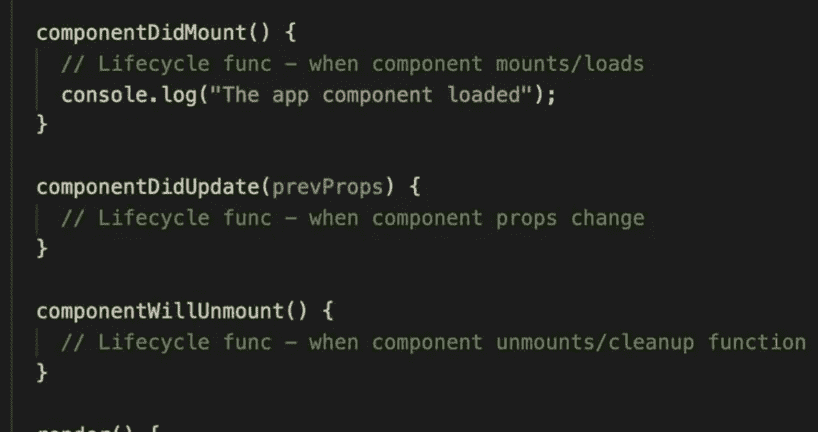
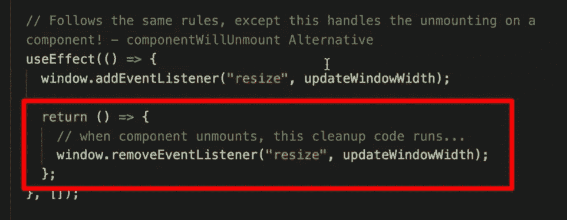

# 基于 React 中的类或函数类型组件解释生命周期。

> 原文：<https://blog.devgenius.io/lifecycle-explained-based-on-class-or-function-type-component-in-react-48091a411068?source=collection_archive---------9----------------------->

当你第一次用 react 开始你的旅程时，学习它背后的生命周期和逻辑是复杂的，但是对于任何 React 开发人员来说，用 React 创建项目是必须的。学习生命周期背后的推理会有一点棘手，但你将有一切从这里开始。

首先，假设你已经知道 React 中基于类和基于功能的组件之间的区别，那么生命周期在这个不同的组件中会有不同的处理方式，所以让我们从基于类的组件以及这个组件如何处理生命周期开始。

## 基于类的组件的生命周期。

**组件安装**

componentDidMount 将类似于组件挂载时的情况，这从其名称中可以看出，这样说吧，你有一个屏幕，每当这个屏幕处于焦点上时，无论你在这个屏幕中有什么，这都可以是一个子级、状态等。这个方法调用并在屏幕上挂载它，下面我们有一个例子，下面我们做了一个 console.log()，这是如何使用这个方法的另一个例子，如果你从数据库请求一些东西，你可以在那个步骤中这样做。

**componentiddupdate**

每当组件更新时，我们需要运行 componentDidUpdate，这只会在你更新道具、状态等时运行...

**组件将卸载**

我们可以将 componentWillUnmount 作为组件的出口，每当你重新渲染一个组件时，我们必须调用 componentWillUnmount，每当用户在屏幕上交互时，假设用户改变了组件的颜色，那么 react 所做的就是卸载组件并将其渲染回屏幕，所以正如我在开始时所说，这是任何重新渲染到屏幕上的组件的出口。

**总结**:概括来说，首先我们需要把组件挂载到页面上，我们用 componentDidMount 来做，这样我们就可以在屏幕上看到组件，然后这个组件接收用户做的一些交互更改，这将导致组件卸载，这将由 componentWillUnmount 来处理，然后用 componentDidUpdate 重新挂载，这样我们就可以用 react 获得交互性和动态行为。

**简单提一下**，我们在类组件中使用了更多的生命周期方法，但上面三个是最重要的，你会经常用到。

## 基于功能的组件的生命周期。

**使用效果挂钩**

如果你读了我的上一篇文章，其中我解释了基于类和基于函数的组件之间的区别，你就会知道在你的代码中使用函数组件更容易，我的意思是这是我的观点:)我想生命周期也是如此，因为你只需要 useEffect 钩子。下面你会发现在基于函数的组件中的 useEffect 钩子的例子，这是 useEffect 钩子的简单实现，在每次渲染时，我们都会运行这个 useeffect。

**简单说明一下**，我们下面实现 useEffect 的方式可能不需要，因为每当我们重新渲染组件时它都会计时，而不是在下面的例子中，但是如果你有一个复杂的逻辑，你可能不需要它，另一方面，因为它会在我们每次重新渲染时运行，它会影响应用程序的性能，所以当你这样使用它时要小心。

接下来，我们将讨论下面的图片，它和上面的一样，但只有一个不同，这是我们添加的括号，这个括号有一点不同，如果你不需要在任何时候重新渲染时运行 useEffect，那么你必须添加这个括号，它将告诉 useEffect 只在第一次渲染时运行。这个括号被命名为依赖数组，如果数组中没有任何东西，它告诉 React 只在组件挂载时运行这个，如果有后续的重新渲染，就不要运行这个代码，**只在组件挂载时运行**。

如果我们在依赖数组中添加一些变量，那么现在事情会略有不同，如果你检查下面的例子，你会意识到我们有一个变量作为名称，这段代码将在第一次渲染时运行，每当我们对该变量进行更改时。如果您将名称设置为“John ”,并将其更改为“Jack ”,此代码将再次呈现。我们可以包括道具和状态，基本上你可以包括任何我们想要触发的东西。

**补充说明**，这段代码将等同于我们在基于类的组件中的 **componentDidUpdate** 。

**快速提示**，如果您忘记在依赖关系括号中添加变量，并且您在 useEffect 挂钩中有该依赖关系，React 将警告您，并要求您在终端中添加它。

我们将讨论的最后一个生命周期方法相当于 **componentWillUnmount。**在下面你会看到一个图像，里面有一个 return，如果你在 useEffect hook 里面看到一个 return 函数，那就意味着我们做了一个清理，清理的意思是，在你重新渲染组件之前，它需要被卸载，以便用更新的版本重新渲染。例如，如果您正在连接到一个数据库，并且无论何时连接，您都应该首先需要进行清理，然后再连接，您必须断开连接并在再次连接后进行清理。

**简单提一下**，当你再次连接后建立连接和断开连接时，你必须小心，因为如果你在第一次安装时建立连接，而没有再次建立，这将提高你的 React 应用程序的性能，这将取决于你的需要，但只是要小心实现哪个使用效果。

我们将在这里总结，生命周期以及如何基于组件类型处理它是一个复杂的主题，但是当你清楚地理解它时，它将变得有意义。希望我的文章能帮助你理解生命周期方法背后的思想，如果是这样的话，给我一个关注，鼓掌，或者与你想了解生命周期的朋友分享这篇文章。

我的链接在下面

[AKIN KARAYUN | LinkedIn](https://www.linkedin.com/in/akin-karayun-ab3239bb/)