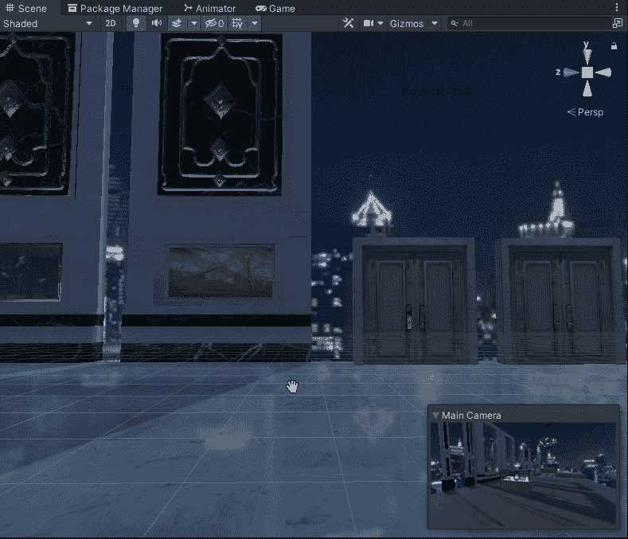

# Unity 中的光探头与屏幕空间反射

> 原文：<https://blog.devgenius.io/light-probes-vs-screen-space-reflections-in-unity-52c9b88c78d1?source=collection_archive---------5----------------------->

# 反射探针

要创建反射探头，请在场景中创建一个空的游戏对象。把它放在你想放的地方。对我来说，这将是我的马贝尔弗劳尔所在的地方。

请注意，我在地板上得到了我的墙壁和门的一些像样的反射

# 屏幕反射

屏幕反射是后期处理堆栈的一部分。您需要一个在自己的层上具有屏幕空间反射的后处理体积。

然后在主相机上你需要有一个后处理层，设置后处理体积层。

打开屏幕反射

更改设置

# 为什么使用反射探头

屏幕反射的使用是性能密集型的。我可以用探针得到很好的反射，这很便宜。如果我的目标是移动设备，我会使用反射探针，因为我可以获得合格的结果，而不会影响性能。屏幕反射看起来更好，所以如果我的目标是高端电脑和律师，我会使用屏幕反射。