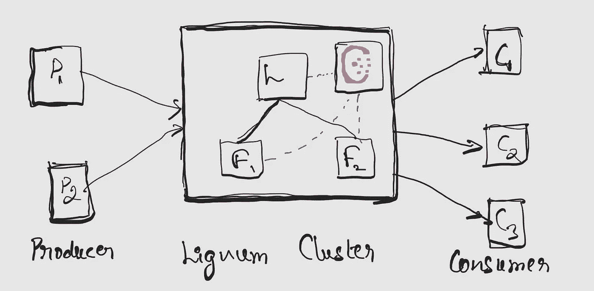
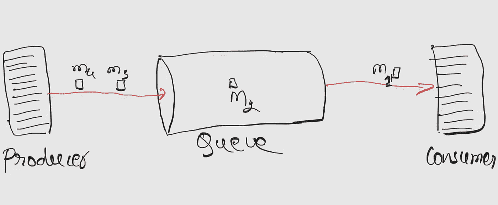
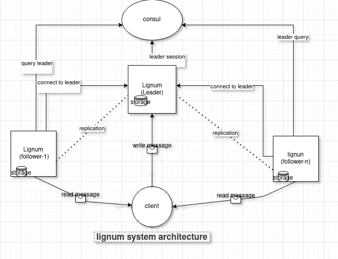

# Lignum:分布式消息队列

> 原文：<https://blog.devgenius.io/lignum-distributed-message-queue-403d38548dbe?source=collection_archive---------6----------------------->

在所有 WFH 模糊和孤立的情况下，我开始使用 Consul 研究分布式锁，这个简单的测试程序很快成为构建一个名为 [Lignum](https://github.com/NishanthSpShetty/lignum) 的分布式消息队列的途径。



木质概述

这是一篇介绍 Lignum 消息队列的文章。

**什么是分布式系统？**

有许多定义，一个简单的谷歌搜索将导致多个答案。我可以把分布式系统定义为一个自治或独立的程序或系统的集合，它们朝着一个共同的目标努力。

也就是说，多个系统通过各种通信手段联网在一起，为一个共同的目的服务。它可以是一个请求网页和一个提供网页的系统。对于最终用户来说，这些系统可能看起来像一个系统，但可能有数百个这样的系统，它们相互通信来完成任务。

**什么是消息队列？**

为其他服务提供队列数据结构的系统，用于按 FIFO 顺序读写消息。
队列允许生产者服务写消息，消费者异步消费。生产者和消费者不需要知道对方。



信息排队

消息队列的两个基本特征是

1.  消息被发送到指定的缓冲区，这些被称为主题。我们从主题中产生和消费信息。
2.  消息
    这是我们写给主题的真实消息，供其他人使用。

比如:阿帕奇卡夫卡，RabbitMQ，芹菜。

**什么是分布式消息队列？**

当我们构建一个托管在多个节点中的消息队列时，这些节点共同工作，作为其他服务的单个实体。

将有多个存放用户消息的队列来提供

1.  可靠性和高可用性
2.  容错
3.  表演
4.  与多个节点共享读取负载

**木质**

[Lignum](https://github.com/NishanthSpShetty/lignum) 作为一个测试程序开始使用[consult session lock](https://developer.hashicorp.com/consul/docs/dynamic-app-config/sessions)学习分布式锁定，它开始转向消息队列，因为那时我正在研究 Kafka。
这是围棋里写的。我开始的时候确实考虑了测试驱动开发，但是很快就变得一团糟。



木质建筑

Lignum 不是一个成熟的消息队列，它是一个正在开发的项目。你可以

*   向主题发送消息
*   消费来自主题的消息
*   消息被复制到所有节点，这意味着任何节点都可以用来从主题中读取消息
*   将消息保留在磁盘上

**木质部群**

*   Lignum 可以在集群模式下运行，不需要任何特殊的设置
*   通过使用会话锁进行协商，可以简化集群管理
*   每个节点将连接到 Consul 以获取领导者。如果没有发现领导者，其中一个节点将被选为领导者
*   所有其他节点将把自己注册为领导者的跟随者
*   发送给领导者的消息将被复制到追随者节点
*   它有两种复制模式
    a. WAL 复制
    b. Live 复制
*   如果领导者倒下了，任何一个追随者都会被选为领导者

**复制**

目前，lignum 实现了两种模式的复制策略。

1.  WAL 复制
2.  实时复制。

默认情况下，选择 WAL 复制。

**沃尔复制**

当消息溢出配置(`message.initial-szie-per-topic`)中定义的缓冲区时，为每个主题创建日志文件。Lignum 为每个主题创建 WAL 文件(`.qwal`)。当消息计数达到缓冲区时，这个文件作为`log`文件被刷新到磁盘。Lignum 经常关注这些日志文件的创建并发送给追随者。所有跟随者定期与领导者同步，提供最终/延迟的一致性。

**实时复制**

这是一个流复制，当追随者已经注册了领导者，我们不需要担心同步的消息，如果主题创建后。我们可以直接将领导者收到的消息转发给追随者。在这种策略中，消息会立即发送给注册的追随者。这种方式可以提供强大的一致性。

**如何运行 Lignum**

*   先决条件
    —咨询
    您可以使用[自述](https://github.com/NishanthSpShetty/lignum#requirement)中指定的 Dockerfile
*   克隆存储库

```
https://github.com/NishanthSpShetty/lignum.git
```

*   建造它`make build`
*   更新`config.yml`，你可以参考[这份文件](https://github.com/NishanthSpShetty/lignum/blob/master/doc/config.md)了解更多关于配置的细节。
*   运行`make run`

这将运行单个节点，选举自己为领导者。你现在可以用它来写和读信息了。

*   发送消息

```
curl --request POST \
  --url http://localhost:8080/api/message \
  --header 'Content-Type: application/json' \
  --data '{
   "topic": "test",
   "message":"this is a test message"
   }'
```

*   阅读邮件

```
curl --request GET \
  --url http://localhost:8080/api/message \
  --header 'Content-Type: application/json' \
  --data '{
   "topic": "test",
   "from": 0,
   "to": 3
   }'
```

> 注意:lignum 不跟踪消费者，所以现在我们需要提供偏移量来读取消息。

消息从偏移量 0 开始。在上述示例中，将从偏移量 0 到偏移量 2(即[0，3])提取消息。如果有，你会从系统得到 3 条信息。

它提供什么样的交货保证？
由于消息是持久的，消费者可以随时读取任何偏移量，因此交付保证由消费者负责。木质素保证了消息的有序性。

让我们向现有集群添加节点

*   根据您的主机更改配置。
*   如果在与上次运行相同的主机上运行，则更改配置文件中的端口、数据目录和复制端口值。
*   运行`make run`

这将引出另一个节点，向领导节点注册它自己。一旦注册了跟随者，leader 节点中出现的任何主题都将被复制，并带有 WAL 复制中解释的所有日志文件。现在，您也可以阅读来自 follower 节点的消息。

这是一篇关于木质素的简短介绍。我将在未来提出一个关于其内部和开发细节的单独文档。

代码在 Github : [Lignum](https://github.com/NishanthSpShetty/lignum) 。

结账并提供反馈，欢迎投稿。

查看我的 Github 档案，了解我正在进行的其他精彩项目

[](https://github.com/NishanthSpShetty) [## nishantspshetty-概述

### 此时您不能执行该操作。您已使用另一个标签页或窗口登录。您已在另一个选项卡中注销，或者…

github.com](https://github.com/NishanthSpShetty) 

在 LinkedIn 上与我联系

[https://www.linkedin.com/in/nishanthspshetty/](https://www.linkedin.com/in/nishanthspshetty/)