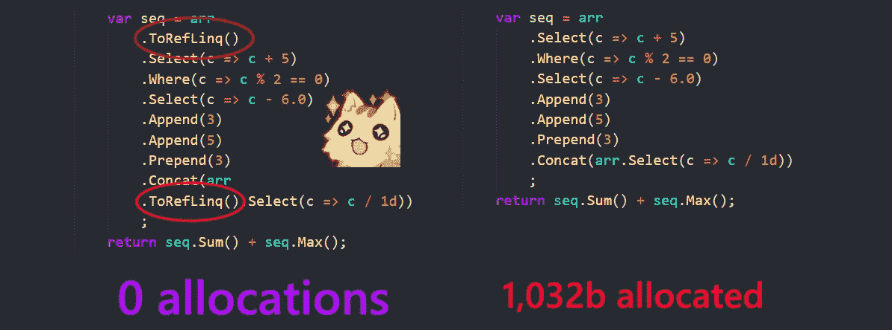
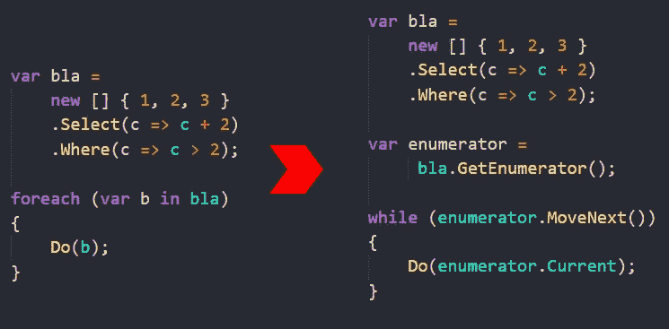
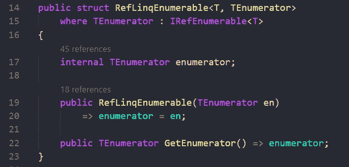
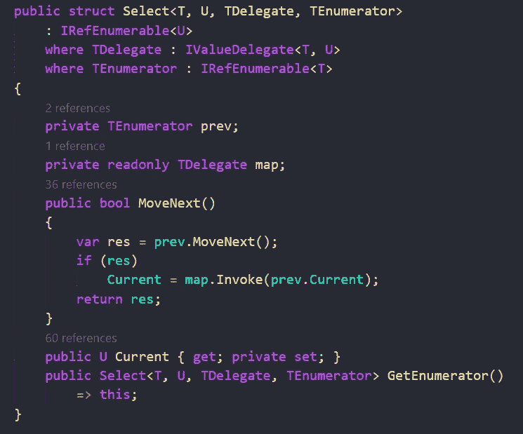
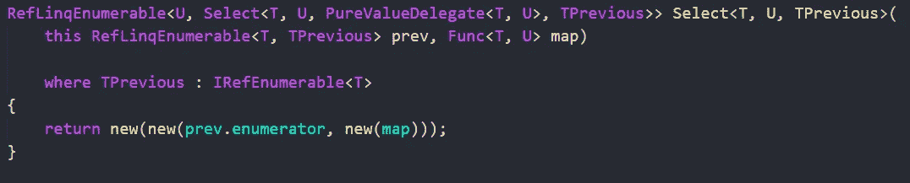
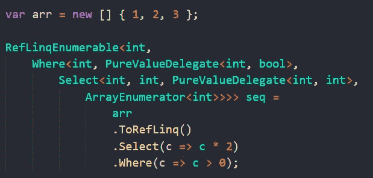
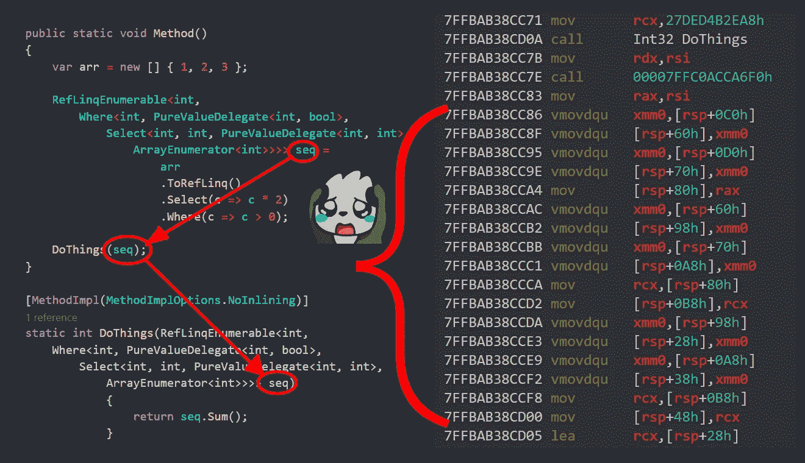
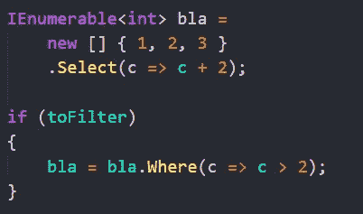
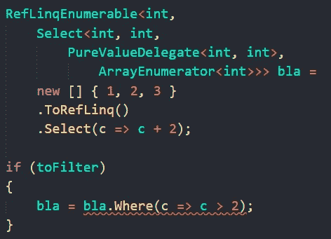
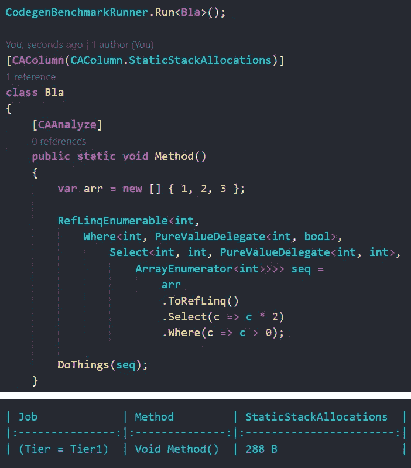

# 像普通的 LINQ，但是更快并且没有分配:可能吗？

> 原文：<https://blog.devgenius.io/like-regular-linq-but-faster-and-without-allocations-is-it-possible-3d4724632e2a?source=collection_archive---------1----------------------->

你好，我的小鸭子们！

LINQ 的一个变种能让我们变得多有效率

我们大多数人不喜欢 LINQ 吗？基础类库的神奇之处在于。NET 是今天发布的，它允许以声明的方式处理序列。然而，如果我们做一个“更好”的版本呢？

对于不耐烦的人: [github](https://github.com/asc-community/HonkPerf.NET) 。

# 简而言之，关于 Linq 如何工作

简而言之，LINQ 只是 IEnumerable <t>接口上的一组扩展方法。每一种方法都在前一个序列之上创建另一个“层”，添加新的条件或该序列元素的变换。例如，Select [创建](https://source.dot.net/#System.Linq/System/Linq/Select.cs,13) SelectEnumerableIterator 并返回它(除非其他优化技巧完成了它们的工作)。</t>

每当对用这些方法创建的序列进行 foreach 时，都要创建一个枚举数，并逐步使用它。以下是 foreach 是如何降低的:

Roslyn 将 foreach 扩展到与状态机同步

这不是 foreach 的精确扩展，如果你想知道那里到底发生了什么，请访问 sharplab。

现在… that 和其他迭代器都是类，这意味着每次你调用 Select/Where 或其他 LINQ 方法时，都会在托管堆上创建一个引用类型的新实例，增加 GC 压力。GC 在。但有时这些分配是不需要的。此外，当这些迭代器运行时(当您执行一个*活动的*动作时，例如 Count()、Sum()或用 foreach 遍历它)，由于一个虚拟调用(对接口的调用)而创建了一个间接层。

# 让我们做我们的 Linq

这里的想法是，我们将有一个更复杂的类型，它将累积所有迭代器和所有查询，而不是一个单一的公共接口，每个新实例都被向上转换到这个接口中。

我们要做的就是存储之前的迭代器，而不是当前的迭代器。方法是泛型。哦，是的，我喜欢泛型，你可能已经猜到了我的[前一篇文章](https://itnext.io/stay-safe-with-your-units-advanced-units-of-measure-in-net-f7d8b02af87e?source=user_profile---------0-------------------------------)。这一次我们将把前面迭代器的类型设为类型参数。方法如下:

枚举器在其内部保存前一个枚举器

现在 TEnumerator 是前面的枚举器本身，因为它是一个结构体。那么，我们如何做出选择呢？让我们首先创建 SelectEnumerator:

选择枚举器声明

如您所见，它保存了以前的枚举数和一个委托，后者从 T 映射到 U(例如，从 int 映射到 string)。此枚举数循环访问上一个枚举数，并将 Current 设置为新值(通过委托映射的上一个枚举数的值)。TDelegate 是委托的类型参数，因此如果想避免调用，可以在其中传递一个值委托。

现在，Select 方法本身只是创建了枚举器。你知道，LINQ 工作*懒散*，我们的 RefLinq 也是。我们只是创建一个枚举器并返回它——它将按需运行。

返回值类型选择的新实例

与我们创建 Where 和其他枚举器的方式相同。现在，就像我说的，枚举器在里面保存前一个。让我们看看我们得到的实际类型:

相互嵌入的枚举器

如你所见，最里面的是 ArrayEnumerator，它嵌入到 Select 中，最外面的是 Where。Select 有一个从 int 到 int 的纯值委托，同样有一个从 int 到 bool 的委托(谓词)。

因此，我们没有一个公共的接口，把我们所有的迭代器向上转换到这个接口中，就像经典的 LINQ 那样，我们在每次操作中都创建一个新的类型，所以没有堆分配，绝对没有！

此外，由于没有虚拟调用，并且所有方法都是在编译时确定的，所以它们中的许多都被内联，从而提高了性能。这就是为什么这样的实现也会更快！

# 为什么 LINQ 不这样实施呢？

因为 LINQ 的实施要普遍得多。让我回顾一下我们在实施过程中遇到的所有问题。

## 问题 1。复制是昂贵的

这意味着，我们永远不能将我们的结构装入接口/对象。这反过来意味着，将我们的序列传递给一个方法或从该方法返回会对性能产生巨大的影响。要通过复制传递该结构，需要将整个结构复制到被调用的方法:

复制巨大的结构是昂贵的

正如你所看到的，这种传递引入了一大堆指令来移动复制内存以将其传递给 DoThings！

## 问题二。没有通用类型—能力有限

在常规 Linq 中，我们可以有条件地向序列中添加一个新的“层”或覆盖它，如下所示:

Linq 更有能力

经典的 Linq 有通用的引用类型 IEnumerable <t>，由于虚拟调用，实际的底层类型可以是任何类型！</t>

但我们的情况不是这样:

不能将新序列的类型装入旧序列

因为它都是值类型，没有抽象接口，我们不能把这个新序列装进旧序列。

## 问题三。并不是所有的 Linq 方法都只能使用堆栈

例如，SkipLast 需要存储一个元素缓冲区，以确保我们不会访问不需要的元素，同时，访问其他元素不会超过一次。

我没有找到任何安全的好方法。动态分配堆栈内存的唯一方法是 [stackalloc](https://docs.microsoft.com/en-us/dotnet/csharp/language-reference/operators/stackalloc) ，但是必须在用户端完成，同时用户还要手动传递缓冲区的大小给它。那就扼杀了 linq 的目的。

## 问题 4。渴望堆栈内存

大多数时候，人们只关心堆内存，这是绝对公平的。但是在这种罕见的情况下，我还注意了堆栈上分配的内存量——因为它是一个巨大的结构，还记得吗？它会吃很多很多。

使用我自己的 alpha 版本 [CodegenAnalysis 工具](https://github.com/WhiteBlackGoose/CodegenAnalysis)我检查了堆栈分配内存的数量:

分析堆栈分配的内存

**堆栈上分配的 288** 字节。它只是选择和在哪里！对于长而复杂的查询，它可以是千字节。(注意，这个大小并不*而*取决于输入的大小，因为它都是枚举器)

# 有人需要吗？

有，但是不多。游戏开发人员、系统程序员或那些场景完全符合 lib 用例的人可能需要它(也就是说，不返回/传递那些枚举器，使用一些需要缓冲区的方法，等等)。).

事实上，我所做的作为一个想法绝对不是新的，我只是描述了它是如何工作的，它有多有用或没有用。有很多其他的库也有同样的用途:NoAlloq、LinqFaster、Hyperlinq、ValueLinq、LinqAF、StructLinq。他们彼此都有一点不同，但或多或少遵循相同的想法。

# 结论

我实现了[所有的方法，但只有](https://github.com/asc-community/HonkPerf.NET/tree/main/Sources/HonkPerf.NET.RefLinq/Extensions)方法只能被堆栈化。要将性能特征与其他库进行比较，请参考[报告](https://github.com/asc-community/HonkPerf.NET)的[基准](https://github.com/asc-community/HonkPerf.NET#benchmarks)部分。

因此，最终，与手动实现的状态机相比，这种实现的开销要低得多，甚至为零(for 循环会更快)。没有虚拟调用，也没有堆分配。

但是它有许多负面影响:没有可向上转换的公共类型，一些方法无法实现，复制开销很大，等等。

所以我宣布经典 Linq 在这里胜出。然而，我仍然认为这篇文章是有用的——在某种意义上，是的，没有比内置 linq 更好的 linq，但有一种方法可以让它更好地用于一些利基场景。

感谢您的关注！我的 [github](https://github.com/WhiteBlackGoose) ， [twitter](https://twitter.com/WhiteBlackGoose) 。

(我用 [BenchmarkDotNet](https://github.com/dotnet/BenchmarkDotNet) 分析性能，用 [CodegenAnalysis](https://github.com/WhiteBlackGoose/CodegenAnalysis) 分析 JIT 的 asm codegen。截图是用仙女座色主题的 VS 代码做的)