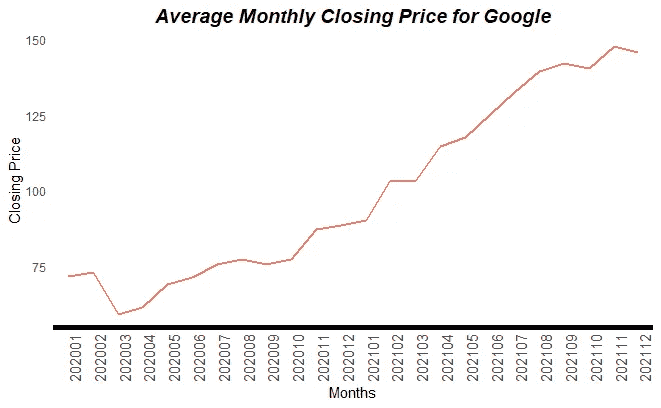
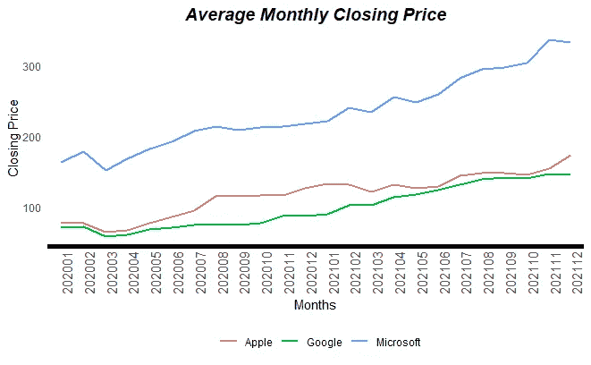
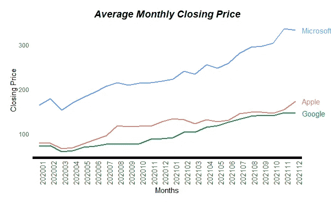
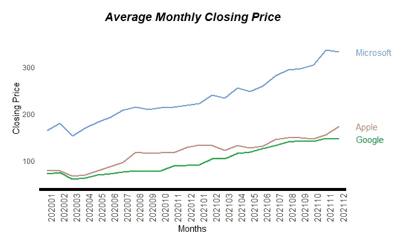

# 线条末端带有标签的折线图

> 原文：<https://blog.devgenius.io/line-charts-with-labels-at-ends-of-lines-6a438687fbc5?source=collection_archive---------4----------------------->

折线图通常用于显示一段时间内的趋势。例如，我们可以查看“谷歌”股票每周或每月的价格趋势。



或者，可以使用折线图来比较多个系列，方法是将它们都绘制在同一个图表上，也就是说，我们可以通过并排绘制来比较“谷歌”、“苹果”和“微软”的股价。

当在同一图表上绘制多个系列时，会引入“图例”来帮助正确识别系列。在下面的例子中，显示在底部的图例帮助我们将“红色”线与苹果联系起来，“绿色”线与谷歌联系起来，“蓝色”线与微软联系起来。



# 目标

上面的图表是非常基本的。包括 Microsoft Excel 和 PowerPoint 在内的大多数商业智能工具都可以轻松创建这些图例，并提供自定义图例的选项—位置、大小、字体等。

然而，我们的客户没有包括图例，而是要求将系列标签放在行尾。



这可以在 PowerPoint 中通过隐藏图例并在系列旁边手动放置标签来轻松创建。但是，想象一下图表是每月更新的仪表板的一部分的场景。如果标签是根据系列的新终点自动绘制的，而不需要有人手动更改它，这不是很好吗？

在本文中，我将介绍在 r 中使用“ggplot”创建这个图表的两种方法。

我假设你对“ggplot”有一个基本的了解。如果你是 ggplot 新手，[https://ggplot2.tidyverse.org/](https://ggplot2.tidyverse.org/)是帮助你入门的绝佳资源。在这篇文章[中，我还介绍了更多基本的“ggplot”术语。](https://medium.com/dev-genius/fancy-bubble-plot-using-ggplot2-ab8efefffded)

# 设置

对于这个例子，我使用“quantmod”R 库从“yahoo”获取每日股票价格。但是你可以用你喜欢的任何数据替换它。

# 加载库

```
if (!(require(pacman))) install.packages("pacman")

library(pacman)
p_load(data.table, quantmod,
       ggplot2, gridExtra)
```

# “谷歌”、“苹果”和“微软”的源股票价格

函数`getMonthlyClosingPrice`提取两个日期(含)之间给定符号的每日股票价格。通过对给定月份的股票收盘价取平均值，将数据转换为月度数据。

该函数在返回数据之前创建一个带有股票标识符的`bName`列。

```
getMonthlyClosingPrice <- function(x, sDate, eDate)
{
  # Inputs-
  # x    : list with the stock symbol and string to identify the stock
  # sDate: Start Date of data
  # eDate: End Date of data

  # Outputs -
  # DT   : Average monthly stock prices
  symb <- x[1] # Symbol
  bName <- x[2] # String identifier for the stock

  DT <- data.frame(
    getSymbols( # Function to pull stock prices
    Symbols = symb, # Stock symbol on the exchange, for example 'GOOG' for 'Google'
    src = "yahoo", # Source of data. Check the function help for more sources
    from = sDate, # Start date of data
    to = eDate, # End date of data
    auto.assign = F # If this 'TRUE', a data frame will be auto created
    )
    )

  # Below two lines remove the 'symbol' from column names.
  # This helps with appending the data by generalizing the column names
  cName <- sub(paste0(symb, "."), "", colnames(DT))
  colnames(DT) <- cName

  # Create a column with year and month, in the format YYYYMM
  # for example, 202101 for Jan 2021.
  DT$yr_month <- (as.POSIXlt(rownames(DT))$year + 1900) * 100 + (as.POSIXlt(rownames(DT))$mon + 1)

  # Create a summarized monthly dataset
  DT <- data.table(DT)[,.(avgPr = mean(Close, na.rm = T)),
                         by=.(yr_month)]
  # Add a column with stock identifier
  DT$brand <- bName

  # Return the dataset
  return(DT)
}
```

`stockList`是要拉的符号和股票对应名称的列表。

```
# List of stock to pull
# Each entry has a 'symbol' and 'stock identifier'
stockList <- list(
  c("GOOG", "Google"),
  c("AAPL", "Apple"),
  c("MSFT", "Microsoft")
)
```

向`lapply`提供`stockList`将返回 3 个数据集，每个符号一个。使用`rbind`和`do.call`将这些组合成一个数据集。

你可以选择在一个`for`循环中使用`rbind`，而不是`do.call`和`lapply`。

```
# Pull stock prices for 3 stocks in the list and
# create a combined dataset
DT <- do.call("rbind", 
              lapply(
                stockList,
                getMonthlyClosingPrice,
                "2020-01-01",
                "2021-12-31"
              )
              )
```

现在我们已经有了创建图的数据，让我们看看两个选项。

# 选项 1-扩展图边距并关闭“裁剪”

使用`geom_line`创建折线图，使用`geom_text`绘制标签。

因为标签是为系列中的最后一个点绘制的，所以`geom_text`的数据是使用`tail`函数的子集。请注意，函数`getMonthlyClosingPrice`生成的数据集已经按升序排列，所以我在调用`tail`函数之前跳过了对数据集排序的步骤。

如果您不熟悉“data.table”，请参考[https://cran . r-project . org/web/packages/data . table/vignettes/datatable-intro . html](https://cran.r-project.org/web/packages/data.table/vignettes/datatable-intro.html)。

```
ggplot(data = DT) + 
  # Create the line chart
  geom_line(aes(
    x = factor(yr_month), # 'yr_month' is numeric. By converting it to 'factor', we force ggplot to treat the x-axis as discrete instead of continuous
    y = avgPr,
    group = brand, color = brand),
            size = 1 # controls thickness of the line
    ) +
  # Create labels
  geom_text(
    data = DT[,lapply(.SD,tail,1),by=.(brand)], # Subset data to keep only the last entry per series. This is 'data.table' terminology.
    aes(
      x = Inf, # This plots the labels towards the extreme right of the chart
      y = avgPr, 
      label = brand, color = brand),
      hjust = 0 # Left justify labels
    ) +
  # X-axis and Y-axis titles
  xlab("Months") + ylab("Closing Price") +
  # Plot Title
  ggtitle("Average Monthly Closing Price") +
  # Switch off clipping of text. This is required because 'x = Inf' will push
  # the labels to be printed on extreme right of the plot, causing some letters
  # to fall beyond the chart margins. By default, these characters will not be
  # shown. Switching off the 'clip' option, ensures the characters are displayed.
  coord_cartesian(clip = "off") +
  theme_minimal() +
  theme(
    plot.title = element_text(hjust = 0.5, size = 14, face = "bold.italic"),
    axis.text.x = element_text(size = 11, angle = 90),
    panel.grid = element_blank(),
    axis.line.x = element_line(size = 2),
    legend.position = "none",
    # 'plot.margin' is used to expand the margins
    plot.margin = unit(
      c(1,3,1,1), 
      "lines")
  )
```


这个选项简单明了。对于标签短且甜的情况，它工作得非常好。但是，如果标签较长或 x 轴延长，即如果显示 36 个月而不是 24 个月，您可能会遇到标签重叠或部分标签被切掉的问题。

如果您遇到这些问题，请尝试选项 2。

# 选项 2-创建两个图并并排显示

在前一个选项中，折线图和标签绘制在同一个图表上。现在，我们将折线图和标签绘制成两个独立的图表。然后使用`gridExtra`库中的`grid.arrange`将它们组合起来。

因为两个图是独立的，所以需要一些额外的步骤来确保图尺寸对齐。

1.  y 轴极限必须手动设置。标签图的数据是仅保留最后一个入口点的子集。如果 y 轴限制是自动设置的，则折线图和标签图的限制可能会不同，因此标签可能会错位。
2.  标签图上的一些元素必须被标绘，但通过指定透明颜色来隐藏。例如，影响绘图区的元素有图表标题、x 轴标签和标题以及 x 轴线条。这些必须标绘，但使用透明颜色“#FFFFFF00”隐藏。

## 折线图

与“选项 1”相同，但我们不再绘制`geom_text`。设置 y 轴的最小和最大限值。

`plot.margin`用于通过固定上下页边距来确保两个图表对齐。

```
# Lower and Upper limits for Y-axis
yMin <- min(DT$avgPr) * 0.9 # 90% of the minimum average closing price across all series
yMax <- max(DT$avgPr) * 1.1 # 110% of the maximum average closing price across all series

lChart <- ggplot(data = DT) + 
  # Create the line chart
  geom_line(aes(
    x = factor(yr_month), # 'yr_month' is numeric. By converting it to 'factor', we force ggplot to treat the x-axis as discrete instead of continuous
    y = avgPr,
    group = brand, color = brand),
            size = 1 # controls thickness of the line
    ) +
  # X-axis and Y-axis titles
  xlab("Months") + ylab("Closing Price") +
  # Plot Title
  ggtitle("Average Monthly Closing Price") +
  coord_cartesian(ylim = c(yMin, yMax), clip = "off") +
  theme_minimal() +
  theme(
    plot.title = element_text(hjust = 0.5, size = 14, face = "bold.italic"),
    axis.text.x = element_text(size = 11, angle = 90),
    panel.grid = element_blank(),
    axis.line.x = element_line(size = 2),
    legend.position = "none",
    # 'plot.margin' is used to expand the margins
    plot.margin = unit(
      c(1,1,1,1), 
      "lines")
  )
```

## 标签

这部分代码有明显的变化。

1.  `x=Inf`替换为`x=factor(yr_month)`
2.  `color`为绘图标题，x 轴标签和标题，x 轴本身设置为' #FFFFFF00' (hexcode 为透明)。
3.  `plot.margin`用于确保标签完全显示。你可能需要调整左边距来得到正确的结果。

```
tChart <- ggplot(data = DT) +
  # Create labels
  geom_text(
    data = DT[,lapply(.SD,tail,1),by=.(brand)], # Subset data to keep only the last entry per series. This is 'data.table' terminology.
    aes(
      x = factor(yr_month), # The labels are no longer forced to be outside the plotting. So we can use the 'yr_month' for the last point in the series.
      y = avgPr, 
      label = brand, color = brand),
      hjust = 0 # Left justify labels
    ) +
  # X-axis and Y-axis titles
  xlab("Months") + ylab("Closing Price") +
  # Plot Title
  ggtitle("Average Monthly Closing Price") +
  coord_cartesian(ylim = c(yMin, yMax), clip = "off") +
  theme_minimal() +
  theme(
    plot.title = element_text(hjust = 0.5, size = 14, face = "bold.italic",
                              color = "#FFFFFF00"),
    axis.text.y = element_blank(),
    axis.title.y = element_blank(),
    axis.title.x = element_text(color = "#FFFFFF00"),
    axis.text.x = element_text(size = 11, angle = 90,
                               color = "#FFFFFF00"),
    panel.grid = element_blank(),
    axis.line.x = element_line(size = 2, color = "#FFFFFF00"),
    legend.position = "none",
    # 'plot.margin' is used to expand the margins
    plot.margin = unit(
      c(1,5,1,1), 
      "lines")
  )
```

## 将折线图和标签放在一起

这两个图表是使用`grid.arrange`并排绘制的。使用`widths`选项控制分配给每个图表的区域。在这种情况下，90%的区域分配给`lChart`(折线图)，10%分配给`tChart`(标签图)。

```
grid.arrange(
  lChart, 
  tChart, 
  widths = c(9, 1)
  )
```



当标签较长或 x 轴延长时，固定分配给每个图表的区域给我们更多的灵活性，即我们绘制 36 个月而不是 24 个月。

# 要探索的其他功能

## 字符串换行

对于绘制更长的标签，尝试`stringr`库中的`str_wrap`功能。你可以在`geom_text`的`label`美学中调用这个函数。

```
#geom_text(aes(label = stringr::str_wrap(brand, width = 5)))
```

## 几何 _ 文本 _ 排斥

如果标签重叠，尝试用`ggrepel`库中的`geom_text_repel`替换`geom_text`。

## 刻度 _ 颜色 _ 手动

您可能已经注意到，我们没有在代码中为任何品牌指定颜色。颜色由 ggplot 根据默认调色板自动分配。您可以使用`ggplot`中的`scale_color_manual`选择指定特定的颜色。

# 摘要

在本文中，我们使用`quantmod`库获取股票价格。使用`do.call`和`lapply`合并数据集。

我们看到了绘制折线图的两个选项，其中系列标签显示在每个系列的最后一个点的右侧。

*   选项 1 —通过使用`x=Inf`将标签推向最右侧，将标签绘制在同一图表上。使用`theme`中的`plot.margin`选项扩展情节页边距，并使用`coord_cartesian`中的`clip="off"`关闭字符剪辑。
*   选项 2 —标签绘制在单独的图表上。然后使用`grid.arrange`将折线图和标签放在一起。使用`widths`分配每个图表的绘图区域。

检查这个[线程](https://stackoverflow.com/questions/29357612/plot-labels-at-ends-of-lines)以获得创建这些图的其他方法。

希望你觉得这篇文章有趣。请在评论区留下你的想法/反馈。