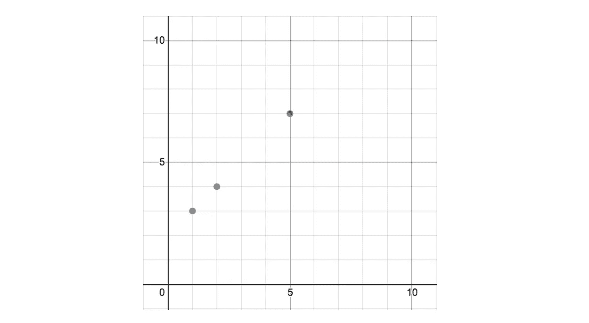

# 最佳拟合线？那是什么？

> 原文：<https://blog.devgenius.io/line-of-best-fit-whats-that-54d78655f384?source=collection_archive---------30----------------------->

艾萨克·史密斯在 [Unsplash](https://unsplash.com?utm_source=medium&utm_medium=referral) 上拍摄的照片

最近，我和一些同事想制作一个 [web 应用程序](https://covid-tracer.netlify.app/)，它可以模拟各种类型的 Covid 数据。我们找到了 [Covid 跟踪项目 API](https://covidtracking.com/api) ，并决定我们需要一种方法来显示州和国家级别的一般预测。虽然我们不是数据科学家，但我们知道一个简单的方法是实施线性/指数回归。

那么什么是线性回归呢？这是最合适的路线。那是什么意思？很高兴你问了！

寻找最佳拟合直线的目标是找到最能代表一组数据的直线方程。单看数据点，对预测未来值帮助不大；但是，如果我们可以使用数据点创建一条线来很好地表示数据，那么我们就可以使用这条线/方程来预测未来的值。

让我们看看点(1，3)，(2，4)和(5，7)

对你来说，这三点显然都在同一条线上，但是让我们再检查一下。回到基础代数，我们可以通过使用一般斜率方程(rise over run)来找到穿过点 A (1，3)和点 B (2，4)的直线的斜率:

一般斜率方程

通过为 x 值插入 1 和 2，为 y 值插入 3 和 4，我们看到斜率为 1。

我们将使用直线的一般(斜率-截距)方程中的斜率，其中 m 是斜率，b 是 y 截距。

直线的斜率截距形式

通过代入斜率和已知在直线上的一点，就可以求出直线的 y 截距，然后代入斜率和 y 截距就可以求出直线的一般方程。让我们插入斜率(1)和点 A (1，3)。

如果对 B 点(2，4)和 C 点(5，7)重复上述步骤，您会发现它们也在一条斜率为 1 的直线上，这条直线就是我们已经找到的直线。这三个点共线。

现在我们有了直线的方程，如果数据点遵循相同的趋势，我们可以预测一个未来值。例如，假设 x 值表示天数，y 值表示植物的高度(英寸)。如果植物继续以同样的速度生长，在第 10 天，它将长到 12 英寸高。

现在，我知道这是一个简单的例子，特别是因为所有的数据点恰好位于同一条线上，但现在让我们看看其他数据点的情况并非如此。

在这里，我们可以看到没有一条特定的线连接所有这些数据点，但似乎有一个上升的趋势。我们可以选择两个点，找到一条线的方程，这条线似乎代表数据点的平均值。

在这个例子中，y=(1/2)x+3 看起来是一个很好的代表。使用这一行，我们可以通过插入一个 x 值来预测一个近似值。

选取两个数据点来创建我们的方程似乎有点武断，尤其是当数据点非常分散的时候。怎样才能更准确的找到最佳拟合的线？幸运的是，我们可以使用线性回归，在这种情况下，我们找到了代表数据的最佳直线的复杂数学。我们需要做的就是插入数据点！如果你有一个图形计算器，你可以把 x 和 y 值插入一个列表，然后计算线性回归。如果您使用它来表示 react 应用程序中的数据，我们使用了 [regression.js](https://www.npmjs.com/package/regression) 包。这非常容易实现——您只需要将表示您的数据点的数组作为参数传递。

那么，如何判断一个线性回归方程对数据的表现呢？可以看看相关系数(用 r 表示)。相关系数的**绝对值**越接近 1，就越能代表数据。

最后要考虑的是，你应该检查多种类型的回归方程。如果你输入数据进行**线性**回归，你会得到一条**线**，即使一个**指数**函数更好地代表了数据。在这里，你可以通过目测看到，右边的等式似乎比左边的图表解释了更高百分比的数据(注意，理想情况下，你希望有许多数据点来提高你的准确性)。在这里，检查相关系数以查看哪个模型是更好的匹配是很重要的。

左:线性回归；右图:指数回归

我希望这有助于解释最佳拟合/回归方程的基本原理！它们真的非常有用，可以帮助你的项目更上一层楼。下面是我们在项目中如何使用它的一个例子， [Covid Tracer](https://covid-tracer.netlify.app/) :

