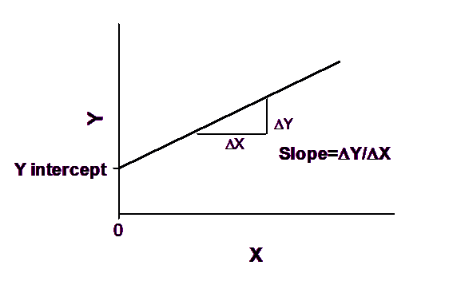

# 线性回归—在 R 中(第一部分)

> 原文：<https://blog.devgenius.io/linear-regression-in-r-part-1-b265afad2f78?source=collection_archive---------15----------------------->

这篇文章旨在提供线性回归的全面概述，包括基本原理和高级技术，分为六个部分。目录如下所示:

1.  R 中的线性回归:模型输出解释(第一和第二部分)
2.  使用各种指数的模型验证和选择(第 3 和第 4 部分)
3.  用数据结构和基于分布的转换增强模型拟合(第 5 部分)
4.  使用真实世界数据的假设示例(第 6 部分)

> 请注意，所有的分析都将使用 R 进行，尽管基本概念普遍适用于各种软件。

在深入研究回归和线性回归的细节之前，有必要解决两个基本问题:

## **什么是回归？**

回归是一种统计技术，用于确定因变量(也称为响应或结果变量)与一个或多个自变量(也称为预测变量或解释变量)之间的关系。

## 回归的应用和背景是什么？

回归通常用于预测、预报或建立预测变量和响应变量之间的关系。数学上，回归可以表示为:

Yi = f(Xi，B) + ei

在这个方程中，B 代表未知参数(β)，X 代表自变量，Y 代表因变量，e 代表误差项。变量 I 对应于一个观察值或一行数据。

简单线性回归包括一个因变量和一个自变量(预测值)的二维分析。因变量可以用自变量来定义。

在简单线性回归中，方程由一个标量响应变量和一个解释向量变量组成，公式如下:

Yi = Bo + B1xi + ei，其中 i = 1，2，…。n

或者，这可以表示为:

Yi = a + Bxi + ei

这里，易代表因变量，是自变量，a 是截距，B 是斜率。在构建线性回归模型时，将使用说明性示例更详细地解释每一项。

例如，考虑在特定地点进行的土壤肥力试验，氮(N)处理范围从 0 千克氮到 200 千克氮。记录这些氮处理的最终产量。目的是确定在特定环境下氮和产量之间的关系，以及预测每英亩生产 200 公斤谷物所需的氮量。

在这种情况下，氮作为自变量或解释变量，可用于定义产量或因变量。为了进一步阐明这个概念，将在 R 中创建一个假设的数据集，并测试一个模型。

数据集包括 N_rate 和产量，N _ rate 以千克/英亩定义氮，产量以千克/英亩表示。

```
NY <- data.frame(N_rate = c(0,10,50,100,150,200), Yield = c(50,70,80,120,170,220))NY## N_rate Yield
## 1 0 50
## 2 10 70
## 3 50 80
## 4 100 120
## 5 150 170
## 6 200 220
```

现在，让我们尝试构建一个线性回归模型，并检查由此产生的统计参数，以及讨论他们的解释。

```
**model_1 <- lm(Yield~N_rate, data = NY)** #here yield is the dependent variable and N_rate is independent variable. lm defines the linear model. so the function actually works like: lm(y~x, data)**summary(model_1)** #to observe the model parametersCall:
lm(formula = Yield ~ N_rate, data = NY) #here lm = linear modelResiduals:
 1 2 3 4 5 6 
 0.8714 12.7297 -9.8373 -10.5459 -1.2546 8.0367Coefficients:
 Estimate Std. Error t value Pr(>|t|) 
**(Intercept) 49.12861** 6.56237 7.486 0.001702 ****** 
**N_rate 0.81417** 0.05866 13.880 0.000156 ***
 — -
Signif. codes: 0 ‘***’ 0.001 ‘**’ 0.01 ‘*’ 0.05 ‘.’ 0.1 ‘ ’ 1Residual standard error: 10.45 on 4 degrees of freedom
**Multiple R-squared: 0.9797, Adjusted R-squared: 0.9746** 
F-statistic: 192.7 on 1 and 4 DF, p-value: 0.0001562
```

模型中一些最重要的参数包括截距、斜率、R 平方、p 值、误差项(系数标准误差和残差标准误差)和 F 统计。回头参考等式:

*Yi = Bo + B1xi + ei*

***其中 Yi 为产量，Bo 或 a 为截距，B1 为斜率，=自变量，ei 为误差项。*** *斜率和截距也称为模型系数。*

> **什么是截距，应该如何解读？**(也称为 y 轴截距或常数)
> 
> 截距是指拟合线与 Y 轴相交的点，有时被认为是 x = 0 时的预测 Y 或 Y [pred] 值(尽管将预测值解释为零可能会有问题；这将在后面解释，并讨论为什么不建议将所有预测值设置为零)。虽然截距通常很难解释，但它在模型拟合中起着至关重要的作用。为简单起见，考虑模型的截距值 49.13 千克/英亩。这可以解释为在没有任何氮投入(x = 0)的情况下，每英亩 49.13 千克谷物的预期产量。
> 
> **什么是斜率，应该如何解读？**
> 
> 斜率是一个关键的模型系数，表示预测变量改变一个单位所导致的响应变量的平均变化。在给定的模型中，N_rate(斜率)系数为 0.81，表明每英亩增加 1 公斤氮投入可多生产 0.81 公斤粮食，或每英亩增加 1 公斤氮投入可相应增加 0.81 公斤产量。可以使用上升/下降方法手动计算斜率，该方法需要将 y 的变化除以 x 的变化，斜率可能为正，也可能为负，具体取决于关系。正斜率意味着关系中的线性增加或增益，由此预测变量的增加导致响应变量的增加。在目前的模型中，产量随着氮的添加而增加，表现出正相关关系。相反，负斜率表示预测变量的增加导致响应变量的减少。



图:y 轴截距和斜率的图形表示。

> 如何解释系数的 p 值？
> p 值决定一个项的统计显著性或拒绝零假设的概率(零假设意味着没有效果)。如果 p 值小于 0.05，可以拒绝零假设，表示预测变量对反应或结果有显著影响。在给定的模型中，斜率(或 N_rate)的 p 值为 0.001，小于 0.05，表明添加 N_rate 对谷物产量有显著影响。

> **R-square 应该如何解读？**
> 在输出中，可以观察到两种不同的 R 平方值:多重 R 平方和调整 R 平方。多元 R-square 通常用于描述线性回归，而调整 R-square 主要用于多元线性回归，因为它包括对样本大小或预测因子数量的调整。R 平方值表示可由预测变量解释的响应变量的变化比例。在这种情况下，R-square 为 0.98，这意味着大约 98%的谷物产量变化(响应)可以由施氮量(预测值)来解释。这表明籽粒产量的大部分变化都与施氮量有关，而施氮量可以用来描述这些变化。R-square 也可以作为模型拟合的指标(模型拟合和评估将在第 2 部分讨论)。较高的 R-square 表示更适合的模型。然而，需要注意的是，R-square 并不是模型准确性的可靠参数，因为包含更多的预测因子可以增加 R-square，即使预测因子与响应变量无关。

> **F 统计量和模型 p 值如何解释？**
> 在回归模型分析过程中，假设零假设(即无效)，对全局模型进行假设检验。f-统计量表示变量之间的关系。较高的 F 统计支持拒绝零假设，并强调了整个模型的重要性。为了准确解释模型的准确性或拒绝零假设，F-stat 和 p-value 应该一起考虑。对于具有大量预测变量的模型，F 统计量将更低且更接近 1，p 值将小于 0.05。然而，对于具有少量预测变量的模型(如我们的例子)，高 F 统计值(192.7)和低 p 值(0.00015)表明模型的显著性，允许零假设被拒绝。有充分的证据表明施氮量与谷物产量之间有关系。F-stat 和模型的 p 值用于确定模型的显著性，而不是系数项。

> **系数标准误如何解读？**
> 系数标准差是指估计值的标准偏差(系数项，即斜率或截距)，可用于计算模型的 95%置信区间。它快速显示了估计的重要性。系数标准误差说明了模型对未知系数值的估计精度。系数的标准误差总是正的。标准误差越小，表示估计值越精确。与标准误差相比，较大的系数意味着该系数可能非零。此外，它还用于计算 t 值。系数除以标准误差得到 t 值。较大的 t 值表示系数比标准误差大得多。

在接下来的文章中，我将阐述模型拟合过程(利用最小二乘法)，讨论残差和残差标准误差，并对每一个进行解释。如果你觉得这篇文章很有帮助或者获得了新的见解，考虑用咖啡来支持我:[https://www.buymeacoffee.com/sauravdastsk](https://www.buymeacoffee.com/sauravdastsk)