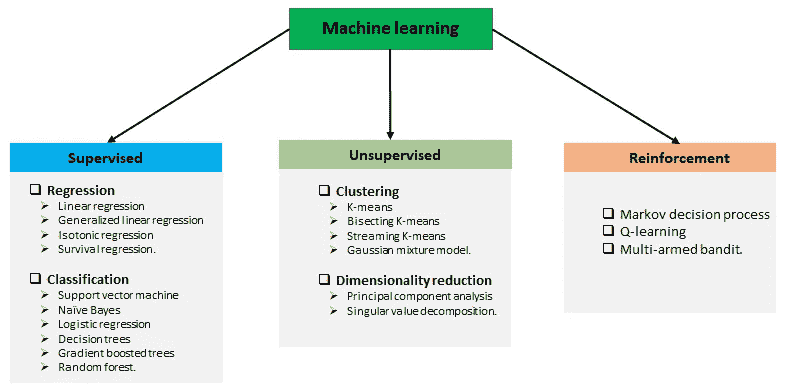
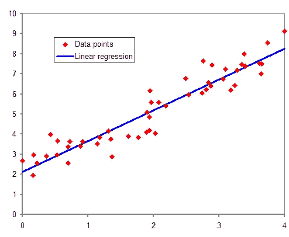
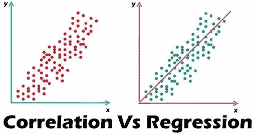

# 线性回归-机器学习算法

> 原文：<https://blog.devgenius.io/linear-regression-machine-learning-algorithm-a1d303312867?source=collection_archive---------1----------------------->

线性回归一直是统计领域中研究最广泛的课题之一。通过长期建立的统计程序，线性回归模型的特性得到了很好的理解，并且可以很快地得到训练。

开始学习机器学习模型的踏脚石是线性回归。

当我们谈论线性回归时，我们需要了解 ML 问题的类型。以下是由不同的 ML 任务组成的简短总结:

# **T3 什么是线性回归？**

在深入线性回归之前，让我们了解这两个术语各自的含义。

**线性**:这意味着沿着一条直线或接近直线的一系列步骤(顺序)从一个阶段前进到另一个阶段。

**回归**:回归的统计术语是确定一个因变量与一系列自变量之间的关系。

因此，*线性回归*意味着对因变量和自变量之间的关系进行建模的线性方法。它将沿着数据点绘制一条称为最佳拟合线的直线来预测目标值。

线性回归线有一个等式:

> **Y = mX+c**

其中 Y 为因变量，X 为自变量，m 为斜率，c 为截距(当 ***x*** = 0 时 ***y*** 的值)

有两种类型的线性回归模型:

***简单线性回归:*** 是一个自变量一个因变量的线性回归模型

> y = mx + c

***多元线性回归* :** 是一个自变量多于一个因变量的线性回归模型

> y = m1x1 + m2x2 + …+ c

**复杂度**:模型的复杂度为 O(k)，其中 k 为数据的特征数/维数

# 作为机器学习模型的线性回归

*   在机器学习中，线性回归算法需要估计数据表示中使用的系数值，以提供更好的预测值准确性。
*   可以使用以下方法评估系数值:

1.  ***普通最小二乘法*** :普通最小二乘法程序寻求最小化残差平方和。这意味着给定一条穿过数据的回归线，我们计算每个数据点到回归线的距离，对其求平方，并将所有平方误差相加。这是普通最小二乘法试图最小化的量。
2.  ***梯度下降:*** 这是从每个系数的随机值开始的。计算每对输入和输出值的误差平方和。学习率被用作比例因子，并且系数朝着最小化误差的方向被更新。重复该过程，直到达到最小平方和误差，或者不可能进一步改进。
    使用该方法时，您必须选择一个学习率(alpha)参数，该参数决定了程序每次迭代的改进步长。
3.  ***正则化:*** 这寻求最小化训练数据上的模型的平方误差的和(使用普通最小二乘法)，并且降低模型的复杂性(像模型中所有系数的和的数量或绝对大小)。
    线性回归的两种正则化过程是:
    a. *套索回归*
    b. *岭回归*
    当输入值中存在共线性且普通最小二乘法会过度拟合训练数据时，这些方法非常有效。

**线性回归模型的成本函数**

*   为了估计模型的性能，我们使用成本函数。
*   成本函数计算估计值和实际值之间的差异，并确定模型对于给定数据集的表现。
*   在线性回归中，我们使用以下方法来计算成本函数:

1.  **T22【均方根误差】T23**
2.  ***均方差***

**为线性回归准备数据**

*   在数据准备过程中，可以使用以下启发式方法，以便从线性回归模型中获得更好的输出

1.  ***剔除异常值*** :假设你的输入输出变量没有噪声。因此，需要在数据清理阶段去除异常值。
2.  ***去除共线性*** :当你有高度相关的输入变量时，它会过度拟合你的数据。
3.  ***高斯分布:*** 如果你的输入输出变量有高斯分布，线性回归会做出更可靠的预测。
4.  ***重新调整输入:*** 如果使用标准化或规范化来重新调整输入变量，通常会做出更可靠的预测。

# 相关和线性回归的区别

在理解相关和线性回归这两个术语之间的区别时，经常会出现混淆。

## 相互关系

*   相关性一词是两个词“Co”(在一起)和两个量之间的关系(联系)的组合。
*   这是一种统计技术，表示变量对之间的联系强度。
*   相关性可以是正的，也可以是负的。当两个变量同向移动时，即一个变量的增加会导致另一个变量的相应增加，反之亦然，那么这些变量被认为是*正相关*。
*   相反，当两个变量朝不同的方向移动时，一个变量的增加会导致另一个变量的减少，反之亦然，这种情况被称为*负相关。*
*   相关性旨在找到一个表示变量之间关系的数值。

## 线性回归

*   它是一种统计技术，用于根据两个或多个变量之间的平均数学关系，估计由于一个或多个自变量的变化而导致的度量因变量的变化
*   回归描述了自变量与因变量在数字上的关系。
*   回归的目标是根据固定变量的值预测随机变量的值。

# **结论**

线性回归是机器学习的一个重要组成部分。由于其简单性和重要性，它已被广泛应用于不同的行业。

它的一些应用领域是:

1.  企业经常使用线性回归来理解广告支出和收入之间的关系。
2.  它可用于医学领域，以了解药物剂量和患者血压之间的关系
3.  农业科学家经常使用线性回归来观察降雨量和肥料对水果/蔬菜产量的影响。

感谢您的阅读，我希望您发现这篇文章很有见地！

非常欢迎你对这篇文章的想法。请在评论区分享。