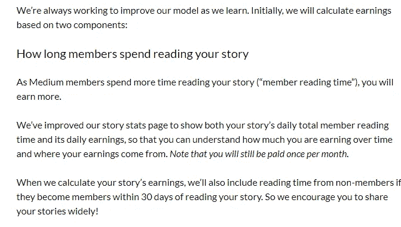
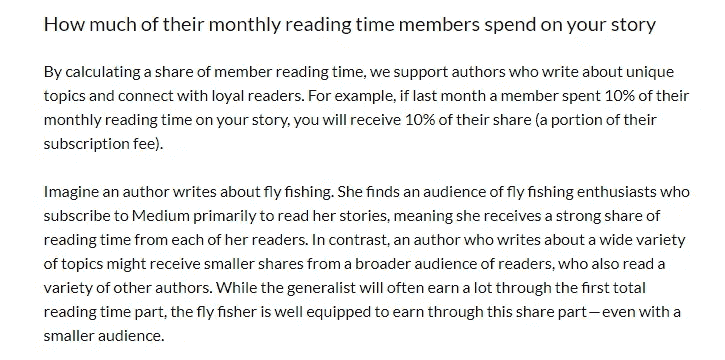
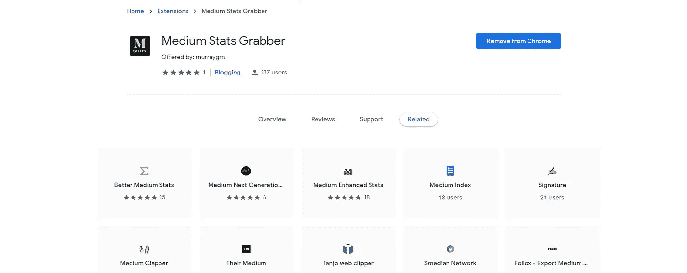
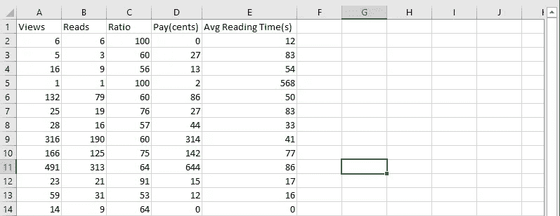
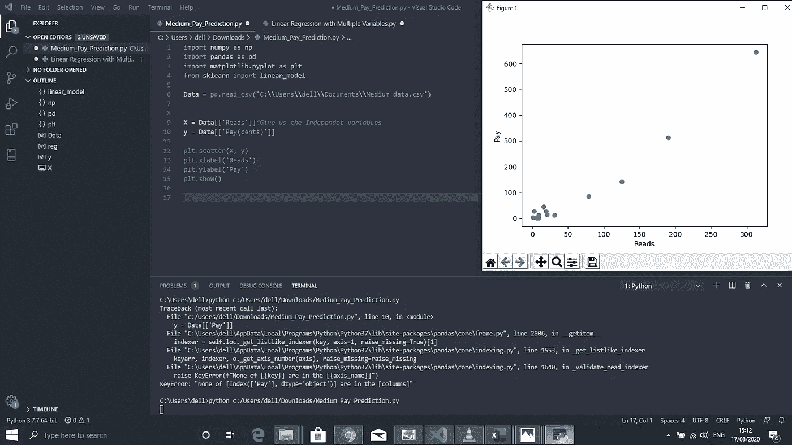
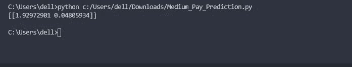
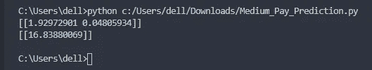

# 预测中期支付的线性回归模型

> 原文：<https://blog.devgenius.io/linear-regression-model-to-predict-medium-payment-8f2d96758f86?source=collection_archive---------6----------------------->

## 我们打算建立一个基于统计数据的中等支付预测的基础模型。


德米特里·德米德科在 [Unsplash](https://unsplash.com?utm_source=medium&utm_medium=referral) 上拍摄的照片

这份小小的“如何做”清单旨在帮助你了解媒体如何决定薪酬。你可能会好奇你需要做些什么来计算这个。我绝不是说这是一个完美的设计，但它可能会帮助一些人提高他们新发现的机器学习技能。

以此为基础，初学者可以使用以前的数据进行预测。

要求:一个好的 IDE，Python 安装，几个库(numpy，pandas，matplotlib，Scikit-Learn)。

第一步是确定媒体如何支付人们，我们可以在他们的帮助中心找到这个[。](https://help.medium.com/hc/en-us/articles/360036691193-Calculating-earnings-in-the-Partner-Program)



中型帮助中心



中型帮助中心

在这两种情况下，我们都可以收集数据来预测将要支付的金额。目前，第二种计算方法没有得到数据表示。因此，它可能会妨碍准确地确定一个人在一定条件下的收入。

声明:我们将只使用第一张图片。将来，我们可以改进模型。

## 1.数据收集

由于手动收集数据的繁琐性，一些数据收集插件是专门为 Medium 开发的。我将使用的是[中等统计抓取器。](https://chrome.google.com/webstore/detail/medium-stats-grabber/gdomhiacoiloiecaholjiegdaklelpig/related)



我截图。

一旦插件安装在你的浏览器上(我的是 Chrome)，进入统计页面，点击右上角的插件图标。它会立即下载各种故事的统计数据。


我的中等统计抓取图标

下载完数据后，可能会非常混乱。将它排列成简单的行和列将会减轻你面前的工作。



我发表的作品的 Excel 电子表格

## 2.确定我们的变量

从我们的表格中，我们需要知道我们的自变量和因变量。因变量将在 y 轴上使用，而自变量将用于建立我们的方程。

我将 Reads 列和 Avg Reading Time 列作为我的自变量。薪酬成了我的因变量。这些结论来自第一张截图。因此，我们将正确地使用这些作为我们的线性回归模型。

## 3.测试变量

现在，我们可以做一个测试，看看我们的自变量如何与因变量相关。有两种方式:目测和计算。

```
import numpy as np
import pandas as pd
import matplotlib.pyplot as plt
from sklearn import linear_modelData = pd.read_csv(‘C:\\Users\\dell\\Documents\\Medium data.csv’)X = Data[[‘Reads’, ‘Avg Reading Time(s)’]]*#Give us the Independet variables* y = Data[[‘Pay(cents)’]]plt.scatter(X, y)
plt.xlabel(‘Reads’)
plt.ylabel(‘Pay’)
plt.show()
```



我截图

在这个截图中，我们看到了阅读和付费之间的相关性的并排显示。在 X 条目中，我们可以将其更改为平均读取时间，以查看相关性。

## 4.使用两个独立变量

我们现在可以将平均阅读时间和阅读次数变量一起放在 x 下面。工资将保持在 y 下面。下一个练习我们将检查这两个变量的系数，看看它们对一个人的工资有多大影响。

```
import numpy as np
import pandas as pd
import matplotlib.pyplot as plt
from sklearn import linear_modelData = pd.read_csv(‘C:\\Users\\dell\\Documents\\Medium data.csv’)X = Data[[‘Reads’,’Avg Reading Time(s)’]]*#Give us the Independent variables* y = Data[[‘Pay(cents)’]]Reg = linear_model.LinearRegression()
Reg.fit(X, y)
print(Reg.coef_)
```

Reg.fit(X，y)可能需要简单的分解。x 代表两个自变量，而 y 代表因变量。我们也可以这样写:

> Reg.fit([['Reads '，平均阅读时间)]，[['Pay']])。

因为我们已经在第 9 行和第 10 行表示了所有这些信息，所以没有必要重复。



分别用于读取和平均读取时间的系数

在这幅图中，我们可以看出阅读次数比平均阅读时间对工资的影响更大。

## 5.预测

现在，我们终于可以进入最后一步，插入预测值。

```
import numpy as np
import pandas as pd
import matplotlib.pyplot as plt
from sklearn import linear_modelData = pd.read_csv(‘C:\\Users\\dell\\Documents\\Medium data.csv’)X = Data[[‘Reads’,’Avg Reading Time(s)’]]*#Give us the Independet variables* y = Data[[‘Pay(cents)’]]Reg = linear_model.LinearRegression()
Reg.fit(X, y)
print(Reg.coef_)
print(Predict.predict([[20, 50]]))
```

在最后一行代码中，我们可以分别输入“读取”和“平均读取时间”，如 x 所示。我们得到的答案是:



底值是我们以美分为单位的预测。

我们可以看到，这可能为某人赚了 16.83 美分。

我需要重申，这不是一个描绘最准确画面的模型，因为我们缺少某些数据。如果有任何可用性，我会确保更新这个模型，以更精确的方式工作。

我希望任何像我一样的机器学习领域的初学者都可以接受这个小小的项目，作为一种更好地理解算法的简单方法。

记住尽可能多地使用数据。我使用了非常有限的数据，因为我没有发表太多。

祝你好运。