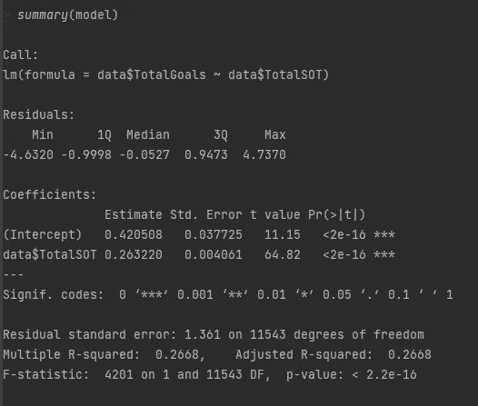
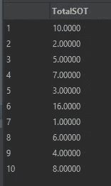
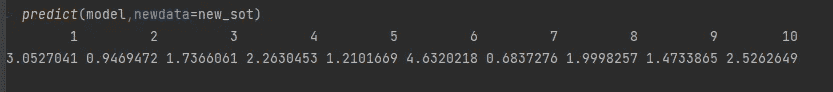

# 总体目标的线性回归预测。步骤和模型演练指南。

> 原文：<https://blog.devgenius.io/linear-regression-prediction-of-total-goals-steps-and-model-walkthrough-guide-c397a647cd2b?source=collection_archive---------4----------------------->

线性回归是预测连续变量最常用的算法之一，无论是股票/房价，你每周在超市花多少钱，甚至是进球的数量。线性模型可以以监督的方式用于预测分析，也就是说，我们将列作为已知值输入模型。在本文中，我将详细介绍线性回归，在将它应用于足球数据集进行演示之前，用于验证这种方法的步骤和技术。这里将使用的编程语言是 r。代码和数据集将在最后提供 github 链接。

*这个建模或预测目标的例子绝不是最佳方法，已经有很多关于泊松分布的文章，它非常适合这样做。这种做法的基础是纯粹的教育基础上进行线性回归所需的步骤。当使用线性回归来解决一个问题时，需要考虑如此大量的知识和方面，这无疑不会在本文中涉及，但希望本文涵盖了许多要点。

# **回归分析**

在建模问题中应用线性回归用于根据至少一个(称为简单线性回归)或多个变量(称为多元线性回归)的值来预测因变量的值。因变量是指我们希望预测或解释的变量。通过这种方法，因变量由自变量的行为模拟，自变量是用于预测或预报的解释变量。

回归分析是确定变量之间潜在关系的一种很好的方法，也就是说，如果 X 的值增加，是否会导致 y 的增加。如果是这样，我们可以得出结论，存在线性关系。图 1 通过可视化的方式展示了这一点。牢固的关系可以是积极的，也可以是消极的。可以观察到，在左上图中，随着 x 的增加，y 的影响也随之增加。下面可以观察到相反的情况。EDA 或通过散点图的解释数据分析是识别这些关系的一个很好的方法，我将很快展示。

图 1:如何判断变量之间的线性？

# EDA 和数据预处理

为了在足球环境中说明这一点，我为欧洲五大足球联赛——西甲、德甲、法甲、意甲和英超——创建了一个足球数据集。数据取自[football-data.co.uk](https://www.football-data.co.uk/data.php)。该数据集包含列:联赛，主队，客场队，主场进球，客场进球，主场射门，主场射门，客场射门，主场角球，客场角球，然后是进球，射门和角球的 4 个总数。总共有 11，677 行，包含从 16/17 赛季到世界杯前夕的所有比赛的比赛数据。

皮尔逊相关图也可用于确定连续/离散数字之间的关系，但我在此不再赘述，因为这些图在可视化关系方面做得更好。

资料组

为了测量与总进球数呈线性关系的总射门数与总进球数之间的可能关系，我通过 GGPLOT2 散点图绘制了这种关系，并拟合了一条红色的线性线以显示可能的相关性。

射门与进球的关系

每场比赛的单独数据点是灰色的，我们可以看到只有两场比赛的总投篮次数达到 50+。直线的斜率代表某种关系，但它并不完全表示真正强有力的关系。一些有 10 个进球的比赛只有大约 30 次射门，而许多没有进球的比赛通常有超过 20 次射门。可以断定有关系，但不是完全确凿的。

下一张图是 x 轴上的角球和 y 轴上的进球。这里的差异令人吃惊，如果我们再次参考图 1，我们可以看到直线是平坦的，甚至朝着角球数量更多的方向向下倾斜。很明显，比赛中更多的角球不会影响进球数量，当你认为角球意味着防守压力时，这可能会令人惊讶。

角落与目标的关系

我们测试了两个可能的独立预测变量的线性度，并得出结论，没有强到足以很好地预测有多少进球。但是让我们试着射向目标变量，直觉上这意味着守门员必须扑出或者防守队员扑出了球门线上的禁区，或者确实进球了。这肯定比前两个变量有更多的线性关系。

目标与目标之间的关系。

并且结果非常令人满意，线性线表示目标上的射门数量和目标之间的真正的强正相关关系。重申这一点，随着 SOT 值的上升，目标值也随之上升。

绘图的结果告诉我们，为了预测进球的数量，使用角球可能是一个相当无用的任务，而且可能不是使用射门的最佳方法。我们知道，发射变量包括 SOT 值，因为发射和目标上的发射相互关联，所以使用这两个变量进行多元线性回归也不是一个好主意，因为存在多重共线性。

在多元回归方程中，只要一个自变量与一个或多个其他自变量高度相关，就存在多重共线性。多重共线性是一个问题，因为**它破坏了独立变量**的统计显著性。(施普林格，2022 年)

这可能导致我们的模型不是很好，或者过度拟合，实际上在预测目标方面做得不好。为了准备一个简单的线性模型，其中包含一个因变量(TotalGoals)和一个自变量(TotalSOT ),我只过滤了这两个变量，得到一个模型数据集:

简单的一元线性模型数据集。

在开始建模之前，线性回归的一个主要假设是数据是正态分布的。为了检查这一点，我们可以使用两列模型文件的直方图。

图 2:总目标的正态分布

在总目标的情况下，分布看起来合理，但不完全是我们想要的。作为参考，看看这个[链接](https://www.investopedia.com/terms/n/normaldistribution.asp#:~:text=Normal%20distribution%2C%20also%20known%20as,as%20a%20%22bell%20curve%22.)。正态分布，也称为高斯分布，是一种关于平均值对称的[概率分布](https://www.investopedia.com/terms/p/probabilitydistribution.asp)，表明接近平均值的数据比远离平均值的数据出现得更频繁。(投资媒体，2022 年)

通过观察总目标的分布，我们可以确认在这个数据集中，最有可能的总目标是 2，紧接着是 3。不同的联盟可能对这个数据有更大的贡献，但是管理差异或者寻找为什么会这样的解释超出了本文的范围。0-0 平局是非常不可能的，在我们 11k+游戏的数据集中只发生了大约 700 次。

图 3:总 SOT 的正态分布。

目标上的总镜头分布看起来很好，是一个很好的钟形曲线的代表。因为总目标是合理的，但不是完全令人满意的，可以对变量进行统计测试，让我们继续前进。有时，你可以有一个接近正态分布，不必过于担心学究，但为了有效性，我将使用一个统计测试来缓解所有的担忧。

我将使用的测试是 Kolmogorov-Smirnov 测试，此处将详细解释[。本质上，我想确认总目标是否是正态分布的，并需要以下假设的第二种意见。](https://towardsdatascience.com/kolmogorov-smirnov-test-84c92fb4158d)

*零假设 Ho* :数据呈正态分布。
备择假设 Ha:数据不是正态分布。

高于 0.05 的 p 值**在统计上不**显著，并表明**无效**假设的有力证据。这意味着我们应该保留原假设，拒绝替代假设。

结果显示，p 值小于显著性阈值 0.05(通常用于许多统计测试)，得出的值为 0.00000000000000022，因此实际上不符合要求。

KS 测试结果。

我们能做些什么来克服这个问题吗？是的，有，它们被称为转变。非正态数据的一些转换包括:

*   SQRT 正偏差数据的平方根。中度倾斜。
*   对数-正偏态数据的 log10。更大的偏斜。
*   反向可用于负偏斜。

在这种情况下，转换没有将分布变为正态分布。因此，我们可以就此打住，但了解可能的补救措施是有价值的。我将检查剔除异常值后的分布，看看是否会产生积极的影响。

# 极端值

重要的是要注意，一般来说，离群值会影响模型推断，在继续之前考虑它们对每个场景中的建模问题的影响总是明智的。在 EDA 和预处理过程中，我们可以使用多种方法来检查异常值。箱线图是常用的。从图 2 直方图的右尾可以明显看出，目标 8-10 的顶端看起来像是异常值。通过使用箱线图，这些确实是异常值的事实更加明显。

图 4:总目标中的异常值。

图 5:总 SOT 中的异常值。

箱线图使用中间值和上下四分位数(定义为第 25 和第 75 个百分位数)。如果下四分位数是 Q1，上四分位数是 Q3，那么差值(Q3-Q1)就称为四分位数间距或 IQR。IQR 本质上是包围盒子的数据。任何大于(或小于)1.5 倍 IQR 的数据点都被称为异常值，这里用我们在图顶部看到的数据点来表示。有几种方法可以解决这些问题。我们可以使用集中趋势测量，如平均值、中间值或众数，或者如果行数非常少，我们可以将它们从数据集中删除。甚至还有将异常值留在其中的概念，因为它们是有趣的数据点，但在本练习中，我将使用中值，并将这些值更改为 TotalGoals 和 TotalSOT 的中值。中位数通常是比平均值更好的选择，因为平均值本身是由所有数据点组成的，并且在设计上包含了异常值。中值是 50%的数据点，不受这些极端值的影响。

现在，我将在移除异常值后检查分布形状。两个变量看起来都好得多。当目标值超过 4 时，仍然有一个轻微的向右的尾巴，但是继续向前是没问题的。

图 6:剔除异常值后的正态分布。

目标上的射击接近完美的高斯形状。

图 7:剔除异常值后的正态分布。

既然预处理工作已经完成，我们可以继续建模，但在此之前，我将概述 5 个假设，我们在前面的多重共线性中已经看到了一个。

线性回归模型的五个假设如下:

*   线性关系——我们已经通过散点图确定
*   多元正态性-通过直方图确认为合理的标准。
*   没有或几乎没有多重共线性-通过使用数据集中一个与其他变量无关的变量来解决。当一个变量用于简单线性回归预测时无效。虽然必须说，一个目标至少有助于进球得分，因为它们是联系在一起的。
*   无自相关-线性回归模型假设误差项是独立的。这意味着一个观测值的误差项不受另一个观测值的误差项的影响。这在时间序列数据中是一个更常见的问题，但在这里并不适用。为了测试自相关性， **Durbin Watson 测试**用于以下假设。
    *零假设 Ho* :没有误差自相关
    *交替假设* Ha:有误差自相关。这是在创建的模型上执行的。同样，高于 0.05 的 p 值**不**具有统计显著性，并表明**无效**假设的有力证据。因为 p 值低于 0.05，我们可以拒绝这种情况下的零假设，并得出结论，存在自相关。由于这不是时间序列数据，因为我没有使用日期来预测未来，所以这不会造成太大的问题。

德宾沃森试验。

*   同方差性—同方差性的假设意味着相同的方差是线性回归模型的核心。同方差描述了一种情况，其中误差项(即自变量和因变量之间关系中的“噪声”或随机扰动)在自变量的所有值上都是相同的。当误差项的大小在独立变量的值之间不同时，异方差(违反同异方差)就出现了。(statisticsolutions.com，2022 年)

我们可以使用 Breusch Pagan 测试来检测具有以下假设的**异方差性**。

*零假设* *Ho* —误差方差相等，这意味着存在同方差。
*替代假设 Ha* —误差方差不相等，这意味着不存在同方差。

我再一次发布观察 p 值的指导方针。高于 0.05 的 p 值是**不具有**统计显著性，并且表明**无效**假设的有力证据。这意味着我们应该保留原假设，拒绝替代假设。

p 值小于 0.05，这意味着我们应该拒绝零假设，接受备选项。这表明不存在同质性。

布鲁赫异教徒试验。

# 建模。

线性回归通过以下公式建模—

其中: **y** 为自变量( **x** )任意给定值下因变量( **y** )的预测值。

*   **B0** 是**截距**，当 **x** 为 0 时 **y** 的预测值。
*   **B1** 是回归系数——当 **x** 增加时，我们期望 **y** 改变多少。
*   **x** 是自变量(我们期望的变量在影响 **y** )。
*   **e** 是估计的**误差**，或者说我们对回归系数的估计有多大的变异。所以本质上这个模型是说，一个 SOT 值增加了目标期望值，从 0.42 上升了 0.26。一个大胆的声明，假设我们应该每 4 秒看到一个目标。

该方法的目的是通过搜索回归系数(B1)找到数据中的最佳拟合线，使模型的总误差(e)最小化。

我称线性模型为使用 TotalSOT 的独立变量来预测总目标。使用 r 中的 summary 函数。找到汇总结果。

图 8:模型的总结结果。

评估此输出的结果是理解线性模型在某种程度上有效的关键。残差非常对称。也就是说，如果我们把它们画出来，它们看起来会非常类似于正态分布。中位数接近于 0。这证实了这确实是关于正态分布相似性的情况。这一点很重要，因为残差的正态性是运行这种模型的一个重要假设，反过来，它积极地反映了未来的模型推断。

剩余标准误差为 1.361，这是因变量偏离真实回归线的平均量。f-统计量—当响应和预测值之间没有关系时，
我们希望该值接近 1，我们可以看到该值
远大于 1。

R 平方值为 0.2668，这意味着该模型占总方差的 26%。R 平方是一种拟合优度度量，它表示自变量解释的因变量的方差百分比。一般来说，R2 值越高越好，但是 R2 值有局限性。使用这个值来确定我们所能做出的系数估计和预测是否有偏差是不明智的，因此应该对残差图进行检查。

*“R-squared 并不表示回归模型是否能充分拟合您的数据。好的模型可以具有低的 R2 值。另一方面，有偏见的模型可以有很高的 R2 值！”—吉姆·弗罗斯特。*

即使 R2 值很低，但独立变量很重要，这在这里由汇总输出中的低 pvalue(小于 0.05)和三个星号*表示。总进球数和总打靶数的关系我们还是可以得出一些结论的。当使用一个以上的变量来预测时，调整后的 R2 值更具有指示性。

假设自变量移动一个单位，统计显著系数被认为继续代表因变量的平均变化。在这种情况下，SOT 只占总方差的 26%,所以就模型质量而言，我认为仅仅确认它是目标的完美预测器是不够的。

# **残差分析。**

残差(误差)是因变量(目标变量)的预测值与下面计算的因变量的实际观察值之间的差异。

残差=实际 y 值-预测 y 值

ri=yi−^yi.

分析模型误差图是理解模型在预测总体目标方面有多好的关键。

图 9:后验预测检查。

后验预测检验定义为:“在拟合模型下模拟复制数据，然后将这些数据与观察数据进行比较”([盖尔曼和希尔，2007 年，第 158 页](http://www.stat.columbia.edu/~gelman/arm/))。在应用中，后验预测检验的使用是为了“寻找真实数据和模拟数据之间的系统性差异”([盖尔曼等人，2004 年，第 169 页](http://www.stat.columbia.edu/~gelman/book/))。正如来自 R 包“性能”的残差图所示，观察数据与总得分相比波动很大。该模型未能完全解释目标利差，当我们知道目标是随机的且 R2 值如此之低时，这并不奇怪。

图 10:线性度。

绿色参考线应该是水平的。我们可以看到，在很大程度上，它符合预期。

图 11:方差的同质性。

图 11 是与图 10 相似的曲线图。方差齐性表示组间**方差相对均匀**。也就是说，所有群体之间都有相似的变异。

图 12:残差的正态性。

残差的正态性遵循直线。在底端和顶端有一些偏斜，但是考虑所有点允许我们确认线性模型的残差是正常的。

图 13:厨师距离。

因为我们之前处理了异常值，这意味着在两条等高线之外没有影响模型的有影响的异常值。如果是这种情况，我们将看到表明异常值存在的数据点。在这种情况下，我们需要相应地处理这些问题，因为它们的存在会改变模型预测总体目标的方式，从而影响绩效。

# **交叉验证**

交叉验证是模型性能分析的关键部分。交叉验证**是一种重采样方法，使用数据的不同部分在不同的迭代中测试和训练模型**。它主要用于以预测为目标的环境中，人们希望估计预测模型在实践中的准确程度。(维基百科，2022)

我使用了 10 个 k 折叠，其中在训练的每次迭代中，模型的 9 个折叠用于训练，一个折叠用于验证。每次迭代都会对训练折叠进行重新采样，验证集也是如此，这意味着我们可以更准确地了解模型对新数据的概括能力。

图 14:10 倍的 CV 模型。

我们得到和之前一样的值。这意味着在预测总体目标时，最初的模型可能和它得到的一样好。也就是说，如果没有更多更能预测总目标的数据，我们得到的结果就不可能得到改善。

# **预测**

到目前为止，我们已经看到了基本的数据准备和探索步骤。检查数据的分布，并进行检查以确保数据在很大程度上符合创建线性回归模型以预测总体目标的假设或要求。然后创建模型，并检查汇总输出和残差，以确定性能问题和验证。交叉验证用于确定总体性能，由此得出结论，如果没有更多/更好的数据，用这种方法预测的目标将不是最佳的。最后一步是执行一些预测。

在这个例子中，我没有为这个模型创建训练和测试分割，因为我将根据我创建的 SOT 值自己手动预测十个目标值。很明显，这种方法不足以单独预测总目标，所以我认为这是不必要的。我创建了一个新的数据集，包含了 SOT 值和游戏中的总进球数。

图 15:编造数据进行预测。

该模型预测总目标为:

预测。

10 次击中目标导致 3.05 个进球。击中目标两次，结果仅差一球。16 次射门中靶我们预计会进 4 个球。这看起来并不可怕，但进行这个练习应该真正巩固好数据在预测随机变量(如目标)中的重要性。如果我们有离球门的距离，射门前的球员总数，射门的球员，或者如果是点球，禁区外或头球，这将告诉我们更多。它明确证实了高级数据度量的有效性，这就是为什么预期目标是一个更好的度量。

我希望你喜欢阅读，并学习了制作线性回归模型的一些步骤。这篇文章决不是完成这种分析的完全详尽的指南，这种分析对于手头的每个问题都是独特的，但总的来说，可以进行这样的分析，即仅在目标上射门不能很好地预测总进球。

使用的数据集可以在这里找到[，以及用于执行本文中看到的步骤的 R 脚本。](https://github.com/socrstats/medium_model_guides)

关注我以获取更多的足球内容，我经常发布网络抓取文章，目的是为此收集更好的数据。

谢谢，

保罗。

 [## medium_model_guides/1。线性回归。r 位于主控制台/中型 _ 车型 _ 指南

### 用于模型教程的代码和数据集。为 socrstats/medium_model_guides 开发做出贡献，创建一个…

github.com](https://github.com/socrstats/medium_model_guides/blob/main/1.%20Linear%20Regression.R)