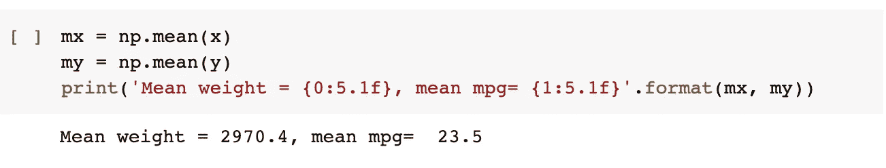
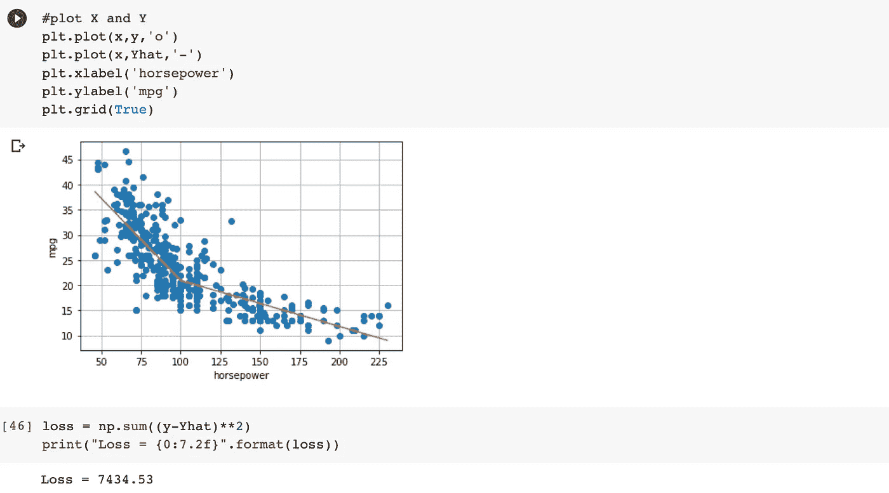

# 使用汽车 mpg 数据的线性回归

> 原文：<https://blog.devgenius.io/linear-regression-using-automobile-mpg-data-46ccc09a04cc?source=collection_archive---------4----------------------->

本文将讨论以下内容。我们将使用线性回归模型来发现汽车 mpg 数据集中两个变量之间的关系。

*   线性回归
*   最小二乘法
*   汽车 mpg 数据集
*   实施简单线性回归
*   实现分段线性回归

# 线性回归

[线性回归](http://www.stat.yale.edu/Courses/1997-98/101/linreg.htm)通过将一个线性方程与观察到的数据相拟合来模拟两个变量之间的关系。

或者，正如[乔希·斯塔默](https://www.youtube.com/watch?v=nk2CQITm_eo)解释的那样，线性回归背后的概念就是**用最小二乘法和 R 平方拟合数据**。

# 最小二乘法

credit:[https://www . jmp . com/en _ in/statistics-knowledge-portal/what-is-regression/the-method-of-least-squares . html](https://www.jmp.com/en_in/statistics-knowledge-portal/what-is-regression/the-method-of-least-squares.html)

[最小二乘法](http://www.stat.yale.edu/Courses/1997-98/101/linreg.htm)通过最小化每个数据点到直线的垂直偏差的平方和来计算观察数据的最佳拟合直线。

我们将使用这些方法来找出汽车 mpg 数据中两个变量之间的关系。

# 汽车 mpg 数据集

汽车 mpg 数据集来自**加州大学欧文分校机器学习知识库**，该知识库维护 622 个数据集作为对机器学习社区的服务。

[https://archive.ics.uci.edu/ml/datasets/auto+mpg](https://archive.ics.uci.edu/ml/datasets/auto+mpg)

如在网站上找到的数据集的详细描述所示，有 398 行和 9 列以及缺失值。这 9 个属性信息描述如下。

1.mpg:连续
2。气缸:多值离散
3。排量:连续
4。马力:连续
5。重量:连续
6。加速:连续
7。年款:多值离散
8。原点:多值离散
9。汽车名称:字符串(对于每个实例是唯一的)

该数据涉及以英里/加仑为单位的城市循环油耗，根据 3 个多值离散属性和 5 个连续属性进行预测( [Quinlan](https://archive.ics.uci.edu/ml/datasets/auto+mpg) ，1993)。

# 实施简单线性回归

在导入 **Matplotlib、Pandas** 和 **Numpy** 包之后，我们加载数据集。

使用 head()函数，我们可以看到数据集的前 6 行，并检查 dataframe 是否正确加载。

使用 columns、shape 和 index 函数，我们可以检查列名、行数(索引)和列数。

将数据帧转换为 NumPy 数组，我们可以直观地看到汽车的**重量和 mpg** 之间的关系。

平均重量和平均 mpg 也可以使用以下代码进行研究。

## 绘制线性拟合

我们将探索不同特性**马力**和**英里/加仑**之间的关系。

由于马力有一些丢失的数据，我们将使用 **dropna** 方法来删除它们。

**𝑥棒线**和 **𝑦棒线**为样本均值， **𝑠𝑦𝑥** 和 **𝑠𝑥𝑥** 为协方差和方差。

我们绘制 x 和 y(实际值)以及 x 和 ypred(预测值),以确定预测值与实际数据集的拟合程度。

平方损失(RSS 或 L2 损失)是测量预测值(yhat)和实际值(y)之间差异的最常用方法之一。

# 实现分段线性回归

由于当马力在 50-100 之间时，mpg 更高，我们将看到如何通过使用分段线性回归来提高拟合度。

我们将遵循这个分段函数。

因为马力在 50-100 之间有较高的 mpg，我们将把 lambda 设置为 100。

新的 X 矩阵将如下所示。

然后，我们使用以下公式和函数找到最佳β。

然后，我们可以基于最优β找到 yhat(预测的)。

通过再次绘制 x 和 y(实际值)以及 x 和 Yhat(预测值)，我们可以直观地看到预测值与实际数据集的吻合程度。

损耗减少了接近 2000，这比第一次线性拟合好得多。

感谢你花时间阅读这篇文章！