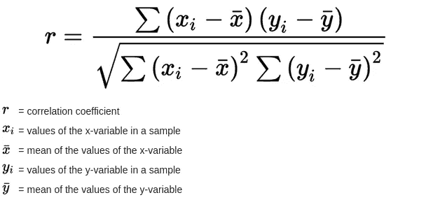

# 用 python 实现线性回归

> 原文：<https://blog.devgenius.io/linear-regression-with-python-228028edc989?source=collection_archive---------0----------------------->

## 机器学习

我们将预测学生态度的价值，代表他/她在考试中对问题的正确回答。


线性回归

在学习新东西之前，我们需要问一个问题。而那个问题就是“ ***我们为什么要用那个？*** 。

当我们想要根据一个变量的值来预测另一个变量的值时，使用线性回归**。我们要预测的变量称为因变量(或者有时称为结果变量)。**

我们知道计算机是哑机器，除非我们不给出或提供指令，否则它不能执行任何操作。在机器学习中，我们经历了线性回归的概念，因为这是通过一些公式预测一些值的技术。

所以，让我们直接进入主题，做一些预测。

> **线性回归公式:**


图 1(线性回归公式)

在第二段。我提到了因变量这个术语。这里 **Y** 是因变量，我们将预测它的值。

如果你在想为什么它的因变量，那么它的答案是很明显的。 **Y** 取决于值 *y 截距*即 **α** 和斜率值 **β** 以及此处独立变量 **x** 的值。所以如果任何值发生变化。 **Y** 的值也会改变。

> 我们使用的公式

我们可以很容易地实现它，因为我们有公式。但是现在我们还没有 **α，β** 和**x**的值

## ***β(斜率公式):***

让我们先从 **β** 开始。 **β** 是这里的斜率。斜率的公式如下。


图 2(斜率回归公式)

我们不会深究所有的斜率概念。但简而言之 **r** 是相关系数。 **Sy** 为 **Y** 值的标准偏差， **Sx** 为 **X** 值的标准偏差。

***相关系数(r)公式:***



图 3(相关系数)

符号σ(**∑**)通常用于表示多个项的总和。 **x̅** 是 x 的平均值，y̅**是 y 的平均值**

***“标准差(Sy 或 Sx)”公式:***


图 4(标准偏差公式)

这是标准偏差的公式，数值会根据截距而变化。如果 **Sx** 那么使用给定的公式，或者如果 **Sy** 那么用 y 代替 x

## ***y 轴截距(α)公式:***


图 5 ( *y 轴截距(α)公式)*

Y 的平均值也称为 Y 的平均值，X 的平均值也称为 X 的平均值。

> 一组步骤

到目前为止，我们已经讨论了所有用于寻找线性回归的公式。

让我们通过创建地图来清理我们的道路。

**第一步:**

我们将找到公式中需要用到所有可能的平均值。

**第二步:**

我们将找到**相关系数(r)** 的值。

**第三步:**

我们将找到**标准偏差的值(Sy 和 Sx)。**

第四步:

我们将把第三步和第四步的值放入**斜率(β)** 公式中。

**第五步:**

我们将找到 y 截距的值，即 **α** 。

**第六步:**

我们将把第四步和第五步的值放入**线性回归**公式中。

> 履行

首先创建任意名称的 python 文件。在我的例子中，我将它的名称设置为“ ***ManualURL.py*** ”

我们需要在我们的计算机或虚拟环境中安装 **numpy，sklearn** 。我们可以通过下面的命令简单地安装它。

```
pip install numpy
pip install sklearn
```

然后我们需要在文件的顶部导入它们。

```
import numpy as np
import math
from sklearn.linear_model import LinearRegression
```

然后创建两个数组。我们将根据学生给出的问题的正确答案来预测学生的态度。最后，我们将把我们的输出与从 sklearn 导入的 **LinearRegression** api 进行比较。

```
x = correct_questions_answers = [17,13,12,15,16,14,16,16,18,19]
y = attitude = [94,73,59,80,93,85,66,79,77,91]print("Hello! I'll predict how much happy you're on the behalf of your correct answers")
print("Please put the number of correct answers")
print("NOTe *This assumption is without any API*")
```

我已经用 **x** 和 **y** 创建了两个数组，为了让你更清楚，我给它们分别取了两个名字。并增加了一些打印语句，以便用户在最后运行程序时进行干预，这样用户就能明白该做什么。

**实施第一步:**

```
# Finding mean of x.
mean_of_X = float(sum(x))/(float(len(x)))# Finding mean of y.
mean_of_Y = float(sum(y))/(float(len(y)))
```

我们分别寻找 x 和 y 的平均值。我们使用浮点数据类型，因为数据可以是十进制的。 **Sum()** 和 **len()** 是 python 内置函数 Sum()将数组的所有条目相加， **len()** 统计数组中的条目数。

```
# Finding (x — mean_of_X)x_Minus_mean_of_X = []
a = 0
for a in x:
  append_value = 0
  append_value = a — mean_of_X
  # print(append_value)
  x_Minus_mean_of_X.append(append_value)
```

这里我设置了另一个名为 **x_Minus_mean_of_X** 的数组，它存储(X-mean _ of _ X)的结果。简单地说，我在从 **x( *正确 _ 问题 _ 答案)*** 值*中减去 **x** 的平均值。*我正在使用 for 循环，这样数组的所有值都通过 x 减去，然后将结果临时存储在 **append_value** 变量中。还有。在名为 **x_Minus_mean_of_X.** 数组中添加结果值

```
# Finding (y — mean_of_Y)
y_Minus_mean_of_Y = []
b = 0
for b in y:
  append_value = 0
  append_value = b — mean_of_Y
  # print(append_value)
  y_Minus_mean_of_Y.append(append_value)
```

这与 y 阵列的步骤完全相同，y 阵列是**姿态**阵列。

```
# Finding (x — mean_of_X) * (y — mean_of_Y)
# using multiply function to multiply two arraysproduct_of_xy_from_their_mean = np.multiply(x_Minus_mean_of_X, y_Minus_mean_of_Y)
```

我声明了一个很长的变量，只是为了让你知道什么是什么。还加上了评论。正如你所看到的，我在这个文件的最上面导入了 numpy 作为 np。现在使用 **multiply()** 函数将数组相乘。

```
# Finding sqaure of (x — mean_of_X)
Sqaure_of__x__mean_of_X = []
c = 0
for c in x_Minus_mean_of_X:
  append_value = 0
  append_value = c**2
  # print(append_value)
  Sqaure_of__x__mean_of_X.append(append_value)
```

现在寻找数组 **x_Minus_mean_of_X** 的每个值的平方。这就是为什么我们在这里使用 for 循环并将结果值附加到另一个新声明的名为**Sqaure _ of _ _ x _ _ mean _ of _ x .**的数组中

```
# Finding sqaure of (x — mean_of_X)Sqaure_of__y__mean_of_Y = []
d = 0
for d in y_Minus_mean_of_Y:
  append_value = 0
  append_value = d**2
  # print(append_value)
  Sqaure_of__y__mean_of_Y.append(append_value)
```

这与 Y 数组的步骤完全相同，Y 数组是 **y_Minus_mean_of_Y** 数组。

**实施第二步:**

求相关系数(r)的值。首先我们分别找到命名者和分母。然后我们会找到相关系数(r)本身。

```
#Finding numirator of correcation coefficient (r)
numirator = sum(product_of_xy_from_their_mean)
```

我正在添加值**product _ of _ xy _ from _ their _ mean**数组。我建议你也看看这个公式，以便更好地理解。

```
#Finding denominator of correcation coefficient (r)
denominator = sum(Sqaure_of__x__mean_of_X) * sum(Sqaure_of__y__mean_of_Y)
```

我把数组的值**Sqaure _ of _ _ X _ _ mean _ of _ X**和数组的值**Sqaure _ of _ _ Y _ _ mean _ of _ Y**相加，然后乘以*运算符。

```
r = numirator/math.sqrt(denominator)
```

在分母中，我使用了 **math.sqrt()** 。**。sqrt()** 是数学库中的平方根方法。我用它来求平方根分母。

**实施第三步:**

为了找到斜率的值，我们需要找到**标准偏差的值(Sy 和 Sx)。让我们发现:**

```
#Finding SySy_numirator = sum(Sqaure_of__y__mean_of_Y)
Sy_denomirator = len(y) — 1Sy = math.sqrt(Sy_numirator/Sy_denomirator)
```

首先，我们找到 Sy 的命名者，并将其存储在 **Sy_numirator** 变量中，分母也是如此。

```
#finding Sx
Sx_numirator = sum(Sqaure_of__x__mean_of_X)
Sx_denomirator = len(x) — 1Sx = math.sqrt(Sx_numirator/Sx_denomirator)
```

首先我们找到 **Sx** 的命名者，我们找到并存储在 **Sx_numirator** 变量中，分母也是一样。

**执行第四步:**

现在我们可以求出斜率的值。我们在 ***第二步*** 中找到了**相关系数(r)** 在 ***第三步*** 中找到了**标准差(Sy/Sx)** 。

```
# Finding Sy/Sx
_S_ = Sy/Sx
slope = r * _S_
```

我们简单的将 **( Sy/Sx)** 的值存储在 **__S__** 单变量中，并与**相关系数(r)** 相乘，存储该值为斜率变量。

**执行第五步:**

```
#Finding y intercept_a = mean_of_Y — slope*mean_of_X
```

我们现在可以通过输入目前得到的值来找到 y 截距。

**实施第六步:**

现在我们可以找到线性回归，因为我们已经有了一切。但是首先需要问学生他给出了多少正确答案。我们可以通过添加输入字段来简单地做到这一点。

```
question_input = float(input())
```

在这之后你可以使用线性回归公式。

```
_y = _a + slope*question_input
```

_y 是因变量，得到了这个的预测值。

> 请比较线性回归 API

你可以简单地比较你的预测，把下面的代码放在你的文件的底部。

```
print(“We predict that you’ll be happy”,_y,”this much !”)
print(“”)
print(“Lets resure the prediction with experts program”)
print(“Please put the same number of correct answers”)
print(“NOTE *This time the assumption is with API*”)s = np.array([17,13,12,15,16,14,16,16,18,19]).reshape((-1,1))
t = np.array([94,73,59,80,93,85,66,79,77,91])print(“”)
print(“X”,x)print(“Chick X to resure the prediction or quite by pressing any other key”)
ans = input()value = None
if ans is “X”:
  value = s
else:
  print(“Thank You!”)
  quit()model = LinearRegression().fit(s,t)
_X = [value]
r_sq = model.predict(s)
print(r_sq)
```

谢谢大家！