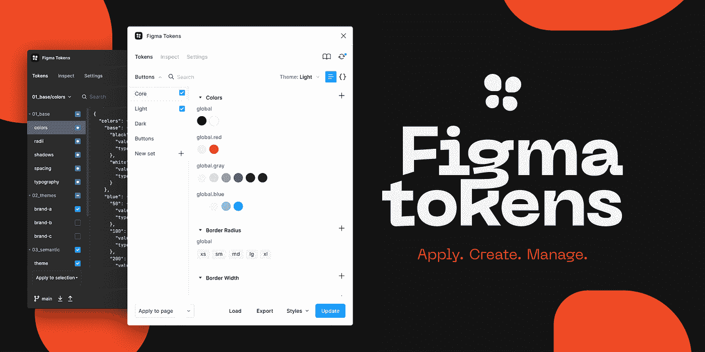

# 链接 Figma 并使用 Figma 令牌进行反应

> 原文：<https://blog.devgenius.io/link-figma-and-react-using-figma-tokens-89e6cc874b4d?source=collection_archive---------1----------------------->

我已经测试了一个名为“Figma 令牌”的 Figma 插件几个星期了。



Figma 社区的 Figma Token

该工具允许您使用 Figma 令牌创建设计系统。

# 这是什么意思？


这意味着您可以创建诸如“颜色”、“间距”、“边框半径”等标记。然后，您可以将它应用于整个文档、样式或仅应用于所选内容。

最棒的是，您可以以 [JSON](https://es.wikipedia.org/wiki/JSON) 格式导出这些令牌。这个插件本身允许你在 Github 或 Gitlab 上导出这个 JSON。


创建新的分支或直接在 main 上创建。


JSON 档案导出到 Github

# 好吧，但是我该怎么做呢？

我们可以把这个 JSON 和另一个叫做[风格词典](https://amzn.github.io/style-dictionary/#/)的工具一起使用。多亏了它，我们可以将这个 JSON 转换成 CSS 格式。))不错:)

为此，我们将在 React 项目中安装我们的样式字典包。

```
npm install -D style-dictionary
```


下一步是在 React 项目的根目录下创建一个 config.json 文件。

```
{   
    "source": ["./tokens/tokens.json"],
    "platforms": {     
        "css": {       
            "transformGroup": "css", 
            "buildPath": "./src/build/css/",
            "files": [
             {           
                "destination": "_variables.css",
                "format": "css/variables"         
             }       
         ]     
      }   
   } 
}
```

一切就绪，现在我们只需用下面的命令初始化脚本。

```
npx style-dictionary build --config config.json
```

我们已经将所有 Figma 标记创建为 CSS 变量。


如果在任何时候我们需要在设计系统中修改我们的令牌来修改主色、间距、文本大小等。我们只需将更改上传到 Github / Gitlab，前端开发人员只需执行两个命令就可以在项目中传输这些更改。

```
git pull
npx style-dictionary build --config config.json
```

就这样😊一切都被修改了。这大大简化了设计者和开发者之间的交流和工作。