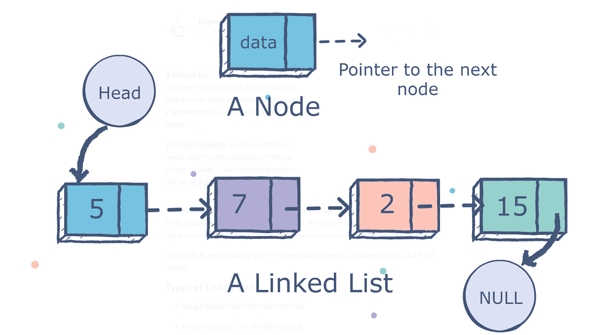
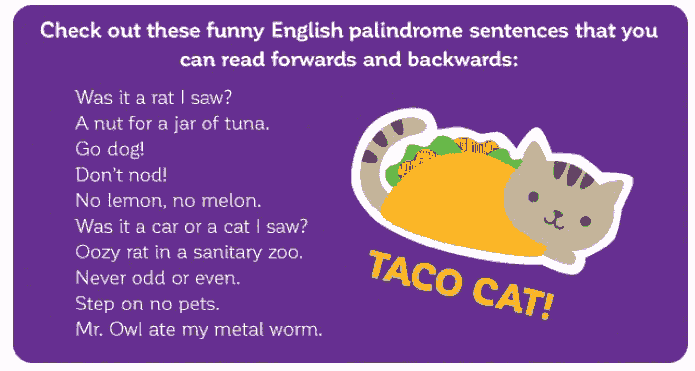
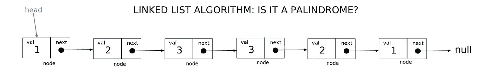
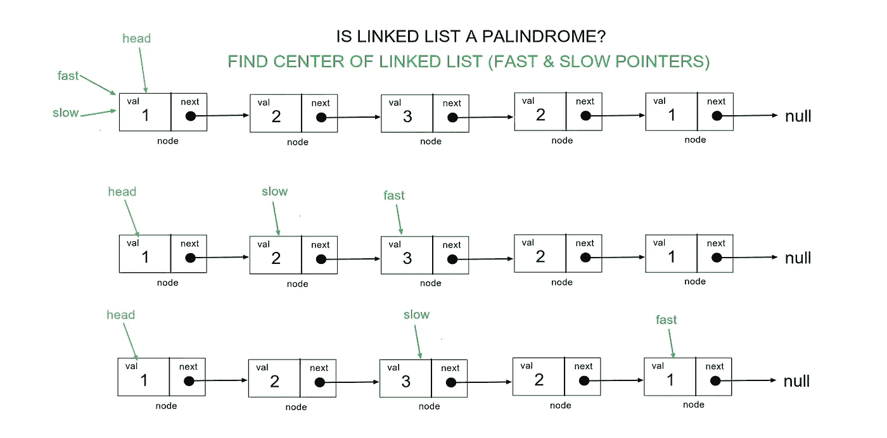
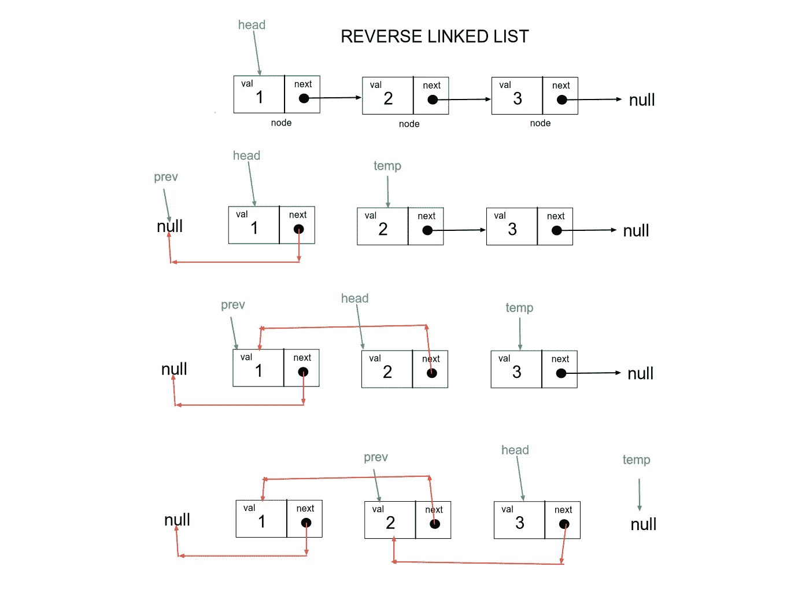
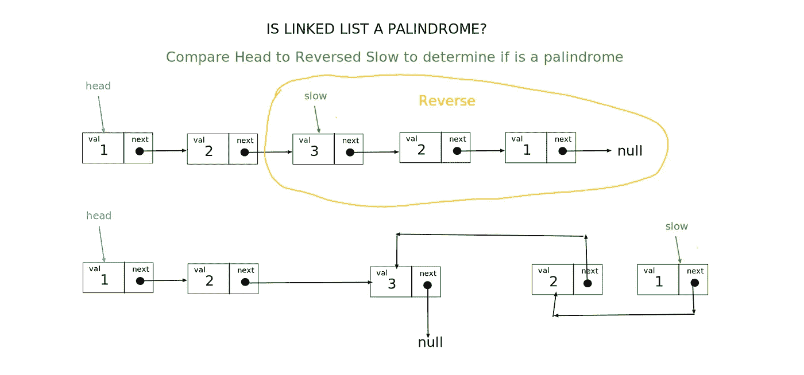

# 链表算法:它是单链表的回文吗？

> 原文：<https://blog.devgenius.io/linked-list-algorithm-is-it-a-palindrome-for-singly-linked-list-3137291f76c9?source=collection_archive---------2----------------------->



[https://www.educative.io/edpresso/what-is-a-linked-list](https://www.educative.io/edpresso/what-is-a-linked-list)

# 什么是链表？

链表是一种数据结构，由一系列通过链接连接的节点组成。每个节点都包含一个值，并有一个指向链中下一个节点的 next 指针。头指针指向第一个节点，最后一个元素指向 null。

有不同类型的链表:

*   单向链表(单向)
*   双向链表(双向)
*   循环链表

链表有简单的基本操作，如插入、删除、搜索。与数组不同，元素中的指针可以很容易地被改变以插入或删除元素。

# 什么是回文？



回文是一个单词、短语或序列，向后读和向前读是一样的。

# 链表是回文吗？

现在我们知道了什么是链表和回文，我们如何确定给定的链表是否是回文。

用一个数组或一个字符串，来判断这些数据集是否是一个回文可以有不同的简单解法。一个可能的解决方案是制作一个反向副本，并将其与原始副本进行比较，以查看反向副本是否与原始副本相同。另一个可能的解决方案是遍历数组或字符串，比较第一个元素和最后一个元素，并对每个向中心移动的元素继续这样做。

至于单链表，不像字符串或者数组那么直接。这是因为没有前一个指针或尾指针，我们不知道列表中的最后一个节点或前一个节点，也不能快速确定列表的长度。

有些解决方案会占用额外的内存空间。例如，将链表中的所有值存储到一个数组中，并判断该数组是否为回文。或者制作链表的副本，反转链表的副本并将每个值与原始值进行比较。

让我们按照以下步骤来考虑不占用额外内存的解决方案:

1.  确定给定链表的中点(使用两个指针)
2.  反转链表的后半部分
3.  比较链接列表值

让我们以这幅图为例:



举例。这个单链表是回文吗？

# 使用 2 个指针确定中点。

*   快速指针—最初设置为与头部指针相同，移动速度比慢速指针快两倍，直到到达终点
*   慢速指针—最初设置为与头指针相同，将随着快速指针一次移动一个节点。

查看慢速指针和快速指针如何在链表中穿行。



```
let slow = head;
let fast = head;
while (fast && fast.next) {
  slow = slow.next
  fast = fast.next.next;
}
```

# **反转链表的后半部分**

一般情况下，我们如何反转一个链表？

当我们遍历链表时，我们希望第一个节点是最后一个，因此它的下一个指针应该指向 null。有了 prev，head 和 temp 指针，我们可以让 head 的下一个指针指向 prev 节点，并在列表中移动时继续这样做。我们需要一个临时指针，这样头部就知道下一步该去哪个节点。



```
var reverse = function(head) {
  let prev = null;
  while (head) {
    let temp = head.next;
    head.next = prev;
    prev = head;
    head = temp;
  }
  return prev;
}
```

让我们回到我们的例子，看看后半部分(指针变慢)是什么样子。



我们的头指针和慢指针以及所有后面的指针都指向末尾或空。我们现在可以…

# **比较链表值**

当我们在 head 或 slow 不等于 null 的情况下遍历时，我们可以在向终点(或 null)移动时比较 head 的值和 slow 的值。

```
while (slow) {
  if (head.val !== slow.val) {
    return false;
  }
    head = head.next;
    slow = slow.next
}
```

让我们把所有的碎片放在一起，为我们的最终解决方案。

```
var isPalindrome = function(head) {
    let slow = head;
    let fast = head;
    while (fast && fast.next) {
        slow = slow.next
        fast = fast.next.next;
    }
    slow = reverse(slow);
    while (slow) {
        if (head.val !== slow.val) {
            return false;
        }
        head = head.next;
        slow = slow.next
    }
    return true;
};var reverse = function(head) {
    let prev = null;
    while (head) {
        let temp = head.next;
        head.next = prev;
        prev = head;
        head = temp;
    }
    return prev;
}
```

这就对了，当这些步骤被分解并组合在一起时，并不那么糟糕！

我想用一个简单的数据结构算法来保持本周的文章简洁明了。在本周的 Hack Reactor 中，我们做了一个 react redux 和 thunk sprint，这是一个状态管理工具。我认为这在概念上是有意义的，并且检查代码的工作方式也是有意义的(有时，我必须仔细考虑)。我期待了解更多关于 React hooks 的知识，因为它是 React 自己的状态管理系统。在接下来的几周里，我们会写更多的东西！