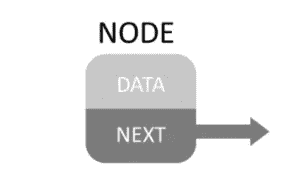
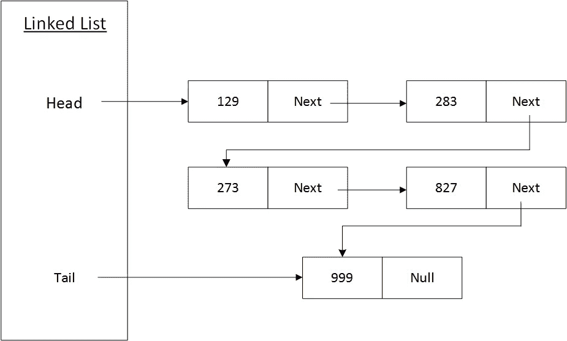
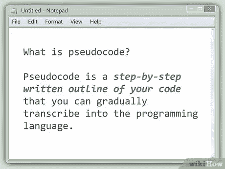

# 链表——简介

> 原文：<https://blog.devgenius.io/linked-list-an-introduction-25f8cac4452e?source=collection_archive---------1----------------------->

在过去的几个月里，我一直在考虑重温数据结构的概念。人们常说，最好的学习方法是向别人描述你的学习。在这篇文章中，我将努力向我的读者介绍链表。

根据维基百科，链表的定义是:

> 在计算机科学中，**链表**是数据元素的线性集合，其顺序不是由它们在内存中的物理位置给出的。相反，每个元素指向下一个。它是一种数据结构，由共同代表一个序列的节点集合组成

**什么是节点？**



节点是数据结构的基本构件。如上图所示，它由两部分组成

1.  数据
2.  链接(即指针)到下一个节点

链表是数据元素的线性集合。让我们借助一个 5 节点链表来理解这一点。



**重点:**

1.  一个链表有一个头节点和一个尾节点。头指向链表的第一个元素，尾指向最后一个元素。
2.  链表中的每个节点将指向下一个节点。
3.  空链表的头尾将为空。
4.  单节点链表的头和尾将指向唯一的节点。

**我们来看看一些伪代码:**



节点可以表示为:

```
public class Node {
    public int Value {get; set;}
    public Node Next {get; set;}
}
```

链表的不同节点可以被初始化为:

```
Node first = new Node{value = 129};
Node second = new Node{value = 283};
Node third = new Node{value = 273};
Node fourth = new Node{value = 827};
Node fifth = new Node{value = 999};
first.Next = second;
second.Next = third;
third.Next = fourth;
fourth.Next = fifth;
fifth.Next = null;
```

链表的头部将指向第一个节点，而链表的尾部将指向第五个也是最后一个节点。

在接下来的几篇文章中，我将介绍链表的不同操作。

1.  [在链表的开头添加一个节点](https://medium.com/@tarunbhatt9784/linked-list-can-you-add-a-professional-node-please-4387215baa5a)
2.  [在链表的末尾添加一个节点](https://medium.com/@tarunbhatt9784/linked-list-add-a-node-at-the-end-5b1911b160a0)
3.  [有效插入:链表 vs 数组](https://medium.com/@tarunbhatt9784/effective-insertion-linked-list-vs-arrays-c36bea8c5613)
4.  [从起点删除一个节点](https://medium.com/@tarunbhatt9784/linked-list-remove-node-from-the-start-15bfef2cba27)
5.  [从末端移除一个节点](https://medium.com/@tarunbhatt9784/linked-list-remove-node-from-the-end-3aab6bc83b32)
6.  [枚举和查找操作](https://medium.com/@tarunbhatt9784/linked-list-enumerate-find-operations-e51d42e82fc1)

**参考文献:**

1.  [https://app . plural sight . com/library/courses/ads-part 1/目录](https://app.pluralsight.com/library/courses/ads-part1/table-of-contents)
2.  [https://en.wikipedia.org/wiki/Linked_list](https://en.wikipedia.org/wiki/Linked_list)

谢谢，塔伦


页（page 的缩写）s-Medium 是一个阅读、写作和向其他作者学习的绝佳平台。如果你想加入我的旅程，今天就加入[传媒](https://tarunbhatt9784.medium.com/membership)。