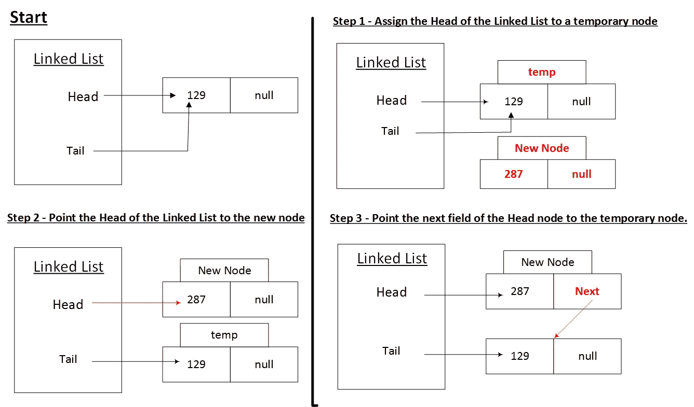
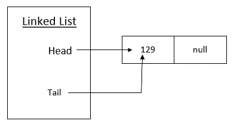

# 链接列表—在开头添加一个节点

> 原文：<https://blog.devgenius.io/linked-list-can-you-add-a-professional-node-please-4387215baa5a?source=collection_archive---------0----------------------->



几天前，我开始回顾我的数据结构概念。人们常说，最好的学习方法是向别人描述你的学习。本文是该计划的延续。阅读本文之前，最好对 [**链表**](https://medium.com/@tarunbhatt9784/linked-list-an-introduction-25f8cac4452e) 有一个基本的了解。

这篇文章是关于在链表中添加一个节点的。


**场景:**

1.  在空链表中添加节点
2.  将新节点添加到现有链表的前面。
3.  在现有链表的末尾添加一个新节点。

在本文中，我将只讨论场景 1 和 2。场景 3 已经在[这里](https://medium.com/@tarunbhatt9784/linked-list-add-a-node-at-the-end-5b1911b160a0)讲过了。

1.  **在空列表中添加节点**



向空列表添加新节点的最简单方法是将链表的头和尾都指向新节点。

```
public void AddFirstNode(LinkedListNode<T> node)
{
    Head = node;
    Tail = node;
    node.next = null;
    Count++;
}
```

**2。在现有链表的前面添加一个新节点。**


向前端添加新节点的步骤如下:

1.  将链表的头分配给一个临时节点
2.  将链表的头部指向新节点
3.  将头节点的下一个字段指向临时节点。

需要注意的是，在上面的例子中，不需要临时节点。为了确保该流程适用于多个节点，我们使用了一个临时节点。

```
public void AddNodeAtTheStart(LinkedListNode<T> node)
{
    LinkedListNode<T> temp = Head;
    Head = node;
    Head.next = temp;
    Count++;
}
```

**结论:代码的最终版本。**

```
public void AddNodeAtTheStart(LinkedListNode<T> node)
{
    LinkedListNode<T> temp = Head;
    Head = node;
    Head.next = temp;
    Count++;
    if(Count==1) Tail = Head;
}
```

本文的完整代码可以在[https://github . com/tarunbhatt 9784/linked list/tree/master/LinkedListAddToFront](https://github.com/tarunbhatt9784/LinkedList/tree/master/LinkedListAddToFront)找到

**参考文献:**

1.  [https://medium . com/@ tarunbhatt 9784/linked-list-an-introduction-25 F8 CAC 4452 e](https://medium.com/@tarunbhatt9784/linked-list-an-introduction-25f8cac4452e)
2.  [https://app . plural sight . com/library/courses/ads-part 1/目录](https://app.pluralsight.com/library/courses/ads-part1/table-of-contents)
3.  [https://en.wikipedia.org/wiki/Linked_list](https://en.wikipedia.org/wiki/Linked_list)


页（page 的缩写）s-Medium 是一个阅读、写作和向其他作者学习的绝佳平台。如果你想加入我的旅程，今天就加入 [medium](https://tarunbhatt9784.medium.com/membership) 。