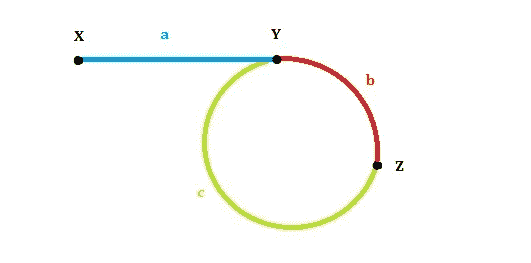
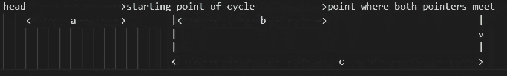
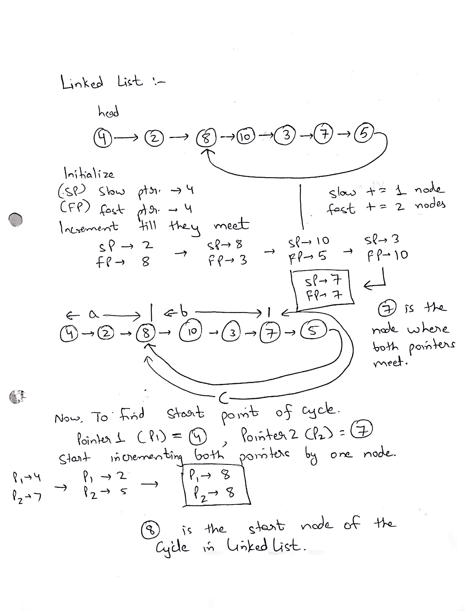

# 链表循环问题

> 原文：<https://blog.devgenius.io/linked-list-cycle-problems-73853a2e365c?source=collection_archive---------9----------------------->



什么是链表中的循环？
如果链表中有某个节点可以通过继续跟随下一个指针再次到达，则链表中存在循环。

定义单链接列表:

```
class ListNode {
   int val;
   ListNode next;
   ListNode(int x) {
       val = x;
       next = null;
     }
 }
```

本文分为两部分:

1.检测链接表中是否有循环

2.如果存在循环，则返回循环开始的节点。

**第一部分:检测链接列表中的循环/循环**

在 LinkedList 中有多种方法来检测一个循环，但是这里我们将使用龟兔赛跑方法。

## 龟兔赛跑法:

在这个方法中，我们将使用两个指针，一个慢速指针一次只移动一步，另一个快速指针一次移动两步。

如果 LinkedList 中存在循环，那么这些指针将在一个点相遇，否则当慢速指针位于 LinkedList 的中间时，快速指针将为空。

请查找下面的代码，以检测单链接列表中的循环/循环:

```
public class Solution {
    public boolean hasCycle(ListNode head) {
        if(head==null) return false;
        ListNode h1=head,h2=head;
        while(h1.next!=null && h2.next!=null){
            h1 = h1.next;
            h2 = h2.next.next;
            if(h1==h2) return true;
            if(h1==null || h2==null) return false;
        }
        return false;
    }
}
```

如果存在循环，则返回 TRUE，否则返回 FALSE。
我们可以修改这段代码来返回两个指针相遇的节点，如下所示:

```
public class Solution {
    public ListNode hasCycle(ListNode head) {
        if(head==null) return null;
        ListNode h1=head,h2=head;
        while(h1.next!=null && h2.next!=null){
            h1 = h1.next;
            h2 = h2.next.next;
            if(h1==h2) return h1;
            if(h1==null || h2==null) return null;
        }
        return false;
    }
}
```

如果存在循环，这将返回 not null ListNode，否则返回 null。

Leetcode 问题:[链表循环](https://leetcode.com/explore/learn/card/linked-list/214/two-pointer-technique/1212/)

**第二部分:返回循环开始的节点**

因此，如果 LinkedList 中有一个循环，那么我们知道快指针和慢指针在一个点(节点)相遇，我们可以使用上面的代码得到它们相遇的那个节点。

现在我们的主要任务是寻找循环的开始节点，为此我们将使用[弗洛伊德循环寻找算法](https://www.geeksforgeeks.org/floyds-cycle-finding-algorithm/)。

假设:
链表头到循环起点的距离为‘a’
循环起点到两个指针交汇点的距离为‘b’
两个指针交汇点到循环起点的距离为‘c’。

如下图所示:



因此，慢速指针移动的距离是= a+b
,然而，快速指针移动的距离是= a+K(b+c)+b

其中的“K”是一个整数，表示快速指针在遇到慢速指针之前必须运行的整圈数。

当周期很小时，K 可以大于 1。

**询问**——为什么慢指针永远不会为了满足快指针而运行另一个周期？
**Ans**——慢指针到达周期时，快指针已经在里面了。从快指针到慢指针的距离严格小于周期的长度，快指针移动的速度是慢指针的两倍。
因此慢速指针不能超过循环的一半。

我们知道，快速指针的移动速度是慢速指针的两倍，因此等式变为:

快速指针覆盖的距离== 2*(慢速指针覆盖的距离)

a+K(b+c)+b = 2(a+b)
K(b+c)= a+b
a = K(b+c)-b
a =(K—1)* b+K * c

如果我们要求 N = (K — 1)，那么 N 也是整数，那么
a = N * b + (N + 1)* c
或者
a = c + N (b + c)

其中 N(b+c)的有效位移始终为零，因为(b+c)代表循环，这意味着 0 位移。

这使得 **a=c** 。

因此，这意味着如果启动另外两个指针，一个从头开始，另一个从快指针和慢指针相遇的点开始，那么这两个指针相遇的节点将是循环的开始节点。

示例:



例子

请在下面找到相同的代码:

```
public class Solution {
    public ListNode detectCycle(ListNode head) {
        if(head==null||head.next == null) return null;
        ListNode h1=head,h2=head;
        while(h1.next!=null && h2.next!=null){
            h1 = h1.next;
            h2 = h2.next.next;
            if(h1==h2) { //node where both pointers meet
                h1 = head;
                while (h1 !=h2) {
                    h1 = h1.next;
                    h2 = h2.next;
                }
                return h1;
            }
            if(h1==null || h2==null) return null;
        }
        return null;
    }
}
```

Leetcode 问题:[链表循环二](https://leetcode.com/explore/learn/card/linked-list/214/two-pointer-technique/1214/)

**参考文献** :
1。 [Leetcode 讨论](https://leetcode.com/explore/learn/card/linked-list/214/two-pointer-technique/1214/discuss/44774/Java-O(1)-space-solution-with-detailed-explanation.)解说-1
2。 [Leetcode 讨论](https://leetcode.com/problems/linked-list-cycle-ii/discuss/1701057/Do-note-that-some-answers-in-comment-section-is-actually-wrong)解释-2
3。[龟兔算法](https://dev.to/alisabaj/floyd-s-tortoise-and-hare-algorithm-finding-a-cycle-in-a-linked-list-39af)


编码快乐！！！如果你喜欢这篇文章，请鼓掌。有任何疑问或建议吗？当然可以！！Ping 我:
*[LinkedIn](https://www.linkedin.com/in/rohitm17/)*[Twitter](https://twitter.com/rohit_mittal17)
*[GitHub](https://github.com/rohitm17)
*[Medium](https://medium.com/@rohitm17)