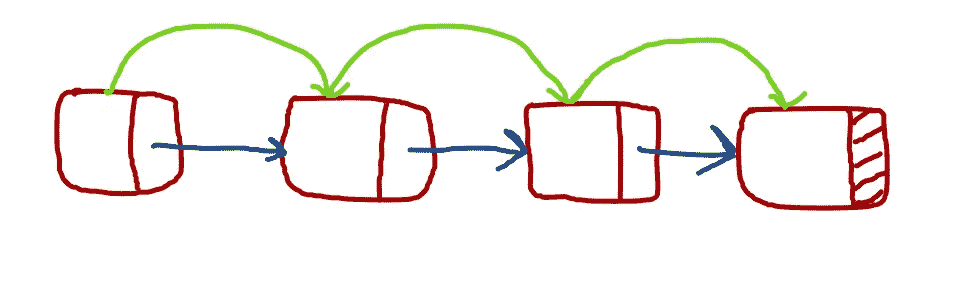
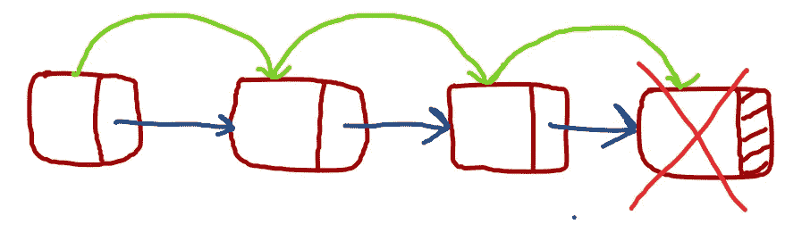
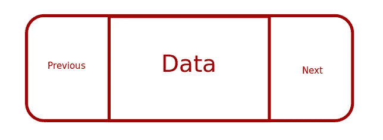

# 链表，GoLang 中的双向链表

> 原文：<https://blog.devgenius.io/linked-list-doubly-linked-list-in-golang-14bdd33f62e1?source=collection_archive---------6----------------------->

上一篇[文章](https://medium.com/dev-genius/singly-linked-list-in-golang-bb90a96c9933)我写了关于在单链表中插入并显示其内容。今天我想扩展那篇文章(我也是闲坐着)。我们将尝试删除最后一个节点。

这可以通过
1)遍历到最后一个节点来完成。



横越

2)删除节点。



删除

3)将前一个节点的下一个指针重置为空。


更新的链接列表

让我们看一下代码片段:

```
func (n *Node) DeleteNode() {
 iter := n
 for (iter.next).next != nil {
 iter = iter.next
 }
 iter.next = nil
}
```

像往常一样，`DeleteNode`函数前面有一个类型为`*Node`的接收器，因此它只能通过类型为`*Node`的变量来调用。这也让我们更好地理解了`DeleteNode`的目的和关联。第一行设置了`iter`变量。在`for`循环中，它遍历所有节点以找到最后一个节点。然后将指向最后一个节点的下一个指针设置为`nil`。

不要担心释放内存，因为 golang 的垃圾收集器会处理它。这种方法的效率是 O(n-1)。其中 n 是链表的大小。我们可以通过添加尾指针来尝试将删除节点算法优化到 O(1)。但是每次我们删除一个节点时，尾指针都需要调整以指向最后一个节点。这将是 O(n-1)。为了解决这个问题，我们使用了双向链表。

双向链表是一种数据结构，其中每个节点既可以指向上一个节点，也可以指向下一个节点。所以它有三个元素:

```
type Node struct {
 Prev *Node
 Data int
 Next *Node
}
```

它大致如下图所示:



我漂亮的双向链表

由于存在前一个指针，我们将稍微修改我们的插入逻辑。
1)创建新节点
2)前一个指针将指向前一个节点。
3)下一个指针将指向空

以下是代码片段:

```
var tail *Nodefunc (n *Node) AddNode(data int) {
 if tail == nil {
 tail = n
 }
 n = tail
 newNode := Node{n, data, nil}
 n.Next = &newNode
 tail = &newNode
}
```

我们引入了`tail`指针作为全局变量。它总是指向最后一个节点。我们正在初始化`newNode := Node{n,data,nil}`。这里第一个字段值是前一个指针。每个新节点都应该指向前一个节点。下一个节点指针应该为空(或者在这种情况下为`nil`)。正如您在这里看到的，通过引入`tail`指针，我们已经将`AddNode`的操作效率显著提高到 O(1)。我们不需要遍历整个数组来找到最后一个位置。

让我们看看如何以 O(1)的效率解决最后一个节点删除问题。以下是代码片段:

```
func (n *Node) DeleteLast() {
 tail = tail.Previous
 (tail.Next).Previous = nil
 tail.Next = nil
}
```

`tail`指针更新指向前一个节点。然后更新最后一个节点的`Previous`和指向`nil`的`Next`指针。通过这种方式，我们不仅删除了最后一个节点，还保持了`tail`指针的更新，并且都是 O(1)效率。
完整源代码可点击此处[https://gist . github . com/sandeep-sarkar/082 abfef 7340 f 15 C4 AE 030 e 6 aa 7 ECB 01](https://gist.github.com/sandeep-sarkar/082abfef7340f15c4ae030e6aa7ecb01)。