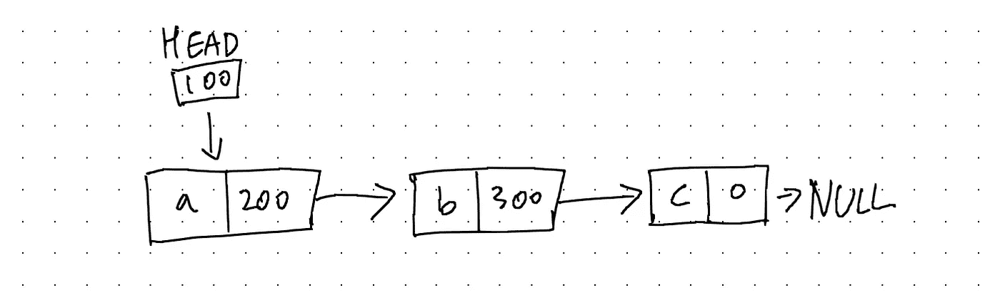
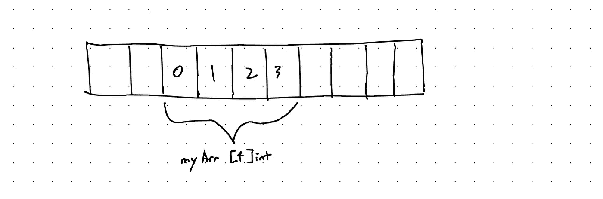
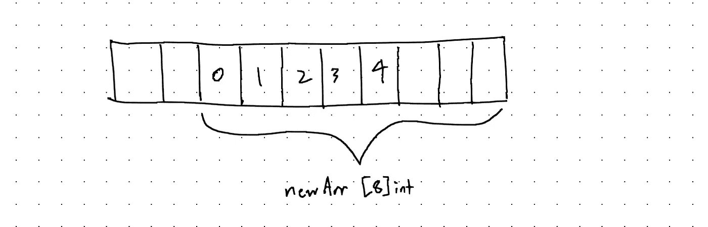
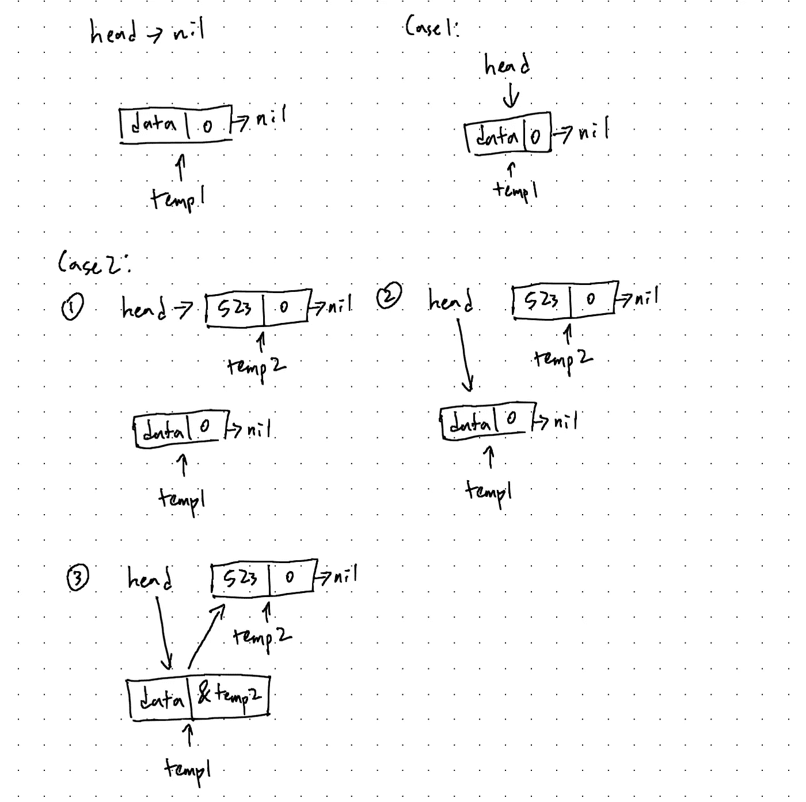
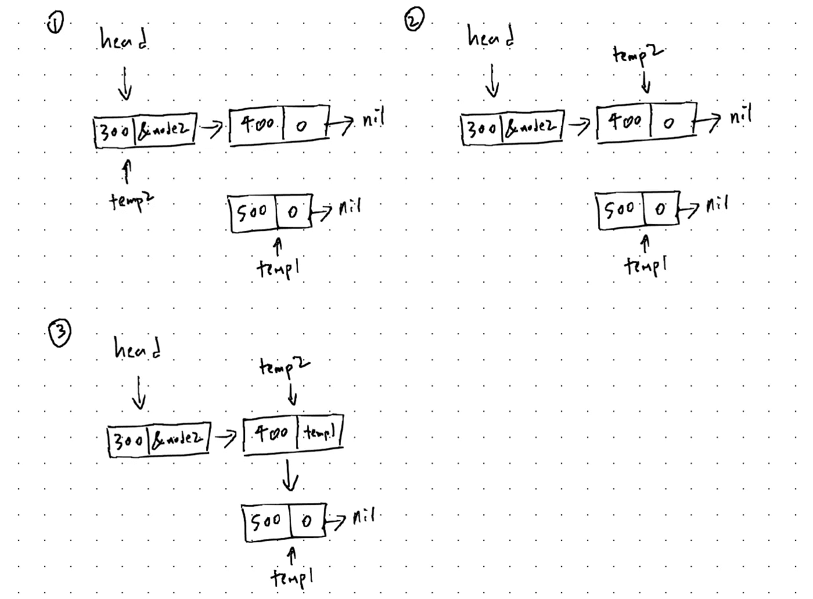
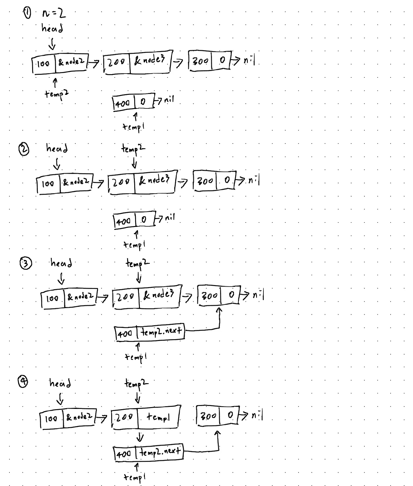
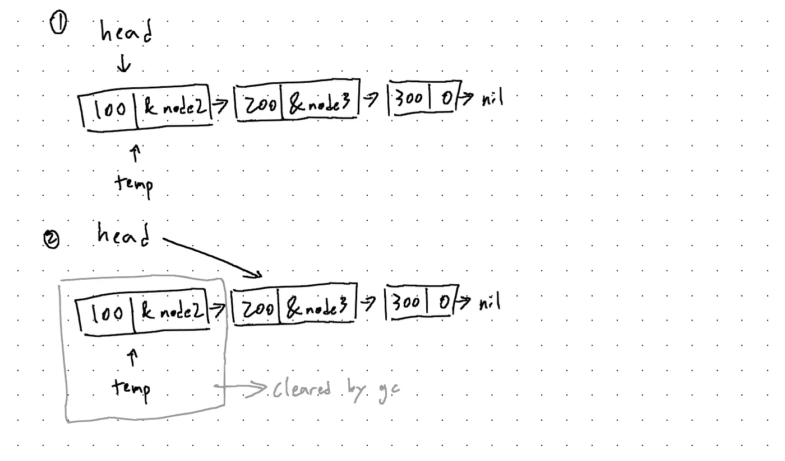
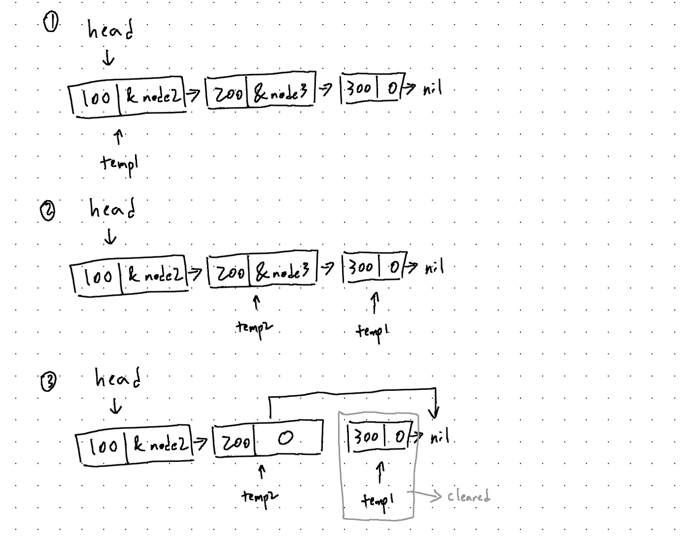
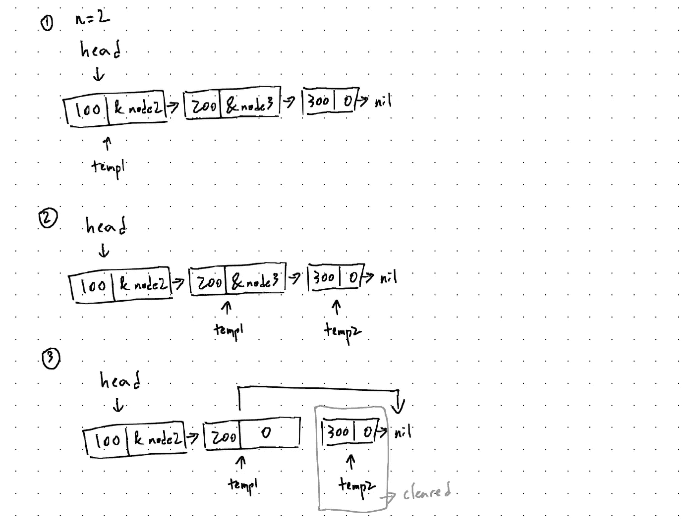
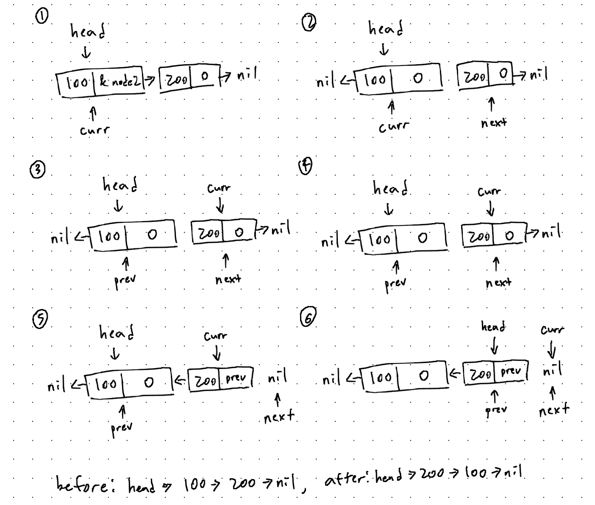

# Go 中的链接列表

> 原文：<https://blog.devgenius.io/linked-list-in-go-c663eb684291?source=collection_archive---------6----------------------->

欢迎来到我的新系列:Go 中的数据结构介绍！我们将以一个关于*链表*的帖子开始这个系列。如果你是计算机专业的学生，你可能在课堂上遇到过这些。链表不仅是 CS 课程的一部分，而且也是编码面试中一个非常受欢迎的话题，所以希望对这个话题有一个扎实的掌握。我们开始吧！

# 什么是链表？

链表是一种用来存储许多数据的数据结构。基本结构由通过指针相互链接的多个*节点*组成。一个节点通常由存储的数据和指向下一个节点的指针组成。



我们通过跟随指向第一个节点的指针进入列表，也称为*头*。不要混淆，上图中只有三个节点。第一个项目*头*仅仅是指向第一个节点的指针。最后一个节点指向空值，表示列表结束。

链表是用来存储数据的。然而，它们也是更复杂的数据结构(如堆栈和队列)的主干。用指针链接每个节点的想法也适用于其他数据结构，比如树和图。

# 链表与数组

你可能想知道，“为什么我们还要学习这种数据结构？我们没有数组吗？我们不就是在这里重新发明轮子吗？”数组是有道理的，但是数组和链表在结构上是不同的。

数组在程序编译前被初始化。它需要分配一定的内存块。



当你需要寻找元素时，数组是非常有用的。数组中的每一项都有一个索引，我们可以通过使用`myArr[n]`访问它来快速找到第 n 个元素。

这里的问题是数组不能在运行时调整大小。这意味着我们不能在运行程序后改变它的大小。如果我们的数组有四块内存，这意味着我们不能存储超过四个项目。解决这个问题的一个方法是创建一个两倍于原始数组的新数组，并复制所有元素。



Go 切片就是这样实现的。这种方法的问题是复制大量数据的效率很低，而且我们还有很多剩余的空间。

链表旨在通过指针连接分散在内存中的节点来解决这个问题。这样，我们不需要事先知道我们的列表的大小。如果我们想添加一个新的节点，我们只需要创建一个并链接它。

虽然这里没有浪费内存，但问题是每个数据点需要比数组更多的内存，因为它还必须存储指向下一个节点的指针。另外，为了在索引 *n* 处搜索元素，我们需要遍历列表，直到到达第 n 个位置。每个节点只知道下一个节点的存在，所以我们不能从一开始就访问第 n 个元素。

# Go 实现

让我们看看如何在 Go 中创建一个链表。

```
type Node struct {
    data int
    next *Node
}
```

这就是节点的定义方式。每个节点保存数据和指向下一个节点的指针。我们将为该指南存储`int`数据，但是您可以很容易地将其切换到其他类型。我们甚至可以使用`interface{}`来存储我们想要的任何类型的数据。

```
type LinkedList struct {
    head *Node
    length int
}
```

这就是链表的定义。其中最重要的部分是头部，它存储了指向第一个节点的指针。其他属性是可选的，但是非常有用。我们添加了存储链表长度的`length`属性。

```
package mainimport (
    "fmt"
)func main() {
    list := LinkedList{nil, 0}
}
```

我们可以这样初始化链表。初始长度为零，因为我们的列表中还没有节点。头指向`nil`是因为没有节点可以指向。

现在我们可以定义 struct 方法来插入和删除节点。

# 插入

这里我们可以考虑三种主要情况:在头部、尾部和任意位置插入。

```
func (l *LinkedList) insertAtHead(data int) {
    temp1 := &Node{data, nil} if l.head == nil {
        l.head = temp1
    } else {
        temp2 := l.head
        l.head = temp1
        temp1.next = temp2
    }
    l.length += 1
}
```

这个结构方法是使用指向我们的`LinkedList`对象的指针定义的，因为我们需要对它进行修改。

我们首先创建一个节点，并将指向它的指针保存为`temp1`。这个节点存储我们给定的数据，最初指向`nil`。

我们需要注意两种情况。第一种情况是当列表为空时。在这种情况下，我们只需设置`head`指向我们刚刚创建的节点。

第二种情况是列表不为空。这意味着`head`已经指向了某个节点。我们需要对其进行调整，以便 head 指向我们的新节点，而新节点指向 head 曾经指向的节点。

*   我们首先将`head`的副本保存为`temp2`。
*   然后我们设置`head`指向`temp1`。
*   最后，我们设置`temp1`指向`temp2.`

我在下面画了一个图，帮助你理解其中的逻辑。



最后，我们将长度增加 1。

在尾部(末端)插入节点怎么样？

```
func (l *LinkedList) insertAtTail(data int) {
    temp1 := &Node{data, nil} if l.head == nil {
        l.head = temp1
    } else {
        temp2 := l.head
        for temp2.next != nil {
            temp2 = temp2.next
        }
        temp2.next = temp1
    }
    l.length += 1
}
```

这也很简单。我们创建一个新节点，并将指向它的指针保存为`temp1`。这里，我们还必须处理列表为空的情况。步骤同上。

现在有趣的部分是:为了在列表后面插入一个元素，我们需要遍历整个列表，直到到达最后一个元素。如果没有这一步，就无法访问最后一个元素。

*   我们首先创建一个`head`的副本作为`temp2`。
*   我们通过将`temp2`设置为`temp2.next`来遍历列表。我们继续这样，直到`temp2.next`是`nil`，这意味着`temp2`指向最后一个节点。
*   简单地说，让最后一个节点指向`temp1`所指向的同一个节点。

这里有一个图表解释了它是如何工作的。我们将使用大量的图表，因为它们能极大地帮助我们理解。



最后，让我们看看如何在任意位置插入数据。

```
func (l *LinkedList) insert(n, data int) {
    if n == 0 {
        l.insertAtHead(data)
    } else if n == l.length-1 {
        l.insertAtTail(data)
    } else {
        temp1 := &Node{data, nil}
        temp2 := l.head for i := 0; i < n-1; i++ {
            temp2 = temp2.next
        }
        temp1.next = temp2.next
        temp2.next = temp1
    }
    l.length += 1
}
```

这里的逻辑与上面两个函数非常相似。

*   当我们想在列表的开头或结尾插入时，我们可以调用`insertAtHead()`或`insertAtTail()`来代替。
*   为了在第 n 个位置插入数据，我们需要遍历列表到达第 *n-1* 个位置。
*   一旦我们到达第 n-1 个位置，我们设置`temp1.next`，指向新节点的指针，指向第 n+1 个位置。然后我们设置`temp2`指向我们的新节点。

你现在知道该怎么做了。:)



# 删除项目

既然我们理解了整个指针操作的工作原理，我们就可以更容易地理解删除是如何工作的。我们也将把它分成三种情况:删除头部、尾部和任意位置的项目。

```
func (l *LinkedList) deleteAtHead() {
    temp := l.head
    l.head = temp.next l.length -= 1
}
```

这是删除列表中第一项的方法。我们只需要改变`head`，使它指向第二个节点。你可能认为第一个节点会留在内存中，除非我们显式地清除它，但是我们没有。Go 内置的垃圾收集器会为我们清除这个。



```
func (l *LinkedList) deleteAtTail() {
    temp1 := l.head
    var temp2 *Node
    for temp1.next != nil {
        temp2 = temp1
        temp1 = temp1.next
    }
    temp2.next = nil l.length -= 1
}
```

这是删除列表中最后一项的方法。逻辑是熟悉的:

*   我们遍历列表，直到到达最后一个节点。然而，这一次，我们也跟踪了恰好在`temp1`之前的节点。
*   我们设置`temp2`指向`nil`而不是`temp1`。最后一个节点将被垃圾收集器清除。



```
func (l *LinkedList) delete(n int) {
    if n == 0 {
        l.deleteAtHead()
    } else if n == l.length-1 {
        l.deleteAtTail()
    } else {
        temp1 := l.head
        for i := 0; i < n-1; i++ {
            temp1 = temp1.next
        }
        temp2 := temp1.next
        temp1.next = temp2.next
    }
    l.length -= 1
}
```

最后，我们来看看如何在任意位置删除一个项目。

*   如果删除第一项或最后一项，我们可以使用`deleteAtHead()`和`deleteAtTail()`来代替。
*   逻辑和`deleteAtTail()`很像。我们遍历列表，直到到达第 n-1 个节点。我们设置`temp2`指向第 n 个节点。
*   我们将`temp1.next`设置为指向`temp2.next`，这有效地去除了第 n-1 个和第 n 个元素之间的联系。



恭喜你！我们现在知道了如何创建一个链表、插入一个节点和删除一个节点。让我们更进一步。

# 反转链接列表

能够反转我们的列表是很有用的。让我们来看看如何做到这一点。

```
func (l *LinkedList) Reverse() {
    var curr, prev, next *Node
    curr = l.head
    prev = nil for curr != nil {
        next = curr.next
        curr.next = prev
        prev = curr
        curr = next
    }
    l.head = prev
}
```

看图表比我用简单的语言解释步骤要快。



# 结论

链表是一种很容易实现的有用的数据结构。对于初学者来说，链表可能具有挑战性，因为这是指针第一次被广泛使用。我希望这个指南能帮助你理解链表是如何工作的。祝你学业有成！

你也可以在[发展到](https://dev.to/jpoly1219/linked-lists-in-go-3g63)和[我的个人网站](https://jpoly1219.github.io)上阅读这篇文章。