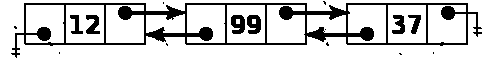

# Javascript 中的链表

> 原文：<https://blog.devgenius.io/linked-list-in-javascript-795595742087?source=collection_archive---------1----------------------->


数据结构介绍文章。链表的概念和应用于 Javascript 语言的实例。

# 介绍

数据结构是有效处理大量数据的一种手段，了解它的结构和组成可以给我们提供更有效的工具来设计与某些问题相关的产品。在这种情况下，我们将执行一个链表的介绍，回顾其特点和用途。

# 概念添加到链表中

链表是一种线性数据结构，由相互引用的元素组成，也就是说，链表中的每个元素都有一个指向下一个元素的引用对象或指针。注意这些元素存储在存储器中不连续的位置。


链接列表由以下元素组成:

1.  **链表**:元素管理结构。
2.  **节点**:存储和连接元素，包含至少一个任何类型的感兴趣的数据和一个指向下一个节点的指针。
3.  **HEAD** :列表的初始节点。

# 链接列表类型

链表有多种实现方式，它们的区别在于它们指向的引用，一些实现方式包含循环引用，而另一些实现方式可能包含对后继节点或前趋节点的引用。

以下是一些类型的链表:

## 简单链表

链表，其中每个节点包含一个唯一的链接后续元素字段。


## 双向链表

链表，其中每个节点包含一个双向链接，节点指向后继元素作为前趋元素。



## 循环链表

类似于简单的链表，区别在于最后一个节点指向列表中的第一个节点。


# 在 Javascript 中实现链表

为了在 Javascript 中实现一个链表，我们将依赖于库[https://github.com/trekhleb/javascript-algorithms](https://github.com/trekhleb/javascript-algorithms)，它包含了一个优秀的实现，但是我们将简化一些方法和结构以便能够理解它的操作。我们会支持面向对象编程的所有人。

## 类别链接列表

代表链表的类，这个类将拥有代表初始节点的`head`属性。启动时，割台将被设置为`null`。LinkedList 类在启动时不会有任何与之关联的节点。

```
class LinkedList {
  constructor() {
    this.head = null;
}
```

## 类节点

表示节点的类，这个类将有两个属性，属性`value`表示要存储的感兴趣的数据，属性`next`表示指向列表中下一个项目的指针。

```
class LinkedList {
  constructor() {
    this.head = null;
}
```

接下来的步骤是向`LinkedList`类添加方法，这将帮助我们执行列表中节点的操作。例如，元素的插入、搜索和删除。

## 节点插入方法

我们将从向链表中插入节点的基本方法开始。

**插入节点**

```
insertNode(value) {
  const newNode = new Node(value, null);
  if (this.head === null) {
    this.head = newNode;
  } else {
    let current = this.head;
    while (current.next) {
      current = current.next;
    }
    current.next = newNode;
  }
 }
}
```

在代码片段中:

*   使用参数指示的值创建一个新节点。
*   第一个节点存储在`head`属性中。
*   后续节点将被绑定到最后一个元素的`next`属性上，依此类推。

**注意**:我们可以用`next`属性来区分列表的最后一个元素，这将有`null`值。

## 节点显示方法

我们将继续使用打印每个节点值的基本方法。

**打印**

```
print(){
  let current = this.head;
  while (current) {
    console.log(current.value);
    current = current.next;
  }
}
```

在代码片段中:

*   我们逐个元素地遍历列表，打印属性的`value`。

## 节点搜索方法

我们将继续介绍一种基于值搜索元素的基本方法。这一次，返回第一个匹配项。

**findNode**

```
findNode(value) {
  let current = this.head;
  while (current) {
    if (current.value === value) {
      return current;
    }
    current = current.next;
  }
  return null;
}
```

在代码片段中:

*   我们对 while 循环使用相同的元素遍历技术，但是添加了一个比较值的条件。
*   如果值等于要查找的值，则返回元素。
*   如果值不相等，它继续在列表中循环。
*   如果没有找到元素，则返回`null`。

## 节点移除方法

我们将继续使用一种基于价值移除项目的基本方法。

**删除节点**

```
deleteNode(value) {
  if (this.head.value === value) {
    this.head = this.head.next;
  } else {
    let current = this.head;
    while (current.next) {
    if (current.next.value === value) {
       current.next = current.next.next;
       return;
    }
    current = current.next;
  }
 }
}
```

在代码片段中:

*   我们遍历列表中的元素，找到带有值的节点。
*   如果我们找到了节点，我们要做的是省略列表中的元素，也就是说，我们将跳过与后续元素连接的元素，完全消除当前引用。

## 完整代码

```
class Node {
  constructor(value, next) {
    this.value = value;
    this.next = next;  
  }
}

class LinkedList {
  constructor() {
    this.head = null;
  }

  insertNode(value) {
    const newNode = new Node(value, null);
    if (this.head === null) {
      this.head = newNode;
    } else {
      let current = this.head;
      while (current.next) {
        current = current.next;
      }
      current.next = newNode;
    }
  }

  print(){
    let current = this.head;
    while (current) {
      console.log(current.value);
      current = current.next;
    }
  }

  deleteNode(value) {
    if (this.head.value === value) {
      this.head = this.head.next;
    } else {
      let current = this.head;
      while (current.next) {
        if (current.next.value === value) {
          current.next = current.next.next;
          return;
        }
        current = current.next;
      }
    }
  }

  findNode(value) {
    let current = this.head;
    while (current) {
      if (current.value === value) {
        return current;
      }
      current = current.next;
    }
    return null;
  }
}

const linkedList = new LinkedList();
linkedList.insertNode(12);
linkedList.insertNode(99);
linkedList.insertNode(37);
linkedList.print();
console.log(linkedList.findNode(37));
```

# 结局

在本文中，我们使用链表的基本方法，然而，这些方法应该足以涵盖链表的基本用例。当然，有许多方法可以扩展和改进我们的例子。我建议继续探索实现，并使它们适应您的需要。

感谢你远道而来，如果你觉得这很有用，别忘了鼓掌👏。订阅以接收更多内容🔔。

如果你需要额外的帮助，请联系我🤠。

*   ✉️ [**给我发邮件**](mailto:dcortes.net@gmail.com)
*   🤝 [**在 LinkedIn 上联系我**](https://www.linkedin.com/in/dcortesnet/)
*   📮 [**在推特上联系我**](https://twitter.com/dcortes_net)

非常感谢您的阅读，我感谢您的时间。