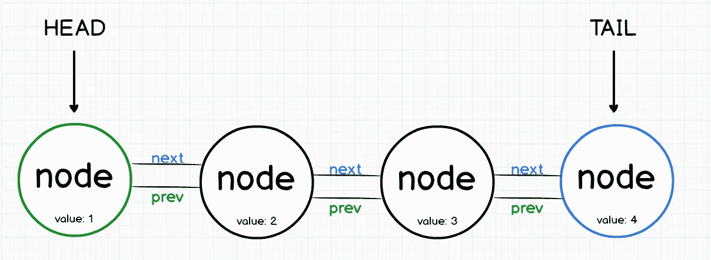
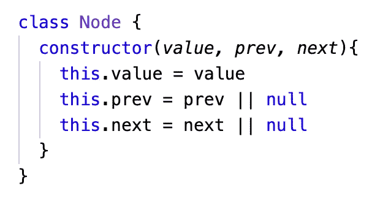
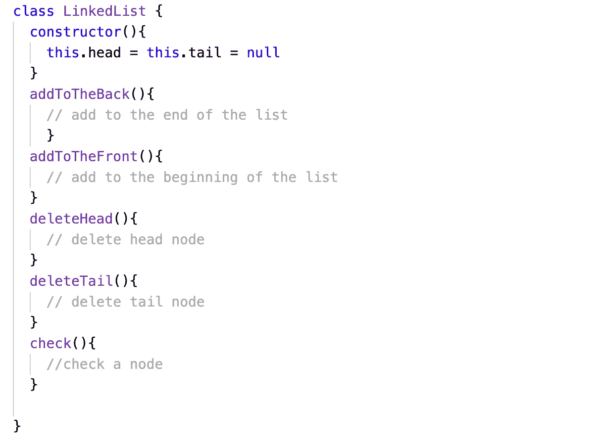
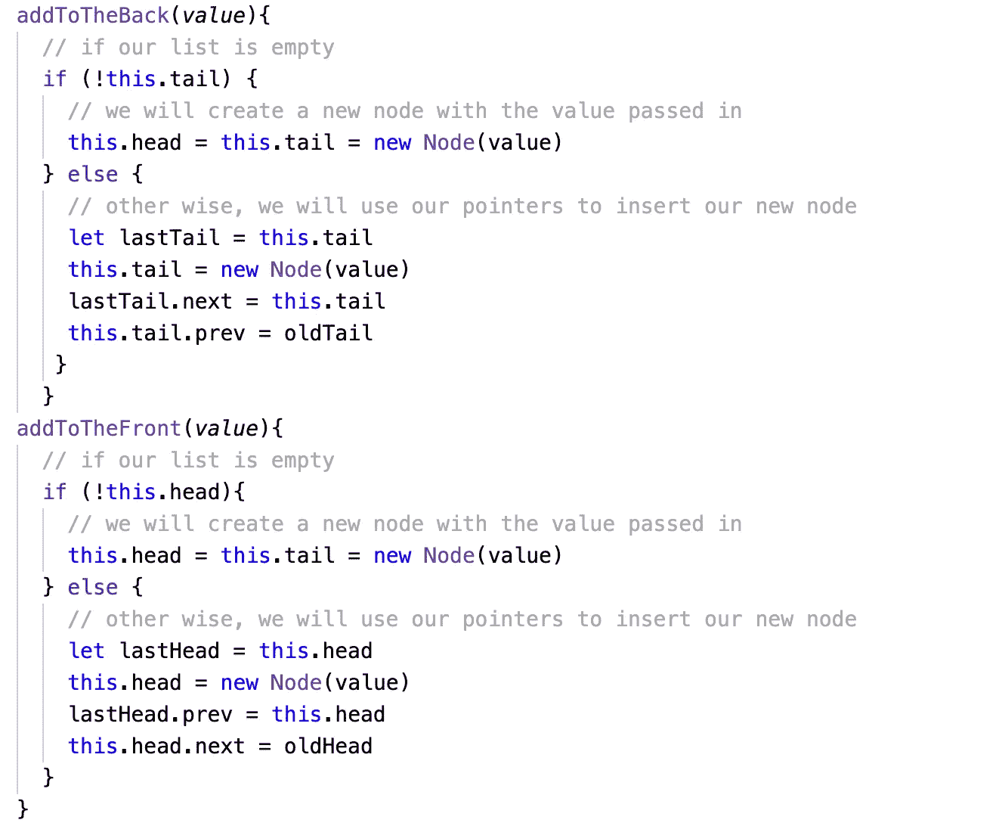
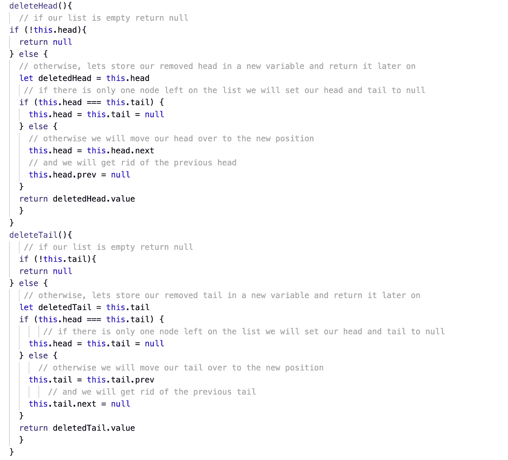
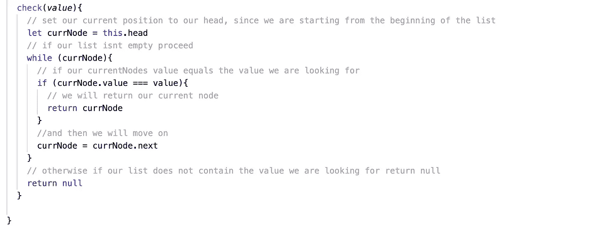

# Noobs 的链接列表

> 原文：<https://blog.devgenius.io/linked-lists-for-absolute-dummies-2fa10f752c?source=collection_archive---------27----------------------->

有时候简单就是不够简单

## 链表是元素的有序集合

每个元素称为一个“节点”

## WTH 是一个节点？！

不要慌！没那么严重，一个节点只能保存两个东西

*   数据值本身
*   指向下一个节点的引用，也称为“指针”

## 让我为你设置场景

在一个遥远的星系里，住着一种叫做 nodes 的外星人。假设我是一个名为 headNode(是的，这是我的合法名字)的节点，刚刚在夜总会上线。为了确保没有人插队，保安给了我一张写有我前面那个人名字的票。我前面的人有一张票，上面有他们前面的人的名字。这条线上的每个人都有一张写有下一个人名字的票，除了将要进入夜总会的人，他们将被称为 tailNode。一到达俱乐部门口，tailNode 的门票上的名字就被保安擦掉了。

## 这个故事的寓意？

*   我们称为节点的外星物种是{剧透警报}… **节点**！
*   头节点是**头节点**，尾节点是**尾节点**
*   我们这一行是**列表**
*   标签是指向列表中下一个节点的指针
*   tailNodes 擦除了指向 **NULL** 的票点
*   headNode 站在列表的**起点**，tailNode 站在**终点**
*   你可以当保镖💪做所有的决定

## 我希望我还没有失去你，我们如此接近😱

不幸的是，作为保镖，你不具备心灵运输能力。因此，你不能只是出现在一个节点前检查它的票。您必须走过所有其他节点才能到达您想要检查的节点。

## 好吧，让我们把这个带回家

链表的一个缺点是你不能随意到达任何一个节点。您需要一步一步地通过所有其他节点。这使得**链表在直接访问节点**时很弱。但是… **链表在插入和删除节点方面很神奇**。

为什么？你可能会问。

因为你可以在列表的任何地方插入你的节点，只要你插入的节点指向应该在它前面的节点，它后面的节点现在指向我们的新节点。

**记住，你骗不了保镖**😉

现在我们有了这个伟大的背景故事，让我们用代码来重演。

至此，你应该对单独的****链表的工作原理有了一个坚实的理解。**现在让我们把热度调高一点，创建一个**双向链表。****

**放松，没什么变化，想象一下保镖给了你第二张卡，上面有你身后的人的名字。**

****是的，这家俱乐部的保安人员确实出现了，是吧****

**为了使用我们的列表，我们需要创建我们的节点类。**

****

**本例中的**下一个**和**上一个**将是我们的**指针**，它将帮助我们找到每个**节点**所在的位置**

**现在，要创建我们的列表，我们可以…**

****

****刚刚发生了什么？****

**我们刚刚在构造函数中创建了头部和尾部，所有这些空的方法将很快被实现列表所有功能的代码填充。**

**瞧，这还不算太糟吧？**

**好了，让我们想出一个简单的方法，用我们的指针在列表的前面和后面插入一个节点**

****

****好了，现在我们要想办法把这些节点踢出生产线！😠****

****

****伪代码应该让事情变得足够简单****

**我知道，你可能已经厌倦了思考这个问题。但是在我离开你之前，我们还有最后一步😅**

**我们需要一种方法来检查我们的值列表…**

****

# **嘣宝宝！**

**我们做到了！**

**这是最后的[解决方案](https://gist.github.com/SohamDutta1216/5c45985ea2897507a6c285f1b62ef4c9)代码，以防你懒得跟随😒**

**希望这能帮助一些人。算法和数据结构有时真的很难理解，但它并不像看起来那么难。**