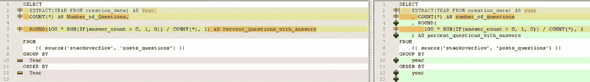

# 带有 dbt 和 SQLfluff 的林挺 SQL

> 原文：<https://blog.devgenius.io/linting-sqls-with-dbt-and-sqlfluff-ceb45836a2ca?source=collection_archive---------3----------------------->


劳伦·曼克在 [Unsplash](https://unsplash.com/photos/aOC7TSLb1o8) 上的照片

当在一个由数据分析师和工程师组成的大团队中工作时，您是否曾经为不同的 SQL 风格而苦恼过？上/下关键字、前导/尾随逗号、缩进、别名规则等。

随着模型数量的增长，拥有一致的风格变得有益，以便于代码审查、新成员的加入等。
这里来了 SQLfluff 拯救，这是一个 SQL 文件的 CLI linter。它可以突出显示并经常修复违反样式的情况。

dbt 是另一个令人惊奇的工具，可以简化数据建模，跟踪模型之间的依赖关系，减少样板代码的数量。

在这篇文章中，我想分享将这两种工具结合起来并在团队中采用的方法。

**团队结盟。**

首先，你需要和团队交流，解释为什么有特定的风格规则很重要。
这一步极其重要，因为没有人会乐意看到一份公关在没有清楚了解为什么需要它的情况下被搁置。

这次谈话的一个好结果将是你同意遵守的一套初始规则。此外，如果项目很大并且/或者由多个 dbt 项目组成，您可能希望只在项目的某个区域进行推广。

**集成到开发工作流程中。**

下一步是将 SQLfluff 集成到开发工作流中。
最简单的方法是使用预提交钩子。
如果你已经在使用它们，只需添加几个新的挂钩`sqlfliff fix`、`sqlfluff lint`就简单多了。

否则，您可能需要额外的时间来采用预提交挂钩。值得一提的是，这一步可能是可选的，尽管强烈建议这样做，以便使开发工作流程更加顺畅。

**整合到 CI/CD 中。**
下一步是通过将 SQLfluff 集成到 CI/CD 中来执行规则。这可能是软的也可能是硬的。
在第一种情况下，它应该只发出警告，但不阻止 PRs 被合并。
在第二种情况下，请购单应在合并前通过 SQLfluff 检查。

***性能注意事项。如果您有许多 SQL 文件，并且正在努力进行长时间的检查，那么可以考虑使用参数`— parallel`。
此外，我强烈建议利用 ***dbt slim CI*** ，以便在运行 CI/CD 检查时只检查已更改的文件，而不是所有文件(这需要存储部署到生产环境的 dbt 模型的最后状态)。***

**该练习了！**

现在，让我们动手创建一个演示项目，看看 SQLfluff 如何提供帮助。

为此，我将在 GCP BigQuery 上使用一个开放数据集。
源代码可在 [GitHub](https://github.com/eskarimov/demo-dbt-sqlfluff) 上获得。

让我们先安装必要的软件包:

```
pip3 install dbt-bigquery==1.3.0 sqlfluff==1.3.2 sqlfluff-templater-dbt==1.3.2 pre-commit==2.20.0
```

并用`dbt init`创建一个新项目。

它将创建几个标准的 dbt 模型。
我们还将使用公共堆栈溢出数据集创建另一个模型。
让我们先在`schema.yml`中添加一个信号源:

```
sources:
  — name: stackoverflow
    database: bigquery-public-data
    schema: stackoverflow
    tables:
      — name: posts_questions
```

让我们统计一下历年来回答问题的百分比:

```
SELECT
 EXTRACT(YEAR FROM creation_date) AS Year,
 COUNT(*) AS Number_of_Questions,
 ROUND(100 * SUM(IF(answer_count > 0, 1, 0)) / COUNT(*), 1) AS Percent_Questions_with_Answers
FROM
 {{ source(‘stackoverflow’, ‘posts_questions’) }}
GROUP BY
 Year
ORDER BY
 Year
```

现在我们需要告诉 SQLfluff 使用哪种方言，并为我们的规则调优所需的参数。
在本教程中，我们将强制使用前导逗号、关键字和函数名的大写字母。
我们将创建一个文件`.sqlfluff`，内容如下:

```
[sqlfluff]
templater = dbt
dialect = bigquery[sqlfluff:templater:dbt]
project_dir = ./[sqlfluff:rules]
comma_style = leading[sqlfluff:rules:L010]
capitalisation_policy = upper[sqlfluff:rules:L030]
capitalisation_policy = upper
```

我们还需要忽略编译期间 dbt 生成的某些文件。我们将向`.sqlfluffignore`添加以下文件夹:

```
target/
dbt_packages/
macros/
```

让我们运行`sqlfluff lint`并检查输出:

```
=== [dbt templater] Sorting Nodes…
=== [dbt templater] Compiling dbt project…
=== [dbt templater] Project Compiled.
== [/example-dbt-sqlfluff/models/stackoverflow/percent_questions_answered_per_year.sql] FAIL
L: 1 | P: 1 | L010 | Keywords must be lower case.
L: 2 | P: 3 | L003 | Expected 1 indentation, found less than 1 [compared to
 | line 01]
L: 2 | P: 11 | L010 | Keywords must be lower case.
L: 2 | P: 16 | L010 | Keywords must be lower case.
L: 2 | P: 36 | L010 | Keywords must be lower case.
L: 2 | P: 39 | L014 | Unquoted identifiers must be consistently lower case.
L: 2 | P: 43 | L019 | Found trailing comma. Expected only leading.
L: 3 | P: 3 | L003 | Expected 1 indentation, found less than 1 [compared to
 | line 01]
L: 3 | P: 12 | L010 | Keywords must be lower case.
L: 3 | P: 15 | L014 | Unquoted identifiers must be consistently lower case.
L: 3 | P: 34 | L019 | Found trailing comma. Expected only leading.
L: 4 | P: 3 | L003 | Expected 1 indentation, found less than 1 [compared to
 | line 01]
L: 4 | P: 62 | L010 | Keywords must be lower case.
L: 4 | P: 65 | L014 | Unquoted identifiers must be consistently lower case.
L: 4 | P: 95 | L016 | Line is too long.
L: 5 | P: 1 | L010 | Keywords must be lower case.
L: 6 | P: 3 | L003 | Expected 1 indentation, found less than 1 [compared to
 | line 05]
L: 7 | P: 1 | L010 | Keywords must be lower case.
L: 7 | P: 7 | L010 | Keywords must be lower case.
L: 8 | P: 3 | L003 | Expected 1 indentation, found less than 1 [compared to
 | line 07]
L: 8 | P: 3 | L014 | Unquoted identifiers must be consistently lower case.
L: 9 | P: 1 | L010 | Keywords must be lower case.
L: 9 | P: 7 | L010 | Keywords must be lower case.
L: 10 | P: 3 | L003 | Expected 1 indentation, found less than 1 [compared to
 | line 09]
L: 10 | P: 3 | L014 | Unquoted identifiers must be consistently lower case.
L: 10 | P: 7 | L009 | Files must end with a single trailing newline.
```

相当多的违规，不是吗？我们一会儿就把它们修好。
您可以使用默认规则，找到最适合您的规则和/或使用`.sqlfluff`中的`exclude_rules`键禁用不必要的规则。

现在让我们变些魔术，尝试用`sqlfluff fix.` 来修复文件。这里我将初始文件(左栏)与新文件(右栏)进行比较:



最后一步，让我们看看如何将它集成到预提交钩子中，并自动检查文件:
用以下内容创建文件`.pre-commit-config.yaml`:

```
repos:
  - repo: [https://github.com/sqlfluff/sqlfluff](https://github.com/sqlfluff/sqlfluff)
    rev: 1.3.2
    hooks:
      — id: sqlfluff-fix
        additional_dependencies : [‘dbt-bigquery==1.3.0’, ‘sqlfluff-templater-dbt==1.3.2’]
      — id: sqlfluff-lint
        additional_dependencies : [‘dbt-bigquery==1.3.0’, ‘sqlfluff-templater-dbt==1.3.2’]
```

运行`pre-commit install`和`pre-commit run --all-files`以确保其正常工作。

现在，每当你改变你的 SQL 并想要提交它们时，SQLfluff 将首先尝试自动修复任何发现的冲突并突出显示无法修复的冲突。
进一步的步骤可能包括将这些检查与 CI/CD 工具集成，例如 GitHub 状态检查。

今天就到这里，编码快乐！

**参考文献**
1。[https://console . cloud . Google . com/market place/product/stack-exchange/stack-overflow](https://console.cloud.google.com/marketplace/product/stack-exchange/stack-overflow)2 .[https://docs.sqlfluff.com/en/stable/rules.html](https://docs.sqlfluff.com/en/stable/rules.html)
3。[https://github.com/sqlfluff/sqlfluff](https://github.com/sqlfluff/sqlfluff)