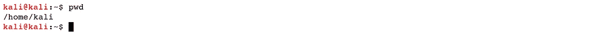
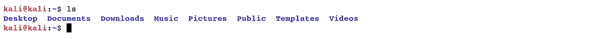
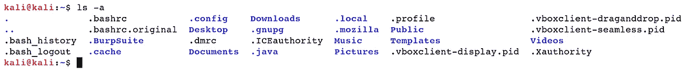
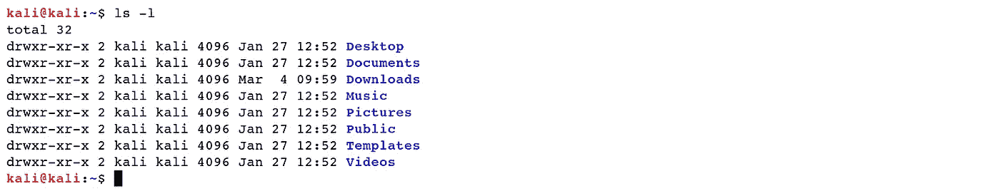
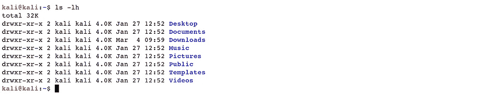
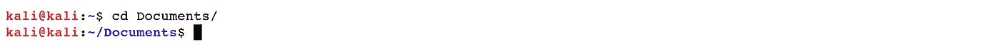
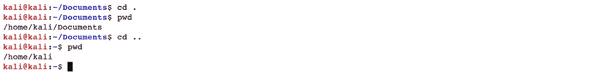
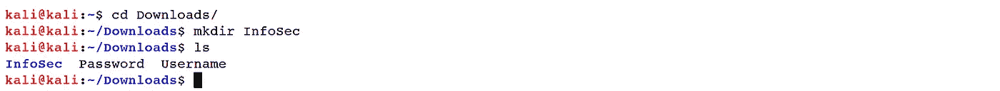
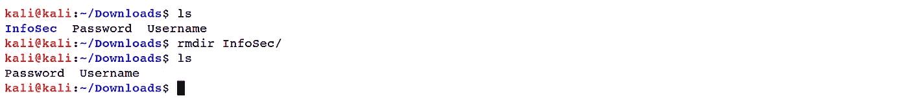

# Linux 基础—命令行界面(第 1 部分)

> 原文：<https://blog.devgenius.io/linux-basics-command-line-interface-part-1-aa5a48e57666?source=collection_archive---------16----------------------->

Linux 是一种类似于 Windows、iOS 和 Mac OS 的操作系统。事实上，地球上最著名的平台之一，例如 Android，是由 Linux 操作框架驱动的。操作系统是在个人电脑上持续运行的最重要的程序。它处理计算机的内存和进程，就像它的大多数软件和硬件一样。此外，它还能让您在不知道如何用计算机语言交流的情况下与 PC 对话。没有操作系统，电脑就不能工作。

从电话到汽车、超级计算机和家用设备、家用台式机到商用服务器，Linux 操作框架无处不在。它存在于你的电话、室内调节器、汽车、冰箱、Roku 设备和电视中。此外，它还运营着很大一部分互联网、世界上最好的 500 台超级计算机中的大多数，以及世界股票交易。除了作为在全球范围内运行桌面、服务器和嵌入式框架的基础之外，Linux 还是最健壮、最安全、最容易使用的操作系统之一。

Linux 操作框架包含下面列出的几个不同部分:

*“boot loader”*—处理电脑引导程序的软件。对于大多数客户端来说，这将主要是一个弹出的屏幕，最终会离开并引导到操作框架中。

*“OS 内核”* —这是整体中的一部分，被称为*“Linux”内核是框架的核心，处理 CPU、内存和外围设备。它是操作系统的最低级别。*

*“Init system”*—这是一个子框架，引导客户端空间并负责控制守护进程。最常用的 init 框架之一是*“systemd”，*，这也是最有争议的一个。当基础引导从引导装载程序移交时，init 框架处理引导过程。

*“守护进程”* —这些是后台服务，在引导期间或您登录到桌面后启动。

*“图形服务器”* —这是在屏幕上显示插图的子框架。它几乎总是被称为*“X 服务器”*

*【桌面环境】* —这是客户端直观使用操作系统的部分。有许多可供浏览的桌面环境，每一个都包括内置的应用程序。

*“应用”* —桌面环境不提供应用的全部展示。与 Windows 和 Mac OS 非常相似，Linux 提供了大量可以有效找到和安装的优秀软件。大多数当今的 Linux 发行版都集成了类似 App Store 的工具，这些工具集中并简化了应用程序的建立。

例如，Ubuntu Linux 有 Ubuntu 软件中心，它使你能够在大量的应用程序中快速搜索，并从一个集中的位置引入它们。

1.  **命令行界面**

Linux 命令行是基于文本的操作系统界面。通常指外壳、终端、控制台、提示符等。利用它可以给人困惑和困惑的感觉。然而，从一个站点复制和粘贴命令的能力，加上命令行提供的强大功能和适应性，意味着在渗透测试和安全审计期间尝试执行一些任务时，使用它可能是最基本的。

在本章中，我们将重点介绍 CLI 界面，并向您展示一些技巧，让您更加熟悉一些基本命令和概念。事不宜迟，我们开始吧。

1.1 **导航和使用目录**

我们必须适应的主要事情是如何在我们的 Linux 框架上探索文件系统。在这一小节中，我们将概述最广泛使用的目录命令，例如， *"pwd "，" cd "，" ls "，" mkdir "，" T5 "和 *"rmdir。"**

*   *【pwd】*——打印工作目录:在某个随机的时间，我们在一个单独的文件夹中，我们可以看到文件夹中包含的记录，以及我们上面的注册表(称为父目录)和下面的任何子注册表的路径。我们现在所在的目录被称为当前工作目录。为了显示当前的工作目录，我们使用了*“pwd”*命令。

***Ex****:(****kali @ kali****:~ $ pwd)*

*   *“ls”-*list:为了列出当前工作目录中的文档和索引，我们使用了*“ls”*操作符。

***Ex****:(****kali @ kali****:~ $ ls)*

使用 *"ls"* 最常用的选项之一是*-一个"*来演示所有文档。显示所有记录意味着包括隐藏的记录。当 Linux 文件系统上的记录名以点开始时，它被认为是一个隐藏文档，不会出现在标准文件列表中。

***Ex****:(****kali @ kali****:~ $ ls–a)*

通常你会利用选项 *"ls"* 以不同的排列方式显示注册表的内容，或者显示索引的多个部分。只编写 *"ls"* 给你一个注册表中文件的纲要。作曲*“ls–l”*为你提供了一个长长的列表。

***Ex****:(****kali @ kali****:~ $ ls–l)*

另一个常用的替代词 *"ls"* 是*-LH。"*它以更易于阅读的格式显示数字(文件尺寸)。

***Ex****:(****kali @ kali****:~ $ ls–LH)*

*   *“CD”*-更改目录:要更改您的工作目录，我们使用*“CD”*操作符。为此，键入 *"cd"* 所追求的工作目录的路径名。路径名是我们沿着树的分支到达我们需要的注册表的路线。路径名可以用两种独特的方式之一来表示；绝对路径名或相对路径名。绝对路径名从根索引开始，一个分支一个分支地追踪树，直到到达所需文件夹或文件的路径完成。

***Ex:****(****kali @ kali****:~ $ CD 文档/)*

绝对路径名从根目录开始并提示其目标，相对路径名从工作目录开始。

为此，它利用一些异常符号来表示文件系统树中的类似情况。这些不同的符号是*.”*和*。”。*《T50》. "符号暗指工作目录，而*. .。*符号暗指工作目录的父目录。

***Ex****:(****kali @ kali****:~/Documents $ CD。)、(****kali @ kali****:~/Documents $ CD..)*

*   *" mkdir "*-制作一个目录:在 Unix 记录树中漫步很有趣，但是用 *"mkdir "制作你的目录更令人愉快。*你至少需要给*“mkdir”*一个参数，即你要创建的新文件夹的名称。

***Ex:****(****kali @ kali****:~/Downloads $ mkdir InfoSec)*

*   *“rmdir”-*删除目录:当一个文件夹为空时，可以利用*“rmdir”*将其删除。

***Ex:****(****kali @ kali****:~/Downloads $ rmdir InfoSec/)*

[Linux 基础—命令行界面(第 1 部分)](https://medium.com/@nuriddin.artykow/linux-basics-command-line-interface-part-1-aa5a48e57666)

[Linux 基础知识——命令行界面(第二部分)](https://medium.com/@nuriddin.artykow/linux-basics-command-line-interface-part-2-47072b303052)

[Linux 基础知识——命令行界面(第 3 部分)](https://medium.com/@nuriddin.artykow/linux-basics-command-line-interface-part-3-ae2a31713325)

[Linux 基础—命令行界面(第 4 部分)](https://medium.com/@nuriddin.artykow/linux-basics-command-line-interface-part-4-1bb47cfdfb7a)

[Linux 基础知识——命令行界面(第 5 部分)](https://medium.com/@nuriddin.artykow/linux-basics-command-line-interface-part-5-ab643c1e2f89)

[Linux 基础—命令行界面(第 6 部分)](https://medium.com/@nuriddin.artykow/linux-basics-command-line-interface-part-6-8f9cd096b4ef)

[Linux 基础—命令行界面(第 7 部分)](https://medium.com/@nuriddin.artykow/linux-basics-command-line-interface-part-7-2707208c1415)

[Linux 基础—命令行界面(第 8 部分)](https://medium.com/@nuriddin.artykow/linux-basics-command-line-interface-part-8-2ddb20e4993d)

[Linux 基础—命令行界面(第 9 部分)](https://medium.com/@nuriddin.artykow/linux-basics-command-line-interface-part-9-b71cb77a7683)