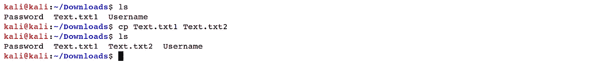
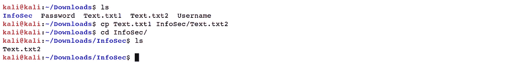
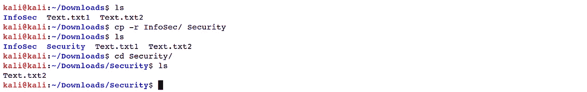
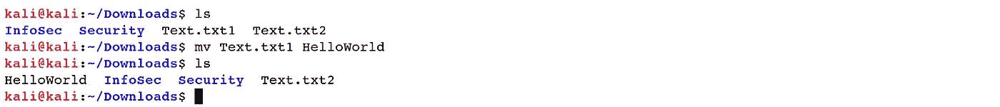
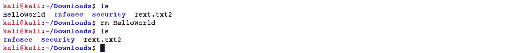
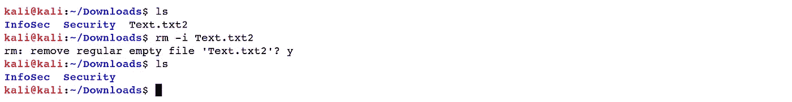
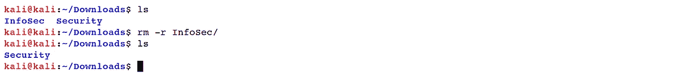
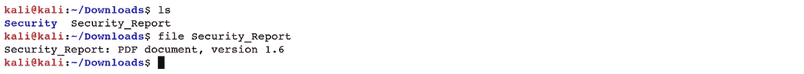
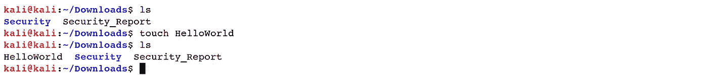

# Linux 基础—命令行界面(第 2 部分)

> 原文：<https://blog.devgenius.io/linux-basics-command-line-interface-part-2-47072b303052?source=collection_archive---------27----------------------->

2 www.wallpapermemory.com

1.2 **处理文件**

在这一节中，我们将展示一些用于文件和目录操作的常用命令。这些命令是:*【CP】【mv】【RM】【touch】**文件*

*   *“CP”-*复制:*“CP”*选项复制记录或目录。

***Ex:****(****kali @ kali****:~/Downloads $ CP text . txt 1 text . txt 2)*

您同样可以利用*“CP”*将各种记录复制到一个目录中。对于这种情况，最后一个参数必须是目录。

***Ex****:(****kali @ kali****:~/Downloads $ CP text . txt 1 InfoSec/text . txt 2)*

要复制目录中的所有内容，请使用*-r "*操作符。*-r "*选项强制递归复制所有子目录中的所有记录。

***Ex:****(****kali @ kali****:~/Downloads $ CP-r InfoSec/Security)*

*   *"mv"-* 移动: *"mv"* 选项执行记录移动和文档重命名，这取决于它的使用方式。在这两种情况下，第一个文件名在活动结束后不再存在。*“mv”*的用法与*“CP”类似。*

***Ex****:(****kali @ kali****:~/Downloads $ mv text . txt 1 hello world)*

*   *“RM”-*remove:*“RM”*命令用于擦除文件和目录。

***Ex****:(****kali @ kali****:~/Downloads $ RM hello world)*

在删除当前文档之前，您可以使用*-I "*(交互式)选项提示用户确认。如果，在任何情况下，这个选项没有被确定， *"rm"* 命令将悄悄地删除记录。

***Ex:****(****kali @ kali****:~/Downloads $ RM-I text . txt 2)*

如果要删除目录中的所有内容，需要指定*-r】*(用于递归)选项。

***Ex:****(****kali @ kali****:~/Downloads $ RM-r InfoSec/)*

*   *【文件】*:由*【文件】*操作员决定记录类型。Linux 不利用扩充来确定文档类型。命令行并不关心文件是否以*结尾。txt"* 或*. pdf . "*作为安全分析师，应该使用 *"file"* 选项来确定文档类型。

***Ex:****(****kali @ kali****:~/Downloads $ file Security _ Report)*

*   *【touch】*:在 Linux 操作系统中创建一个新的空文件，我们使用*【touch】*选项。

***Ex****:(****kali @ kali****:~/Downloads $ touch hello world)*

[Linux 基础知识—命令行界面(第 1 部分)](https://medium.com/@nuriddin.artykow/linux-basics-command-line-interface-part-1-aa5a48e57666)

[Linux 基础知识—命令行界面(第 2 部分)](https://medium.com/@nuriddin.artykow/linux-basics-command-line-interface-part-2-47072b303052)

[Linux 基础—命令行界面(第 3 部分)](https://medium.com/@nuriddin.artykow/linux-basics-command-line-interface-part-3-ae2a31713325)

[Linux 基础知识—命令行界面(第 4 部分)](https://medium.com/@nuriddin.artykow/linux-basics-command-line-interface-part-4-1bb47cfdfb7a)

[Linux 基础—命令行界面(第 5 部分)](https://medium.com/@nuriddin.artykow/linux-basics-command-line-interface-part-5-ab643c1e2f89)

[Linux 基础—命令行界面(第 6 部分)](https://medium.com/@nuriddin.artykow/linux-basics-command-line-interface-part-6-8f9cd096b4ef)

[Linux 基础—命令行界面(第 7 部分)](https://medium.com/@nuriddin.artykow/linux-basics-command-line-interface-part-7-2707208c1415)

[Linux 基础—命令行界面(第 8 部分)](https://medium.com/@nuriddin.artykow/linux-basics-command-line-interface-part-8-2ddb20e4993d)

[Linux 基础—命令行界面(第 9 部分)](https://medium.com/@nuriddin.artykow/linux-basics-command-line-interface-part-9-b71cb77a7683)