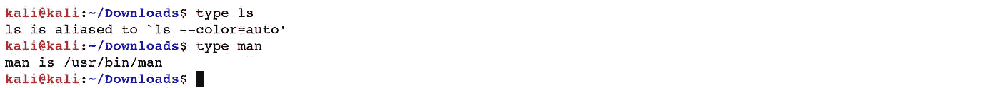
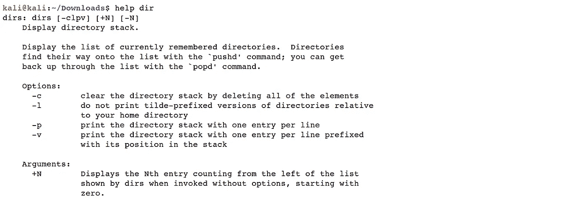
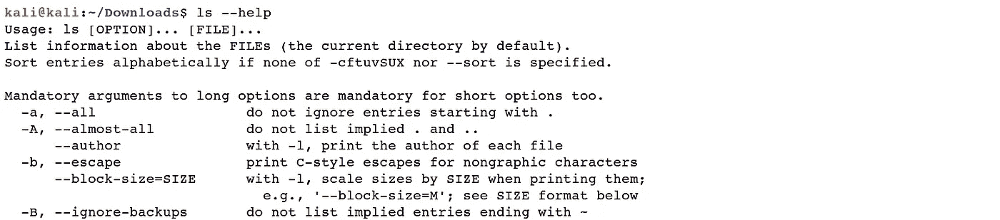
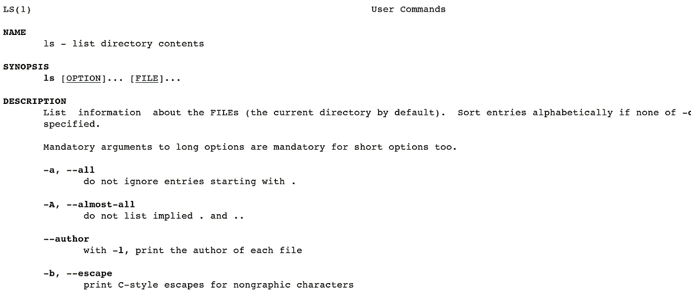
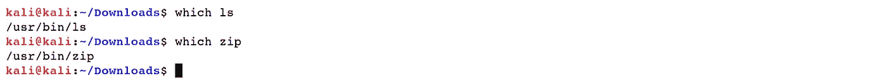
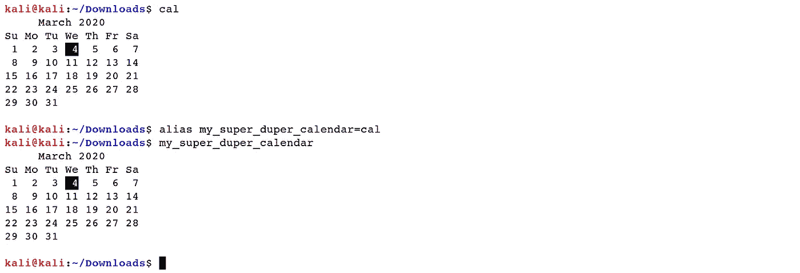
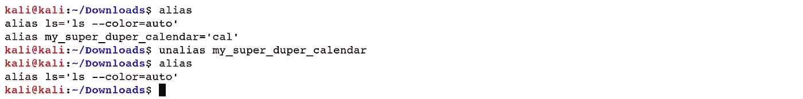

# Linux 基础—命令行界面(第 3 部分)

> 原文：<https://blog.devgenius.io/linux-basics-command-line-interface-part-3-ae2a31713325?source=collection_archive---------29----------------------->

作者:www.wallpapermemory.com

1.3 **识别命令**

命令可以是四种截然不同的事物之一:

1.一个可执行程序就像我们看到的每一个文件一样。在这个类中，项目可以是汇编的二进制文件，例如，用 C 和 C++编写的程序，或者用脚本方言、shell、Perl、python、ruby 等等发送的项目。

2.与外壳本身结合在一起的命令。Bash 内部支持各种命令，称为 shell 内置命令。例如，*“CD”*选项就是一个内置的 shell。

3.外壳函数。这些比添加到环境中的标准外壳内容要小。

4.别名，我们可以自己定义的命令，由其他命令构建而成。

准确地知道使用了四种命令中的哪一种通常是很有价值的，Linux 提供了几种不同的方法来发现它。

*   *【类型】*:这个选项是一个 shell 内置的，显示具体给定命令名的类型。

***Ex:****(****kali @ kali****:~/Downloads $ type ls)*

*   *【help】*:Bash 有内置的助手，每个 shell 内置的助手都可以访问。要使用它，键入*“help”*，后跟内置 shell 的名称。

***Ex:****(****kali @ kali****:~/Downloads $ help dir)*

许多可执行项目支持一个 *"- -help"* 选项，显示命令支持的语法和选项的描述。

***Ex:****(****kali @ kali****:~/Downloads $ ls-help)*

*   *“man”——*手册页:大多数计划用于命令行的可执行程序都提供了一个称为手册页的常规文档。键入 *"man"* 命令，后跟程序名称，查看该特定程序的手册页。

***Ex:****(****kali @ kali****:~/Downloads $ man ls)*

*   *"info"-* 信息:GNU 项目为他们的项目的手册页提供了一个选择，称为 *"info。"信息页面是超链接的，很像网站页面。信息程序读取数据文档，这些数据文档被树组织成单独的节点，每个节点包含一个主题。信息记录包含可以在节点间移动的超链接。超链接可通过其驱动参考项目符号来识别，并通过将鼠标光标置于其上并按下“*Enter”*键来启动。*

***Ex:****(****kali @ kali****:~/Downloads $ info cat)*

*   *“which”*:有时候一个框架上引入的可执行程序不止一种形式。虽然这在工作站上并不常见，但在大型服务器上并不奇怪。使用 *"which"* 运算符来确定给定可执行文件的确切位置。

***Ex****:(****kali @ kali****:~/下载$哪些 ls)*

*   *【别名】*:shell 让你可以做别名。别名经常被用来为当前命令创建一个更简单的名字，或者有效地提供参数。

***Ex:****(****kali @ kali**:~/Downloads $ alias my _ super _ duper _ calendar = cal)***

要删除您创建的别名，使用 *"unalias"* 命令，并指定别名。

***Ex****:(****kali @ kali****:~/Downloads $ unalias my _ super _ duper _ calendar)*

[Linux 基础—命令行界面(第 1 部分)](https://medium.com/@nuriddin.artykow/linux-basics-command-line-interface-part-1-aa5a48e57666)

[Linux 基础知识—命令行界面(第二部分)](https://medium.com/@nuriddin.artykow/linux-basics-command-line-interface-part-2-47072b303052)

[Linux 基础知识——命令行界面(第 3 部分)](https://medium.com/@nuriddin.artykow/linux-basics-command-line-interface-part-3-ae2a31713325)

[Linux 基础—命令行界面(第 4 部分)](https://medium.com/@nuriddin.artykow/linux-basics-command-line-interface-part-4-1bb47cfdfb7a)

[Linux 基础—命令行界面(第 5 部分)](https://medium.com/@nuriddin.artykow/linux-basics-command-line-interface-part-5-ab643c1e2f89)

[Linux 基础—命令行界面(第 6 部分)](https://medium.com/@nuriddin.artykow/linux-basics-command-line-interface-part-6-8f9cd096b4ef)

[Linux 基础—命令行界面(第 7 部分)](https://medium.com/@nuriddin.artykow/linux-basics-command-line-interface-part-7-2707208c1415)

[Linux 基础—命令行界面(第 8 部分)](https://medium.com/@nuriddin.artykow/linux-basics-command-line-interface-part-8-2ddb20e4993d)

[Linux 基础知识——命令行界面(第 9 部分)](https://medium.com/@nuriddin.artykow/linux-basics-command-line-interface-part-9-b71cb77a7683)