# Linux 基础—命令行界面(第 4 部分)

> 原文：<https://blog.devgenius.io/linux-basics-command-line-interface-part-4-1bb47cfdfb7a?source=collection_archive---------33----------------------->

作者:www.wallpapermemory.com

1.4 **从终端读取文件**

如果您不熟悉 Linux 操作系统，并且只能使用终端，那么您可以考虑如何在命令行中查看文档。在 Linux 终端中阅读文档并不等同于在记事本中打开文件。因为您处于命令行模式，所以您应该在 Linux 中利用命令来读取数据。

在 Linux 中显示一个文档并没有那么复杂。学习如何在 CLI 中读取文件既容易又重要。这里有几个命令可以让您在 Linux 终端中查看文件的内容。

*   *【cat】*——连接文件:这是在 Linux 中查看文件最简单也可能是最流行的命令。它只是将数据内容打印到标准输出，并显示在屏幕上。

***Ex****:(****kali @ kali****:~/Downloads $ cat hello world)*

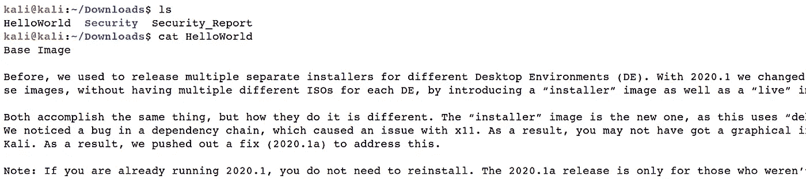

*   *" tac "*-反向连接文件:与 *"cat"* 命令相同，但从下到上显示标准输出。

***Ex****:(****kali @ kali****:~/Downloads $ tac hello world)*

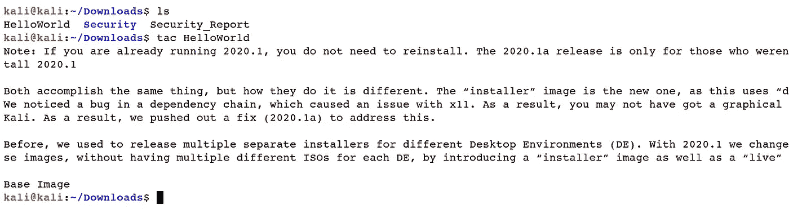

*   *【nl】*-数字行:*【nl】*命令实际上类似于*【cat】*命令。主要的区别在于，在终端中显示内容时，它会在前面加上行号。

***Ex****:(****kali @ kali****:~/Downloads $ nl hello world)*

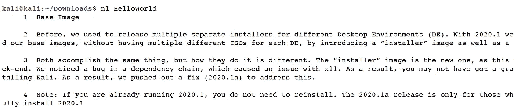

*   管道 *"* | *"* 和 *"less"* :一个名为管道的 shell 特性使用命令的能力来读取来自*"标准输入"*的信息，并将其重定向到*"标准输出"。*利用管道选项 *"* | *，"*一个命令的标准输出可以通过管道输入到另一个命令的标准输入。为了充分展示和理解这一点，我们将使用另一个名为*“less”的命令*

此选项一次查看文件的一页。最好的是，当你退出*“less”*命令(通过按*“q”*)时，屏幕上没有线条显示。你的航站楼保持干净整洁。

***Ex****:(****kali @ kali****:~/Downloads $ ls/bin | less)*

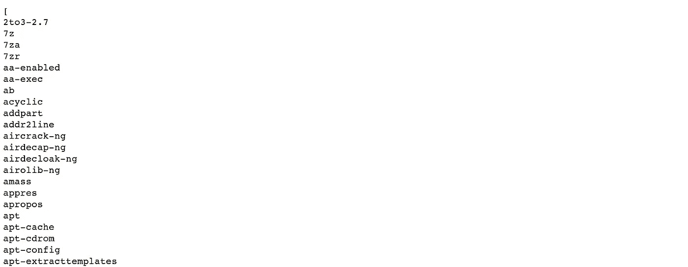

*   *【Sort】*:Sort 是一个 Linux 程序，用于打印信息内容记录的行，以及排列请求中所有文档的连接。该命令接受*“空格”*作为字段分隔符，整个输入文档作为排序键。需要注意的是*【排序】*命令不对记录进行排序；但是，它只打印排序后的输出，直到您重定向输出。

***Ex:****(****kali @ kali****:~/Downloads $ ls/bin | sort)*

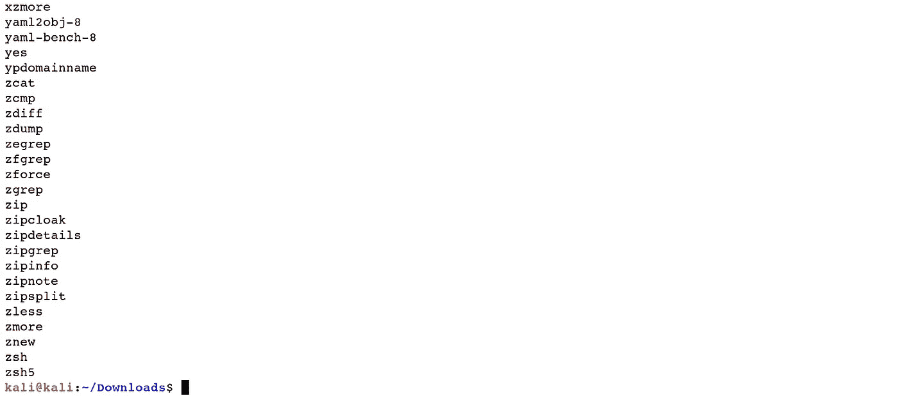

*   *“uniq”*:该命令用于报告或排除重新散列的行；它过滤来自*“标准输入”*的行，并将结果合成到*“标准输出”*在 info 流上运行 *"sort"* 之后，您可以使用 *"uniq"* 命令选项来驱逐重新散列的行。

***Ex:****(****kali @ kali****:~/Downloads $ ls/bin | uniq)*

*   *“head”*:该命令是查看文本文件的另一种方式，但有一点不同。默认情况下， *"head"* 命令显示一个文本文件的前十行。

***Ex****:(****kali @ kali****:~/Downloads $ head/etc/passwd)*

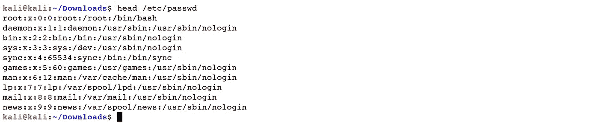

*   *【tail】*:Linux 中的 Tail 命令是 head 命令的比较级，但是相反。head 命令显示从最早起点开始的文档，tail 命令显示从结尾开始的记录。

***Ex:****(****kali @ kali****:~/Downloads $ tail/etc/passwd)*

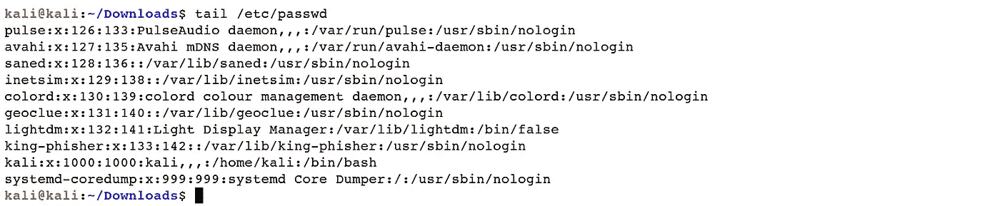

*   *“更多”*:该操作符是一个有用的文档检查过滤器，主要用于查看证书。它以类似排列的方式在页面中显示记录内容，客户可以按*“Enter”*查看更多数据。

***Ex****:(****kali @ kali****:~/Downloads $ ls/bin | more)*

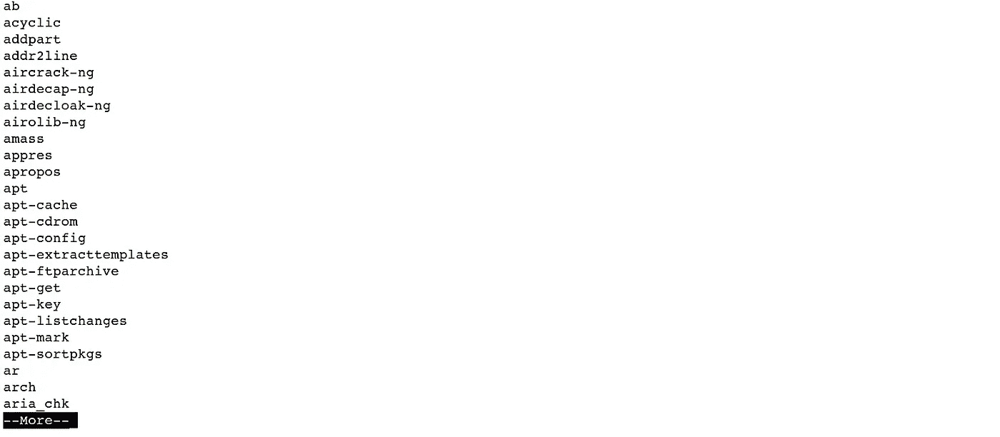

*   *"strings"* :使用 *"strings"* 命令，可以显示二进制文件中可读的 ASCII 字符串。

***Ex****:(****kali @ kali****:~/Downloads $ stings/usr/bin/CP)*

*   *【WC】*-字数:字数命令用于显示文档中包含的行数、字数和字节数。

***Ex****:(****kali @ kali****:~/Downloads $ WC hello world)*

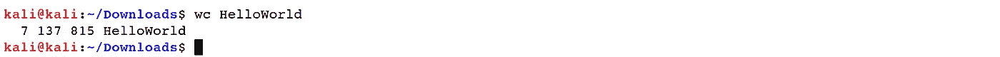

*   *【grep】*:*【grep】*是一个强大的文件模式搜索器，每个 Linux 发行版都配备了它。这些滤波器输出匹配给定模式的线。它从文件或*“标准输入”*中读取行，并默认将所有匹配的行打印到*“标准输出”*

***Ex****:****(kali @ kali****:~/Downloads $ ls/bin | grep zip)*

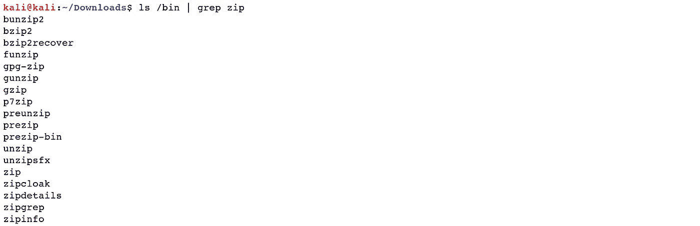

*   *" fmt "*-格式化程序: *"fmt"* 运算符是一个简单的理想内容格式化程序，它将确定文档中的段落重新格式化，并将结果打印到*"标准输出。"*

***Ex****:(****kali @ kali****:~/Downloads $ fmt hello world)*

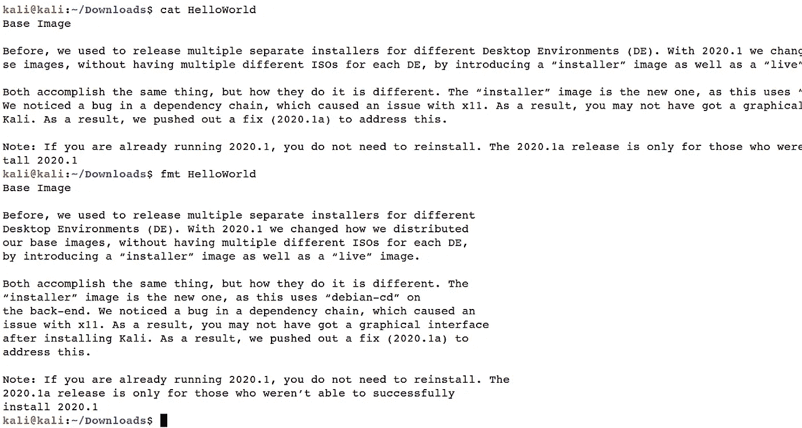

[Linux 基础知识—命令行界面(第 1 部分)](https://medium.com/@nuriddin.artykow/linux-basics-command-line-interface-part-1-aa5a48e57666)

[Linux 基础—命令行界面(第二部分)](https://medium.com/@nuriddin.artykow/linux-basics-command-line-interface-part-2-47072b303052)

[Linux 基础—命令行界面(第 3 部分)](https://medium.com/@nuriddin.artykow/linux-basics-command-line-interface-part-3-ae2a31713325)

[Linux 基础—命令行界面(第 4 部分)](https://medium.com/@nuriddin.artykow/linux-basics-command-line-interface-part-4-1bb47cfdfb7a)

[Linux 基础—命令行界面(第 5 部分)](https://medium.com/@nuriddin.artykow/linux-basics-command-line-interface-part-5-ab643c1e2f89)

[Linux 基础知识——命令行界面(第 6 部分)](https://medium.com/@nuriddin.artykow/linux-basics-command-line-interface-part-6-8f9cd096b4ef)

[Linux 基础—命令行界面(第 7 部分)](https://medium.com/@nuriddin.artykow/linux-basics-command-line-interface-part-7-2707208c1415)

[Linux 基础—命令行界面(第 8 部分)](https://medium.com/@nuriddin.artykow/linux-basics-command-line-interface-part-8-2ddb20e4993d)

[Linux 基础—命令行界面(第 9 部分)](https://medium.com/@nuriddin.artykow/linux-basics-command-line-interface-part-9-b71cb77a7683)