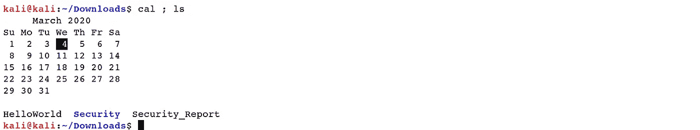
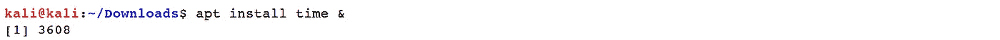
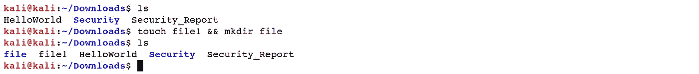
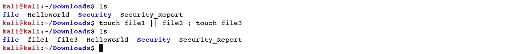
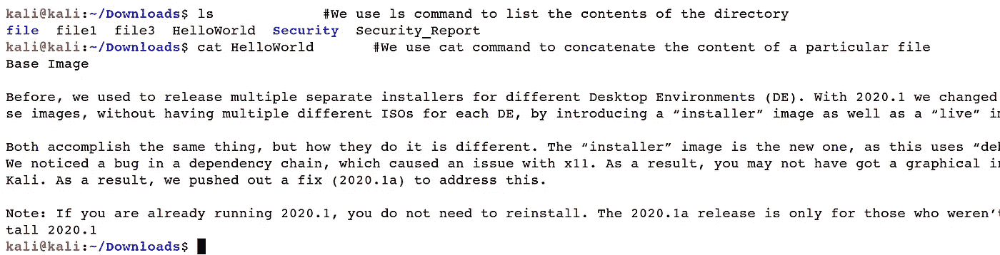
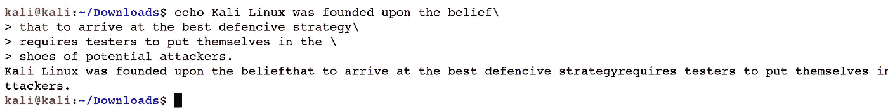

# Linux 基础—命令行界面(第 5 部分)

> 原文：<https://blog.devgenius.io/linux-basics-command-line-interface-part-5-ab643c1e2f89?source=collection_archive---------32----------------------->

作者:www.wallpapermemory.com

1.5 **控制操作员**

在本节中，我们将提到控制操作符命令，并简要讨论相关参数，如*“$？”、“&、“*等。

*   *“分号(；)"*:常用的是基本的复合命令，比如在命令行上把几个命令挂在一起组成一个组。这样的命令需要用分号隔开，分号表示命令的结尾。要在一行中对 shell 命令进行必要的排列，请使用分号分隔每个命令。

***Ex****:(****kali @ kali****:~/Downloads $ cal；ls)*

*   *“与号(&)”*:是 Linux 中最有价值的控制运算符之一。当 shell 中的任何命令以*&*结尾时，它开始在后台执行。因此，您不必等待命令完成。当前一个操作在后台执行时，您将获得另一个操作的终端窗口。

***Ex****:(****kali @ kali****:~/Downloads $ apt 安装时间& )*

*   *"一个双&符号(&&)"*:shell 使用这个操作符作为逻辑 *"AND。"只有当第一个命令成功时，它才允许执行第二个命令。*

***Ex****:(****kali @ kali****:~/Downloads $ touch file 1&&mkdir file)*

*   *“双管(*| |*)”*:shell 将其作为逻辑*“或。”仅当第一个命令失败时，才允许执行第二个命令。*

***Ex****:(****kali @ kali****:~/Downloads $ touch file 1 | | file 2；触摸文件 3)*

*   *“井号(#)”*:这是 Linux 中最常用的控制操作符之一。它用于编写 shell 注释。Shell 会忽略在*“$”*符号之后写的所有东西，它在命令执行或者 shell 扩展中起不到任何作用。

***Ex****:(****kali @ kali****:~/Downloads $ ls #我们用 ls 命令列出目录的内容)*

*   *"用(\)"* "转义特殊字符:增强控制字符的使用，如*"；"而“@”*却没有解释它的外壳。

***Ex****:(****kali @ kali****:~/Downloads $ echo @ \ # \ $ \ % \ *)*

*   *“行尾反斜杠”*:以反斜杠结束的行前进到下一行。shell 不解释换行符，并且会寻找 shell 扩展和命令行的执行，直到遇到不带反斜杠的换行符。

***Ex****:(****Kali @ Kali****:~/Downloads $ echo Kali Linux 建立在信念之上\*

*>得出最佳防守策略\*

*>要求测试者将自己置于\*

*>潜在攻击者的鞋子。)*

[Linux 基础知识—命令行界面(第 1 部分)](https://medium.com/@nuriddin.artykow/linux-basics-command-line-interface-part-1-aa5a48e57666)

[Linux 基础知识—命令行界面(第 2 部分)](https://medium.com/@nuriddin.artykow/linux-basics-command-line-interface-part-2-47072b303052)

[Linux 基础—命令行界面(第 3 部分)](https://medium.com/@nuriddin.artykow/linux-basics-command-line-interface-part-3-ae2a31713325)

[Linux 基础—命令行界面(第 4 部分)](https://medium.com/@nuriddin.artykow/linux-basics-command-line-interface-part-4-1bb47cfdfb7a)

[Linux 基础—命令行界面(第 5 部分)](https://medium.com/@nuriddin.artykow/linux-basics-command-line-interface-part-5-ab643c1e2f89)

[Linux 基础—命令行界面(第 6 部分)](https://medium.com/@nuriddin.artykow/linux-basics-command-line-interface-part-6-8f9cd096b4ef)

[Linux 基础—命令行界面(第 7 部分)](https://medium.com/@nuriddin.artykow/linux-basics-command-line-interface-part-7-2707208c1415)

[Linux 基础—命令行界面(第 8 部分)](https://medium.com/@nuriddin.artykow/linux-basics-command-line-interface-part-8-2ddb20e4993d)

[Linux 基础—命令行界面(第 9 部分)](https://medium.com/@nuriddin.artykow/linux-basics-command-line-interface-part-9-b71cb77a7683)