# Linux 基础—命令行界面(第 6 部分)

> 原文：<https://blog.devgenius.io/linux-basics-command-line-interface-part-6-8f9cd096b4ef?source=collection_archive---------29----------------------->

作者:www.wallpapermemory.com

1.6 **文件层级**

Linux 命令行的新手可能会问为什么有这么多的特殊目录，它们有什么用，以及为什么事情是这样分类的。如果您不熟悉 Linux 如何排列文档，这些目录可能会显得非常武断，有奇怪的截断名称，而且大部分时间都有重复的名称。事实证明，有一种策略依赖于多年的 UNIX 惯例，在这一节中，我们将给出 Linux 目录结构的序言。

*   *"/root "*:*"/root "*注册表是根用户在框架上唯一的 home 索引。它只能由根客户机使用和读取，并且它的结构通常很像一个 *"/home"* 目录，但是它用于根客户机需要的记录和设置。现在，许多框架削弱了根客户端利用*“sudo”*命令获得超级用户利益的能力，所以这个注册表不怎么用了。

***Ex****:(****kali @ kali****:~ $ CD/root)*

*   *"/bin"* 和 *"/sbin"* :这些注册表存储二进制可执行文件记录，这是引导系统的基础。这些目录之间的显著区别在于, *"/sbin"* 注册表是为管理员用来管理 Linux 操作框架的系统二进制文件而提出的。

***Ex****:(****kali @ kali****:~ $ CD/bin)*

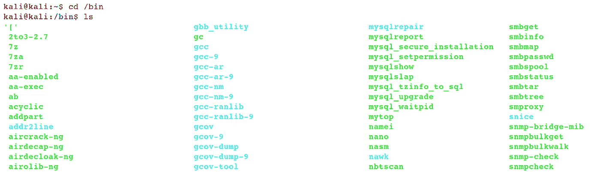

*   *"/lib"* :该目录存储了在 *"/bin"* 和 *"/sbin"* 目录中找到的二进制文件的共享库。

***Ex****:(****kali @ kali****:~ $ CD/lib)*

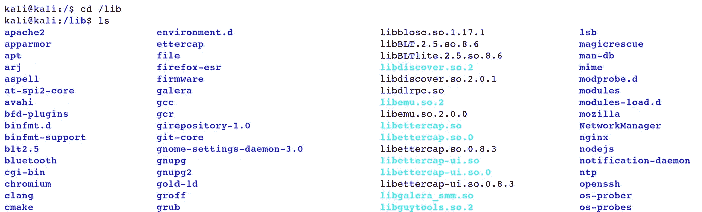

*   *"/boot"* :这个索引的目的是存储所有的 bootloader 文档、内核记录和 *"initrd"* 文件。它通常被视为一个不同的小分区，这样引导装载程序可以更有效地阅读它。

***Ex****:(****kali @ kali****:~ $ CD/boot)*

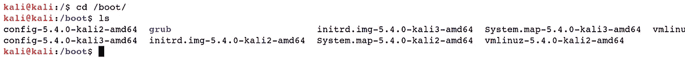

*   *"/opt "*:*"/opt "*目录的思想是存储可选软件，从 Linux 存储库之外下载。您可以在许多类似 Linux 的系统上找到一个空的 *"/opt"* 文件夹。

***Ex****:(****kali @ kali****:~ $ CD/opt)*

*   *"/etc "*:*"/etc "*目录存放系统设置文件。如果您必须在 Linux 框架上配置服务，或者更改网络或其他核心设置，这是首先要考虑的地方。

***Ex****:(****kali @ kali****:~ $ CD/etc)*

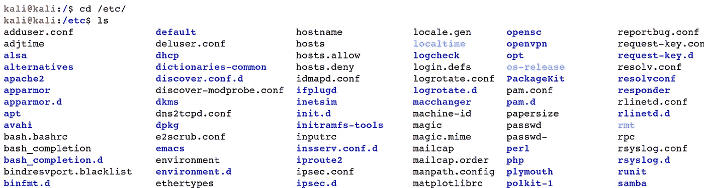

*   *"/home "*:*"/home "*目录是 Linux 框架上每个用户存储其记录的区域。 *"/home"* 下的每个目录都以特定的用户名命名，并归该用户所有。

***Ex****:(****kali @ kali****:~ $ CD/home)*

*   *"/srv"* :此目录的目的是存储服务器可能远程共享的文档。

***Ex:****(****kali @ kali****:~ $ CD/SRV)*

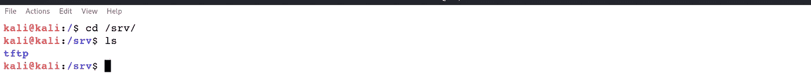

*   *"/media"* 和 *"/mnt"* :当您向 PC 添加额外的文件系统时，无论它是来自 USB 驱动器、NFS 挂载还是不同的源，您都需要一些标准的地方来挂载它们。为此，我们使用 *"/mnt"* 和 *"/media"* 目录。 *"/media"* 寄存器作为可移动媒体小工具的挂载点，例如，CDROMs、计算机化的相机和不同的 USB 连接设备。因为 *"/media"* 在 UNIX 世界中相对较新，所以您可以体验没有这个注册表的框架运行。 *"/mnt"* 目录应该是空的，只用于临时挂载点。

***Ex****:(****kali @ kali****:~ $ CD/media)*

*   *"/usr"* :虽然 *"/usr"* 像用户一样被挂接，但我们需要知道它代表的是 Unix 系统资源。目录应该包含可共享的只读信息。

***Ex****:(****kali @ kali****:~ $ CD/usr)*

*"/usr/bin"* :这个目录包含了很多命令。

***Ex****:(****kali @ kali****:/usr $ CD/usr/bin/)*

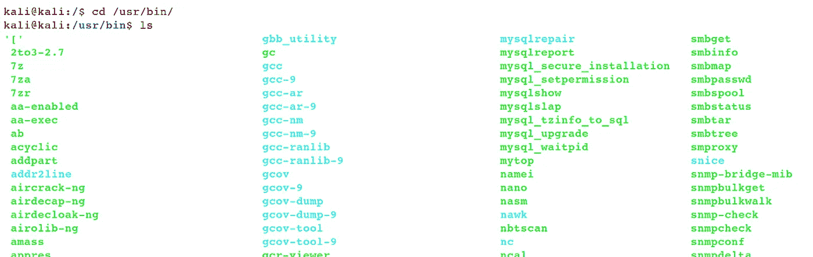

*"/usr/lib"* :此目录包含客户端或脚本无法合法执行的库。

***Ex:****(****kali @ kali****:/usr $ CD/usr/lib)*

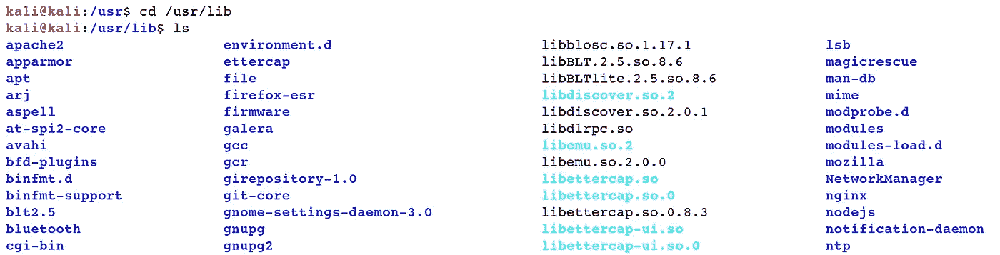

*"/usr/local"* :这个注册表可以被所有者用来在本地安装软件。

***Ex****:(****kali @ kali****:/usr $ CD/usr/local/)*

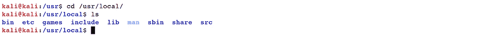

*"/usr/share"* :这个目录包含与架构无关的数据。

***Ex:****(****kali @ kali****:/usr $ CD/usr/share)*

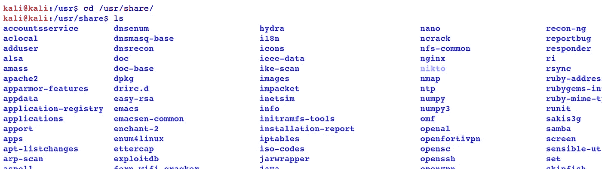

*"/usr/src"* :这个目录是存放内核源文件的。

***Ex****:(****kali @ kali****:/usr $ CD/usr/src)*

*   *"/var"* :传统的 UNIX 服务器拥有比预期更高的磁盘空间，而 *"/var"* 注册表旨在存放大小可能无法控制或可能被频繁写入的文档。与只读的 *"/usr，"*"不同， *"/var"* 目录毫无疑问应该是可写的，因为在其中您会发现日志文档、邮件服务器假脱机和不同的记录，这些记录可能会来回移动，或者通常会以不可预测的方式增加大小。

***Ex:****(****kali @ kali****:~ $ CD/var)*

*   *"/dev"* :你会在这里发现设备记录。UNIX 框架有一个*“一切都是文档”*规则，这意味着即使你的设备最终也是一个文件。此目录包含系统上小工具的记录，从磁盘和分区到鼠标和键盘。

***Ex****:(****kali @ kali****:~ $ CD/dev)*

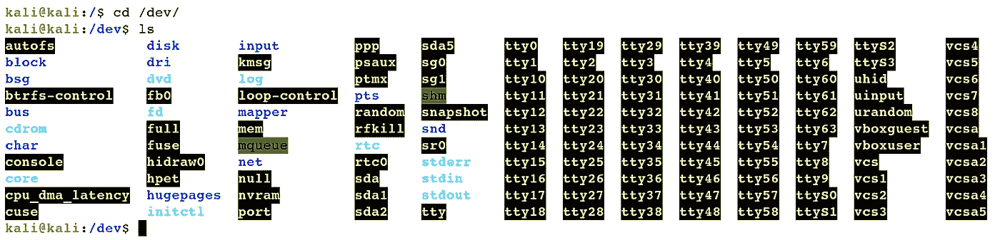

*   *"/proc "*:*"/proc "*注册表存储了代表框架上大多数正在运行的进程的数据的记录。

***Ex****:(****kali @ kali****:~ $ CD/proc)*

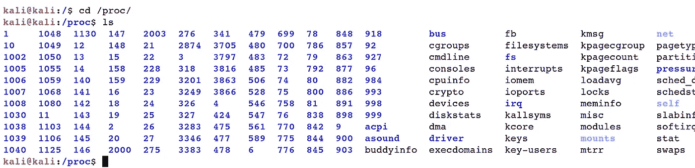

*   *"/sys"* :虽然有些内核状态文件已经出现在*"/proc "*中，但是现在应该放在 *"/sys "中*

*"/sys"* 注册表旨在包含这些让您能够与内核协作的文档，并且这个目录被频繁地以递归符号链接的嵌套序列形式出现的记录所填充。

***Ex:****(****kali @ kali****:~ $ CD/sys)*

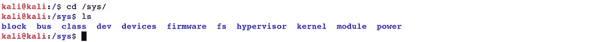

*   *"tmp"* :应用程序和用户应该在需要时利用 *"/tmp"* 来存储非永久性信息。存储在 *"/tmp"* 中的信息可以使用磁盘空间，也可以使用 RAM。其中两个由操作系统管理。切勿使用 *"/tmp"* 存储重要信息或您希望存档的信息。

***Ex****:(****kali @ kali**:~ $ CD/tmp)***

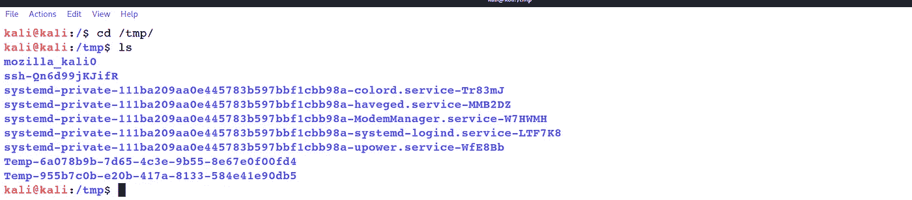

[Linux 基础知识—命令行界面(第 1 部分)](https://medium.com/@nuriddin.artykow/linux-basics-command-line-interface-part-1-aa5a48e57666)

[Linux 基础知识—命令行界面(第 2 部分)](https://medium.com/@nuriddin.artykow/linux-basics-command-line-interface-part-2-47072b303052)

[Linux 基础—命令行界面(第 3 部分)](https://medium.com/@nuriddin.artykow/linux-basics-command-line-interface-part-3-ae2a31713325)

[Linux 基础—命令行界面(第 4 部分)](https://medium.com/@nuriddin.artykow/linux-basics-command-line-interface-part-4-1bb47cfdfb7a)

[Linux 基础—命令行界面(第 5 部分)](https://medium.com/@nuriddin.artykow/linux-basics-command-line-interface-part-5-ab643c1e2f89)

[Linux 基础—命令行界面(第 6 部分)](https://medium.com/@nuriddin.artykow/linux-basics-command-line-interface-part-6-8f9cd096b4ef)

[Linux 基础—命令行界面(第 7 部分)](https://medium.com/@nuriddin.artykow/linux-basics-command-line-interface-part-7-2707208c1415)

[Linux 基础—命令行界面(第 8 部分)](https://medium.com/@nuriddin.artykow/linux-basics-command-line-interface-part-8-2ddb20e4993d)

[Linux 基础—命令行界面(第 9 部分)](https://medium.com/@nuriddin.artykow/linux-basics-command-line-interface-part-9-b71cb77a7683)