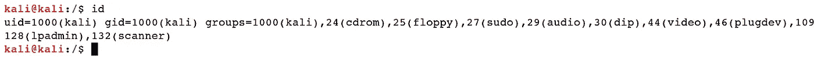
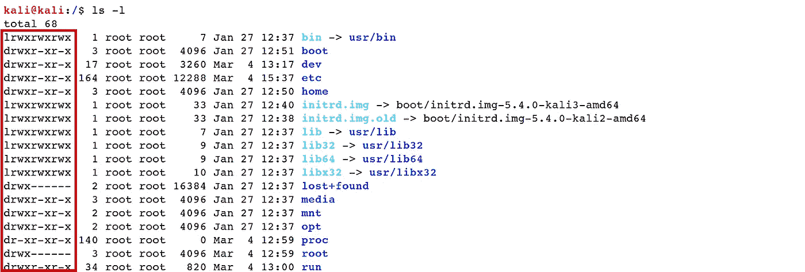
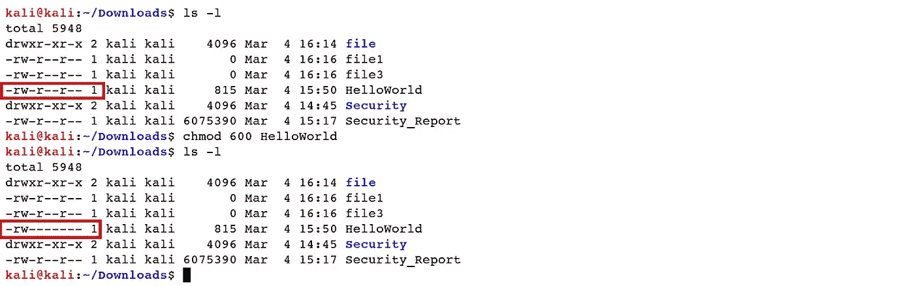
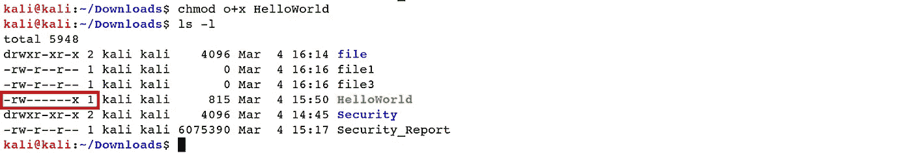
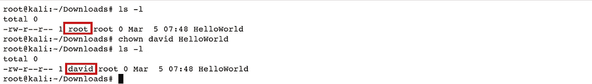
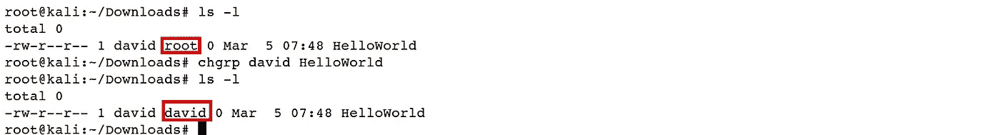
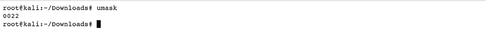

# Linux 基础—命令行界面(第 7 部分)

> 原文：<https://blog.devgenius.io/linux-basics-command-line-interface-part-7-2707208c1415?source=collection_archive---------23----------------------->

作者:www.wallpapermemory.com

1.7 **文件权限**

Linux 是 UNIX 的一个副本，UNIX 是一个多客户机操作框架，可以被许多客户机同时访问。Linux 同样可以用于集中式的计算机和服务器，不需要做任何改动。

尽管如此，这也增加了安全隐患，因为自发的或恶意的用户可能会篡改、更改或删除重要信息。为了可行的安全性，Linux 将授权分为两个级别:所有权和许可。

*所有权:* Linux 框架为每个文档和目录分配了三种基于用户的所有者。

1.*用户/所有者:*用户是文档的所有者。自然地，创造记录的人变成了记录的拥有者。随后，用户有时还被称为所有者。

2.*组:*一个用户组可以包含各种客户端。在一个组中拥有位置的所有客户将具有对该记录的类似访问许可。

3.其他:这个人既没有创建记录，也没有在可以要求文档的用户组中占有一席之地。它暗示了所有其他人。

*   *“id”*-身份:在创建客户端记录时，客户端被分配一个称为用户 ID 或*“uid”*的号码，为了方便起见，该号码在那时被映射到用户名。客户端被分配一个主组 ID 或*“GID”*，并且可以在另一个组中占有一席之地。要找出用户身份的信息，使用*“id”*命令。

***Ex****:(****kali @ kali****:~ $ id)*

*权限:*您的 Linux 框架中的每个记录和目录都有下面三个权限，这三个权限是针对我们上面提到的三个所有者的。

1. *Read (r):* 此权限授权您打开并读取文件。文件夹的读取权限允许您列出其内容。

2.写(w): 写权限授权修改文件的内容。目录的写权限允许您添加、删除和重命名存储在文件夹中的文件。

3. *Execute (x):* 在 Windows 中，一个可执行程序通常有一个扩展名*”。exe"* 并且可以高效运行。在 Linux 中，除非应用了*“execute”*权限，否则不能运行应用程序。如果没有设置文档的权限，您仍然可以查看和修改程序代码，但不能运行它。

***Ex****:(****kali @ kali****:~ $ ls–l)*

帖子的前十个字符是文档属性。这些字符中的第一个是文档类型。以下是一些您可能经常看到的文档类型:

*"-"* 代表常规文件，

*【d】*代表目录、

*“l”*代表象征联系，

*“c”*代表字符文件，

*“b”*表示块文件。

*   *“chmod”*-变更模式:利用*“chmod”*操作符变更文件或注册表的授权。要使用它，您需要指明理想的权限设置以及要修改的文档或记录。有两种不同的方式来指定权限模式:绝对(数字)模式和符号模式。

绝对(数字)模式-在此模式下，文档授权不以字符表示，而是以三位八进制数字表示。因此，文档和目录的权限类型如下:

r w x = 7 读+写+执行

r w - = 6 读+写

r -x = 5 读取+执行

r----= 4 读取

-w x = 3 写+执行

-w - = 2 写入

- x = 1 执行

- = 0 没有权限

如果您将三种权限安排(所有者、组和其他)中的每一种都表示为一个数字，那么您就有了一种真正有优势的方法来传达潜在的授权设置。例如，如果我们需要设置一个特定的文件来获得所有者的读写授权，但又要求对其他人保密，我们将使用以下命令:

***Ex****:(***kali @ kali***:~/Downloads $ chmod 600 hello world)*

符号模式——在符号模式下，您可以通过使用数学符号来更改特定所有者的权限。例如，使用 *"+"* 符号向文件或目录添加权限，使用 *"-"* 符号移除权限，使用 *"="* 符号设置和覆盖权限。我们也可以用组名的首字母代表不同的所有者:用户或所有者*为*、组为【G】*、其他为*【O】*、所有为*【A】*。*

***Ex****:(****kali @ kali****:~/Downloads $ chmod o+x hello world)*

*   *“chown”*-更改所有权:该命令用于更改文档或目录的所有者和组所有者。*【chown】*可以根据命令的第一个参数更改文件所有者和文件组所有者。例如，*“chown David filename . txt”*将文件的所有权从当前所有者变更为用户*“David”。**“chown David:users filename . txt”*将文件的所有权从当前所有者更改为用户*“David”*，并将文件组所有者更改为组*“users”。**“chown:Admins filename . txt”*将组所有者更改为组*“Admins”*且文件所有者不变。*“chown David:filename . txt”*将文件所有者从当前所有者变更为用户*“David”*，并将组所有者变更为用户*“David”的登录组。*

***Ex****:(****root @ kali****:~/Downloads # chown David hello world)*

*   *“chgrp”*-更改组所有权:在更传统的 Unix 形式中，*“chown”*运算符仅更改文件所有权，而非组所有权。因此，使用了不同的命令*“chg RP”*。除了逐渐受到限制之外，它的工作方式类似于*“chown”，*。

***Ex****:(****root @ kali****:~/Downloads # chgrp David hello world)*

*   *“umask”*:创建文档或目录时，会应用很多默认权限。*“umask”*操作员指定这些默认授权*。*默认表示不需要设置的授权。

***Ex****:(****root @ kali****:~/Downloads # umask)*

[Linux 基础-命令行界面(第 1 部分)](https://medium.com/@nuriddin.artykow/linux-basics-command-line-interface-part-1-aa5a48e57666)

[Linux 基础-命令行界面(第 2 部分)](https://medium.com/@nuriddin.artykow/linux-basics-command-line-interface-part-2-47072b303052)

[Linux 基础-命令行界面(第 3 部分)](https://medium.com/@nuriddin.artykow/linux-basics-command-line-interface-part-3-ae2a31713325)

[Linux 基础—命令行界面(第 4 部分)](https://medium.com/@nuriddin.artykow/linux-basics-command-line-interface-part-4-1bb47cfdfb7a)

[Linux 基础知识——命令行界面(第 5 部分)](https://medium.com/@nuriddin.artykow/linux-basics-command-line-interface-part-5-ab643c1e2f89)

[Linux 基础——命令行界面(第 6 部分)](https://medium.com/@nuriddin.artykow/linux-basics-command-line-interface-part-6-8f9cd096b4ef)

[Linux 基础——命令行界面(第 7 部分)](https://medium.com/@nuriddin.artykow/linux-basics-command-line-interface-part-7-2707208c1415)

[Linux 基础知识——命令行界面(第 8 部分)](https://medium.com/@nuriddin.artykow/linux-basics-command-line-interface-part-8-2ddb20e4993d)

[Linux 基础—命令行界面(第 9 部分)](https://medium.com/@nuriddin.artykow/linux-basics-command-line-interface-part-9-b71cb77a7683)