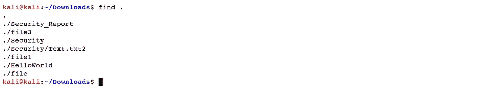
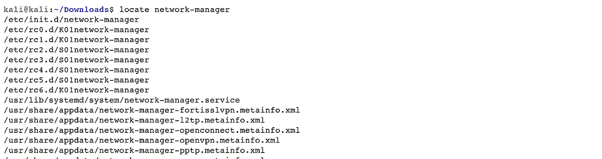

# Linux 基础—命令行界面(第 8 部分)

> 原文：<https://blog.devgenius.io/linux-basics-command-line-interface-part-8-2ddb20e4993d?source=collection_archive---------28----------------------->

作者:www.wallpapermemory.com

1.8 **在**周围找东西

在 Linux 框架中查找一个文档可能会很麻烦，因为您可能根本不知道如何查找。发现记录的理想方法是使用一些独特的终端命令。掌握这些命令可以让您对文档进行全面的监督，并且它们比其他操作框架上的基本搜索功能更具优势。让我们来看看它们。

*   *【查找】*:使用*【查找】*操作符可以扫描已知相对文件名的文档。最简单的命令类型是在流注册表中搜索记录，并递归地通过其子目录搜索与提供的搜索标准匹配的记录。您可以按名称、所有者、组、类型、权限、日期和其他规则扫描文档。

键入以下命令，列出在当前目录中找到的所有文件。

***Ex****:(****kali @ kali****:~/下载$ find。)*

要查找匹配特定模式的记录，使用*-name "*选项。您可以使用文件名元字符，如 *"*、"*，但是您应该在每个元字符前面加上转义字符 *"\"* 。例如，如果我们需要在*“Downloads”*文件夹中找到每个以*“Sec”*开头的文件，我们需要将目录更改为*“Downloads”*文件夹，然后键入以下命令:

***Ex****:(****kali @ kali****:~/Downloads $ find。-名称 Sec\*)*

*“查找”*操作符有一大堆可供选择的方法来改进搜索。有关 *"find"* 操作符的更多信息，在终端窗口中运行 *"man find"* 并按下 *"Enter。"*

*   *【定位】*:*【定位】*选项比*【查找】*选项更快，因为它利用了最近构建的数据库，而*【查找】*命令在真实系统中搜索所有实际的目录和记录。 *"locate"* 命令恢复包含预定义字符组的所有路径名的概要。

***Ex****:(****kali @ kali****:~/Downloads $ locate network-manager)*

*   *"which"* :该操作符返回给定命令时可执行文件的绝对路径。它有助于找到一个可执行文件的位置，为桌面上的程序或桌面管理器中的其他位置创建一个替代方法。

***Ex****:(****kali @ kali****:~/Downloads $ ls)*

当然， *"which"* 命令只显示第一个匹配的可执行文件。要显示所有匹配的可执行文件，使用带有*-a "*选项的命令。

[Linux 基础知识—命令行界面(第 1 部分)](https://medium.com/@nuriddin.artykow/linux-basics-command-line-interface-part-1-aa5a48e57666)

[Linux 基础知识——命令行界面(第二部分)](https://medium.com/@nuriddin.artykow/linux-basics-command-line-interface-part-2-47072b303052)

[Linux 基础知识——命令行界面(第 3 部分)](https://medium.com/@nuriddin.artykow/linux-basics-command-line-interface-part-3-ae2a31713325)

[Linux 基础知识—命令行界面(第 4 部分)](https://medium.com/@nuriddin.artykow/linux-basics-command-line-interface-part-4-1bb47cfdfb7a)

[Linux 基础知识—命令行界面(第 5 部分)](https://medium.com/@nuriddin.artykow/linux-basics-command-line-interface-part-5-ab643c1e2f89)

[Linux 基础知识—命令行界面(第 6 部分)](https://medium.com/@nuriddin.artykow/linux-basics-command-line-interface-part-6-8f9cd096b4ef)

[Linux 基础—命令行界面(第 7 部分)](https://medium.com/@nuriddin.artykow/linux-basics-command-line-interface-part-7-2707208c1415)

[Linux 基础—命令行界面(第 8 部分)](https://medium.com/@nuriddin.artykow/linux-basics-command-line-interface-part-8-2ddb20e4993d)

[Linux 基础—命令行界面(第 9 部分)](https://medium.com/@nuriddin.artykow/linux-basics-command-line-interface-part-9-b71cb77a7683)