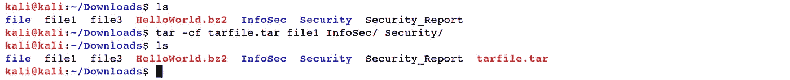

# Linux 基础—命令行界面(第 9 部分)

> 原文：<https://blog.devgenius.io/linux-basics-command-line-interface-part-9-b71cb77a7683?source=collection_archive---------27----------------------->

作者:www.wallpapermemory.com

1.9 **压缩和归档文件**

理解存档文档和压缩文档之间的区别和联系是很重要的。存档文档是放在一个文档中的文件和目录的集合。归档文件不压缩，它利用与所有单个文档和注册表整合时相似的磁盘空间。压缩文档是文件和目录的集合，其存储方式使用的磁盘空间少于所有记录和索引的总和。万一您的电脑需要更多的磁盘空间，您可以压缩那些您并不经常使用的文档或您需要保存但不再使用的记录。你甚至可以制作一个存档文件，压缩后保存以节省磁盘空间。请注意，压缩已经压缩的数据会增加额外的开销，因此你会得到一个稍微大一点的文件。所以不压缩压缩文件是一个好习惯。在 GNU/Linux 中有许多程序可以归档、压缩和解压缩文档。在这个指导性练习中，你将熟悉其中的一些。

*   *【gzip】和【gunzip】*:利用*【gzip】*程序压缩一条或多条记录。无论何时执行，它都会用压缩文件替换原始文件。相关的 *"gunzip"* 程序用于将压缩文件重建为其独特的未压缩结构。*“gzip”*利用伦佩尔-齐夫编码压缩给定文档的大小。在任何可能的情况下，每个文档都被一个扩展名为*.【gz】.*的文档所取代

***Ex****:(****kali @ kali****:~/Downloads $ gzip file 1)*

***Ex****:(****kali @ kali****:~/Downloads $ gunzip file1.gz)*

*   *“zcat”和“zmore”*:这些命令用于查看压缩后的*“gzip”*文本文件。

***Ex****:(****kali @ kali****:~/Downloads $ zcat HelloWorld.gz)*

***Ex****:(****kali @ kali****:~/Downloads $ zmore HelloWorld.gz)*

*   *“bzip 2”和“bunzip 2”*:*“bzip 2”*与“gzip”程序非常相似，但是使用了不同的压缩算法名为*“Burrows-Wheeler”*块排序文本压缩算法，以及*“Huffman”*编码。用 *"bzip2"* 压缩的文件将以 *".bz2"* 扩展名结尾。要解压缩文件，请使用*“bunzip2”*命令。

***Ex****:(***T21)kali @ kali***:~/Downloads $ bzip2 hello world)*

***Ex****:(****kali @ kali****:~/Downloads $ bunzip 2 hello world . bz2)*

*   *“bzcat”和“bzmore”*这些命令与*“zcat”*非常相似，用于显示带有*“bzip2”*的压缩文件。

***Ex****:(****kali @ kali****:~/Downloads $ bzcat helloworld . bz2)*

***Ex****:(****kali @ kali****:~/Downloads $ bzmore hello world . bz2)*

*   *“tar”*:*“tar”*是一个 Unix 命令，代表*“磁带存档”*用于将多个文档合并或存储到一个文件中。

我们经常看到以扩展名*结尾的文件名。焦油“*或*”。tgz，"*分别表示简单的 *"tar"* 档案和 *"gzip"* 档案。*“tar”*档案由一组独立的文件、一个或多个目录层次或两者的混合组成。

*【焦油】*实用程序有四种主要工作模式:

*“c”*从文件或目录创建归档文档，

*"x"* 摘录档案、

*“r”*将文档附加到归档文件的末尾，

*“t”*列出归档文件的内容。

模式的完整纲要请参见*“tar”手册页*

***Ex****:(****kali @ kali****:~/Downloads $ tar-cf tarfile.tar 文件 1 InfoSec/ Security/)*

***Ex****:(****kali @ kali****:~/Downloads $ tar-TF tarfile.tar)*

***Ex****:(****kali @ kali****:~/Downloads $ tar-xf tarfile.tar)*

*   *“zip”和“unzip”*:*“zip”*是一个简单明了的跨平台文档压缩和归档工具，适用于类似 Unix 的框架，包括 Linux 和 Windows OS，以及许多其他操作系统。*“zip”*格式是 Windows PCs 上使用的标准存档文件格式，最重要的是，它允许您提供 1 到 9 之间的压缩级别作为选项。一个单独的配套程序是*“unzip”*，它解压缩*“zip”*档案。

***Ex****:****(kali @ kali****:~/Downloads＄zip-r zip file . zip file 1 InfoSec/Security/)*

***Ex****:(****kali @ kali****:~/Downloads $ unzip zip file . zip)*

[Linux 基础知识—命令行界面(第 1 部分)](https://medium.com/@nuriddin.artykow/linux-basics-command-line-interface-part-1-aa5a48e57666)

[Linux 基础知识——命令行界面(第二部分)](https://medium.com/@nuriddin.artykow/linux-basics-command-line-interface-part-2-47072b303052)

[Linux 基础—命令行界面(第 3 部分)](https://medium.com/@nuriddin.artykow/linux-basics-command-line-interface-part-3-ae2a31713325)

[Linux 基础—命令行界面(第 4 部分)](https://medium.com/@nuriddin.artykow/linux-basics-command-line-interface-part-4-1bb47cfdfb7a)

[Linux 基础—命令行界面(第 5 部分)](https://medium.com/@nuriddin.artykow/linux-basics-command-line-interface-part-5-ab643c1e2f89)

[Linux 基础—命令行界面(第 6 部分)](https://medium.com/@nuriddin.artykow/linux-basics-command-line-interface-part-6-8f9cd096b4ef)

[Linux 基础—命令行界面(第 7 部分)](https://medium.com/@nuriddin.artykow/linux-basics-command-line-interface-part-7-2707208c1415)

[Linux 基础—命令行界面(第 8 部分)](https://medium.com/@nuriddin.artykow/linux-basics-command-line-interface-part-8-2ddb20e4993d)

[Linux 基础—命令行界面(第 9 部分)](https://medium.com/@nuriddin.artykow/linux-basics-command-line-interface-part-9-b71cb77a7683)