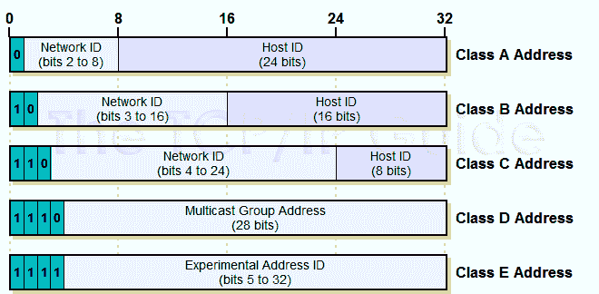
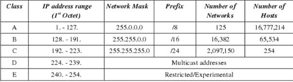
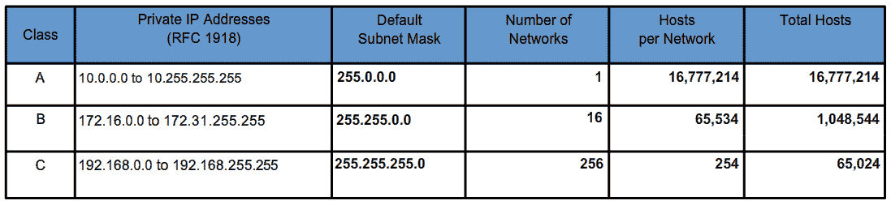

# Linux — CIDR 深度潜水

> 原文：<https://blog.devgenius.io/linux-cidr-deep-dive-ad31b69d846f?source=collection_archive---------2----------------------->

## 先进的 CIDR 知识


# 背景和历史

如果你是 DevOps 工程师或者 SRE，你一定用过这两个命令中的一个:`ifconfig`和`ip addr`。对于网络故障排除，通常需要登录主机，通过运行以下命令来检查网络配置和状态:

```
root@test:~# ip addr
1: lo: <LOOPBACK,UP,LOWER_UP> mtu 65536 qdisc noqueue state UNKNOWN group default 
    link/loopback 00:00:00:00:00:00 brd 00:00:00:00:00:00
    inet 127.0.0.1/8 scope host lo
       valid_lft forever preferred_lft forever
    inet6 ::1/128 scope host 
       valid_lft forever preferred_lft forever
2: eth0: <BROADCAST,MULTICAST,UP,LOWER_UP> mtu 1500 qdisc pfifo_fast state UP group default qlen 1000
    link/ether fa:16:3e:c7:79:75 brd ff:ff:ff:ff:ff:ff
    **inet 10.100.122.2/24** brd 10.100.122.255 scope global eth0
       valid_lft forever preferred_lft forever
    inet6 fe80::f816:3eff:fec7:7975/64 scope link 
       valid_lft forever preferred_lft forever
```

这个命令显示这台机器上的所有网卡。如你所见，每个网卡都有 IP 地址。IP 地址是网络世界中一个网卡的通信地址，相当于我们现实世界中的门牌号。

既然是门牌号，就不能每个人都一样，否则会有冲突。比如大家都打电话№1001，6 单元，快递就无处可去了。所以有时候我们的电脑会弹出网络地址冲突，出现无法上网的情况，大部分都是 IP 地址冲突。

如上图，`10.100.122.2`是 IP 地址。地址用点分隔成四部分，每部分 8 位，因此 IPv4 地址总共是 32 位。因为 IPv4 地址 it 不够，所以发明了 IPv6，也就是上面输出的`inet6 fe80::f816:3eff:fec7:7975/64`。这个有 128 位，目前看起来足够了，但是谁知道以后会发生什么呢？

原来 32 位 IP 地址不够用，分为 5 类。现在想想，当时分配地址是一种奢侈。



图片来自[knowledgeofthings.com](https://knowledgeofthings.com/dividing-ip-addresses-part-i-classful-networking/)

在网络地址中，至少在设计的时候，对于 A、B、C 类主要有两部分，第一部分是网络号，后一部分是主机号。

下表详细显示了三种类型的 A、B 和 C 地址中可以包含的主机数量。



您可以看到，一个`C`类地址所能容纳的最大主机数量太少，只有 254 台。而且一个`B`类地址所能容纳的最大主机数量太多。一个网络下放 6 万多台机器，一般企业基本达不到这个规模，闲置地址浪费。

# 无类域内路由选择(Classless Inter-Domain Routing)

无类域间路由(CIDR)是一种分配 IP 地址和 IP 路由的方法。互联网协议(IP)标准的集合用于创建网络和单个设备的唯一标识符。

这种方法打破了原来设计的几种类型地址的惯例，将 32 位 IP 地址一分为二，前面是**网络号**，后面是**主机号**。

在哪里分？如果你注意的话，可以看到`10.100.122.2/24`，这个 IP 地址有一个斜杠，斜杠后面有一个数字 24。该地址表示为 CIDR。后 24 位是指在 32 位中，前 24 位是网络号，后 8 位是主机号。

CIDR 是在 1992 年引入的，这意味着路由表级别的网络“类”的概念已经被取消，取而代之的是“网络前缀”的概念。“无类型”意味着现在基于整个 32 位 IP 地址掩码做出路由决定。

它的 IP 地址是 A 类、B 类还是 C 类没什么区别，思路是:把很多 C 类地址组合起来进行 B 类地址分配。这种分配多个 IP 地址的方式可以将路由表中的许多条目总结成一个较小的数字。

要使用此合并，必须满足以下三个属性:

*   当多个 IP 地址合并进行路由时，这些 IP 地址必须具有相同的高位地址位。
*   路由表和路由算法必须扩展，以根据 32 位 IP 地址和 32 位掩码做出路由决策。
*   除了 32 位地址之外，路由协议还必须扩展到 32 位掩码。

根据[RFC 1466【Gerich 1993】](https://datatracker.ietf.org/doc/html/rfc1466)将全球分为四个区域，每个区域被分配一个连续的 C 类地址:

*   **欧洲:** `194.0.0.0 ~ 195.255.255.255`
*   **北美:**
*   **中南美洲:** `200.0 .0.0 ~ 201.255.255.255`
*   **亚太:**

这样每个区域大概有 3200 万个地址，另外 3200 万个地址`204.0.0.0 ~ 223.255.255.255`留作备用。
这种分配方式的优势显而易见:

1.  地址的分配是连续的
2.  CIDR 使路由表的设置变得更加容易

**注:私有 IP CIDR 范围如下:**



# CIDR 的例子

让我们来看看 CIDR 街区`16.158.165.91/22`。您能找到该网络的首地址、子网掩码和广播地址吗？

如果您对第一个 IP 地址的回答是`16.158.165.1`，那么这是错误的。我们来做一些分析。

由于`/22`不是 8 的整数倍，所以不好处理。只能先转换成二进制。16.158 部分不动，占用前 16 位。中间的 165 变成了二进制的`10100101`。除了前 16 位，还剩 6 位。所以，8 位中的前 6 位是网络号， **16.158。< 101001 >** ， **< 01 > .91** 为机器编号。

由于每个部分必须有 8 位，所以我们在网络号上再加两个`0`,于是就变成了 **16.158。< 10100100 > (16.158.164)。第一个可用的 IP 地址是 16.158.164.1。**IP 地址范围为**16 . 158 . 164 . 0–16 . 158 . 167 . 255**。

> 注意，16.158.164.0 是网络地址，16.158.164.255 是网络广播地址。两个都是保留的。

# 真实生活用例

## 要求:

一个企业需要 1000 个 IP 地址。ISP 有一个地址块`200.0.64.0/18`。

## 分析:

因为 1000 个 IP 地址= `2^10` = `1024`，占用 10 个地址位。ISP 分配给企业的地址块可以是:`200.0.68.0/22`(网络位 22，主机位 10)。

如果公司有四个子公司，每个子公司需要的 IP 地址是:

*   A 公司 500
*   B 公司 250 英镑
*   C 公司 120 英镑
*   D 公司 120

我们先来分析一下地址块。

**ISP: 200.0.64.0/18**

*   第一个地址是:`200.0.64.0 = 11001000.00000000.01000000.00000000`
*   最后一个地址是:`200.0.127.255 =11001000.00000000.01111111.11111111`ISP 地址总数是`2¹⁴ = 16384`。

## 企业 CIDRs

该企业需要 1000 个 IP，因为`2¹⁰ = 1024`所以我们可以计算出主机部分是 10 位，网络部分是 22 位。我们可以将`200.0.64.0/22`分配给企业。

*   第一个地址:`200.0.64.0 = 11001000.00000000.010000 00.00000000`
*   最后地址:`200.0.67.255 = 11001000.00000000.010000 11.11111111`

然后，我们可以计算每个子公司的网络部分:

*   公司 A，`500 IPs = 2⁹ = 512 = 9 bits`
*   B 公司，`250 IPs = 2⁸ = 256 = 8 bits`
*   C 公司，`120 IPs = 2⁷ = 128 = 7 bits`
*   D 公司，`120 IPs = 2⁷ = 128 = 7 bits`

因此，我们可以分配以下 CIDRs:

*   甲公司:`200.0.64.0/23` ( `200.0.64.0 ~ 200.0.65.255`)
*   乙公司: `200.0.66.0/24` ( `200.0.66.0 ~ 200.0.66.255`)
*   丙公司:`200.0.66.0/25` ( `200.0.67.0 ~ 200.0.67.127`)
*   D 公司:`200.0.67.128/25` ( `200.0.67.128 ~ 200.0.67.255`)

在现实生活中，你不需要做手工计算，有许多在线 CIDR 计算器你可以利用，如[https://www.ipaddressguide.com/cidr](https://www.ipaddressguide.com/cidr)。