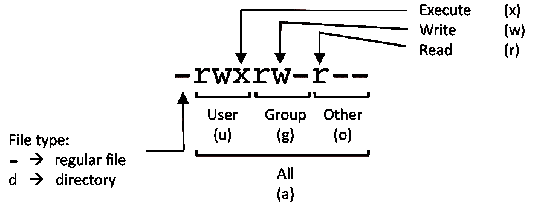
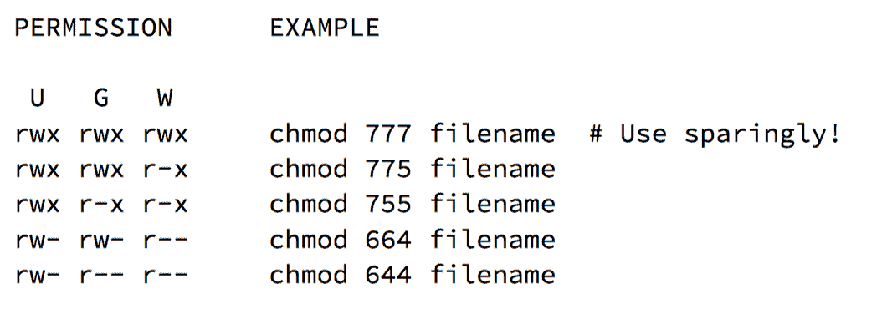

# 面向开发人员的 Linux 命令

> 原文：<https://blog.devgenius.io/linux-commands-for-developers-d88baba576b4?source=collection_archive---------4----------------------->

面向开发人员的基本 Linux 命令介绍。


由[加布里埃尔·海因策](https://unsplash.com/@6heinz3r?utm_source=medium&utm_medium=referral)在 [Unsplash](https://unsplash.com?utm_source=medium&utm_medium=referral) 上拍摄的照片

# 介绍

[Linux](https://www.linux.com/what-is-linux/) 是一个开源操作系统，支持[安卓手机](https://en.wikipedia.org/wiki/Android_(operating_system))、[公共云](https://www.redhat.com/en/resources/state-of-linux-in-public-cloud-for-enterprises)、智能电视、物联网设备、卫星——它无处不在；从你的智能手机到[大型强子对撞机](https://www.linux.com/topic/open-source/how-cern-using-linux-open-source/) (LHC)。

Linus Torvalds 是 Linux 内核的创建者。他还创建了开发人员每天使用的分布式版本控制系统“Git”。

知道如何使用 Linux 命令是开发人员必备的技能。

## 目录

1.  [设置游乐场](#a265)
2.  [评论](#6de7)
3.  [包管理器](#3d0a)
4.  [目录导航](#3b26)
5.  [系统信息](#a077)
6.  [硬件信息](#ac77)
7.  [系统监控，统计&调试](#2be6)
8.  [文件和目录](#5ee0)
9.  [流程管理](#dee0)
10.  [文件权限](#60ab)
11.  [联网](#798d)
12.  [文字搜索](#00b7)
13.  [磁盘使用情况](#c8d1)
14.  [管道和重定向](#04da)
15.  [环境变量](#f0b3)

# 设置游乐场

为了学习和尝试 Linux 命令，在 Linux 容器中运行它是安全的。Docker 是运行容器的一个流行选择，如果你还没有安装它，从下面的链接安装它。

[](https://docs.docker.com/get-docker/) [## 获取码头工人

### 预计阅读时间:1 分钟 Docker 是一个开发、运输和运行应用程序的开放平台。码头工人…

docs.docker.com](https://docs.docker.com/get-docker/) 

一旦 Docker 安装并运行。继续运行以下命令来启动一个 [Ubuntu docker](https://hub.docker.com/_/ubuntu) 容器:

```
$ docker pull ubuntu$ docker run --rm -it ubuntu bash
root@e4675284d809:/#
```

在容器内部，运行以下命令来恢复默认 Ubuntu 上的内容和包，以使其更适合交互和学习使用。

```
# Type 'y' when prompted
root@e4675284d809:/# unminimize
```

现在，安装一个名为 [tmux](https://github.com/tmux/tmux/wiki) 的程序，用于在一个终端窗口中运行多个 shell 会话。

```
$ apt update
$ apt install tmux
```

通过运行`tmux`命令启动 tmux

```
$ tmux
```

## **TMUX 一言以蔽之**

*   启动新的选项卡式窗口:按下`Ctrl+b`，释放，然后按下`c`
*   水平启动新窗口:按`Ctrl+b`，松开再按`"`
*   垂直启动新窗口:按`Ctrl+b`，松开再按`%`
*   在选项卡式窗口之间切换:按下`Ctrl+b`，松开并按下`p`或`n`
*   在水平或垂直窗口之间切换:按下`Ctrl+b`，松开，然后按下`;`
*   关闭窗口:按下`Ctrl+b`，松开后再按下`x`
*   重命名选项卡式窗口:按下`Ctrl+b`，释放，然后按下`,`
*   滚动浏览窗口控制台输出:按 Ctrl+b，释放，然后按`[` —使用箭头移动

# 评论

**Linux 命令行中的注释**以`#`开头

```
$ # This is a comment
```

# 包管理器

`apt`是一个**包管理器**，用于管理 **Ubuntu** Linux 中的包。

**更新软件包存储库**

```
$ apt update
```

**批量升级包**

```
$ apt
```

**搜索名为** `**htop**`的包

```
$ apt search htop
```

**显示关于一个包的信息**

```
$ apt show htop
```

**安装一个名为**T20 的包

```
$ apt install htop
```

**移除一个名为**的包`**htop**`

```
$ apt remove less
```

**安装多个软件包**

```
$ apt install htop less
```

`apt-file`是一个搜索包含文件的包的程序。如果你不记得包的名字，但是你知道命令，这非常有用。

**使用 apt** 安装 apt 文件

```
$ apt install apt-file
```

**更新 apt 文件缓存**

```
$ apt-file update
```

**搜索提供 postgres 命令的包**

```
$ apt-file search bin/psql
```

# 目录导航

**更改到** `**/home**` **目录**

```
$ cd /home
```

**切换到上一个目录**

```
$ cd -
```

**进入目录树的上一级**

```
$ cd ..
```

**打印您所在的当前目录**

```
$ pwd
```

# 系统信息

**显示 Linux 内核信息**

```
$ uname -a
```

**显示内核发布信息**

```
$ uname -r
```

**显示系统已经运行多长时间+负载**

```
$ uptime
```

**显示系统主机名**

```
$ hostname
```

**显示主机的 IP 地址**

```
$ hostname -I
```

**显示系统重启历史**

```
$ last reboot
```

**显示当前日期和时间**

```
$ date
```

**显示本月的日历**

```
$ cal
```

**显示谁在线**

```
$ w
```

**您以谁的身份登录**

```
$ whoami
$ id
```

# 硬件信息

**显示 CPU 信息**

```
$ cat /proc/cpuinfo
```

**显示 CPU 核心数**

```
$ nproc
```

**显示内存信息**

```
$ cat /proc/meminfo
```

**显示过程的环境变量，例如:PID 1**

```
$ cat /proc/1/environ
```

**显示空闲和已用内存(-h 表示可读，-m 表示 MB，-g 表示 GB。)**

```
$ free -h
```

# 系统监控、统计、调试

**显示和管理正在运行的进程**

```
$ top
```

**安装并使用友好的交互式流程查看器(top 的替代产品)**

```
$ apt install htop
$ htop
```

**显示处理器相关统计数据(每 1 秒刷新一次)**

```
$ mpstat 1
```

> ***注意:*** *如果遇到以下错误:/usr/bin/mpstat:没有这样的文件或目录。搜索并安装提供 mpstat 工具的包。*

```
$ apt-file search bin/mpstat
sysstat: /usr/bin/mpstat$ apt install sysstat
```

**显示虚拟内存统计数据(每 1 秒刷新一次)**

```
$ vmstat 1
```

**显示磁盘 I/O 统计数据(每 1 秒刷新一次)**

```
$ iostat 1
```

**列出系统上所有打开的文件**

```
$ lsof
```

**列出用户打开的文件(例如:root)**

```
$ lsof -u USER
```

**用 PID 列出某个进程打开的文件(例如:1)**

```
$ lsof -p PID
```

**显示当前目录占用的磁盘空间(-h 表示可读，-s 表示总结)**

```
$ du -sh
```

**执行“df -h”，每 1 秒显示周期性更新(pro 提示:-d 标志显示可视化更新)**

```
$ watch -n1 df -h
```

# 文件和目录

**以长列表的可读格式列出当前目录下的所有文件(包括隐藏的)(指定** `**.**` **是可选的)。**

```
$ ls -hal .
```

**显示当前工作目录**

```
$ pwd
```

**创建一个或多个新的空文件**

```
$ touch file1 file2
```

**创建新目录**

```
$ mkdir dir1
```

**使用** `**-p**` **选项**创建一个目录树

```
$ mkdir -p dir1/dir2/dir3
```

**使用** `**tree**`命令**列出目录树**

```
$ tree dir1
```

> ***注意:*** *安装* `*tree*` *包，如果遇到以下错误:
> bash: tree:命令找不到*

```
$ apt install tree
```

**将文件从一个目录复制到另一个目录(** `**-v**` **启用详细模式的选项)**

```
$ cp -v file1 dir1/file1-copy
```

**将目录及其所有内容复制到新目录**

```
$ cp -vr dir1 dir1-copy
```

**重命名或移动文件。如果** `**file2**` **是一个目录，那么** `**file1**` **成移入那个目录**

```
$ mv -v file1 file1-rename
$ mv -v file1-rename dir1
```

**删除文件或空目录(** `**-f**` **选项不经询问强制删除)**

```
$ rm file1
```

**递归删除目录及其内容(** `**-v**` **启用详细模式的选项)**

```
$ rm -vr dir1
```

**创建一个指向文件或目录的符号链接(指针)**

```
$ ln -s file1 file1-link
```

**将简单文本写入文件**

```
echo "hello, world!" > hello.txt
```

**查看文件内容**

```
$ cat hello.txt
```

**对大文件进行分页**

```
$ less hello.txt
```

**显示文件的前 20 行**

```
$ head -n 20 hello.txt
```

**显示文件的最后 20 行**

```
$ tail -n 20 hello.txt
```

显示文件的最后 10 行，并在文件更新时跟踪文件。

```
$ tail -f hello.txt
```

# 进程管理

一个**进程**是一个程序的运行实例。

**显示您当前正在运行的流程**

```
$ ps
```

**显示系统上的每个进程。**

```
$ ps auxf
```

**显示流程名称的流程信息**

```
$ ps uf -C processname
```

**显示运行过程的交互式实时视图**

```
$ top
$ htop
```

**基于名称查找工艺标识**

```
pgrep nginx
```

**终止给定流程标识的流程。默认情况下发送 TERM 信号**

```
$ kill PID
```

**向给定流程标识的流程发送定制信号**

```
$ kill -s SIGNAL_NUMBER pid
```

**列出所有可用信号**

```
$ kill -l
```

**基于名称终止流程**

```
$ pkill nginx
```

**作为后台作业运行命令**

```
$ (sleep 30; echo "woke up after 30 seconds") &
```

**列出后台作业**

```
$ jobs
```

**显示停止或后台作业**

```
$ bg
```

**将最近的后台作业带到前台**

```
$ fg
```

**将作业** `**N**` **带到前台**

```
$ fg N
```

**压井作业** `**N**`

```
$ kill %N
```

# 文件权限



**将所有权限授予所有者，将读取权限授予组，将读取权限授予其他人**

```
# Create a file
$ touch file1# Set permission using either of the method
$ chmod 750 file1
$ chmod u=rwx,g=rx,o= file1# List the file permission
$ ls -lh file1
```

**将文件或目录的所有权变更为给定的** `**user**` **和** `**group**`

```
$ chown user:group file1
```

# **联网**

**显示所有可用网络接口的信息**

```
$ ifconfig -a
```

**显示信息的** `**eth0**` **界面**

```
$ ifconfig eth0
```

**Ping 一个主机名或 IP 地址**

```
$ ping google.com
$ ping 8.8.8.8
```

**显示域的注册信息**

```
$ whois medium.com
```

**域名系统查找域**

```
$ dig medium.com A     # IPv4 addresses
$ dig medium.com AAAA  # IPv6 addresses
$ dig medium.com NX    # Nameservers$ host medium.com     # IPv4 addresses
```

**显示本地机器的主机名和 IP 地址**

```
$ hostname
$ hostname -i
```

**从远程 HTTP 服务器下载文件**

```
$ wget [http://ipv4.download.thinkbroadband.com/5MB.zip](http://ipv4.download.thinkbroadband.com/5MB.zip)
$ curl --output 5MB.zip [http://ipv4.download.thinkbroadband.com/5MB.zip](http://ipv4.download.thinkbroadband.com/5MB.zip)
```

显示在 TCP 或 UDP 端口上侦听的所有进程

```
$ netstat -plunt
$ lsof -i
$ lsof -i tcp     # only TCP ports
```

# 文本搜索

**在文本文件中搜索模式**

```
$ grep pattern file# For example:
$ grep root /etc/passwd
```

**递归搜索目录中文本文件的模式**

```
$ grep -R "/bin/bash" /etc
```

**搜索模式，在(B)模式匹配前或(A)模式匹配后输出** `**N**` **行**

```
$ grep -B 5 root /etc/passwd
$ grep -A 3 root /etc/passwd
```

**在目录中查找与文件名匹配的文件**

```
find /etc -iname 'passwd'
find /etc -iname 'pass*'  # glob pattern
```

**根据文件大小查找文件**

```
find / -size +1M #  larger than 1MB
find / -size -1M # smaller than 1MB
```

# 磁盘使用情况

**显示磁盘存储的可用空间和已用空间**

```
df -h
```

**显示目录或文件占用的磁盘空间**

```
du -sh /var/log
du -h 5MB.zip
```

**交互式磁盘使用浏览器**

```
apt install ncdu
ncdu
```

# 管道和重定向

## 重寄

**将命令的正常输出(stdout)重定向至文件**

```
echo "hello" > hello.stdout.txt
echo "world" > hello.stdout.txt
```

**将错误输出(stderr)从命令重定向到文件**

```
cat somefile 2> cat.stderr.txt
```

**将命令的正常和错误输出重定向到一个文件。对日志记录有用。**

```
ps auxf >& processes.txt
```

**将命令的正常输出(stdout)附加到文件，不像** `**>**` **会覆盖文件**

```
echo "hello" >> hello2.stdout.txt
echo "world! >> hello2.stdout.txt
```

**将命令的错误输出(stderr)添加到文件中**

```
cat some-unknown-file 2>> cat2.stderr.txt
```

**将命令的正常和错误输出(stderr)添加到文件中**

```
ps auxf &>> processes.txt
```

## 管道

**外壳管道**是**命令间通信的一种方式。**

**创建一个虚拟文件来学习管道**

```
mkdir pipes-example
cd pipes-example
touch {1..10}.txt
```

**例 1:让我们用** `**sort**` **命令**

```
ls -1 *.txt | sort -n    # sorts the output in ASC order
ls -1 *.txt | sort -nr   # sorts the output in DESC order
```

**例 2:让我们用**`**head**`**&**`**tail**`**命令**

```
ls -1 *.txt | sort -n | head -n 5  # show the first 5 lines
ls -1 *.txt | sort -n | tail -n 5  # show the last 5 lines
```

**示例 3:在文本文件中搜索模式**

```
cat /etc/passwd | grep root    # show lines containing string 'root'
```

# 环境变量

**列出所有环境变量**

```
$ env
```

**显示环境变量的值**

```
echo $HOME
echo $SHELL
```

**创建一个环境变量**

```
export PORT=80
export PLATFORM=medium.com
```

**删除一个环境变量**

```
unset PORT
```

**路径**是常见的**重要的环境变量**之一。如果你不设置它，你认为会发生什么？

```
$ echo $PATH
$ unset PATH
```

# …就是这样！

E非常命令可以是一个关于自身选项的百科全书。如果你想知道更多的选项，作者，例子，那么使用`man`例如:`man htop`或`man man`来了解人类本身。

> 如果你觉得这篇文章有用，别忘了点击👏

# 阅读我写的其他文章

[](https://medium.com/@ptuladhar3/email-productivity-organize-your-gmail-labels-as-tabs-3c29acc7b350) [## 电子邮件效率:将您的 Gmail 标签组织成标签

### “标签式 Gmail 标签”帮助您将 Gmail 标签组织成标签。

medium.com](https://medium.com/@ptuladhar3/email-productivity-organize-your-gmail-labels-as-tabs-3c29acc7b350) [](https://medium.com/@ptuladhar3/deploy-scalable-and-highly-available-web-app-omaha-server-on-aws-cloud-69e26df7c85b) [## 在 AWS 云上部署可扩展且高度可用的 Web 应用程序(奥马哈服务器)

### 使用 CloudFormation 在 Amazon ECS 上部署 Omaha (Google Update)服务器

medium.com](https://medium.com/@ptuladhar3/deploy-scalable-and-highly-available-web-app-omaha-server-on-aws-cloud-69e26df7c85b) [](https://medium.com/@ptuladhar3/design-secure-scalable-vpc-for-micro-service-architecture-1b58fbf128f4) [## 为微服务架构设计安全且可扩展的 VPC

### 了解如何为微服务架构设计安全且可扩展的 VPC 网络。

medium.com](https://medium.com/@ptuladhar3/design-secure-scalable-vpc-for-micro-service-architecture-1b58fbf128f4) [](https://medium.com/@ptuladhar3/bringing-manually-created-resources-into-cloudformation-management-ffd39b05d9f6) [## 将手动创建的资源纳入云信息管理

### AWS 全球加速器

medium.com](https://medium.com/@ptuladhar3/bringing-manually-created-resources-into-cloudformation-management-ffd39b05d9f6)