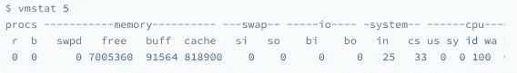
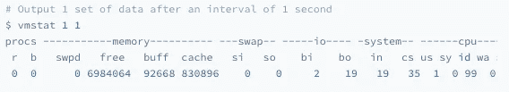
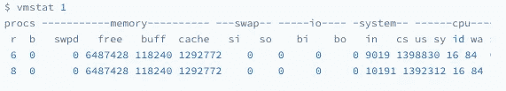

# Linux CPU 上下文切换故障排除

> 原文：<https://blog.devgenius.io/linux-cpu-context-switch-troubleshooting-bda45883e59e?source=collection_archive---------0----------------------->

## 如何排除 CPU 上下文切换故障


在我的上一篇文章: [Linux CPU 上下文切换深度探讨](https://medium.com/geekculture/linux-cpu-context-switch-deep-dive-764bfdae4f01)中，我谈到了 CPU 上下文切换是如何工作的。快速回顾一下，CPU 上下文切换是保证 Linux 系统正常运行的核心功能。分为**【进程上下文切换】****【线程上下文切换】****【中断上下文切换】**。

在这篇文章中，我将讨论如何分析 CPU 上下文切换问题。

# 检查 CPU 上下文切换

我们知道，过多的上下文切换会消耗 CPU 时间来保存和恢复数据，如寄存器、程序计数器、内核堆栈和虚拟内存等，这会导致系统性能显著下降。

既然上下文切换对系统性能有如此大的影响，我们如何检查上下文切换呢？嗯，你可以用`vmstat`工具查询你系统的上下文切换。

## vmstat

`vmstat`是一种常用的系统性能分析工具。它主要用于分析内存使用情况，也常用于分析 CPU 上下文切换和中断的数量。

例如，`vmstat 5` (5 秒输出间隔):



vmstat 示例

让我们来看看输出:

*   `cs`(上下文切换):每秒的上下文切换次数。
*   `in`(中断):每秒中断的次数。
*   `r`(正在运行或可运行):就绪队列长度，即正在运行并等待 CPU 的进程数。
*   `b`(阻塞):处于不可中断睡眠状态的进程数量。

在上面的例子中，我们可以看到上下文切换次数为`33`次，系统中断次数为`25`次，就绪队列长度、不可中断状态进程数均为 0。

## pidstat

然而，`vmstat`只给出了系统的整体上下文切换。要查看每个过程的详细信息，您需要使用`pidstat`。添加`-w`选项，您可以看到每个流程的上下文切换:

例如:

```
# Output interval is 5
$ pidstat -w 5
Linux 4.15.0 (ubuntu)  09/23/18  _x86_64_  (2 CPU)08:18:26      UID       PID   cswch/s nvcswch/s  Command
08:18:31        0         1      0.20      0.00  systemd
08:18:31        0         8      5.40      0.00  rcu_sched
...
```

这个结果中有两列需要我们注意:`cswch`和`nvcswch`。

`cswch`表示每秒自愿上下文切换的次数，`nvcswch`表示每秒非自愿上下文切换的次数。

*   **自愿上下文切换是指进程无法获得所需资源而导致的上下文切换。**例如，当 I/O 和内存等系统资源不足时，会发生自愿上下文切换。
*   **非自愿上下文切换是指由于时间片过期，流程被系统强制重新调度时发生的上下文切换。**比如大量进程争用 CPU 时，容易出现不自觉的上下文切换。

您必须记住这两个概念，因为它们意味着不同的性能问题。

# 个案分析

现在您已经知道如何查看这些指标，另一个问题出现了。上下文切换频率多久被认为是正常的？让我们来看一个案例。

我们将使用【https://github.com/akopytov/sysbenc】([)](https://github.com/akopytov/sysbench)，一个多线程的基准测试工具来生成负载，以模拟上下文切换过多的问题。假设您已经在 Linux 系统上安装了`sysbench`和`sysstat`。

在我们模拟负载之前，让我们在一个终端中运行`vmstat`:



这里可以看到当前的上下文切换数`cs`是 35，中断数`in`是 19，`r`和`b`都是 0。因为此刻我没有其他任务在运行，所以它们是空闲系统的上下文切换次数。

让我们运行`sysbench`来模拟多线程调度系统的瓶颈:

```
$ sysbench --threads=10 --max-time=300 threads run
```

现在，您应该会看到`vmstat`的不同输出:



你应该能发现`cs`列的上下文切换次数从之前的`35`急剧上升到`1.39`百万。同时，注意观察其他几个指标:

*   `r`:就绪队列长度已达到 8
*   `us`和`sy`:`us`和`sy`的 CPU 使用率加起来是 100%，系统 CPU 使用率是 85%，说明 CPU 主要被内核占用。
*   `in`:中断的数量也上升到了 10000，说明中断处理也是一个潜在的问题。

结合这些指标，我们可以知道系统的就绪队列过长，也就是有太多的进程在运行，等待 CPU，导致大量的上下文切换，上下文切换导致系统 CPU 使用率增加。

那么是什么过程导致了这些问题呢？

我们继续分析使用第三终端中的`pidstat`来看看 CPU 和进程上下文切换的情况:

```
# 1 means output interval is 1 second
# -w: output process switching index，
# -u: output CPU usage index
$ pidstat -w -u 1
08:06:33      UID       PID    %usr %system  %guest   %wait    %CPU   CPU  Command
08:06:34        0     10488   30.00  **100.00**    0.00    0.00  100.00     0  **sysbench**
08:06:34        0     26326    0.00    1.00    0.00    0.00    1.00     0  kworker/u4:208:06:33      UID       PID   cswch/s nvcswch/s  Command
08:06:34        0         8     11.00      0.00  rcu_sched
08:06:34        0        16      1.00      0.00  ksoftirqd/1
08:06:34        0       471      1.00      0.00  hv_balloon
08:06:34        0      1230      1.00      0.00  iscsid
08:06:34        0      4089      1.00      0.00  kworker/1:5
08:06:34        0      4333      1.00      0.00  kworker/0:3
08:06:34        0     10499      1.00    224.00  pidstat
08:06:34        0     26326    236.00      0.00  kworker/u4:2
08:06:34     1000     26784    223.00      0.00  sshd
```

从`pidstat`的输出可以发现，CPU 使用率的增加确实是由`sysbench`引起的，它的 CPU 使用率已经达到了 100%。但是上下文切换来自其他进程，包括**非自愿**上下文切换频率最高的`pidstat`，以及**自愿**上下文切换频率最高的内核线程`kworker`和`sshd`。

注意:默认情况下`pidstat`只显示进程上下文切换，如果你想看到实际的线程上下文切换，添加`-t`参数。

## 中断

要找出中断数量也很高的原因，您可以检查`/proc/interrupts`文件。该文件提供了只读中断用法。

```
# -d: Highlight the change area
$ watch -d cat /proc/interrupts
           CPU0       CPU1
...
RES:    2450431    5279697   Rescheduling interrupts
...
```

观察一段时间后，可以发现变化最快的是重调度中断(RES)。这种中断类型表示处于空闲状态的 CPU 被唤醒以调度新任务运行。所以这里中断的增加是因为任务太多的调度问题，这和前面上下文切换次数的分析结果是一致的。

现在回到最初的问题，每秒多少次上下文切换是正常的？

这个值其实取决于系统本身的 CPU 性能。在我看来，如果系统的上下文切换次数比较稳定的话，几百到一万次应该是正常的。但是，当上下文切换次数超过 10，000 次，或者切换次数快速增加时，很可能出现了性能问题。

# 结论

此时，你应该可以根据上下文切换的类型做一些具体的分析了。

*   有更多的自愿上下文切换，表明进程正在等待资源，并且可能出现其他问题，如 I/O 饱和
*   非自愿的上下文切换比较多，说明进程是被强制调度的，也就是都在争 CPU，说明 CPU 确实成了瓶颈
*   中断次数增加，说明 CPU 被中断处理程序占用，你需要通过查看`/proc/interrupts`文件来分析具体的中断类型。