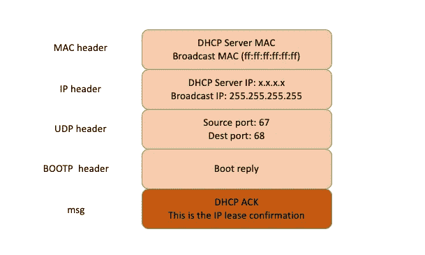

# Linux — DHCP 深度剖析

> 原文：<https://blog.devgenius.io/linux-dhcp-deep-dive-cee543061272?source=collection_archive---------5----------------------->

## 高级 DHCP 知识


在我的上一篇文章中，我介绍了一些 IP 的基本概念。如果我们需要和其他机器通信，我们需要一个通信地址，我们需要为网卡配置这样一个地址。

# 如何配置 IP 地址

如果有相关的知识和积累，可以使用命令行自己配置一个 IP 地址。可以用`ifconfig`或者`ip addr`。设置完成后，使用这两个命令打开网卡，开始工作。

**使用网络工具:**

```
$ sudo ifconfig eth0 10.0.0.1/24
$ sudo ifconfig eth0 up
```

**使用 iproute2:**

```
$ sudo ip addr add 10.0.0.1/24 dev eth0
$ sudo ip link set up eth0
```

你可能会问，我可以配置任何东西吗？如果我配置了一个不与任何人关联的地址，该怎么办？比如旁边的机器都是`192.168.1.x`，我把我的机器配置到了`16.158.24.6`地址，会发生什么？

你当然可以那样做，但是包裹不能寄出去。为什么发不出去？假设`192.168.1.6`就在我的机器旁边，甚至在同一个开关上，你把机器的地址设置为`16.158.24.6`。在这台机器上，你试着 ping `192.168.1.6`。你以为只要把包发出去，同一台交换机上的另一台机器就能马上收到，对吧？

但是 Linux 系统不是这样的，它没有你想象的那么聪明。你肉眼可以看到机器就在旁边，它需要按照自己的逻辑进行处理。

只要网络上运行的包是完整的，没有上层可以有下层，没有下层绝对不可能有上层。

于是，你看到它有了自己的源 IP 地址`16.158.24.6`和目的 IP 地址`192.168.1.6`，但是由于 MAC 层还没有填满，这个包无法发出去。

知道自己的 MAC 地址很容易。但是在目标 MAC 中使用什么呢？你使用机器`192.168.1.6`的 MAC 地址吗？

当然不是。Linux 会先判断，这个地址是和我在同一个网段，还是和我的一个网卡在同一个网段？它将发送一个 ARP 请求来获取 MAC 地址。但是如果找不到会怎么样呢？

> **Linux 的默认逻辑是，如果这是跨网段调用，它不会直接将数据包发送到网络，而是尝试将数据包发送到网关。**

如果你配置了一个网关，Linux 将获得网关的 MAC 地址，并将数据包发送出去。对于机器`192.168.1.6`，虽然通过了包的目标 IP，但可惜 MAC 地址不是，所以它的网卡不会接受包。

如果没有配置网关怎么办？包裹根本无法寄出。那么，如果网关配置为 192.168.1.6 呢？不可能，Linux 不会让你配置成功的，因为**网关至少有一个网卡**必须和当前网络在同一个网段，怎么可能`16.158.24.6`的网关是`192.168.1.6`？

因此，当您需要手动配置机器的网络 IP 时，请务必咨询您的网络管理员。

# 动态主机配置协议(DHCP)

原来配置 IP 的方法这么多。你可能会问，IP 配置好了之后，就不能改了。这对于配置服务器端机器是可以的，但是如果是客户端机器呢？幸运的是，有一个自动配置协议，即:动态主机配置协议(DHCP)可用于客户端机器 IP 地址配置。

有了这个协议，网络管理员只需要配置一个共享的 IP 地址。每台新连接的机器通过 DHCP 协议申请这个共享 IP 地址，然后自动配置。当人们离开时，或者当他们用完时，归还它，以便其他机器也可以使用。

所以，如果是数据中心的服务器，IP 一旦配置好，基本上就不会变了，相当于买了房子自己装修。DHCP 相当于租房。不需要装修，都给你摆好了。你可以用一段时间，用完了就可以退租。

# DHCP 的工作原理

当一台机器加入一个新网络时，它必须能被其他机器发现。但是首先新机器除了自己的 MAC 地址之外什么都不知道。那么如何让自己被发现呢？它将首先执行“DHCP 发现”。

新机发送了一个 IP 地址为`0.0.0.0`目的 IP 地址为`255.255.255.255`的广播包。广播包封装 UDP，UDP 封装 BOOTP。其实 DHCP 是 BOOTP 的加强版，但是如果你去抓包，很可能你看到的名字还是 BOOTP 协议。

在这个广播包里，新人在喊:我是新来的(开机请求)，我的 MAC 地址是这个，我还没有 IP，谁能给我租个 IP 地址！

数据包格式如下所示:


DHCP 服务器立即知道新机器已经来了。此时，我们可以体会到 MAC 地址的独特重要性。当一台机器用它自己的 MAC 地址加入网络时，MAC 是它唯一的身份。如果这是重复的，就没有办法配置它。

只有 MAC 是唯一的，DHCP 服务器才能知道这是一个新人，需要租借一个 IP 地址给它。这个过程称为 DHCP Offer。同时，DHCP 服务器为该客户端保留提供给它的 IP 地址，以便其他 DHCP 客户端不会被分配该 IP 地址。

DHCP 报价的格式如下所示:


DHCP 服务器仍然使用广播地址作为目的地址，因为请求 IP 分配的新用户还没有自己的 IP 地址。DHCP 服务器回复一个 IP，除此之外，服务器还发送诸如子网掩码、网关和 IP 地址租期等信息。

如果有多台 DHCP 服务器，新机器将选择其中一台 DHCP 服务器(通常是最先到达的服务器),并向网络发送一个 DHCP 请求广播数据包，其中包含客户端的 MAC 地址、接受租约中的 IP 地址以及提供租约的 DHCP 服务器。然后告诉所有 DHCP 服务器它将接受哪个 IP 地址，并告诉其他 DHCP 服务器撤销其他提供的 IP 地址。


此时，由于没有得到 DHCP 服务器的最终确认，客户端仍然使用`0.0.0.0`作为源 IP 地址，使用`255.255.255.255`作为目的地址进行广播。在 BOOTP 中，接受 DHCP 服务器分配的 IP。

当 DHCP 服务器收到客户端的 DHCP 请求时，会广播并返回一个 DHCP ACK 消息给客户端，表示客户端的选择已被接受，并将 IP 地址的合法租用信息和其他配置信息放入广播包中。



# IP 地址恢复和更新

当 50%的租用期过去后，客户端将直接向 DHCP 服务器发送 DHCP 请求消息包，DHCP 服务器为其提供 IP 地址。

当客户端收到服务器响应的 DHCP ACK 消息包时，它将根据包中提供的新租约和其他更新的 TCP/IP 参数更新其配置。这样，IP 租用更新就完成了。

# 结论

*   DHCP 协议主要用于向客户出租 IP 地址。和房产中介很像。要谈判，要签约，要续租，播出不能“抢单”；
*   DHCP 协议可以向客户推荐“改造小组”PXE，并且可以安装操作系统，这在云计算领域非常有用。