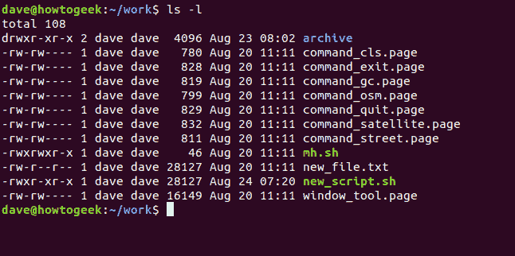
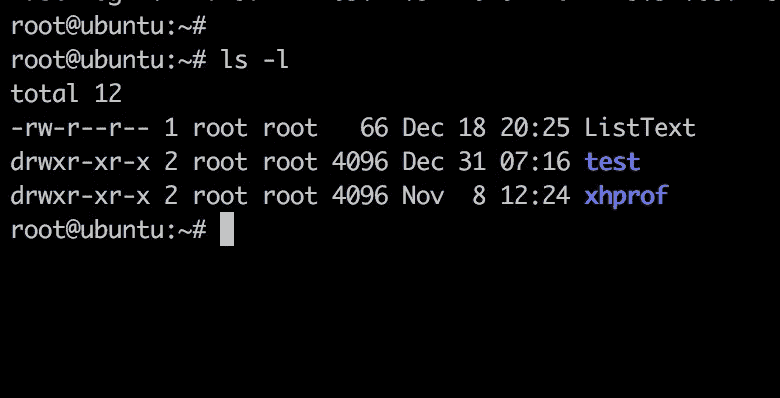

# 傻瓜版的 Linux🐧

> 原文：<https://blog.devgenius.io/linux-for-dummies-f24ecd6c5b61?source=collection_archive---------4----------------------->

所以你可能听说过 Linux 有多酷，人们在使用它，关于我的操作系统比你的好的永恒的争论等等等等等等🥱，你想尝试一下，你想亲眼看看 Linux 有什么宣传，并对它进行修补，你来对了博客……希望如此😄

**首先，为什么选择 LINUX？我为什么要用它？**

好吧，这 100%是我自己的观点，但我希望我的大多数企鹅伙伴们会认同其中的一些观点

1.  Linux 是免费的:不像 Windows，毫无疑问，Windows 是最主要的桌面操作系统，Linux 是一个免费的操作系统，只要选择一种口味并下载它
2.  Linux 是如此“可破解”:因为 Linux 是一个开源软件，你可以定制它的每一个方面**，无论你是想创建自己的桌面小工具，还是真的将代码注入内核并运行它，使用 Linux 一切皆有可能，在你和你深爱的 Linux ♥️之间没有障碍，你甚至可以创建自己的 Linux 并在网上发布！**
3.  **安全性:不要误解我的意思，在 Linux 上发现了一些记录在案的漏洞，但是你甚至在 Linux 上找不到一个杀毒软件…..由于 Linux 上的特权概念，这是可能的，所以简单地说，有一个 root 帐户可以比普通用户帐户做更多的特权操作**

**4.开箱即用的神奇工具:诸如 curl、wget 之类的命令行工具让您的生活变得更加轻松，尤其是如果您像我一样一直生活在终端中，并且喜欢您可爱的小 bash 脚本**

**5.帐户概念:如上所述，Linux 有一个非常重要的概念，这个概念得到了极大的强调，对于组织和限制对系统的访问非常有用**

**6.开发人员友好:Linux 的灵活性和可用性使得它对开发人员非常友好，因为一切都很容易设置，你想开始用 c++开发吗？只需安装`g++`编译器，你就可以开始了，也许想开始使用 Rust？刚装了`rustup`，只是想根据自己的需求写自己的脚本或者炫耀？Bash 脚本是您最好的朋友、妻子和情人**

**其他原因主要围绕透明度和灵活性，但我愿意分享我自己让我坚持下去的原因**

****如何获得 LINUX？****

**说到 Linux，我真的不能提供一个“免费下载 Linux”的链接，但是社区已经开发了超过 8000 种“口味”的 Linux 来满足各种需求，从生产级网络安全到军方使用的实际操作系统，只要做出你的选择，下载`.iso`文件，在 Windows 上启动 virtualbox 来在虚拟机上运行操作系统**

****应该买哪个 LINUX 发行版？****

**老实说，我会推荐 Ubuntu，因为它对用户非常友好，而且如果你来自 Windows 背景(你 99.99%是 Windows 背景)，它会很容易上手，直到你对“Linux 方式”的东西感到足够舒服，你可以得到另一个发行版/版本**

****基本 LINUX 命令****

**好了，现在开始真正的交易，我们将学习一些每个普通用户都会使用的 Linux 命令，所以让我们学习它们，最重要的是**练习它们****

*   **`echo` —打印到终端**

**这个命令打印任何东西和它之后的任何东西，就像您喜欢的编程语言中的任何其他打印函数一样**

**例子:`echo hello world`或者你可以加上双引号`echo "hello world"`**

*   **`pwd` —打印工作目录**

**顾名思义，这个命令会告诉您所在的目录**

**`- ls` —上市**

**现在你知道你在哪里了，你可能还想知道你当前的位置有哪些文件或目录，为此我们使用了`ls`命令，但是这个命令通常与“flags”一起使用以获得更好的结果，例如`ls -la`这个命令不仅会显示文件和目录，甚至会显示隐藏的文件和目录以及与它们相关联的权限，稍后会详细介绍**

*   **`cd` —更改目录**

**现在你想移动到你选择的目录中，所以你使用`cd`命令来这样做，简单地`cd`后面跟着目录名，例如`cd Downloads`将把我们移动到`Downloads`目录中**

*   **`mkdir` —制作目录**

**现在你可能想在你当前的位置或其他地方创建你自己的目录，简单地使用`mkdir`后跟目录名，瞧，✨，你有了一个新的目录，例如`mkdir exercises`**

**如果你在目录名前加一个点，比如`mkdir .secrets`，它会创建一个隐藏的目录，只有使用`ls -la`才可见，这很有帮助**

*   **`touch` —创建文件**

**要在当前目录下创建空文件，你需要的任何文件都可以使用它，后跟文件名，就像这样`touch index.js`然后用你喜欢的文本编辑器打开它**

*   **`rm` —删除文件或目录**

**现在你想从你的系统中删除一个文件，因为你不需要它或类似的东西，删除一个文件只需简单地用`rm`加上文件名，如`rm index.js`，它就会被立即删除**

**现在要删除一个目录，我们不能像对待文件一样`rm`，相反，我们需要添加几个标志来表示我们想要递归地删除一个目录，它看起来像这样`rm -rf node_projects`，所以这个命令将删除这个目录及其内容**

*   **`chmod` —改变模式**

**真正的企鹅时间到了💩所以如果你查看目录的内容，你会发现左边有一些奇怪的字母**

****

**来源:如何极客**

**所以我们有一个`-`，后面跟着三个字母“块”，每个块也有三个字母，那么它们是什么呢？**

**第一个字符表示这是一个文件还是一个目录，因此`-`表示一个文件，字母`d`表示一个目录，如下图所示**

****

**来源:LinuxForDevices**

**现在我们来谈谈这三段字母**

1.  **第一部分是“用户”权限，这意味着创建文件/目录的人**
2.  **第二个是“组”权限，这意味着我们在系统上创建并添加到组中的用户帐户**
3.  **第三是“其他”权限**

**现在转到每个部分中的实际权限**

**`r`表示读取，能够读取或查看文件**

**`w`表示写入文件或编辑它**

**`x`表示执行文件，或者运行它**

**作为一个像我一样的普通 Linux 用户，你只关心那些不管谁能做什么的人，即不需要担心组是否能执行文件，所以现在当你看到`-rw-r--r--`时，这意味着我们可以**读**和**写**到那个**文件****

**因此`chmod`命令将这些权限更改为我们想要的权限，在大多数情况下，如果不是所有情况，您将需要`chmod 777`或`chmod +x`来使文件可执行，这样我们就可以像`./FILE`一样运行它**

**该命令在创建 shell 脚本时经常使用，并且您想要执行它们**

*   **`sudo` —作为根用户执行**

**在 Linux 中，你经常会遇到一个错误，上面写着“权限被拒绝”,这是因为 Linux 中的大多数命令都需要 ***根权限*** ,但是这到底是什么意思呢？正如我们前面提到的，这是 Linux 通过分配权限来加强安全性的方式，所以如果我们只是普通用户，`sudo`命令可以帮助我们以 root 用户身份运行命令**

**例如，`apt update`命令用于更新您的系统库以便下载软件包，它需要 root 来修改一些系统文件，因此运行`apt update`将导致错误`Permission denied`，所以我们使用`sudo apt update`，然后它会要求我们输入 root 密码，如果正确，它将运行该命令**

*   **`su` —切换用户**

**用于从普通用户切换到根用户，如果你很懒，不想每次都在大多数事情之前输入`sudo`和输入你的密码**

*   **`man` —手册页**

**现在，这是所有命令之王，每当你迷路了，不知道如何在你的 Linux 上使用任何命令时，只需运行`man`后跟命令名，例如`man sudo`**

**这应该足够让你开始玩你的 Linux 盒子了，如果你们喜欢我的博客♥️，我会给你们带来更多的 Linux 乐趣**