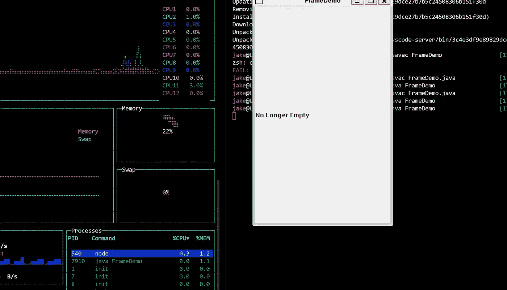

# Linux 图形用户界面应用程序支持—适用于 Linux 的 Windows 子系统

> 原文：<https://blog.devgenius.io/linux-gui-application-support-windows-subsystem-for-linux-55881e4594f3?source=collection_archive---------1----------------------->

WSL 2 中的 Linux GUI 应用程序，不需要 Windows X 服务器

[Sai Kiran Anagani](https://unsplash.com/@_imkiran?utm_source=medium&utm_medium=referral) 在 [Unsplash](https://unsplash.com?utm_source=medium&utm_medium=referral) 上的照片

我喜欢 Linux 的 Windows 子系统(WSL)。WSL 允许我在 Windows 机器上学习和实验 Linux 环境，这对于我作为一名开发人员的长期成功是绝对关键的。有了 WSL，我也能够合理地保留我的 Windows 机器，虽然我已经完全喜欢在日常工作中使用 MacOS，但我非常高兴地得知，我可以把 Hyper，Oh-my-zsh，brew 等更多东西带到我的 Windows 机器上。

这并不意味着 WSL 没有它的陷阱，有许多重要的问题会赶走更多懂 Linux 的人，但是微软的团队在 WSL 上取得了很大的进步，并且将 Linux 环境引入了 Windows。迄今为止最重要的功能之一是最近发布的，这将 Linux GUI 应用程序支持带到了 WSL。

# 为什么支持 Linux 图形用户界面应用程序？

我主要在专业工作和个人项目中使用 JavaScript、reactor 和 Node，但在过去的几个月里，我也一直在努力将 Java 添加到我的技术堆栈中。几周前，我开始使用 Java 中的 GUI 程序，当在我的 WSL 环境中尝试一些代码时，我不断收到与 Java GUI 类特别相关的运行时错误。我很快发现，在 WSL(或者 WSL 2，如果使用 WSL，无论如何你都应该使用它)中不支持 GUI 应用程序。真倒霉。

再过几天，我可能会安装 Windows X Server 或类似的程序来支持我运行这些应用程序的需求，但从最新的 Windows Insider 版本开始，这就不再是必需的了！

# 设置并运行

为了能够在 WSL 中试验 GUI 程序，必须遵循几个步骤来获得适当的 windows 开发人员构建和随后的 WSL 更新。首先，您必须在您的机器上安装了 WSL，这里有一个非常好的[资源](https://docs.microsoft.com/en-us/windows/wsl/install-win10)用于该安装过程。

成功运行 WSL 后，您需要确保您已经[注册了](https://docs.microsoft.com/en-us/windows-insider/get-started)Windows Insider 计划，您需要选择加入该计划，并记住您将有权访问的版本是在测试和开发环境中。在撰写本文时，您需要加入“开发频道”来访问 Linux GUI 支持所需的构建，请记住，您可能会遇到这些构建的小错误和大错误。

一旦你获得了最新的开发版本 21364，你就可以运行“wsl--update ”,在下载和安装一段时间后，你就可以访问 WSL 中的 GUI 应用程序了。点击这个[链接](https://devblogs.microsoft.com/commandline/the-initial-preview-of-gui-app-support-is-now-available-for-the-windows-subsystem-for-linux-2/)可以获得更新工作的详细说明，以及当前开发版本中包含的其他特性。

一旦你设置好了，你就可以运行 Linux GUI 应用程序，而不需要连接其他程序，比如 Windows X Server 来获得支持，比如下图中我的深度 FrameDemo 应用程序。除了我的非常小的 Java 应用程序，你现在可以运行任何你想要的 Linux GUI 应用程序，看看这个[棒极了的](https://github.com/luong-komorebi/Awesome-Linux-Software) GitHub repo，它包含了一些真正有趣和有用的 Linux 应用程序，你现在可以在你的 Windows 机器上运行。

编码快乐！

运行在 WSL 2 上的简单 Java GUI 应用程序

# 关于 _ 我. txt

我是一名前端开发者@ Kayhan Space，专业是 JavaScript，Node 和 React，对学习 Java 和 Python 有很大兴趣。除了构建用户界面和客户体验，我还喜欢撰写关于技术和非技术概念、工具和技术的文章。此外，我还对社会科学、政治、历史、太空探索和户外活动着迷。

查看我的[作品集](https://jacob-garlick.com/)获取我的作品样本，或者在 [Twitter](https://twitter.com/garlick_jake) 上关注我，获取关于新文章的通知和偶尔发布的技术推文。