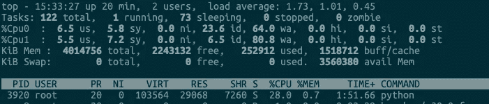
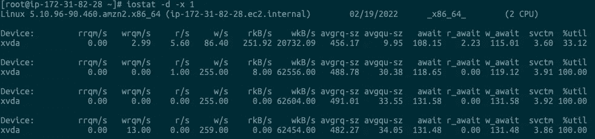
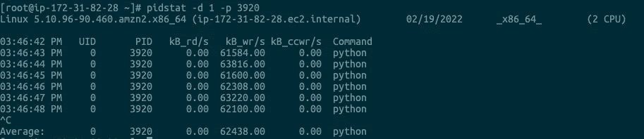

# Linux —高磁盘 I/O 故障排除

> 原文：<https://blog.devgenius.io/linux-high-disk-i-o-troubleshoot-368b98b4be1a?source=collection_archive---------8----------------------->

## 高级 Linux 磁盘 I/O 故障排除技能


在我以前的文章中，我谈到了“Linux —磁盘 I/O 性能”，让我们今天做一些练习，并从一个高磁盘 I/O 故障排除用例中获得乐趣。

# 案例准备

让我们在 Linux 主机上运行以下 docker 容器来模拟一些高磁盘 I/O 场景:

```
$ docker run --name=app -p 80:80 -itd tonylixu/word-pop
9bc4614419bc606064b3d35c5ba86be3fb55617dcd0e61791b4326f6df7c8c37$ docker ps
CONTAINER ID   IMAGE             COMMAND            CREATED         STATUS         PORTS                               NAMES
9bc4614419bc   feisky/word-pop   "python /app.py"   6 minutes ago   Up 6 minutes   0.0.0.0:80->80/tcp, :::80->80/tcp   app
```

一旦容器启动并运行，让我们使用`curl`命令访问 URL“http://127 . 0 . 0 . 1 ”:

```
$ curl [http://127.0.0.1](http://127.0.0.1)
hello world
```

我们可以看到案件正常开始。现在让我们查询一个特定的端点:

```
$ time curl [http://127.0.0.1/popularity/word](http://127.0.0.1/popularity/word)
{
  "popularity": 0.0,
  "word": "word"
}real 0m44.134s
user 0m0.000s
sys 0m0.008s
```

从上面的结果可以看出，it 工具`44`秒就把结果拿回来了！这是怎么回事？为什么查询需要这么长时间？

# 案例故障排除

您可能认为这与网络有关，但是在我们深入研究之前，让我们使用`top`命令来观察系统性能:



查看 top 的输出，可以看到两个 CPU 的 iowait 都很高。尤其是 CPU1，iowait 达到了 80%，还有 2.2GB 剩余内存，看起来足够了。

再往下看，process 节中 PID 为 3920 的 python 进程的 CPU 使用率略高，达到 28%。虽然 28%不是性能瓶颈，但是有点可疑——可能和`iowait`增加有关。

让我们执行一个`ps`命令:

```
$ ps aux | grep 3920
root      3920 13.1  0.7 103860 29232 pts/0    Sl+  15:14   2:46 /usr/local/bin/python /app.py
```

从 ps 的输出可以看出，这个 CPU 使用率很高的进程正是我们的案例应用。但是先不要急着分析 CPU 的问题，因为此时 CPU 使用率还没有达到临界高，已经达到 90%的`iowait`是我们的第一个解决方案。

接下来，让我们使用`iostat`命令继续我们的 I/O 分析:

*   `-d` : I/O 性能指示器
*   `-x`:显示扩展统计数据



从`iostat`的输出中，我们观察到`wKB/s`相当高，62MB/秒，磁盘`xvda`的 I/O 使用率为 100%。显然，我们正在经历 I/O 饱和。此外，发出的写请求的平均队列长度是 34.85，也是一个很高的数字。

所以现在的问题是，我们如何知道哪个进程导致了 I/O 问题？我们有一个 PID 为 3920 的可疑 Python 进程，但是我们如何确定 Python 进程是 I/O 杀手呢？

让我们使用`pidstat`来检查流程:



从上面的输出中，我们可以看到是 3920 Python 进程导致了 I/O 性能瓶颈。

至此，你大概觉得下一步很简单。我们可以只使用`strace`确认是否是写文件，然后使用`lsof`找到文件描述符对应的文件。然后我们修改代码并重新部署应用程序。

不错的主意，让我们试试:

```
$ strace -p 3920 2>&1 | grep write
...hangs
```

遗憾的是，没有与任何`write`系统调用相关的输出。此时，你可能会问，这是怎么回事？为什么根本没有`write`系统调用？如果没有`write`系统调用，这个进程 3920 怎么会导致 I/O 问题呢？这不奇怪吗？

对于文件写，应该有相应的写系统调用，但是用现有的工具找不到踪迹。这个时候就该考虑换工具的问题了。我怎么知道文件被写到哪里？

让我们使用`filetop`([https://github.com/iovisor/bcc/blob/master/tools/filetop.py](https://github.com/iovisor/bcc/blob/master/tools/filetop.py))，一个跟踪内核读写文件的新工具。您可以在我刚才提供的链接中找到安装说明。

安装完成后，让我们运行`filetop`

```
$ filetop -C
15:57:06 loadavg: 2.22 2.20 1.77 1/193 21777TID    COMM             READS  WRITES R_Kb    W_Kb    T FILE
21776  python           0      1      0       4882    R 594.txt
21776  python           0      1      0       4736    R 583.txt
21776  python           0      1      0       4589    R 582.txt
21776  python           0      1      0       4394    R 580.txt
21776  python           0      1      0       3857    R 576.txt
21776  python           0      1      0       3808    R 592.txt
21776  python           0      1      0       3271    R 579.txt
21776  python           0      1      0       2978    R 593.txt
21776  python           0      1      0       2929    R 575.txt
21776  python           0      1      0       2929    R 573.txt
21776  python           0      1      0       2880    R 577.txt
21776  python           0      1      0       2832    R 586.txt
21776  python           0      1      0       2587    R 574.txt
21776  python           0      1      0       2441    R 578.txt
21776  python           0      1      0       2441    R 587.txt
21776  python           0      1      0       2392    R 585.txt
21776  python           0      1      0       2343    R 590.txt
21776  python           0      1      0       2294    R 591.txt
21776  python           0      1      0       2246    R 572.txt
21776  python           0      1      0       2246    R 584.txt
....
```

你会看到`filetop`输出 8 列，分别是线程 ID、线程命令行、读写次数、读写大小(KB)、文件类型、读写文件名。

观察一段时间后，你会发现每隔一段时间，线程号为 21776 的 python 应用会先写大量的 txt 文件，然后大量读取。

线程号为 21776 的线程属于哪个进程？我们可以用`ps`命令来检查它:

```
$ ps -efT | grep 21776
root      3920 21776  3888 30 15:59 pts/0    00:00:07 /usr/local/bin/python /app.py
```

我们看到这个线程正是案例应用程序 3920 的线程。现在，我们如何知道它正在写哪个(哪些)文件呢？

我们可以使用`opensnoop`([https://github . com/io visor/bcc/blob/master/tools/open snoop . py](https://github.com/iovisor/bcc/blob/master/tools/opensnoop.py))命令:

```
PID    COMM               FD ERR PATH
3920   python              6   0 /tmp/2ec58410-919d-11ec-aa6a-0242ac110002/657.txt
3920   python              6   0 /tmp/2ec58410-919d-11ec-aa6a-0242ac110002/658.txt
3920   python              6   0 /tmp/2ec58410-919d-11ec-aa6a-0242ac110002/659.txt
3920   python              6   0 /tmp/2ec58410-919d-11ec-aa6a-0242ac110002/660.txt
3920   python              6   0 /tmp/2ec58410-919d-11ec-aa6a-0242ac110002/661.txt
3920   python              6   0 /tmp/2ec58410-919d-11ec-aa6a-
...
3920   python              6   0 /tmp/2ec58410-919d-11ec-aa6a-0242ac110002/667.txt
3920   python              6   0 /tmp/2ec58410-919d-11ec-aa6a-0242ac110002/668.txt
3920   python              6   0 /tmp/2ec58410-919d-11ec-aa6a-0242ac110002/669.txt
3920   python              6   0 /tmp/2ec58410-919d-11ec-aa6a-0242ac110002/670.txt
```

这次通过`opensnoop`的输出，我们基本可以判断 python 应用会动态生成一批文件来临时存储数据，用完了就删除，导致处理非常慢。

让我们检查一下`ppy.py`的内容:

```
$ docker cp 9bc4614419bc:app.py ./
$ cat app.y

[@app](http://twitter.com/app).route("/popularity/<word>") 
def word_popularity(word): 
  dir_path = '/tmp/{}'.format(uuid.uuid1()) 
  count = 0 
  sample_size = 1000 

  def save_to_file(file_name, content): 
    with open(file_name, 'w') as f: 
    f.write(content)try: 
    # initial directory firstly 
    os.mkdir(dir_path)# save article to files 
    for i in range(sample_size): 
        file_name = '{}/{}.txt'.format(dir_path, i) 
        article = generate_article() 
        save_to_file(file_name, article)# count word popularity 
    for root, dirs, files in os.walk(dir_path): 
        for file_name in files: 
            with open('{}/{}'.format(dir_path, file_name)) as f: 
                if validate(word, f.read()): 
                    count += 1 
    finally: 
        # clean files 
        shutil.rmtree(dir_path, ignore_errors=True)return jsonify({'popularity': count / sample_size * 100, 'word': word})
```

从源代码中可以看到，在这个案例应用中，每个请求的处理过程中，都会生成一批临时文件，然后读入内存进行处理，最后整个目录都会被删除。

# 结论

在本文中，我们解决了一个高 I/O 延迟的问题。首先，我们用`top`和`iostat`分析了系统的 CPU 和磁盘使用情况。我们发现了磁盘 I/O 瓶颈，也知道瓶颈是由案例应用程序引起的。

接下来，我们使用`strace`来观察系统调用，使用`filetop` + `opensnoop`命令来识别被写入的线程和文件。

我希望您喜欢这个故障排除用例。