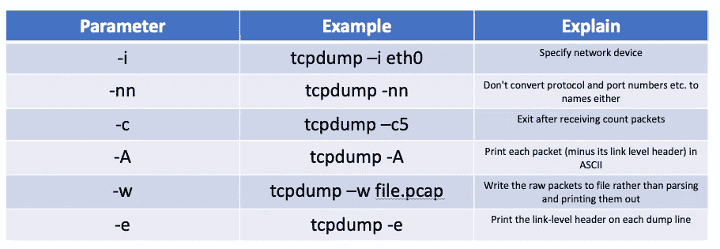
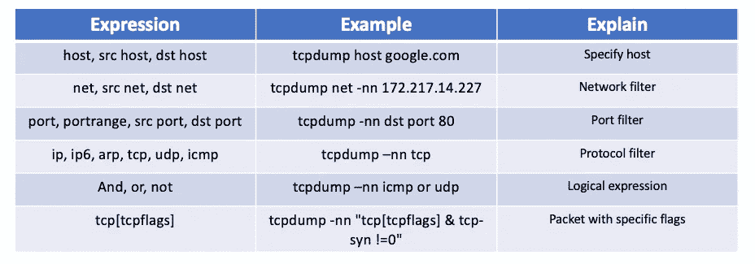
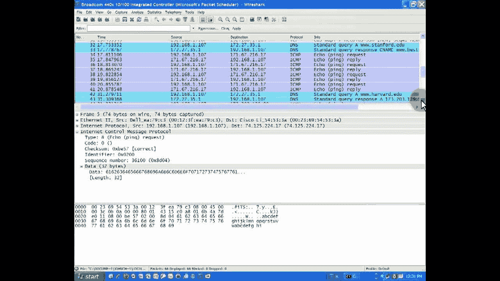
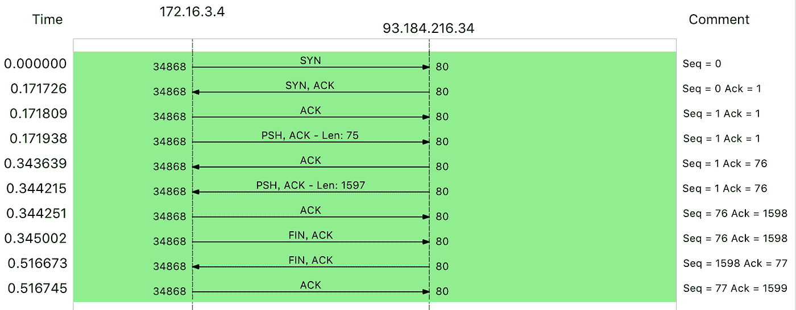

# Linux —如何分析网络性能

> 原文：<https://blog.devgenius.io/linux-how-to-analyze-network-performance-73ab4e1d207d?source=collection_archive---------5----------------------->

## 分析网络性能的有用工具

在我的上一篇文章——“[Linux——如何测量网络性能](/linux-how-to-measure-network-performance-c859a98abbf0)”中。我引入了`ping`、`ip`、`ss`和`sar`等工具来测量网络性能。使用这些工具/命令，您可以快速检查网络性能指标，如带宽、吞吐量和延迟。

但是这些工具都不适合网络数据包捕获和分析，因此即使您注意到网络性能有问题，也很难找到根本原因。

# tcpdump 和 wireshark

`tcpdump`和`wireshark`是最常用的网络数据包捕获和分析工具，也是分析网络性能不可或缺的工具。

*   `tcpdump`仅支持命令行格式，常用于在服务器中捕获和分析网络数据包。
*   除了捕获数据包，`wireshark`还提供了强大的图形界面和总结分析工具，在分析复杂的网络场景时特别简单实用。

所以在实际的网络性能分析中，先用`tcpdump`抓包，再用`wireshark`分析也是一种常用的方法。

由于`wireshark`的图形界面，它不能在 SSH 上使用，所以我建议你把它安装在本地机器上(比如 Windows)。你可以去[https://www.wireshark.org/](https://www.wireshark.org/)下载安装`wireshark`。

## 个案分析

让我们使用 ping 命令检查“google.com.hk”域并检查输出:

```
$ ping -c3 google.com.hk
PING google.com.hk (172.217.14.227) 56(84) bytes of data.
64 bytes from sea30s02-in-f3.1e100.net (172.217.14.227): icmp_seq=1 ttl=102 time=71.6 ms
64 bytes from sea30s02-in-f3.1e100.net (172.217.14.227): icmp_seq=2 ttl=102 time=72.4 ms
64 bytes from sea30s02-in-f3.1e100.net (172.217.14.227): icmp_seq=3 ttl=102 time=70.4 ms--- google.com.hk ping statistics ---
3 packets transmitted, 3 received, 0% packet loss, time **11003ms**
rtt min/avg/max/mdev = 70.466/71.497/72.420/0.830 ms
```

根据 ping 输出，可以发现 google.com.hk 解析的 IP 地址是 172.217.14.227，最后三次 ping 请求都是延迟(70ms 多一点的响应。

但是输出有意思的是:3 次发送，3 次接收，没有丢包，但是三次发送和接收的总时间超过 11s (11003ms)，有点奇怪。

让我们使用`tcpdump`来捕获`ping`命令包，看看发生了什么:

```
$ tcpdump -nn udp port 53 or host google.com.hk
tcpdump: verbose output suppressed, use -v or -vv for full protocol decode
listening on eth0, link-type EN10MB (Ethernet), capture size 262144 bytes
```

让我详细解释一下这个命令。

*   `-nn`，表示没有反域解析。
*   `udp port 53`，表示只显示 UDP 协议端口号(包括源端口和目的端口)为 53 的数据包。
*   `host google.com.hk`，表示只显示目的域名(包括源地址和目的地址)为 google.com.hk 的数据包。
*   这两个过滤条件中间的“或”代表的是或的关系，也就是说，只要满足以上两个条件中的任意一个，就可以显示出来。

现在让我们再来看一下 google.com.hk 的`ping`:

```
$ ping -c3 google.com.hk
PING google.com.hk (172.217.14.227) 56(84) bytes of data.
64 bytes from sea30s02-in-f3.1e100.net (172.217.14.227): icmp_seq=1 ttl=102 time=68.0 ms
64 bytes from sea30s02-in-f3.1e100.net (172.217.14.227): icmp_seq=2 ttl=102 time=67.6 ms
64 bytes from sea30s02-in-f3.1e100.net (172.217.14.227): icmp_seq=3 ttl=102 time=68.9 ms--- google.com.hk ping statistics ---
3 packets transmitted, 3 received, 0% packet loss, time 12001ms
rtt min/avg/max/mdev = 67.614/68.184/68.905/0.616 ms
```

现在`tcpdump`命令应该捕捉到以下内容:

```
...
1\. 23:19:54.915265 IP 172.31.82.28.50824 > 114.114.114.114.53: 50728+ A? google.com.hk. (31)
2\. 23:19:54.934391 IP 114.114.114.114.53 > 172.31.82.28.50824: 50728 1/0/0 A 172.217.14.227 (47)
3\. 23:19:54.934670 IP 172.31.82.28 > 172.217.14.227: ICMP echo request, id 19688, seq 1, length 64
4\. 23:19:55.002680 IP 172.217.14.227 > 172.31.82.28: ICMP echo reply, id 19688, seq 1, length 64
**5\. 23:19:55.003016 IP 172.31.82.28.33805 > 114.114.114.114.53: 1446+ PTR? 227.14.217.172.in-addr.arpa. (45)**
**6\. 23:20:00.022173 IP 114.114.114.114.53 > 172.31.82.28.33805: 1446 1/0/0 PTR sea30s02-in-f3.1e100.net. (83)**
**7\. 23:20:05.545101 IP 172.31.82.28 > 172.217.14.227: ICMP echo request, id 19688, seq 2, length 64**
8\. 23:20:05.551284 IP 172.217.14.227 > 172.31.82.28: ICMP echo reply, id 19688, seq 2, length 64
9\. 23:20:05.582363 IP 172.31.82.28 > 172.217.14.227: ICMP echo request, id 19688, seq 3, length 64
10\. 23:20:05.552506 IP 172.217.14.227 > 172.31.82.28: ICMP echo reply, id 19688, seq 3, length 64
```

让我解释一下上面的输出:

*   `50728+`表示查询 ID 值，它也出现在响应中，加号表示启用了递归查询。
*   `A?`表示查询一条记录。
*   `google.com.hk`表示要查询的域名
*   `31`表示数据包长度。
*   下一个是从 114.114.114.114 发回的 DNS 响应——域名 google.com.hk 的最高记录值。是 172.217.14.227。
*   第三和第四项是 ICMP 回应请求和 ICMP 回应回复。时间戳似乎不是问题。
*   但是接下来的两个反向地址解析 PTR 请求更可疑。因为我们只看到请求包，而没有响应包。如果你仔细看他们的时间，你会发现下一个网络包是在两条记录发出后 5s 才出现的，两条 PTR 记录差不多消耗了 10s。
*   再往下看，最后四个数据包是两个正常的 ICMP 请求和响应，它们看起来很正常。

至此，实际上我们已经找到了 ping 缓慢的根本原因，这是由于没有响应的两个 PTR 请求超时造成的。PTR 反向地址解析的目的是从 IP 地址中找出域名，但实际上并不是所有的 IP 地址都定义了 PTR 记录，所以 PTR 查询很可能会失败。

为了证明我们的概念，让我们禁止 PTR 使用`ping`命令，然后再试一次:

```
$ ping -n -c3 google.com.hk
PING google.com.hk (172.217.14.227) 56(84) bytes of data.
64 bytes from 172.217.14.227: icmp_seq=1 ttl=102 time=67.5 ms
64 bytes from 172.217.14.227: icmp_seq=2 ttl=102 time=67.5 ms
64 bytes from 172.217.14.227: icmp_seq=3 ttl=102 time=67.5 ms--- google.com.hk ping statistics ---
3 packets transmitted, 3 received, 0% packet loss, time 2003ms
rtt min/avg/max/mdev = 67.547/67.572/67.593/0.213 ms
```

`tcpdump`的新数据包捕获:

```
23:36:26.704748 IP 172.31.82.28.55912 > 114.114.114.114.53: 32013+ A? google.com.hk. (31)
23:36:26.725931 IP 114.114.114.114.53 > 172.31.82.28.55912: 32013 1/0/0 A 172.217.14.227 (47)
23:36:26.726153 IP 172.31.82.28 > 172.217.14.227: ICMP echo request, id 21735, seq 1, length 64
23:36:26.793678 IP 172.217.14.227 > 172.31.82.28: ICMP echo reply, id 21735, seq 1, length 64
23:36:27.727869 IP 172.31.82.28 > 172.217.14.227: ICMP echo request, id 21735, seq 2, length 64
23:36:27.795426 IP 172.217.14.227 > 172.31.82.28: ICMP echo reply, id 21735, seq 2, length 64
23:36:28.729637 IP 172.31.82.28 > 172.217.14.227: ICMP echo request, id 21735, seq 3, length 64
23:36:28.797177 IP 172.217.14.227 > 172.31.82.28: ICMP echo reply, id 21735, seq 3, length 6
```

你可以发现现在结束只需要 2s，比之前的 11s 快多了。

# tcpdump

对上述用例进行故障排除后，您现在知道了`tcpdump`是最常用的网络分析工具之一。它以`libpcap`为基础，使用内核中的`AF_PACKET` socket 来捕获网络接口中传输的网络数据包；并提供强大的过滤规则，帮助您从大量网络数据包中挑选出最重要的信息。

为了帮助您更快地开始使用 tcpdump，我在下面为您总结了一些最常见的用法:



常用的过滤器为`tcpdump`:



`tcpdump`虽然功能强大，但是输出格式不直观。尤其是当系统中的网络包数量比较大的时候(比如 PPS 超过几千)，从 tcpdump 捕获的网络包中分析问题并不容易。

# wireshark

Wireshark 也是最流行的网络分析工具之一，它最大的优点是提供了跨平台的图形界面。与`tcpdump`类似，`wireshark`也提供了强大的过滤规则表达式，以及一系列内置的汇总分析工具。

例如，以刚才的 ping 为例，您可以执行下面的命令将捕获的网络数据包保存到`ping.pcap`文件中:

```
$ tcpdump -nn udp port 53 or host google.com.hk -w ping.pcap
```

接下来，将其复制到安装了 wireshark 的机器上，并加载该文件，您应该会看到如下内容:



从`wireshark`的界面可以发现，它不仅以更规则的格式显示每个网络包的头信息；它还以不同的颜色显示了两种不同的协议:DNS 和 ICMP。您还可以一眼看出，中间的两个 PTR 查询没有响应包。

接下来，在网络包列表中选择一个网络包后，还可以在其下方的网络包详情中看到该包在协议栈各层的详细信息。例如，以编号为 5 的 PTR 数据包为例:


可以看到 IP 层(互联网协议)的源地址和目的地址，传输层的 UDP 协议(用户数据报协议)，应用层的 DNS 协议(域名系统)的大致信息。

如果从菜单栏中点击`Statistics`->-`Flow Graph`，然后在弹出的界面中选择流类型中的 TCP 流。您可以更清楚地看到 TCP 流在整个流程中的执行过程:



当然，使用`wireshark`的方式不止这些。更多使用方法也可以参考[官方文档](https://www.wireshark.org/docs/)。

# 结论

在本文中，我介绍了如何结合使用`tcpdump`和`wireshark`，并通过几个案例向大家展示了如何使用这两个工具来分析网络的发送和接收过程，找出潜在的性能问题。我希望你喜欢这次分享，并会在我的下一篇文章中看到你！