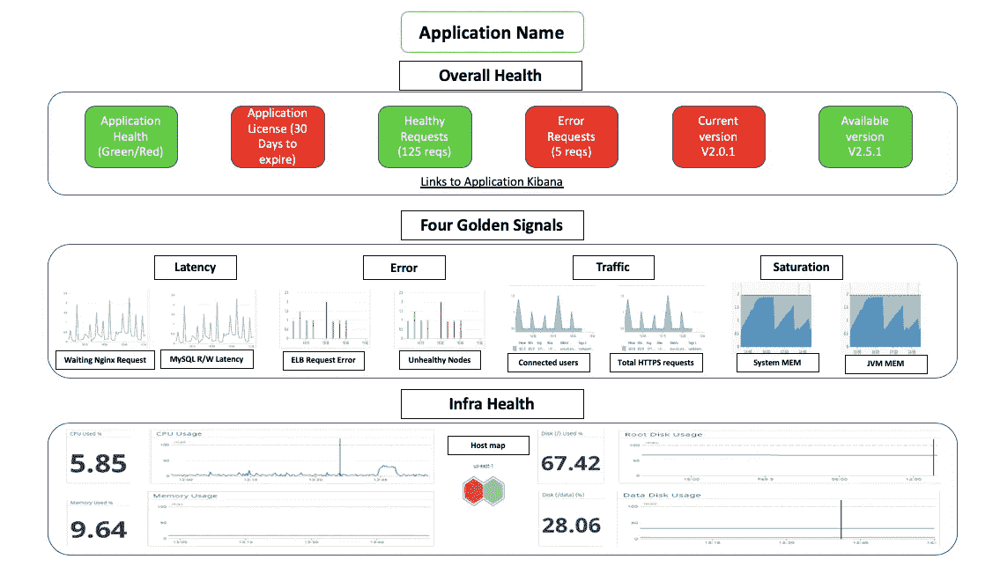

# Linux——如何评估网络性能？

> 原文：<https://blog.devgenius.io/linux-how-to-evaluate-network-performance-9c14ed6f64d9?source=collection_archive---------4----------------------->

## 评估系统网络性能的有用工具


在我以前的文章中，我们讨论了如何解决网络延迟和性能问题，以及经典的 C10K 和 C1000K 问题。重述一下，C10K 指的是单台主机如何同时处理 10000 个并发请求的问题，C1000K 指的是 1M 的并发请求。

# 介绍

I/O 模型的优化是解决 C10K 问题的最佳途径。Liux 2.6 中引入的`epoll`完美解决了 C10K，今天很多高性能网络解决方案仍然基于`epoll`。

从 C10K 到 C100K，一个解决方案是增加物理硬件资源满足要求，但是从 C100K 到 C1000K，增加物理资源是不够的。从硬件中断处理到网络协议栈中文件描述符的数量、连接状态跟踪、缓存队列，再到应用程序工作模式的整个网络链接，都需要优化系统的应用程序和硬件。

再进一步，C10M 呢？这不是增加硬件资源，调优内核和应用就能解决的问题。这时，冗长的网络协议栈就成了内核中最大的问题。

有两种方法可以解决这个问题:

*   使用 XDP 方法在内核协议栈之前处理网络数据包。
*   使用 DPDK，直接跳过网络协议栈，在用户空间轮询处理。

在上述两种方法中，DPDK 是最主流的高性能网络解决方案。不过网卡需要支持 DPDK。

当然，事实上，在大多数场景中，我们不需要在一台机器上有 1000 万个并发请求。通过调整系统架构，将请求分布到多个服务器进行并行处理，是一种更简单、可扩展性更强的解决方案。

但是，在这种情况下，我们需要评估系统的网络性能，以便检查系统的处理能力，并为容量规划提供基准数据。那么如何评价网络性能呢？

# 收集绩效指标

在我们谈论评估网络性能之前，我们必须收集用于测量系统网络性能的指标。如果您的应用程序运行在 AWS EC2/ECS/Lambda/EKS 上，现成的 AWS 在 AWS 云观察中有一些基本的监控指标。如果您的应用程序是容器化的，并且运行在 K8s 上，那么您可以利用 Grafana 和 Prometheus 来收集指标(更多的云原生)。否则还有第三方工具如 Datadog，new relic 等。

无论您使用什么方法/工具，拥有一个指标收集机制和仪表板来显示性能以及警报和通知是至关重要的。我附上了一个示例仪表板，我在下面的一些应用程序中使用它:



# 绩效指标审查

在 Linux 网络基础中，我们曾经说过带宽、吞吐量、延迟、PPS 等。是最常用的网络性能指标。重要网络指标的快速回顾:

*   **带宽**:链路的最大传输速率，以 b/s 为单位，购买网卡时，常用的带宽有 1G、10G、100G。
*   **吞吐量**:表示无丢包的最大数据传输速率，通常以 b/s 或 B/s 为单位，吞吐量受带宽限制，吞吐量/带宽是网络链路的利用率。
*   **延迟**:从发送网络请求到收到远程响应的时间延迟。它可以表示建立连接所需的时间(如 TCP 握手延迟)，或者数据包往返所需的时间(如 RTT)。
*   **PPS** :每秒数据包数，代表网络数据包的传输速率。PPS 通常用于评估网络的转发能力，而基于 Linux 服务器的转发很容易受到网络数据包大小的影响。

在上述四个指标中，带宽与物理网卡配置直接相关。对于 TCP 或 Web 服务，使用了更多的并发连接数、每秒请求数(QPS、每秒查询数)等指标，更能反映实际应用的性能。

# 标杆管理

在熟悉了网络的性能指标之后，我们来看看如何通过性能测试来确定这些指标的基准值。

Linux 组网基于 TCP/IP 协议栈，不同协议层的行为明显不同。所以在测试之前，你要搞清楚你要评估的网络性能属于协议栈的哪一层？换句话说，您的应用程序基于协议栈的哪一层？

总的来说:

*   基于 HTTP/HTTPS 的基于 Web 的应用程序显然属于应用层。
*   游戏服务器通常基于 TCP 或 UDP 与客户端进行交互。所以是在 TCP/UDP 层。
*   如果您的 Linux 服务器被用作软交换机或路由器，它将位于网络层。

## HTTP 性能

HTTP 是最常用的应用层协议。比如常用的 Apache、Nginx 等 Web 服务都是基于 HTTP 的。

测试 HTTP 的性能，也有大量的工具可以使用，比如`ab`、`webbench`等。，是常用的 HTTP 压力测试工具。其中，`ab`是 Apache 自带的 HTTP 压力测试工具，主要测试 HTTP 服务的每秒请求数、请求延迟、吞吐量、请求延迟分布等。

您可以通过运行以下命令来安装 ab 工具:

```
$ yum install -y httpd-tools
```

接下来，在目标机器上，使用 Docker 启动一个 Nginx 服务，然后使用`ab`测试其性能。首先，在目标计算机上运行以下命令:

```
$ docker run -p 80:80 -itd nginx
```

在另一台机器上，运行 ab 命令来测试 Nginx 的性能:

```
# -c means the number of concurrent requests is 1000, -n means the total number of requests is 10000
$ ab -c 1000 -n 10000 [http://192.168.0.30/](http://192.168.0.30/)
...
Server Software:        nginx/1.15.8
Server Hostname:        192.168.0.30
Server Port:            80...Requests per second:    1078.54 [#/sec] (mean)
Time per request:       927.183 [ms] (mean)
Time per request:       0.927 [ms] (mean, across all concurrent requests)
Transfer rate:          890.00 [Kbytes/sec] receivedConnection Times (ms)
              min  mean[+/-sd] median   max
Connect:        0   27 152.1      1    1038
Processing:     9  207 843.0     22    9242
Waiting:        8  207 843.0     22    9242
Total:         15  233 857.7     23    9268Percentage of the requests served within a certain time (ms)
  50%     23
  66%     24
  75%     24
  80%     26
  90%    274
  95%   1195
  98%   2335
  99%   4663
 100%   9268 (longest request)
```

在“请求摘要”部分，您可以看到:

*   每秒的请求数是 1074；
*   每个请求的延迟(每个请求的时间)分为两行。第一行的 927 ms 代表平均延迟，包括线程运行的调度时间和网络请求响应时间，下一行的 0.927 ms 代表实际请求响应时间；
*   传输速率意味着 890 KB/s 的吞吐量(BPS)
*   “连接时间摘要”部分显示了建立连接、请求、等待和摘要的各种时间，包括最小、最大、平均和中值处理时间。
*   最终请求延迟摘要部分给出了在不同时间段处理的请求的百分比，例如，90%的请求可以在 274 毫秒内完成。

## TCP/UDP 性能

`iperf`和`netperf`都是测试 TCP 和 UDP 吞吐量最常用的网络性能测试工具。它们都测量客户机和服务器通信时一段时间内的平均吞吐量。

我们将以`iperf`为例。要安装:

```
$ yum install iperf3
```

然后，在目标计算机上启动 iperf 服务器:

```
# -s means start the server, -i means reporting interval, -p means listening port
$ iperf3 -s -i 1 -p 10000
```

接下来，在另一台机器上运行 iperf 客户端来运行测试:

```
# -c means to start the client, 192.168.0.30 is the IP of the target server
# -b indicates the target bandwidth (unit is bits/s)
# -t means test time
# -P indicates the number of concurrency, -p indicates the target server listening port
$ iperf3 -c 192.168.0.30 -b 1G -t 15 -P 2 -p 10000
```

过一会儿(15 秒)测试结束，回到目标服务器并检查`iperf`报告:

```
[ ID] Interval           Transfer     Bandwidth
...
[SUM]   0.00-15.04  sec  0.00 Bytes  0.00 bits/sec                  sender
[SUM]   0.00-15.04  sec  1.51 GBytes   860 Mbits/sec                  receiver
```

最后的 SUM 行是测试的汇总结果，包括测试时间、数据传输量和带宽。根据发送和接收，这部分分为发送方和接收方两条线。

从测试结果可以看到，这台机器的 TCP 接收带宽(吞吐量)为 860 Mb/s，距离目标的 1Gb/s 还是有点远。

## 转发性能

我们先来看网络接口层和网络层，它们主要负责网络数据包的封装、寻址、路由、发送和接收。

在这一层中，PPS 是最重要的性能指标。要测试网络层，我们可以使用“ [pktgen](https://wiki.linuxfoundation.org/networking/pktgen) ”。`pktgen`自带 Linux 内核，支持丰富的定制选项。

由于`pktgen`作为内核线程运行，您无法直接找到该命令。你需要加载`pktgen`内核模块，然后与/proc 文件系统交互。例如:

```
$ modprobe pktgen
$ ps -ef | grep pktgen | grep -v grep
root     26384     2  0 06:17 ?        00:00:00 [kpktgend_0]
root     26385     2  0 06:17 ?        00:00:00 [kpktgend_1]
$ ls /proc/net/pktgen/
kpktgend_0  kpktgend_1  pgctrl
```

`pktgen`在每个 CPU 上启动一个内核线程，可以通过`/proc/net/pktgen`下的同名文件与这些线程进行交互；而`pgctrl`主要用来控制这个测试的开始和停止。

假设发送机器使用的网卡是`eth0`，目标机器的 IP 地址是`192.168.0.30`，MAC 地址是`11:11:11:11:11:11`。

```
# Define pgset function
function pgset() {
    local result
    echo $1 > $PGDEVresult=`cat $PGDEV | fgrep "Result: OK:"`
    if [ "$result" = "" ]; then
         cat $PGDEV | fgrep Result:
    fi
}# Bind the eth0 network card for thread 0
PGDEV=/proc/net/pktgen/kpktgend_0
pgset "rem_device_all"   # Clear network card binding
pgset "add_device eth0"  # Add eth0 network card# Configure the test options for the eth0 NIC
PGDEV=/proc/net/pktgen/eth0
pgset "count 1000000"    # Total number of packets sent
pgset "delay 5000"       # Send delay between packets (nanoseconds)
pgset "clone_skb 0"      # SKB package copy
pgset "pkt_size 64"      # Network packet size
pgset "dst 192.168.0.30" # destination IP
pgset "dst_mac 11:11:11:11:11:11"  # MAC address# Start test
PGDEV=/proc/net/pktgen/pgctrl
pgset "start"
```

过一会儿，测试完成了，结果可以从/proc 文件系统中获得。通过下面代码片段中的内容，我们可以查看刚才的测试报告:

```
$ cat /proc/net/pktgen/eth0
Params: count 1000000  min_pkt_size: 64  max_pkt_size: 64
     frags: 0  delay: 0  clone_skb: 0  ifname: eth0
     flows: 0 flowlen: 0
...
Current:
     pkts-sofar: 1000000  errors: 0
     started: 1534853256071us  stopped: 1534861576098us idle: 70673us
...
Result: OK: 8320027(c8249354+d70673) usec, 1000000 (64byte,0frags)
  120191pps 61Mb/sec (61537792bps) errors: 0
```

如你所见，测试报告主要分为三个部分:

*   第一部分中的参数是测试选项；
*   第二部分的电流是测试进度，其中，`pkts-sofar`表示已经发送了 100 万个包，表示测试已经完成。
*   结果包括测试花费的时间、网络数据包和碎片数量、PPS、吞吐量和错误数量。

从上面的结果中，我们发现 PPS 是 120，000，吞吐量是 61 Mb/s，并且没有出现错误。

# 结论

在本文中，我们讨论了可以用来评估网络性能的不同工具。

性能评估是优化网络性能的前提。只有当你发现网络性能瓶颈时，才需要进行网络性能优化。根据 TCP/IP 协议栈的原理，不同协议层的性能侧重点不完全相同，对应不同的性能测试方法。

因为低层协议是高层协议的基础。所以一般来说，我们需要自上而下的测试各个协议层的性能，然后根据性能测试的结果，结合 Linux 网络协议栈的原理，找到性能瓶颈的根源，进而优化网络性能。