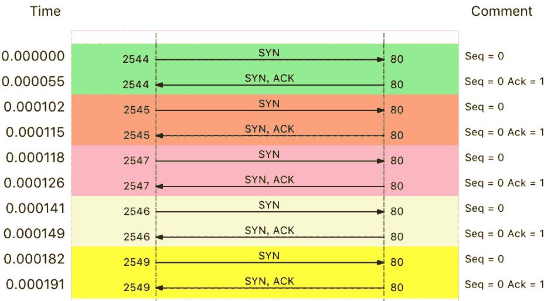
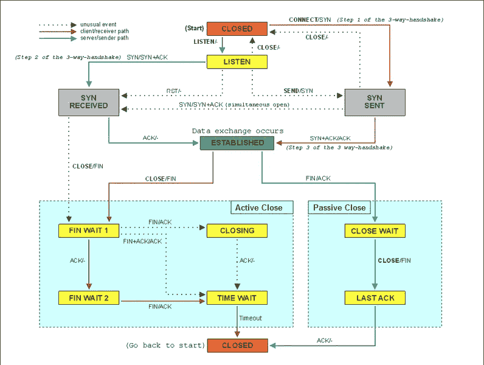

# Linux——如何模拟和缓解 DDoS 攻击

> 原文：<https://blog.devgenius.io/linux-how-to-simulate-and-mitigate-ddos-attacks-62a3cb2f5978?source=collection_archive---------3----------------------->

减轻 DDoS 攻击的有用提示


在我的上一篇文章:“ [Linux —如何分析网络性能](/linux-how-to-analyze-network-performance-73ab4e1d207d)”中，我谈到了如何使用`tcpdump`和`wireshark`，并带您看了几个用例。今天我们来看另一个常见问题，如何缓解 DDoS(分布式拒绝服务)造成的性能下降。

# 什么是 DDoS

DDoS 的前身是 DoS(拒绝服务)，即拒绝服务攻击，是指利用大量合理请求占用过多目标资源，使目标服务无法响应正常请求。

DDoS(分布式拒绝服务)采用基于 DoS 的分布式架构，使用多台主机同时攻击目标主机。这样，即使目标服务部署了网络防御设备，仍然无法应对大量的网络请求。

从攻击原理来说，DDoS 可以分为以下几种。

*   “带宽用完”:无论是服务器还是路由器、交换机等网络设备，带宽都有固定的上限。当带宽耗尽时，出现网络拥塞，其他正常的网络数据包无法传输。
*   “耗尽 OS 资源”:网络服务的正常运行需要一定的系统资源，如 CPU、内存等物理资源，以及连接表等软件资源。一旦资源耗尽，系统就无法处理其他正常的网络连接。
*   “耗尽应用资源”:应用的运行通常还需要与其他资源或系统进行交互。如果应用程序一直忙于处理无效请求，也会导致正常请求的处理速度变慢，甚至得不到响应。

无论什么类型的 DDoS，危害都是巨大的。那么，如何才能发现系统遭受了 DDoS 攻击，如何应对这样的攻击呢？让我向您介绍一个真实的使用案例。

# 案例准备

您需要遵循以下要求:

*   3 台 Linux 主机:应用程序、攻击者、客户端
*   预装`docker`、`sar`、`hping3`、`tcpdump`、`curl`。

## 应用服务器

让我们在应用程序主机上启动一个简单的`nginx`服务:

```
[root@app ~]# docker run -itd --name=nginx --network=host nginx
a8b3685d5eef0ffa2dead081b88d50d777db04bedbdb77ba886ca89b4bb690d2[root@app ~]# docker ps
CONTAINER ID   IMAGE     COMMAND                  CREATED          STATUS          PORTS     NAMES
a8b3685d5eef   nginx     "/docker-entrypoint.…"   24 seconds ago   Up 21 seconds             nginx
```

## 客户

然后，在客户端主机中，使用 curl 访问 Nginx 监听的端口，并确认 Nginx 正常启动:

```
[root@client ~]# curl -s -w 'Http code: %{http_code}\nTotal time:%{time_total}s\n' -o /dev/null [http://172.31.88.139](http://172.31.88.139)
Http code: 200
Total time:0.002437s
```

从这里可以看到，正常情况下，我们访问 Nginx 只需要 2ms (0.002s)。

## 攻击者

现在，让我们从主机攻击者处运行`hping3`命令来模拟 Dos 攻击:

```
# -S means set syn，-p means port 80
# -i u10 send a packet frame every 10 m-seconds
$ hping3 -S -p 80 -i u10 --flood 192.168.0.30
HPING 172.31.88.139 (eth0 172.31.88.139): S set, 40 headers + 0 data bytes
hping in flood mode, no replies will be shown
```

## 减轻

现在让我们回到主机客户端，再次尝试`curl`命令:

```
[root@client ~]# curl -s -w 'Http code: %{http_code}\nTotal time:%{time_total}s\n' -o /dev/null [http://172.31.88.139](http://172.31.88.139)
Http code: 000
Total time:10.001s
curl: (28) Connection timed out after 10000 milliseconds
```

这次普通客户端的连接超时，没有收到 Nginx 服务的响应。

这里发生了什么事？让我们返回到主机应用程序并检查网络状态:

```
[root@app ~]# sar -n DEV 1
08:55:49        IFACE   rxpck/s   txpck/s    rxkB/s    txkB/s   rxcmp/s   txcmp/s  rxmcst/s   %ifutil
08:55:50      docker0      0.00      0.00      0.00      0.00      0.00      0.00      0.00      0.00
08:55:50         eth0  22274.00    629.00   1174.64     37.78      0.00      0.00      0.00      0.02
08:55:50           lo      0.00      0.00      0.00      0.00      0.00      0.00      0.00      0.00
```

从这次`sar`的输出可以看到，网络收到的 PPS 达到了 2 万多个，但是 BPS 只有 1174 kB，所以每个包的大小只有 54B (1174*1024/22274=54)。

包大小不大，但这是什么包？让我们用`tcpdump`来捕捉:

```
[root@app ~]# tcpdump -i eth0 -n tcp port 80
09:15:48.287047 IP 172.31.82.28.27095 > 172.31.88.139: Flags [S], seq 1288268370, win 512, length 0
09:15:48.287050 IP 172.31.82.28.27131 > 172.31.88.139: Flags [S], seq 2084255254, win 512, length 0
09:15:48.287052 IP 172.31.82.28.27116 > 172.31.88.139: Flags [S], seq 677393791, win 512, length 0
09:15:48.287055 IP 172.31.82.28.27141 > 172.31.88.139: Flags [S], seq 1276451587, win 512, length 0
09:15:48.287068 IP 172.31.82.28.27154 > 172.31.88.139: Flags [S], seq 1851495339, win 512, length 0
...
```

在此输出中，Flags [S]表示这是一个 SYN 数据包。大量的 SYN 数据包表明这是一次 SYN Flood 攻击。如果我们用 wireshark 来观察，可以更直观地看到 SYN Flood 的过程:



其实 SYN Flood 是互联网上最经典的 DDoS 攻击。从上图也可以看出它的原理:

*   客户端构造大量 SYN 包，请求建立 TCP 连接；
*   服务器收到包后，会向源 IP 发送一个 SYN+ACK 包，等待三次握手的最后一个 ACK 包，直到超时。

这种等待状态的 TCP 连接通常也称为半开连接。由于连接表的大小有限，大量的半开连接会导致连接表很快填满，无法建立新的 TCP 连接。

参考下面的 TCP 状态图，可以看到此时服务器端的 TCP 连接将处于 SYN_RECEIVED 状态:



图片来自维基百科

我们可以使用`netstat`来查看所有连接的状态，但是注意 SYN_REVEIVED 的状态通常缩写为 SYN_RECV。

```
[root@app ~]# netstat -n -p | grep SYN_REC
tcp        0      0 172.31.88.139:80          172.31.82.28:12503      SYN_RECV    -
tcp        0      0 172.31.88.139:80          172.31.82.28:13502      SYN_RECV    -
tcp        0      0 172.31.88.139:80          172.31.82.28:15256      SYN_RECV    -
tcp        0      0 172.31.88.139:80          172.31.82.28:18117      SYN_RECV    -
...
```

从结果中可以发现大量 SYN_RECV 状态的连接，源 IP 地址为 172.31.82.28。让我们统计一下`SYN_RECV`状态下的连接数:

```
[root@app ~]# netstat -n -p | grep SYN_REC | wc -l
193
```

找出源 IP 后，要解决 SYN 攻击的问题，只需丢弃相关数据包即可。这时，`iptables`可以帮你完成这个任务:

```
[root@app ~]# iptables -I INPUT -s 172.31.82.28 -p tcp -j REJECT
```

注:塞尔班在评论中建议，在这种情况下，`DROP`比`REJECT`更好。

实现上述命令后，让我们再次尝试从客户端主机执行`curl`:

```
$ curl -w 'Http code: %{http_code}\nTotal time:%{time_total}s\n'-o /dev/null--connect-timeout 10 http://172.31.88.139
Http code: 200
Total time:1.572171s
```

但是，一般来说，SYN Flood 攻击中的源 IP 是不固定的。例如，您可以通过在`hping3`命令中添加`--rand-source`选项来随机化源 IP。但是，此时，刚才的方法并不适用。

幸运的是，我们有许多其他方法来实现类似的目标。例如，我们可以通过两种方式限制 syn 数据包的速率:

```
# Limit the number of syn concurrency to 1 per second
$ iptables -A INPUT -p tcp --syn -m limit --limit 1/s -j ACCEPT#Limit the number of newly established connections for a single IP in 60 seconds to 10
$ iptables -I INPUT -p tcp --dport 80 --syn -m recent --name SYN_FLOOD --update --seconds 60 --hitcount 10 -j REJECT
```

到目前为止，我们已经初步限制了 SYN Flood 攻击。但这还不够，因为我们的案例只是单一的攻击源。

如果多台机器同时发送 SYN Flood，这种方法可能直接无效。因为您可能无法通过 SSH 进入机器(SSH 也是基于 TCP 的)，更不用说执行上面所有的故障排除命令了。

## TCP 优化

为了减轻多机 SYN 泛滥，我们可以将半开连接容量从默认的 256 增加到 1024:

```
$ sysctl net.ipv4.tcp_max_syn_backlog
net.ipv4.tcp_max_syn_backlog = 256$ sysctl -w net.ipv4.tcp_max_syn_backlog=1024net.ipv4.tcp_max_syn_backlog = 1024
```

另外，连接每个 SYN_RECV 时，如果失败，内核会自动重试，默认重试次数为 5 次。您可以通过执行以下命令将其减少到 1 倍:

```
$ sysctl -w net.ipv4.tcp_synack_retries=1
net.ipv4.tcp_synack_retries = 1
```

此外，TCP SYN Cookies 也是防御 SYN Flood 攻击的一种特殊方法。SYN Cookies 根据连接信息(包括源地址、源端口、目的地址、目的端口等)计算一个哈希值(SHA1)。)和加密种子(如系统启动时间)。这个哈希值称为 cookie。启用 SYN Cookies 后，不需要维持半开连接状态，也没有半开连接数的限制。

```
$ sysctl -w net.ipv4.tcp_syncookies=1
net.ipv4.tcp_syncookies = 1
```

请注意，上述`sysctl`命令修改的配置是临时的，重启后将会丢失。您可以将它们添加到`/etc/sysctl.conf`文件中，使其永久保存。例如:

```
$ cat /etc/sysctl.conf
net.ipv4.tcp_syncookies = 1
net.ipv4.tcp_synack_retries = 1
net.ipv4.tcp_max_syn_backlog = 1024$ sysctl -p
```

# 结论

今天，我讨论了分布式拒绝服务(DDoS)的缓解措施。DDoS 使用大量伪造的请求，使目标服务消耗大量资源来处理这些无效请求，进而无法正常响应正常用户请求。

由于 DDoS 分布广、流量大、难以跟踪等特点，目前没有办法完全防御 DDoS 带来的问题，只能减轻影响。