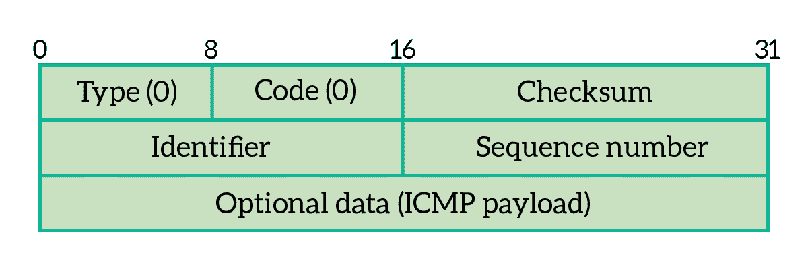
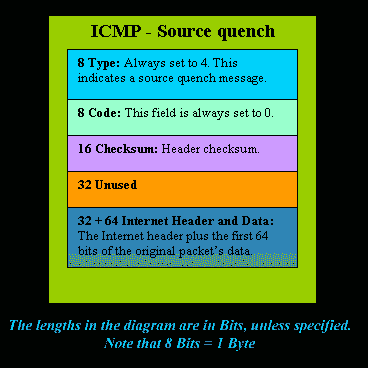
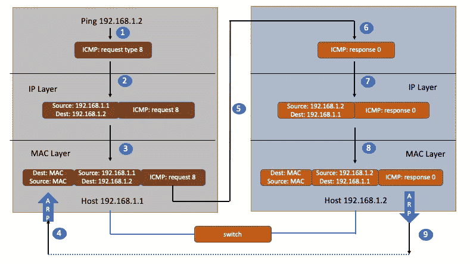

# Linux- ICMP 和 Ping

> 原文：<https://blog.devgenius.io/linux-icmp-and-ping-ab42cbca0f6c?source=collection_archive---------5----------------------->

## 高级 Linux 网络故障排除知识

无论是在办公室，还是在操作数据中心，我们经常会遇到网络问题。服务器显然已经启动并运行，您甚至可以通过机器的终端连接到它。然而，它就是不能从不同的服务器连接。会有什么问题呢？

# ICMP 协议

一般情况下，你会想到使用`ping`命令。但是你知道`ping`是怎么工作的吗？

`ping`是基于 ICMP 协议的。ICMP 代表**互联网控制消息协议**，这里的关键词是“**控制**”，那么具体是如何控制的呢？

当网络数据包在极其复杂的网络环境中传输时，经常会遇到各种各样的问题。遇到问题，不能总是“不知道是什么问题”，要发出信息，汇报情况，这样才能调整传播策略。

ICMP 数据包封装在 IP 数据包中。因为在传输一条指令的时候，源地址和目的地址是肯定需要的。格式如下所示:

图片来自[ictshore.com](https://www.ictshore.com/quick-and-easy/ping-icmp/)

*   **类型:**表示 ICMP 数据包的类型
*   **代码:**添加有关数据包用途的详细信息
*   **校验和**:表头校验和
*   *标识符、序列号和报头的其余部分:*这取决于类型和代码字段

ICMP 是一种直接封装到 IP 中的无状态协议，既不使用 TCP 也不使用 UDP。由于它的无状态特性，它的工作方式可以与 UDP 相比:没有会话建立，没有确认。ICMP 也不使用端口，所以你可以看出 ICMP 是一个网络层协议。

ICMP 数据包有很多种类型，不同的类型有不同的编码。最常见的类型是用于主动请求的 **8** 和用于主动请求响应的 **0** 。比如常用的`ping`是查询消息，是主动请求并获得主动响应的 ICMP 协议。

对`ping`的主动请求被称为 **ICMP 回应请求**。类似地，对主动请求的响应被称为 **ICMP 回应回复**。

# 错误消息类型

一些常见的 ICMP 错误消息包括:端点不可达为 3，源抑制为 4，超时为 11，重定向为 5。

## 端点不可达

对于不可达的错误消息，具体原因用代码表示:

*   网络不可达代码为 0
*   主机不可达代码为 1
*   协议不可达代码是 2
*   端口不可达代码是 3

**源淬火**

源抑制消息可以由网关或主机生成。你不会看到任何这样的消息在你的工作站屏幕上弹出，除非你在一个网关上工作，它会输出所有的 ICMP 消息到屏幕上。

简而言之，ICMP —源抑制是由网关或目的主机产生的，它告诉发送端放慢速度，因为它跟不上接收数据的速度。

图片来自 firewall.cx

## 超时

有时您可能会看到 ICMP 超时错误消息，例如:`Request timed out (ICMP error # 11010)`。该消息指示数据报的生存时间值已经达到零，但是数据报还没有到达最终目的地。当目标系统在分配的时间内没有收到 IP 数据报的所有片段时，也会发送此错误。

该错误消息有两个子类型:

*   代码 0:表示在运输过程中超过了生存时间
*   代码 1:表示碎片重组时间超过

## 再直接的

当路由器需要告诉发送方应该为特定目的地使用不同的路径时，会使用此错误消息。通常，当路由器知道到达目的地的较短路径时，就会发生这种情况。

该错误消息有四个子类型。从他们那里，两个已经贬值了。下面列出了所有子类型及其含义:

*   代码 0:重定向到目标网络(已弃用)
*   代码 1:重定向到目标主机
*   代码 2:根据服务类型重定向到目标网络(已弃用)
*   代码 3:根据服务类型重定向到目标主机

# 砰

现在让我们关注实际的`ping`命令。让我们先来看看数据包流:

假设主机 A 的 IP 地址是 192.168.1.1，主机 B 的 IP 地址是 192.168.1.2，两者在同一个子网。那么在主机 A 上运行“ping 192.168.1.2”会发生什么呢？

*   执行 ping 命令时，源主机会先构造一个 ICMP 请求包，ICMP 包包含多个字段。最重要的有两个，第一个是类型字段，对于请求包是 8；另一个是序列号，主要用来区分连续 ping 时发送的多个包。
*   每次发送一个请求包，序列号将自动增加 1。为了能够计算往返时间 RTT，它在消息的数据部分插入发送时间。
*   然后，ICMP 协议将此数据包连同地址 192.168.1.2 一起传送到 IP 层。IP 层将使用 192.168.1.2 作为目的地址，本地 IP 地址作为源地址，加上一些其它控制信息来构造 IP 数据包。
*   接下来，需要添加 MAC 报头。如果在本节的 ARP 映射表中找到 IP 地址 192.168.1.2 对应的 MAC 地址，可以直接使用；如果没有，需要发送 ARP 协议查询 MAC 地址。
*   获得 MAC 地址后，数据链路层会构建一个 MAC 地址。在数据帧中，目的地址是从 IP 层传过来的 MAC 地址，源地址是本地机器的 MAC 地址；还附加了一些控制信息，它们是根据以太网的介质访问规则发出的。
*   主机 B 收到数据帧后，首先检查其目的 MAC 地址，并将其与自己的 MAC 地址进行比较。如果匹配，就接收，否则丢弃。接收后，检查数据帧，从帧中提取 IP 数据包，交给机器的 IP 层。同样，在 IP 层检查之后，提取有用的信息并交给 ICMP 协议。
*   主机 B 会构造一个 ICMP 响应包，响应包的类型字段为 0，序列号为接收到的请求包中的序列号，然后发送给主机 a。

在规定的时间内，如果源主机没有收到 ICMP 响应包，说明目标主机不可达；如果它收到 ICMP 响应数据包，就意味着可以到达目标主机。此时，源主机将检查并从当前时间中减去源主机最初发送数据包的时间，即 ICMP 数据包的时间延迟。

当然，这只是同一个局域网中最简单的情况。如果是跨网段，还会涉及到网关转发、路由器转发等等。但是对于 ICMP 头，没有影响。