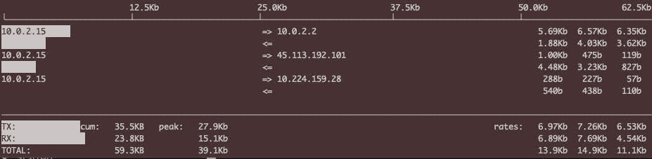

# Linux —每一层的网络故障排除

> 原文：<https://blog.devgenius.io/linux-network-troubleshooting-at-each-layer-1340eb14ebc2?source=collection_archive---------2----------------------->

## 网络的每一层都有哪些故障排除工具？


在我以前的文章中，我谈到了[为什么 Linux 网络是分层的](https://medium.com/geekculture/linux-why-network-is-layered-a29bf013eefa)。如果你读了这篇文章，你应该对网络为什么要分层，为什么要那样分层有一个相对清晰的认识。我还介绍了每一层的基本概念。

在本文中，让我们探讨一下每个网络层可用的故障排除工具。

# 第 7 层—应用层

应用层的故障排除工具太多了。我们选一个主应用展开，说说 HTTP 应用的故障排除工具。

现在的主流浏览器是谷歌的 **Chrome** ，它本身内置了开发者工具。在 Chrome 界面按`F12`，或者如果你是苹果系统，也可以按组合键`option + command + I`启动开发者工具。

其实其他浏览器也有类似的工具，比如 **Firefox** 和 **Edge** 。而且因为 **Edge** 是基于 Chromium 浏览器内核的，它的开发者工具和 **Chrome** 的非常相似。

在开发者工具的帮助下，我们可以非常方便地做很多事情，比如下面这些。

## 找到有问题的服务器 IP

比如有用户反映无法访问你的网站，但是你很清楚这个网站的域名对应了很多 IP 地址。怎么知道用户连接的是哪个 IP？

您可以这样做:让客户启用开发人员工具，在网络页面上找到主页对象，在其 Headers 部分，您可以看到远程地址，其中 IP 是当前连接的 IP，如下所示:


但是因为 DNS 解析的原因，下次重新连接的时候很可能 IP 就不一样了，所以每次都要重新确认这个信息。

这种技术在排除公共网络访问故障时特别有用。要知道，现在流量较高的网站都已经在 CDN 上上市了，全国乃至全球肯定有几十个或者上百个 CDN 终端节点，为访客提供就近的服务。

如果有人说他无法访问某个站点，那么请让他使用开发者工具找到他所连接的远程 IP，然后你就可以根据这些信息开始调查了。

## 协助解决慢速网页的问题

如果访问页面感觉很慢，可以使用开发者工具的时间统计功能，找到耗时较高的 HTTP 资源对象，然后进行针对性的调查。

比如我觉得访问[https://github.com](https://github.com)很慢，可以先打开开发者工具，然后访问站点，等所有加载完成后，再去网页查看这些 HTTP 对象的加载时间。


但这种方法只能检查哪个资源对象花费的时间更长，而对于进一步的调查，比如“为什么这个对象的加载时间比其他对象长”，开发者工具很难回答。

# 第 6、5 层—表示层和会话层

在上一节网络分层中，我提到表示层和会话层的协议不多，TLS 可以归为这两层。对于 TLS 问题的故障排除，我向您推荐两个工具。

首先是基于浏览器做初步检查，主要围绕证书本身。在浏览器的地址栏中，有一个按钮，点击它，可以查看 TLS 证书等信息:


在上面的菜单中，继续单击连接是安全的按钮，然后单击证书是有效的按钮来查看证书。

此外，使用开发人员工具的安全菜单，您还可以查看更详细的 TLS 信息，包括协议版本、密钥交换算法、证书有效期等。


二是用`tcpdump`和`Wireshark`检查 TLS 握手、密钥交换、密文传输等。在`Wireshark`中，可以更全面地查看 TLS 细节。

比如我们在 TLS 握手阶段可以直接看到双方在协商过程中显示的密码套件，而在开发者工具中，只能看到协商完成后的选项。


# 第 4 层—传输层

传输层无疑是重中之重，有很多工具。我们将根据故障排除场景介绍这些工具。

## 路径可达性测试

如果我们想测试 TCP 握手，我们有两个通用工具，`telnet`和`nc`。例如 telnet:

```
$ telnet google.com 443
Trying 142.250.80.46...
Connected to google.com.
Escape character is '^]'.
^]
telnet> q
Connection closed.
```

使用 nc，您可以这样做:

```
$ nc -w 2 -zv google.com 443
Connection to google.com port 443 [tcp/https] succeeded!
```

## 查看当前连接状态

`netstat`命令是一个经典的命令，很多同学会用它来获取 TCP、UDP 等的当前连接信息。，例如:

```
$ netstat -ant
Active Internet connections (servers and established)
Proto Recv-Q Send-Q Local Address           Foreign Address         State
tcp        0      0 127.0.0.53:53           0.0.0.0:*               LISTEN
tcp        0      0 0.0.0.0:22              0.0.0.0:*               LISTEN
tcp        0      0 0.0.0.0:80              0.0.0.0:*               LISTEN
tcp        0    280 10.0.2.15:22            10.0.2.2:56669          ESTABLISHED
tcp6       0      0 :::22                   :::*                    LISTEN
```

## 查看当前连接的传输速率

有时候，您的网络非常繁忙，但您不知道哪个连接占用的带宽最多？可以用`iftop`。这个工具是系统默认不自带的，你需要安装它，然后执行`iftop`。

对了，你需要有 sudo 权限，也就是执行`sudo iftop`，然后你就可以看到不同连接的传输速率，找到正在消耗你带宽的连接。例如以下内容:



## 查看数据包丢失和乱序的统计信息

其实用`netstat`除了可以获得实时的连接状态，还可以获得历史的统计信息。例如，如果您怀疑某台机器的网络不稳定，除了使用 ping 进行简单测试之外，您还可以使用`netstat -s`获得更详细的统计数据。

例如，TCP 数据包丢失和无序计数值可以帮助您确定传输层的状态。下面是我截获的一个`netstat -s`命令的输出:

```
$ netstat -s
......
Tcp:
    16 active connection openings
    1 passive connection openings
    8 failed connection attempts
    1 connection resets received
    1 connections established
    6254 segments received
    4035 segments sent out
    1 segments retransmitted
    0 bad segments received
    3 resets sent
......
TcpExt:
    1 ICMP packets dropped because socket was locked
    3 TCP sockets finished time wait in fast timer
    8 delayed acks sent
    4674 packet headers predicted
    10 acknowledgments not containing data payload received
    1008 predicted acknowledgments
    TCPTimeouts: 1
    TCPBacklogCoalesce: 140
    1 connections reset due to early user close
    TCPRcvCoalesce: 2187
    TCPAutoCorking: 110
    TCPSynRetrans: 1
    TCPOrigDataSent: 1041
    TCPDelivered: 1049
```

## 使用 ss

`ss`命令是`Iproute2`包中的命令，是`netstat`的“替代”。它提供了丰富的套接字统计数据。例如，我经常使用以下命令来查看当前连接的统计数据:

```
$ ss -s
Total: 164
TCP:   5 (estab 1, closed 0, orphaned 0, timewait 0)Transport Total     IP        IPv6
RAW    1         0         1
UDP    2         2         0
TCP    5         4         1
INET    8         6         2
FRAG    0         0         0
```

# 第 3 层—网络层

在这个级别，除了使用`ping`，这是一个非常简单的工具，您还应该掌握另外两个提供更强大的故障排除功能的命令，`traceroute`和`mtr`。

## 查看网络路径状态

下面是一个简单的`traceroute`输出的典型输出:

```
$ traceroute google.com
traceroute to google.com (142.250.80.46), 64 hops max, 52 byte packets
 1  g3100 (192.168.1.1)  2.324 ms  1.108 ms  0.978 ms
 2  * * *
 3  100.41.25.94 (100.41.25.94)  8.645 ms
    100.41.25.96 (100.41.25.96)  8.117 ms
    100.41.25.94 (100.41.25.94)  8.137 ms
 4  0.csi1.whplnywp-mse01-bb-su1.alter.net (140.222.3.212)  7.873 ms  11.703 ms  12.035 ms
 5  * * *
 6  * * *
 7  0.et-10-1-5.gw15.nyc1.alter.net (140.222.230.217)  6.660 ms  20.782 ms
    0.et-9-0-2.gw15.nyc1.alter.net (140.222.1.43)  10.109 ms
 8  &#10.20.148.204.in-addr.arpa (204.148.20.6)  6.696 ms
    72.14.208.130 (72.14.208.130)  7.677 ms  7.520 ms
 9  * 108.170.248.97 (108.170.248.97)  8.115 ms  6.994 ms
10  142.251.65.92 (142.251.65.92)  8.938 ms
    108.170.236.88 (108.170.236.88)  8.210 ms
    142.251.65.97 (142.251.65.97)  8.340 ms
11  108.170.248.20 (108.170.248.20)  7.115 ms
    108.170.248.84 (108.170.248.84)  8.103 ms
    142.251.65.97 (142.251.65.97)  8.934 ms
12  lga34s34-in-f14.1e100.net (142.250.80.46)  8.008 ms  8.151 ms  9.326 ms
```

默认情况下`traceroute`使用`UDP`作为检测协议，但是许多网络设备不响应 UDP，这就是为什么你有时会看到`*`。但是，`traceroute`也有一个明显的缺点:不能连续多次探测路径。

`mtr`除了具备`traceroute`的功能外，还可以实现丰富的检测报告。例如:

```
$ mtr [g](http://www.baidu.com)oogle.com -r -c 10
Start: 2022-01-07T04:05:02+0000
HOST: victorebpf                  Loss%   Snt   Last   Avg  Best  Wrst StDev
  1.|-- _gateway                   0.0%    10    0.3   0.4   0.2   1.2   0.3
  2.|-- 192.168.1.1                0.0%    10    1.6   1.8   1.4   3.2   0.5
  3.|-- 100.65.0.1                 0.0%    10    3.8   7.0   3.8  10.3   2.0
  4.|-- 61.152.54.125              0.0%    10    4.0   4.3   3.6   5.1   0.5
  5.|-- 61.152.25.110             30.0%    10    5.0   6.8   4.4  18.9   5.4
  6.|-- 202.97.101.30             20.0%    10    7.8   6.6   5.4   7.8   0.8
  7.|-- 58.213.95.110             80.0%    10   10.0   9.8   9.6  10.0   0.3
  8.|-- ???                       100.0    10    0.0   0.0   0.0   0.0   0.0
  9.|-- 58.213.96.74               0.0%    10   10.5  12.7   9.9  24.7   4.9
 10.|-- ???                       100.0    10    0.0   0.0   0.0   0.0   0.0
 11.|-- ???                       100.0    10    0.0   0.0   0.0   0.0   0.0
 12.|-- ???                       100.0    10    0.0   0.0   0.0   0.0   0.0
 13.|-- 180.101.49.12              0.0%    10    9.4   9.1   8.3   9.7   0.5
```

## 查看路由

命令 route 可以查看路由表，但该命令有点旧:

```
# route -n
Kernel IP routing table
Destination     Gateway         Genmask         Flags Metric Ref    Use Iface
0.0.0.0         10.0.2.2        0.0.0.0         UG    100    0        0 enp0s3
10.0.2.0        0.0.0.0         255.255.255.0   U     0      0        0 enp0s3
10.0.2.2        0.0.0.0         255.255.255.255 UH    100    0        0 enp0s3
172.17.0.0      0.0.0.0         255.255.0.0     U     0      0        0 docker0
```

或`ip`命令:

```
$ ip route
default via 10.0.2.2 dev enp0s3 proto dhcp src 10.0.2.15 metric 100
10.0.2.0/24 dev enp0s3 proto kernel scope link src 10.0.2.15
10.0.2.2 dev enp0s3 proto dhcp scope link src 10.0.2.15 metric 100
172.17.0.0/16 dev docker0 proto kernel scope link src 172.17.0.1 linkdown
```

# 第 2、1 层—数据链路层和物理层

这一层远离应用层，一般由专职网络团队负责。如果这一层有问题，就会直接反映到网络层的性能上。

比如 IP 会有丢包和延时，然后会引起传输层异常(比如丢包、乱序、重传等。).因此，稳定的数据链路层甚至物理层是网络可靠性的基石。

然而，如果你想检查这两层的状态，你可以使用工具`ethtool`。例如:

```
# ethtool -S enp0s3
NIC statistics:
     rx_packets: 45897
     tx_packets: 9457
     rx_bytes: 59125524
     tx_bytes: 834625
     rx_broadcast: 0
     tx_broadcast: 17
     rx_multicast: 0
     tx_multicast: 59
     rx_errors: 0
     tx_errors: 0
     tx_dropped: 0
```

它的原理是网卡驱动会在内核中注册`ethtool`回调函数，然后我们可以使用`ethtool`命令来查看这些信息。

由于信息是网卡驱动提供的，所以很“接地气”。如果在传输层和网络层故障排除工具上看到了清晰的链路不稳定信息，直接去找网络组处理。