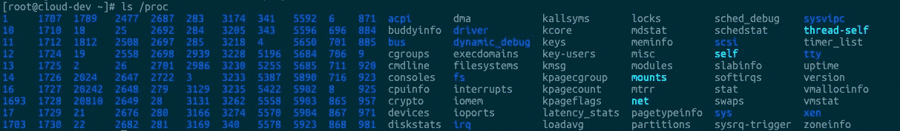
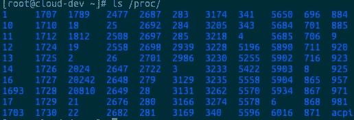
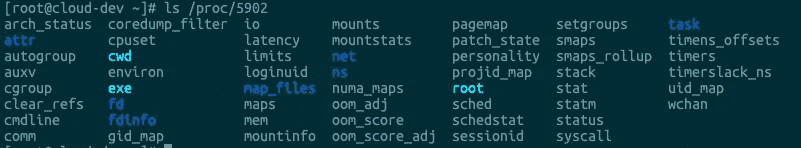

# Linux — /proc/pid 目录第一部分

> 原文：<https://blog.devgenius.io/linux-proc-directory-part-one-6a98dcf6363d?source=collection_archive---------0----------------------->

## 深入研究 Linux /proc/pid 目录


# 什么是过程

Linux 系统上的`/proc`目录也是一个文件系统，但与其他常见的文件系统如`/etc`、`/var`……`proc`不同的是，它是一个伪文件系统(即虚拟文件系统)，存储了一系列当前内核运行状态的特殊文件，通过这些文件，用户可以查看相关的系统硬件和当前正在运行的进程的信息，甚至可以通过改变其中的一些文件来改变内核的运行状态。

基于`/proc`文件系统的上述特殊性，其中的文件通常被称为**虚拟文件**，具有一些独特的特征。

例如，虽然其中一些文件在查看时会返回大量信息，但文件本身的大小显示为 0 字节。此外，这些特殊文件的时间和日期属性通常是当前系统时间和日期，这与它们随时被刷新(存储在 RAM 中)有关。

```
$ ls /proc
...
dr-xr-xr-x  4 root            root               0 Nov 13 22:13 bus
-r--r--r--  1 root            root               0 Nov 17 09:20 cgroups
-r--r--r--  1 root            root               0 Nov 17 09:20 cmdline
-r--r--r--  1 root            root               0 Nov 17 09:20 consoles
-r--r--r--  1 root            root               0 Nov 17 09:20 cpuinfo
-r--r--r--  1 root            root               0 Nov 17 09:20 crypto
-r--r--r--  1 root            root               0 Nov 17 09:20 devices
-r--r--r--  1 root            root               0 Nov 17 09:20 diskstats
-r--r--r--  1 root            root               0 Nov 17 09:20 dma
dr-xr-xr-x  2 root            root               0 Nov 17 09:20 driver
-r--r--r--  1 root            root               0 Nov 17 09:20 execdomains
-r--r--r--  1 root            root               0 Nov 17 09:20 fb
-r--r--r--  1 root            root               0 Nov 17 09:20 filesystems
dr-xr-xr-x  8 root            root               0 Nov 13 22:13 fs
-r--r--r--  1 root            root               0 Nov 17 09:20 interrupts
-r--r--r--  1 root            root               0 Nov 17 09:20 iomem
-r--r--r--  1 root            root               0 Nov 17 09:20 ioports
dr-xr-xr-x 25 root            root               0 Nov 13 22:13 irq
-r--r--r--  1 root            root               0 Nov 17 09:20 kallsyms
...
```

为了方便查看和使用，通常会将这些文件按照相关性分类存放在不同的目录甚至子目录中。例如，`/proc/scsi`目录存储了当前系统上所有 SCSI 设备的相关信息，`/proc/N`是系统当前运行进程的相关信息，其中 N 是运行进程 ID。



大多数虚拟文件可以使用文件查看命令查看，如`cat`、`more`或`less`。有些文件信息可以一目了然的表达出来，但有些文件信息可读性不是很强。然而，当使用一些命令如`free`、`lspci`或`top`查看时，这些可读性较差的文件可以有很好的性能。

# 进程中的 PID 目录

`/proc`目录包含许多以数字命名的子目录。这些数字表示系统中当前运行的进程的进程号，其中包含与相应进程相关的多个信息文件。



让我们来详细看看一个进程目录:



## /proc/ <pid>/arch_status</pid>

为给定的 Linux 进程公开特定于体系结构的信息的新接口。当*CONFIG _ PROC _ PID _ ARCH _ STATUS*启用时，将有这个新的 *arch_status* 文件来公开给定任务的任何额外的架构特定信息。

## /proc/ <pid>/attr</pid>

进程安全属性。

*   **exec** :表示分配给流程的属性，这是支持角色/域转换所需要的
*   **fscreate** :表示为后续调用创建的文件赋值的属性— mkdir — symlink
*   **keycreate** :如果/当一个进程将一个安全上下文写入这个文件时，所有先前的密钥都将被标记上这个上下文
*   **上一个**:显示上一个值/过程/[PID]/属性/当前
*   **sockcreate** :如果/当一个进程将安全上下文写入该文件时，所有先前创建的套接字将被标记上该上下文

## /proc/ <pid>/autogroup</pid>

流程的自动组(任务组)成员身份。例如:

```
$ cat autogroup
/autogroup-7430 nice 0
```

该文件也可用于修改分配给自动组的 CPU 带宽
。这是通过将“nice”
范围内的一个数字写入文件来设置自动组的 nice 值来实现的。

## /proc/ <pid>/auxv</pid>

意思是辅助向量。这包含了在执行时传递给进程的 ELF 解释器信息的内容。
这些值是操作系统作为启动信息传递给动态链接器的值。这些向量是向程序解释器(例如 ld)和进程传输一些操作系统特定信息的机制。

```
$ hexdump -Cv auxv
00000000  21 00 00 00 00 00 00 00  00 90 dd 50 fd 7f 00 00  |!..........P....|
00000010  10 00 00 00 00 00 00 00  ff fb 8b 17 00 00 00 00  |................|
00000020  06 00 00 00 00 00 00 00  00 10 00 00 00 00 00 00  |................|
00000030  11 00 00 00 00 00 00 00  64 00 00 00 00 00 00 00  |........d.......|
00000040  03 00 00 00 00 00 00 00  40 00 a0 3e 73 55 00 00  |........@..>sU..|
00000050  04 00 00 00 00 00 00 00  38 00 00 00 00 00 00 00  |........8.......|
00000060  05 00 00 00 00 00 00 00  09 00 00 00 00 00 00 00  |................|
00000070  07 00 00 00 00 00 00 00  00 b0 1e bf 60 7f 00 00  |............`...|
00000080  08 00 00 00 00 00 00 00  00 00 00 00 00 00 00 00  |................|
00000090  09 00 00 00 00 00 00 00  50 6d a0 3e 73 55 00 00  |........Pm.>sU..|
000000a0  0b 00 00 00 00 00 00 00  e9 03 00 00 00 00 00 00  |................|
000000b0  0c 00 00 00 00 00 00 00  00 00 00 00 00 00 00 00  |................|
000000c0  0d 00 00 00 00 00 00 00  e9 03 00 00 00 00 00 00  |................|
000000d0  0e 00 00 00 00 00 00 00  e9 03 00 00 00 00 00 00  |................|
000000e0  17 00 00 00 00 00 00 00  01 00 00 00 00 00 00 00  |................|
000000f0  19 00 00 00 00 00 00 00  e9 3a da 50 fd 7f 00 00  |.........:.P....|
00000100  1a 00 00 00 00 00 00 00  02 00 00 00 00 00 00 00  |................|
00000110  1f 00 00 00 00 00 00 00  ea 5f da 50 fd 7f 00 00  |........._.P....|
00000120  0f 00 00 00 00 00 00 00  f9 3a da 50 fd 7f 00 00  |.........:.P....|
00000130  00 00 00 00 00 00 00 00  00 00 00 00 00 00 00 00  |................|
00000140
```

## /proc/ <pid>/cgroup</pid>

给定进程所属的组。文件`cgroup`有零行或多行，格式为:

```
hierarchy_id:controller_list:cgroup_path
```

该文件重新格式化的内容示例如下:

```
$ cat cgroup
11:hugetlb:/
10:net_cls,net_prio:/
9:memory:/
8:devices:/
7:perf_event:/
6:blkio:/
5:freezer:/
4:cpu,cpuacct,cpuset:/daemons
3:cpuset:/
2:pids:/
1:name=systemd:/user.slice/user-1001.slice/session-2239.scope
```

以`4:cpu,cpuacct,cpuset:/daemons`为例，冒号分隔的字段从左到右依次为:

*   对于 cgroups 版本 1 层次结构，该字段包含一个唯一的层次结构 ID 号，可以与`/proc/cgroups`中的层次结构 ID 相匹配。对于 cgroups 版本 2 层次结构，该字段包含值 0。
*   对于 cgroups 版本 1 层次结构，该字段包含绑定到该层次结构的控制器的逗号分隔列表。对于 cgroups 版本 2 层次结构，此字段为空。
*   此字段包含流程所属的层次结构中的控制组的路径名。该路径名相对于层次结构的装载点。

## /proc/ <pid>/clear_refs</pid>

一个只写文件，只能由进程的所有者写，并且只有在**CONFIG _ PROC _ PAGE _ MONITOR**内核配置选项被启用时才存在。

## /proc/ <pid>/cmdline</pid>

完成命令来启动当前进程，但是僵尸进程目录中的这个文件不包含任何信息。例如，流程`sshd` cmdline 看起来像这样:

```
$ cat cmdline
/usr/sbin/sshd-D
```

## /proc/ <pid>/comm</pid>

该文件公开了进程的 comm 值，即与进程相关联的命令名。同一进程中的不同线程可能具有不同的`comm`值。仍然用`sshd`过程作为例子，它的`comm`值看起来像:

```
$ cat comm
sshd
```