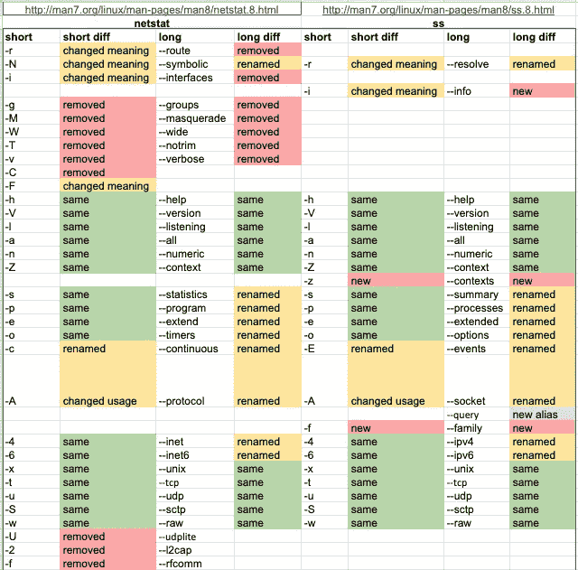

# Linux — ss 命令

> 原文：<https://blog.devgenius.io/linux-ss-command-5b510c1bf58e?source=collection_archive---------4----------------------->

## 为什么你应该开始学习党卫军命令


# ss 简介

`ss` commands 代表 socket statistics，是一个用来调查网络套接字的工具。`ss`包含在`iproute2`包中，是`netstat`命令的替代品。

`ss`命令行实用程序可以显示数据包、TCP、UDP、DCCP、原始和 Unix 域套接字的统计数据。使用`ss`，您可以获得关于您的 Linux 服务器如何与其他机器、网络和服务通信的非常详细的信息；关于网络连接、网络协议统计和 Linux 套接字连接的详细信息。有了这些信息，您可以更容易地解决各种网络问题。

与通常的`netstat`命令相比，`ss`比`netstat`更快更有效。你可能会问为什么？让我们从他们从哪里得到信息开始。

# netstat 和 procfs

`procfs`是一种特殊的文件系统，Linux 以一种类似文件的分层结构呈现进程、网络和其他系统信息，提供了一种比传统的跟踪方法或直接访问内核内存更方便和标准化的方法来动态访问内核中保存的进程数据。

`procfs`位于`/proc`中，它在`/proc/net/tcp`和`/proc/net/udp`处公开 TCP 和 UDP 套接字的信息。

`netstat`直接从`/proc/net`获取信息。它分析文件并根据它打印出信息。

# Netlink 和 ss

`Netlink`是一个 Linux 内核接口，用于内核和用户空间进程之间以及不同用户空间进程之间的进程间通信(IPC ),其方式类似于 Unix 域套接字。

`ss`是最近编写的，以使用`Netlink` API(如果 netlink 不可用，则返回到`/proc/net`)。

# netstat vs ss

所以如果你把`netstat`和`ss`比较一下:

*   `ss`更快，因为它直接从内核获取数据，但是，我没有发现`netstat`明显更慢。
*   Netlink 暴露了更多的 TCP 状态，所以`ss`命令可以让你得到更多的信息
*   它有更好的默认参数

同样，这些都不是一个巨大的全垒打，但因为`ss`是新一代，可以提供`netstat`所做的信息(并且打字更少！)，开始使用`ss`是个好主意。



图片来自 [netstat vs ss](https://docs.google.com/spreadsheets/d/1_iZPZv6j2LqDA2TynvhKPGlRNBuaVcb6_hXfNhdPRzE/edit#gid=136146772)

# **常用 ss 命令**

## **显示插座的简要信息**

```
# ss -s
Total: 122 (kernel 139)
TCP:   4 (estab 2, closed 0, orphaned 0, synrecv 0, timewait 0/0), ports 3Transport Total     IP        IPv6
*         139       -         -        
RAW       0         0         0        
UDP       6         6         0        
TCP       4         4         0        
INET      10        10        0        
FRAG      0         0         0 
```

## **列出当前监听端口**

```
# ss -l
State      Recv-Q Send-Q                                           Local Address:Port                                               Peer Address:Port   
LISTEN     0      128                                                          *:ssh                                                           *:*       
LISTEN     0      100                                                  127.0.0.1:smtp 
```

## **列出监听端口和相应的进程**

```
# ss -pl
State      Recv-Q Send-Q                                     Local Address:Port                                         Peer Address:Port   
LISTEN     0      128                                                    *:ssh                                                     *:*        users:(("sshd",1821,3))
LISTEN     0      100                                            127.0.0.1:smtp 
```

## **列出所有 tcp 套接字**

```
# ss -at
State      Recv-Q Send-Q                                     Local Address:Port                                         Peer Address:Port   
LISTEN     0      128                                                    *:ssh                                                     *:*       
LISTEN     0      100                                            127.0.0.1:smtp                                                    *:*       
ESTAB      0      196                                         172.16.2.106:ssh                                        124.65.173.246:50809   
ESTAB      0      0                                           172.16.2.106:60382 
```

## 列出所有 udp 套接字

```
$ ss -au
State      Recv-Q Send-Q                                     Local Address:Port                                         Peer Address:Port   
UNCONN     0      0                                                      *:bootpc                                                  *:*       
UNCONN     0      0                                                      *:bootpc                                                  *:*       
UNCONN     0      0                                           172.16.2.107:ntp                                                     *:*       
UNCONN     0      0                                           172.16.2.106:ntp                                                     *:*       
UNCONN     0      0                                              127.0.0.1:ntp                                                     *:*       
UNCONN     0      0                                                      *:ntp 
```

## 列出所有 http 连接

```
# ss -o state established '( dport = :http or sport = :http )'
```

## `ss`的常用状态

```
1\. established
2\. syn-sent
3\. syn-recv
4\. fin-wait-1
5\. fin-wait-2
6\. time-wait
7\. closed
8\. close-wait
9\. last-ack
10\. listen
11\. closing
12\. all : All of the above states
13\. connected : All the states except for listen and closed
14\. synchronized : All the connected states except for syn-sent
15\. bucket : Show states, which are maintained as minisockets, i.e. time-wait and syn-recv.
16\. big : Opposite to bucket state.
```

## IP 地址过滤

```
# ss src ADDRESS_PATTERN
# ss src 120.33.131.1 ==> List connections from 120.33.131.1# ss src 120.33.131.1:http ==> List http connections from IP
# ss src 120.33.131.1:80
```

## 端口过滤

```
# ss dport OP PORT
OP: Operator
dport: Destination portOperators are:
1\. <= or le : Less than or equal to port
2\. >= or ge : Greater than or equal to port
3\. == or eq : Equal to port
4\. != or ne : Not equal to port
5\. < or gt : Less than to port
6\. > or lt : Greater than to port
7\. Note: le, gt, eq, ne etc. are use in unix shell and are accepted as well.
```

示例:

```
# ss sport = :http 也可以是 ss sport = :80
# ss dport = :http
# ss dport \> :1024
# ss sport \> :1024
# ss sport \< :32000
# ss sport eq :22
# ss dport != :22
# ss state connected sport = :http
# ss \( sport = :http or sport = :https \)
# ss -o state fin-wait-1 \( sport = :http or sport = :https \) dst 192.168.1/24
```