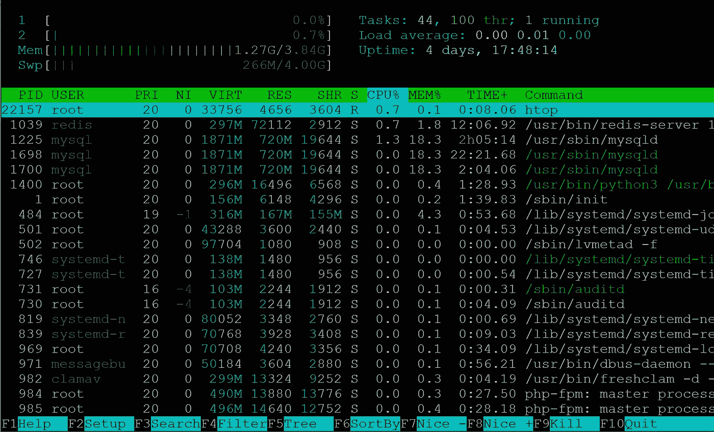
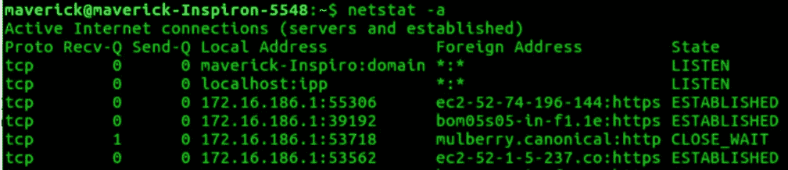

# Linux 系统和故障排除工具

> 原文：<https://blog.devgenius.io/linux-system-and-troubleshooting-tools-1a3385b53753?source=collection_archive---------3----------------------->

> **故障排除**是[问题解决](https://en.wikipedia.org/wiki/Problem_solving)的一种形式，常用于修复机器或系统上的故障产品或流程。这是一个合乎逻辑的、系统的寻找问题根源的过程，目的是解决问题，并使产品或过程再次运行——维基百科


当出现重大中断和报告的错误时，很自然地要开始故障排除，并试图尽快找到根本原因。虽然确定根本原因是第一反应，但推荐的行动方针是 ***使系统在这种情况下尽可能好地工作。*** 类似于驾驶飞机，飞行员被教导在紧急情况下驾驶飞机；与让飞机安全着陆相比，排除故障是次要的。

本文将介绍一种系统的故障排除方法和 linux 工具，以了解系统故障并有效地解决问题。(非常感谢我的导师教给我这些有用的 linux 系统工具！！)

# >>日志

在任何开发人员的工具包中，日志记录都是一个方便的好工具，可以修复任何问题。日志文件允许您快速了解应用程序的行为。导出关于每个操作和系统状态的信息可以更容易地分析某个进程在给定时间点正在做什么。一些重要的 Linux 系统日志包括`/var/log/syslog`、`/var/log/auth.log`、`/var/log/kern.log`和`/var/log/dmesg`。

对于调试来说，Stacktraces 也是您最好的朋友。从检查报告的错误开始，使用堆栈跟踪回溯程序的冻结状态，找出如何修复问题。在整个堆栈中跟踪请求提供了一种强大的方法来更好地了解分布式系统是如何工作的。

对系统设计的透彻理解有助于提出关于哪里出错的假设。是时候深入挖掘有问题的主机以确定原因了。

# >>流程

故障排除过程的下一步是调查主机，以检查延迟、CPU 使用率或正在运行的进程数量是否增加。进程监控是最全面的工具之一，可以看到一个应用程序正在做什么。

> 我们是否最大化了系统资源？

```
**top**- command that provides a dynamic real-time view of a running system**htop** - command to interactively monitor the system’s vital resources or server’s processes in real time
```

***htop****是一款更漂亮、更鲜艳的最新版本 ***top*** 使得***htop****成为解决服务器性能问题的更好工具。**

*****htop*** 显示服务器上正在发生的事情的实时概览。我们一眼就能看到以下内容:**

*   **您的服务器上的单个 CPU 的数量及其资源分别细分**
*   **按进程细分的 RAM 使用情况**
*   **交换用法**
*   **任务总数、线程数和正在运行的任务数**
*   **1 分钟、5 分钟、10 分钟平均负载**
*   **系统正常运行时间和当前时间**
*   **所有正在运行的进程—[PID | User | Priority | Niceness | Virtual Image | Resident Size | Shared Mem Size | CPU % | Memory % | Time | Command**

****

**htop 命令**

**一旦您确定了可疑的流程，那么您可能希望将重点放在该流程上。可以使用***top***/**/*htop***命令:**

```
****top -p $PID****
```

**如果进程看起来行为正常，但是系统的内存使用高于平均值，我们可以详细检查内存使用。**

# **>>内存**

**要找出服务器上内存消耗增加的原因，可以使用以下工具来识别内存密集型应用程序，并释放内存和优化性能:**

```
****free** - display amount of free and used memory in the system**
```

**使用 **top/htop** 命令，仅显示空闲和已用内存量。 **free** 命令显示:空闲和使用的物理内存总量，系统中的交换内存总量，内核使用的缓冲区和缓存。**

**OOM 黑仔是当系统内存严重不足时，linux 内核使用的一个进程。这是因为服务器上的进程消耗了大量内存，系统需要将内存分配给其他进程。如果系统上没有启用交换，内核会给每个正在运行的进程一个名为 ***ooo_score*** 的分数，该分数决定了在可用内存不足的情况下该进程被终止的可能性。**

**如果启用交换，内存页面将被复制到硬盘上分配的*交换空间*中，以释放该页面的内存。检查**圆盘**的截面**

```
****df** - report file system disk space usage**
```

****df** 显示包含每个文件名参数的文件系统上的可用磁盘空间量。**

# **>>磁盘**

**交换空间的主要功能是当实际 RAM 填满并且需要更多空间时，用磁盘空间代替 RAM 内存。内核使用内存管理程序来检测最近最少使用的内存块(或内存页),并将这些内存页交换到硬盘上的特殊分区。我们可以使用以下命令来监控磁盘 I/O 统计信息:**

```
****iostat** - report CPU statistics and I/O statistics for devices, partitions and NFS**
```

****iostat** 命令用于监控系统 I/O 设备加载。它通过观察设备相对于其平均传输时间的活动时间来实现这一点。类似于 **iostat** 命令， **vmstat** 命令报告虚拟内存统计数据和关于系统事件的信息，例如 CPU 负载、分页、系统调用等。`vmstat -S`可用于显示*交换统计。***

```
****iotop** - simple top-like I/O monitor**
```

****iotop** 是一个 Linux 上的交互式 I/O 监控工具，就像 **htop** 一样，可以轻松监控 Linux 上每个运行进程的磁盘读写带宽使用情况。对于系统管理来说，它是一个非常有用的工具，可以跟踪可能导致高磁盘 I/O 读/写的特定进程。它还显示线程或进程在换入和等待 I/O 时花费的时间百分比。**

**其他命令包括`iotop`、`atop`和`dstat`**

# **>>网络**

**对于网络，我们最感兴趣的是吞吐量(每秒请求数—带宽)。我们想要检查**速率**(每秒比特数的读写带宽)和**利用率**(读写带宽除以网络的最大带宽)。一些有用的网络调试工具可以应对延迟高峰和失败的请求，包括:**

```
****netstat** - prints network connections, routing tables, interface statistics, masquerade connections, and multicast memberships**
```

**netstat 告诉你哪些进程正在哪些端口上运行。它是一个重要的网络连接监控工具，可以显示进出连接、路由表、端口监听和使用统计；最近的一个命令是`ss`。**

****

```
****tcpdump** - dump traffic on a network**
```

**tcpdump 是一个数据网络包分析器。它允许用户显示通过网络传输或接收的 TCP/IP 和其他数据包。它可用于排除网络故障，也可用作安全工具。要打印出要查看的数据包，请使用`tcpdump -A`。**

```
****netcat** - arbitary TCP and UDP connections and listens** 
```

**使用 **nectat，**你可以打开 TCP 连接，发送 UDP 数据包，监听任意 UDP 和 TCP 端口，端口扫描等等。它充当后端工具，允许端口扫描和端口监听，此外还允许文件传输。**

## **资源:**

*   **[https://jvns.ca/debugging-zine.pdf](https://jvns.ca/debugging-zine.pdf)**
*   **[https://medium . com/@ Steve . mus hero/linuxs-sre-golden-signals-af 5a a26 ebae](https://medium.com/@steve.mushero/linuxs-sre-golden-signals-af5aaa26ebae)**
*   **[https://landing . Google . com/sre/sre-book/chapters/effective-trouble shooting/](https://landing.google.com/sre/sre-book/chapters/effective-troubleshooting/)**
*   **[https://www . euro VPS . com/blog/important-Linux-log-files-you-must-be-monitoring/](https://www.eurovps.com/blog/important-linux-log-files-you-must-be-monitoring/)**

**故障排除永远不会像我们理想化的模型那样清晰，并且像任何其他技能一样需要实践。对于遇到系统问题的人和解决问题的人来说，这些步骤可以使故障诊断过程不那么痛苦，并且更有效率。采用系统的故障排除方法有助于减少影响时间和限制服务恢复时间，并为用户带来更好的体验。**

**玩得开心，永远不要忘记检查日志！📝**