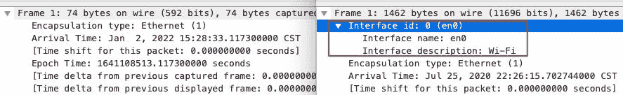
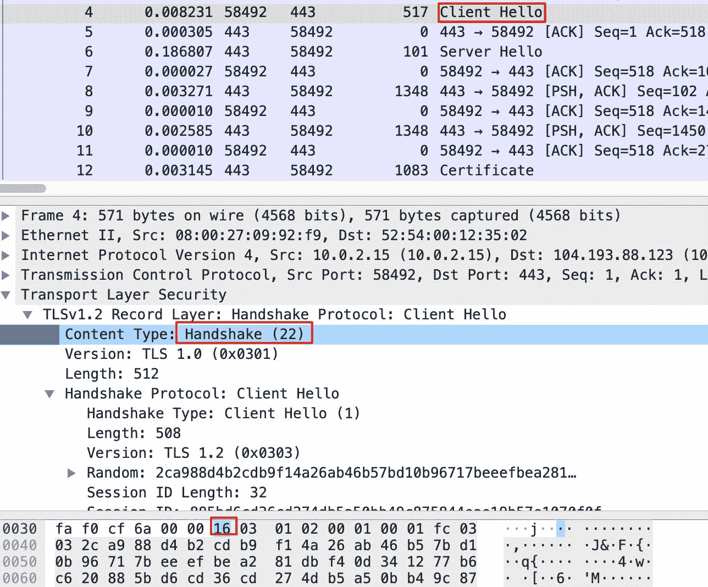

# Linux — tcpdump 深入探讨

> 原文：<https://blog.devgenius.io/linux-tcpdump-deep-dive-c916908eb687?source=collection_archive---------4----------------------->

## 高级 tcpdump 技能


在众多的故障排除技术中，包捕获分析可以说是“皇冠上的明珠”，也是包括我自己在内的很多人一直在努力的方向。

所以，这两个工具`tcpdump`和`Wireshark`在工程师心目中的重要性就不用我多提了。在今天的文章中，我将为`tcpdump`讲述一些高级技巧。

# tcpdump 的历史

1988 年，劳伦斯伯克利国家实验室的四名工程师编写了 hallmark 工具`tcpdump`。这个实验室也值得我们尊敬。这里已经有 13 位诺贝尔奖获得者了。

这个地方能产生突破性的技术也就不足为奇了。`tcpdump`可以在各种类 Unix 操作系统上工作，包括 Linux、FreeBSD、macOS、Solaris 等。，也是使用最广泛的数据包捕获工具之一。

但是`tcpdump`需要依靠一个底层的能力来过滤数据包:`BPF`。BPF 的全称是 Berkeley Packet Filter(也叫 BSD Packet Filter)，是`tcpdump`等数据包捕获工具的底层基础。

BPF 实现了一个数据包捕获虚拟机，并使用`libpcap`来实现用户空间程序的数据包捕获。因此，流程看起来像这样:

`tcpdump`调用`libpcap`接口，该接口调用 BPF 实现包过滤和捕获。

```
tcpdump -> libpcap -> BPF
```

# 数据包捕获文件类型

如果你注意抓取文件的后缀名称，你会发现有几个不同的后缀名称，如`pcap`、`cap`、`pcapng`。你有没有想过为什么有不同的文件类型？

## pcap

这是`libpcap`的格式，也是`tcpdump`、`Wireshark`等工具支持的默认文件格式。除了包数据外，`pcap`格式的文件还包含包捕获文件的元信息，如版本号、包捕获时间、捕获的每个包的最大长度等。

## 帽子

cap 文件可能包含`libpcap`标准以外的一些数据格式，这些数据格式是由`tcpdump`以外的一些数据包捕获程序生成的。例如，在 Citrix 的 NetScaler 负载平衡器中，`nstrace`命令生成的数据包捕获文件扩展名为`.cap`。

除了`pcap`标准定义的信息外，该文件还包含 LB 前端连接和后端连接之间的映射信息。只要版本正确，Wireshark 就可以读取这些`.cap`文件。

## pcapng

虽然`pcap`格式满足了大部分需求，但也存在一些不足。例如，现在多个网络端口的情况越来越普遍，我们经常需要从多个网络接口捕获数据包，所以在数据包捕获文件中，有时需要包含网络端口信息。

借助`pcapng`，单个数据包捕获文件可以包含多个网络接口上捕获的数据包。例如:



当然，`pcapng`还有许多其他特性，比如更细粒度的数据包时间戳，允许向数据包添加注释，更灵活的元数据等等。如果您使用较新版本的 Wireshark 和 tshark 来捕获数据包，默认的数据包捕获文件已经是`pcapng`格式了。

# tcpdump 的基本用法

虽然 tcpdump 有完整的文档和命令手册，但是如果您不经常捕获数据包，您就不能很好地掌握它们。另外，数据包捕获技术课是实践课，不是理论课，你需要大量的实践来掌握它。

## 数据包捕获

使用`tcpdump`捕获数据包，最常见的场景是捕获去往或来自某个 ip 的流量。我们可以使用主机{对等 IP}作为数据包捕获过滤器条件，例如:

```
$ tcpdump host 10.10.23.76
```

另一个常见的场景是捕获某个端口的流量。例如，如果我们想捕获 Nginx 流量，我们可以这样做:

```
$ tcpdump port 22
```

我们还经常使用许多参数，例如:

*   **-w** 文件名，可以将消息保存到一个文件中；
*   **-c** 号，可以抓取固定数量的数据包，避免在流量较大时意外抓取过多的数据包；
*   **-s** 长度，每个消息只能抓取一定长度；
*   **-n** ，不做地址转换(例如，IP 地址转换为主机名，端口 80 转换为 http)；
*   **-v/-vv/-vvv** ，可打印更详细的消息信息；
*   **-e** ，可以打印二层信息，尤其是 MAC 地址；
*   **-p** ，关闭混杂模式。所谓混杂模式，也就是嗅探，就是捕获目的地址不是本地地址的网络数据包。

## 分组过滤器

假设我们需要统计一个 HTTPS VIP 的访问流量中 TLS 版本(目前主要是 TLS1.0、1.1、1.2、1.3)的分布情况。

为了控制数据包捕获文件的大小，我们不想捕获所有 TLS 数据包，而只想捕获 TLS 版本信息。如何做到这一点？要知道，对于这个需求，`tcpdump`本身并没有现成的滤镜，我们需要使用 BPF。

BPF 基于偏移量解析数据包，因此我们也可以在`tcpdump`中使用这种偏移量技术来满足我们的需求。以下命令可以在 TLS 握手阶段捕获客户端 Hello 数据包:

```
$ tcpdump -w file.pcap 'dst port 443 && tcp[20]==22 && tcp[25]==1'
```

我来给你解释一下上面的三个过滤条件。

*   **dst port 443** :这是最简单的，就是捕获客户端发来的访问 HTTPS 的数据包。
*   **tcp[20]==22:** 这是提取的 tcp 的第 21 个字节(因为初始序列号是从 0 开始的)，由于 TCP 头占用了 20 个字节，而 TLS 是 TCP 的有效载荷，那么 TLS 1 字节的第一个字节就是 TCP 的第 21 个字节，就是 tcp[20]。如果这个位置的值是 22(十进制)，则表明这是一个 TLS 握手消息。
*   **tcp[25]==1:** 同样，这是 tcp 头的第 26 个字节。如果等于 1，则表示这是一个客户端 Hello 类型的 TLS 握手消息。

下面是它在捕获文件中的样子:



注意，`16`的值是十六进制的，如果转换成十进制，就是 22。

## 显示数据包内容

有时你想看到 TCP 包的具体内容，比如应用层数据，那么你可以使用-X 参数以 ASCII 码显示 TCP 中的数据:

```
$ sudo tcpdump port 80 -X
......
05:06:57.394573 IP _gateway.52317 > victorebpf.http: Flags [P.], seq 1:17, ack 1, win 65535, length 16: HTTP: GET / HTTP/1.1
  0x0000:  4500 0038 282d 0000 4006 3a83 0a00 0202  E..8(-..@.:.....
  0x0010:  0a00 020f cc5d 0050 0502 3a02 3ed1 3771  .....].P..:.>.7q
  0x0020:  5018 ffff 4421 0000 4745 5420 2f20 4854  P...D!..GET./.HT
  0x0030:  5450 2f31 2e31 0d0a                      TP/1.1..
```

## 读取数据包捕获文件

这个比较简单，tcpdump 可以用-r 参数和文件名读取文件，还可以添加过滤条件。例如:

```
$ tcpdump -r file.pcap ‘tcp[tcpflags] & (tcp-rst) != 0’
```

## 过滤后转储

有时，我们希望从数据包捕获文件中过滤出所需的数据包，并将它们传输到另一个文件中。例如，您想从数据包捕获文件中找到 TCP RST 数据包，并将这些 RST 数据包保存到新文件中。然后这样做:

```
$ tcpdump -r file.pcap 'tcp[tcpflags] & (tcp-rst) != 0' -w rst.pcap
```

## 控制捕获大小

我前面提到过`-s` length 参数，它的使用场景其实包括延长抓包时间。我们在 tcpdump 中添加了`-s`参数来指定捕获的每个包的最大长度，节省了包捕获文件的大小，延长了包捕获时间。

一般来说，帧头是 14 字节，IP 头是 20 字节，TCP 头是 20~40 字节。如果你清楚的知道这次抓包的重点是传输层，那么理论上，对于每个包，你只需要抓包传输层头，也就是前 14+20+40 字节(也就是前 14+20+40 字节)。74 字节):

```
$ tcpdump -s 74 -w file.pcap
```

如果默认捕获是 1500 字节，生成的数据包捕获文件将比上述数据包捕获文件大 20 倍。反之，使用相同的磁盘空间，上述方法可以捕获比默认长 20 倍的数据包！

# tcptrace

有时如果你想做包分析，你可以用`tcpdump -r`打开原始捕获文件:

```
$ tcpdump -r test.pcap | head -10
reading from file test.pcap, link-type EN10MB (Ethernet)
03:55:10.769412 IP victorebpf.51952 > 180.101.49.12.https: Flags [S], seq 3448043385, win 64240, options [mss 1460,sackOK,TS val 237167733 ecr 0,nop,wscale 7], length 0
03:55:10.779061 IP 180.101.49.12.https > victorebpf.51952: Flags [S.], seq 156800001, ack 3448043386, win 65535, options [mss 1460], length 0
...
03:55:10.795327 IP 180.101.49.12.https > victorebpf.51952: Flags [P.], seq 1502:3881, ack 518, win 65535, length 2379
03:55:10.795356 IP victorebpf.51952 > 180.101.49.12.https: Flags [.], ack 3881, win 61060, length 0
03:55:10.802868 IP 180.101.49.12.https > victorebpf.51952: Flags [P.], seq 3881:4228, ack 518, win 65535, length 347
```

但是很难分析上面的输出，因为有太多的信息。其实还有一个工具可以帮忙，那就是`tcptrace`。它不能用于捕获数据包，但可以用于分析。

例如如下，`tcptrace`告诉我们，这个数据包捕获文件中有 2 个 TCP 连接，它们以 RST 结尾:

```
$ tcptrace -b test.pcap
1 arg remaining, starting with 'test.pcap'
Ostermann's tcptrace -- version 6.6.7 -- Thu Nov  4, 2004145 packets seen, 145 TCP packets traced
elapsed wallclock time: 0:00:00.028527, 5082 pkts/sec analyzed
trace file elapsed time: 0:00:04.534695
TCP connection info:
  1: victorebpf:51952 - 180.101.49.12:443 (a2b)   15>   15<  (complete)  (reset)
  2: victorebpf:56794 - 180.101.49.58:443 (c2d)   56>   59<  (complete)  (reset)
```

# 结论

在这篇文章中，我谈到了一些关于`tcpdump`的高级用法，我也提到了`tcpdump`使用的技术，比如 BPF、libpcap 和不同的文件格式。最后，我介绍一个叫做`tcptrace`的工具，如果您方便的时候没有 Wireshark，它可以帮助您进行包分析。我希望你喜欢我的分享。