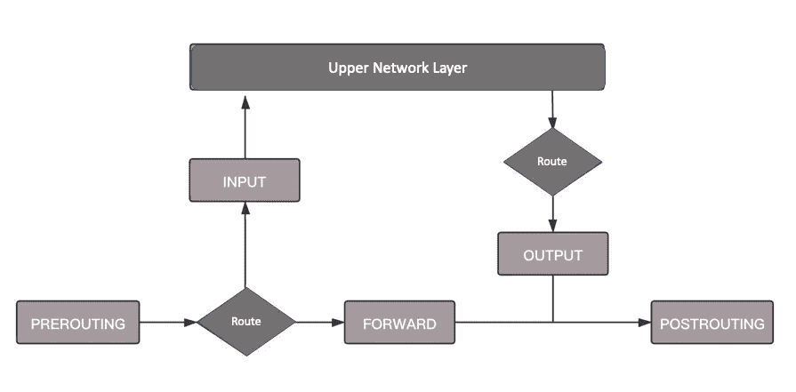
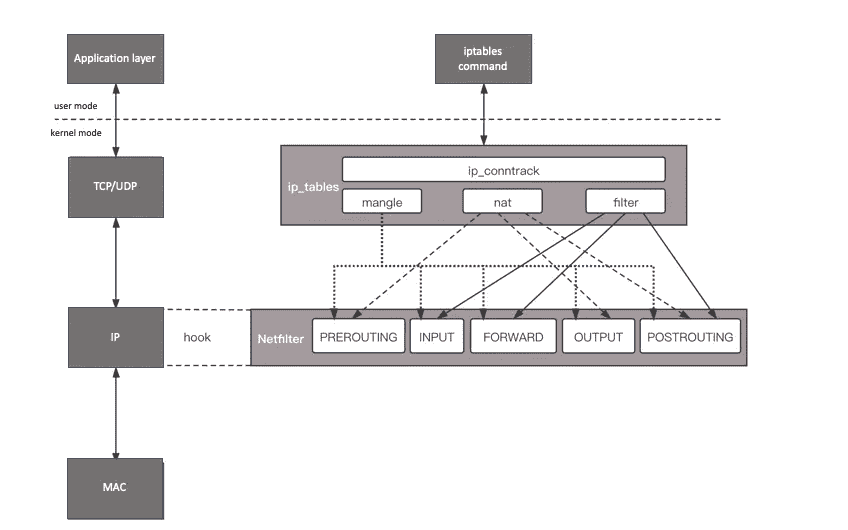
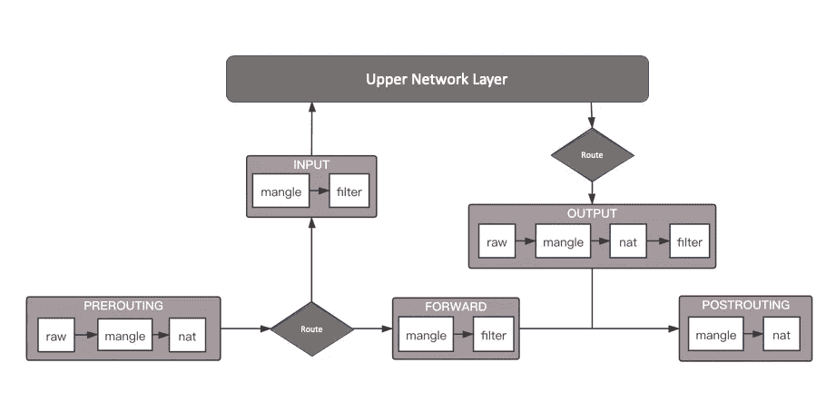

# Linux —当网络数据包到达服务器时会发生什么

> 原文：<https://blog.devgenius.io/linux-what-happens-when-a-network-packet-arrives-at-server-5139860b5466?source=collection_archive---------8----------------------->

## Linux 如何处理到达网络的数据包

每天，我们通过不同的网络协议在服务器和外部互联网之间交换信息。但是你能解释当一个网络包到达你的服务器时会发生什么吗？让我们回顾一下本文中的过程。

首先，MAC 报头将被取下，以查看该分组是否是给该服务器的。如果是，它将进一步取下 IP 报头。在获得目标 IP 后，它开始确定路由。

在路由判断之前，这个阶段叫做**预路由**。如果发现该 IP 是服务器 IP，它会将数据包发送到较高的传输层。这个阶段叫做**输入**。如果发现该 IP 不是服务器 IP，则需要转发该数据包。这个阶段叫做**前进**。

如果数据包属于服务器，上层处理完之后，一般会返回一个处理结果，这个处理结果会被发送出去。这个阶段叫做**输出**。无论是**正向**还是**输出**，都发生在路由判断之后。最后一个阶段是**后路由**。您可以在下图中看到整个过程:

乍一看，整个包加工流程还是和原来的流程一样，但是为什么要特别注意这五个阶段呢？

是因为在 Linux 内核中，有一个框架叫做 **Netfilter** 。它可以在这些阶段插入钩子函数。这些功能可以拦截数据包并干预数据包。

比如做一定的修改，然后决定是否交给 TCP/IP 协议栈处理；或者可以交回协议栈，也就是**接受**；或者过滤后不再传输，也就是**掉线**；和**队列**，发送给某个用户态进程进行处理。

这是一个复杂的过程。常用于内部负载均衡，即进来的数据先传到目标地址 1，再传到目标地址 2，目标地址的数量和权重也可能发生变化。

协议栈往往无法处理如此复杂的逻辑，需要编写一个函数来接管数据并实现自己的逻辑。这就是 **Netfilter** 框架的作用，你可以随时干预 IP 转发的过程，只要你能实现这些钩子函数。

# iptables

一个众所周知的实现是内核模块`ip_tables`。它在这五个阶段中嵌入了函数，以便根据规则处理数据包。

按功能可分为四类:连接跟踪(`conntrack`)、包过滤(`filter`)、网络地址转换(`nat`)和包修改(`mangle`)。其中，连接跟踪是基本功能，其他功能都依赖于它。另外三个可以实现包过滤、修改和网络地址转换。

在用户模式下，还有一个你必须知道的客户端程序`iptables`，它使用命令行来干扰内核的规则。

`iptables`表有四种:`raw` → `mangle` → `nat` → `filter`。这四个优先级依次降低，raw 不常用，所以主要函数在另外三个表中实现。每个表可以设置多个链。

`iptables`有五种类型的链条:

*   `PREROUTING`:数据包进入路由前
*   `INPUT`:目的地址是这台电脑
*   `FORWARD`:实施转发
*   `OUTPUT`:原地址是本机，发出
*   `POSTROUTING`:发送到网卡前

## 过滤器

`filter`工作台处理过滤功能，主要由三个链组成:

*   输入链:过滤所有目的地址为本地的数据包；
*   转发链:过滤所有通过机器的数据包；
*   输出链:过滤这台机器产生的所有数据包。

## 精灵

`nat`表主要处理网络地址转换。它可以执行 Snat(改变数据包的源地址)和 Dnat(改变数据包的目的地址)，包括三个链:

*   预路由链:当数据包到达防火墙时，目的地址可以改变；
*   输出链:可以改变本地生成的数据包的目的地址；
*   路由后链:当数据包离开防火墙时，改变它的源地址。

## 损坏

mangle 表主要是修改数据包，包括:

*   预路由链；
*   输入链；
*   正向链；
*   输出链；
*   路由后链。

将 iptables 表和链添加到上面的流程图中，形成了下面的图和流程。

*   当数据包进来时，使用`mangle`表的预路由链。在这里你可以根据需要改变数据包头的内容，然后进入`nat`表的 PREROUTING 链，在这里你可以根据需要做`Dnat`，也就是目标地址翻译。
*   在进入路由判断时，需要确定是进入本地还是转发。
*   如果是进入本地，进入**输入**链，然后根据条件过滤器限制进入。
*   然后进入本地机，再进入**输出**链，根据条件过滤掉，离开本地机。
*   如果是转发，会进入**转发**链，根据条件过滤限制转发。
*   然后进入 **POSTROUTING** 链，在这里可以做`Snat`，离开网络接口。

# 处理数据包的四种方式

*   **接受**允许数据包通过
*   **丢弃**直接丢弃数据包，不给出任何响应信息
*   **拒绝**拒绝数据包通过，必要时会给数据发送方一个响应消息。
*   **LOG** 在`/var/log/messages`文件中记录日志消息，然后将数据包传递给下一个规则