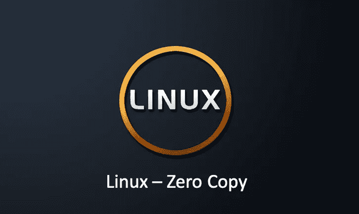
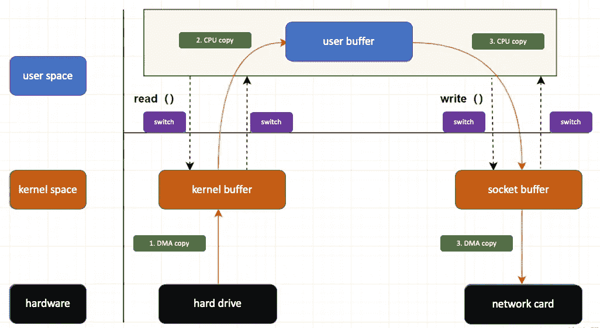
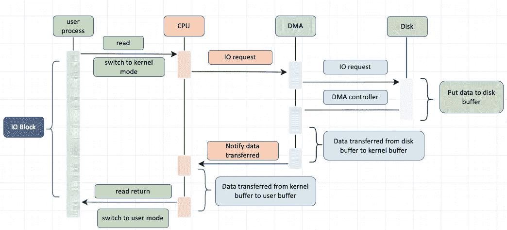
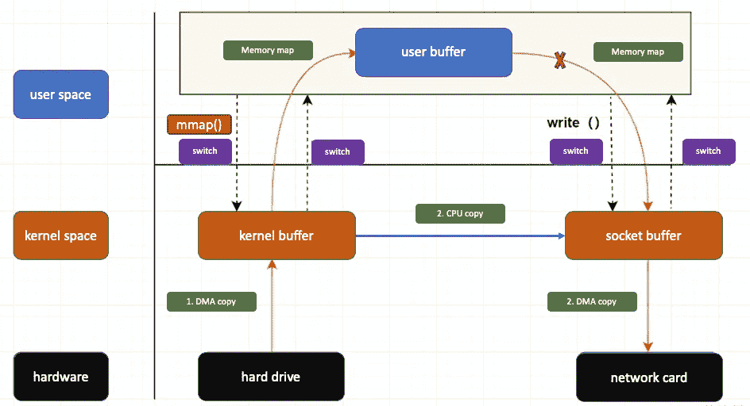
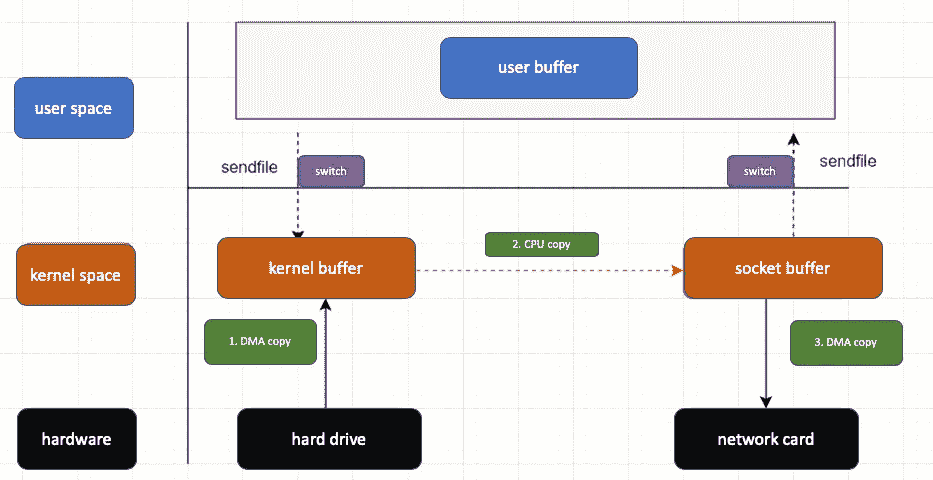

# Linux —零拷贝

> 原文：<https://blog.devgenius.io/linux-zero-copy-d61d712813fe?source=collection_archive---------0----------------------->

## 什么是零拷贝，它是如何工作的？



许多 Web 应用程序提供大量的静态内容，这相当于从磁盘读取数据并将完全相同的数据写回响应套接字。每次数据穿越用户-内核边界时，都必须进行复制，这会消耗 CPU 周期和内存带宽。

零拷贝技术的作用是消除内核和用户空间之间所有不必要的拷贝。无论是卡夫卡还是内蒂，都是运用了零复制的知识。那么零拷贝到底是什么？让我们在这篇文章中探索一下。

# 什么是零拷贝

*   “零”:表示复制数据的次数为 0。
*   “拷贝”:是指将数据从一个存储区转移到另一个存储区。

所以，如果把“零”和“复制”两个词放在一起，“零复制”是指当计算机执行 IO 操作时，CPU 不需要将数据从一个存储区域复制到另一个存储区域，从而减少上下文切换和 CPU 复制时间。它是一种 IO 操作优化技术。

# 传统 IO 的执行过程

例如，如果要实现下载功能，服务器的任务是从连接的套接字发送服务器主机磁盘中的文件。关键代码如下:

```
while((n = read(diskfd, buf, BUF_SIZE)) > 0)
    write(sockfd, buf , n);
```

传统的 IO 过程包括读取和写入过程

*   读取:从磁盘读取数据到内核缓冲区，复制到用户缓冲区
*   写:先把数据写到 socket 缓冲区，最后写到网卡设备

整个流程看起来像:



*   应用程序调用`read`函数，发起对操作系统的 IO 调用，上下文从用户模式切换到内核模式
*   DMA 控制器将数据从磁盘读取到内核缓冲区
*   CPU 读取内核缓冲区并将数据复制到用户应用程序缓冲区，上下文从内核模式切换到用户模式，read 函数返回
*   用户应用进程通过 write 函数发起 IO 调用，上下文从用户态切换到内核态
    并将数据复制到 socket buffer
*   DMA 控制器将数据从套接字缓冲区复制到网卡设备，上下文从内核模式切换到用户模式，此时写功能返回

从流程图可以看出，传统的 IO 过程包括 4 次上下文切换，4 次复制数据(两次 CPU 复制和两次 DMA 复制)。

# 内核空间与用户空间

运行在服务器上的应用程序需要通过操作系统来执行一些特殊的操作，比如磁盘文件的读写，内存的读写等等。

因为这些都是比较危险的操作，不能被应用搞砸，只能交给底层操作系统。

因此，操作系统为用户应用程序分配两个内存空间:用户空间和内核空间。

*   内核空间:主要提供进程调度、内存分配、硬件资源连接等功能。
*   用户空间:提供给每个程序进程的空间。它没有访问内核空间资源的权限。如果应用程序需要使用内核空间的资源，它需要通过一个系统调用。进程从用户空间切换到内核空间，完成相关操作后，从内核空间切换回用户空间。

## 用户模式和内核模式

*   如果一个进程运行在内核空间，它被称为进程的内核状态。
*   如果一个进程运行在用户空间，它被称为进程的用户空间。

# 直接存储器存取

DMA 代表直接内存访问。它本质上是主板上的一个独立芯片，允许外围设备和内存存储之间的直接 IO 数据传输，并且该过程不需要 CPU 的参与。

简单来说就是帮助 CPU 转发 IO 请求，复制数据，那为什么需要它呢？其实主要是效率的问题。它帮助中央处理器做事情。这时候 CPU 就可以空闲下来做别的事情，提高了 CPU 的利用效率。

让我们来看看这个过程:



*   用户应用调用 read 函数，向操作系统发起 IO 调用，进入阻塞状态等待数据返回。
*   在 CPU 接收到指令后，它向 DMA 控制器发起指令调度。
*   DMA 收到请求后，将请求发送到磁盘
*   磁盘将数据放入磁盘控制缓冲区，并通知 DMA
*   DMA 将数据从磁盘控制器缓冲区复制到内核缓冲区
*   DMA 向 CPU 发送数据读取信号，CPU 负责将数据从内核缓冲区复制到用户缓冲区
*   用户应用程序进程从内核状态切换到用户状态，并解除状态阻塞

# 如何实现零拷贝

理解了 DMA 的工作原理之后，让我们来讨论一下零拷贝是如何实现的。首先，零拷贝并不意味着不拷贝数据，而是减少了用户态和内核态切换的次数和 CPU 拷贝的数量；实现零拷贝有两种主要方法:

*   **方法一:** mmap + write
*   **方法二:**发送文件

## mmap +写

mmap 的功能原型如下

```
void *mmap(void *addr, size_t length, int prot, int flags, int fd, off_t offset);
```

mmap+write 实现的零拷贝过程如下:



与`read()`调用相比，这里的主要区别是用户进程通过调用 **mmap 方法**向操作系统内核发起 IO 调用，上下文从用户模式切换到内核模式，然后 CPU 使用 DMA 控制器将数据从硬盘复制到内核缓冲区。主要步骤是:

*   用户进程通过调用 mmap 方法发起对操作系统内核的 IO 调用，上下文从用户模式切换到内核模式
*   CPU 使用 DMA 控制器将数据从硬盘复制到内核缓冲区
*   上下文从内核状态切换到用户状态，mmap 方法返回
*   用户进程通过调用 write 方法再次对操作系统内核进行 IO 调用，上下文从用户状态切换到
    内核状态。到套接字缓冲区
*   CPU 使用 DMA 控制器将数据从套接字缓冲区复制到网卡，上下文从内核模式切换到用户模式，写方法返回

可以发现 mmap+write 实现的零拷贝有 4 个上下文切换和 3 个拷贝(2 个 DMA 拷贝+ 1 个 cpu 拷贝)

## 发送文件()

`sendfile`是 Linux 版以后内核引入的系统调用函数。原型如下

```
ssize_t sendfile(int out_fd, int in_fd, off_t *offset, size_t count);
```

**sendfile 是指在两个文件描述符之间传递数据，它在操作系统内核中运行，避免了从内核缓冲区和用户缓冲区复制数据的操作，因此可以用来实现零复制**。流程看起来像:



*   用户进程启动 sendfile 系统调用，上下文从用户模式切换到内核模式
*   DMA 控制器将数据从硬盘复制到内核缓冲区
*   CPU 将读缓冲区中的数据复制到套接字缓冲区
*   DMA 控制器将数据从套接字缓冲区异步复制到网卡
*   上下文从内核模式切换到用户模式，sendfile 函数返回

可以发现 sendfile 实现的零拷贝只有 2 个上下文切换和 3 个拷贝(2 个 DMA 拷贝+ 1 个 CPU 拷贝)