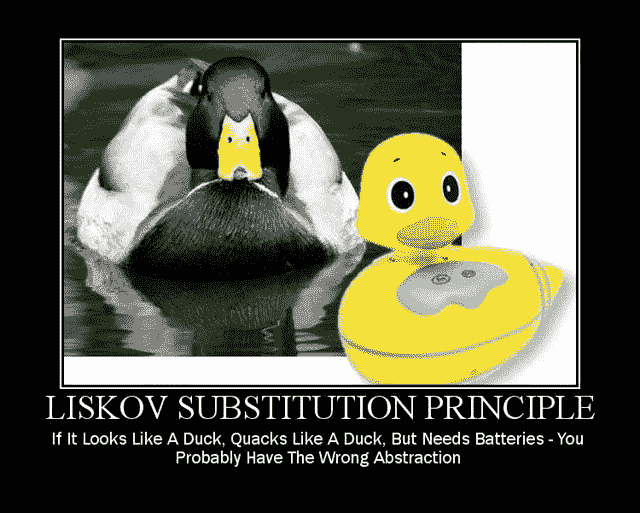

# 利斯科夫的替代原理|坚如磐石

> 原文：<https://blog.devgenius.io/liskovs-substitution-principle-solid-as-a-rock-1cc5bdcee16e?source=collection_archive---------3----------------------->



所以你知道一般如何编码，了解面向对象编程，学过 C++，完成了至少一门软件开发课程(如果你还没有，这些文章不适合你)。如果你知道至少一种编程语言，你可以很容易地编写软件，但是你的代码好吗？还能做得更好吗？它干净吗(这到底是什么意思)？你的建筑好吗？你应该使用不同的吗？设计模式呢？这些是我刚开始工作时遇到的一些问题，回答这些问题帮助我提升到了专业水平。这就是为什么我写了这些系列坚实的岩石设计原则。 **L** 伊斯科夫的**S**substitution**P**c++原理是我将在这里讨论的这个系列的第二个原理。

> */！\:原载@*[*www.vishalchovatiya.com*](http://www.vishalchovatiya.com/category/design-patterns/)*。*

顺便说一句，如果你还没有浏览过我以前关于设计原则的文章，下面是快速链接:

1.  [**S** RP —单一责任原则](http://www.vishalchovatiya.com/single-responsibility-principle-in-cpp-solid-as-a-rock/)
2.  [**O** CP —开启/关闭原理](http://www.vishalchovatiya.com/open-closed-principle-in-cpp-solid-as-a-rock/)
3.  [LSP—利斯科夫替代原理](http://www.vishalchovatiya.com/liskovs-substitution-principle-in-cpp-solid-as-a-rock/)
4.  [**I** SP —界面偏析原理](http://www.vishalchovatiya.com/interface-segregation-principle-in-cpp-solid-as-a-rock/)
5.  [**D** IP —依赖反转原理](http://www.vishalchovatiya.com/dependency-inversion-principle-in-cpp-solid-as-a-rock/)

您在这一系列文章中看到的代码片段是简化的，而不是复杂的。所以你经常看到我不使用像`override`、`final`、`public`(同时继承)这样的关键字，只是为了让代码紧凑&可消耗(大部分时间)在单一标准屏幕尺寸。我也更喜欢`struct`而不是`class`，只是为了节省代码行，有时不写`public:`，还会故意忽略[虚拟析构函数](http://www.vishalchovatiya.com/part-3-all-about-virtual-keyword-in-c-how-virtual-destructor-works/)，构造函数[，复制构造函数](http://www.vishalchovatiya.com/all-about-copy-constructor-in-cpp-with-example/)，前缀`std::`，删除动态内存。我也认为自己是一个务实的人，希望用尽可能简单的方式，而不是标准的方式或使用术语来传达一个想法。

***注:***

*   如果你是在这里被直接绊倒的，那么我建议你浏览一下[什么是设计模式？](http://www.vishalchovatiya.com/what-is-design-pattern/)一、哪怕是鸡毛蒜皮的小事。相信会鼓励你对这个话题进行更多的探索。
*   您在本系列文章中遇到的所有这些代码都是使用 C++20 编译的(尽管我在大多数情况下使用了 C++17 之前的现代 C++特性)。因此，如果你无法获得最新的编译器，你可以使用已经预装了 boost 库的[https://wandbox.org/](https://wandbox.org/)。

# 目的

> **在不改变程序正确性的情况下，子类型必须可以替换它们的基本类型**

*   如果我在 C++的上下文中解决这个问题，这实际上意味着使用指向基类的指针/引用的函数必须能够被它的派生类替换。
*   Liskov 替换原则围绕着确保正确使用继承。

# 违反了利斯科夫替代原理

*   说明 LSP 的一个伟大而传统的例子是，有时在自然语言中听起来正确的东西在代码中并不完全有效。
*   在数学中，一个`Square`就是一个`Rectangle`。事实上，它是一个矩形的特化。“是 A”让你想用继承来建模。然而，如果在代码中你让`Square`从`Rectangle`派生，那么`Square`应该可以在你期望`Rectangle`的任何地方使用。这导致了如下一些奇怪的行为:

```
struct Rectangle {
    Rectangle(const uint32_t width, const uint32_t height) : m_width{width}, m_height{height} {} uint32_t get_width() const { return m_width; }
    uint32_t get_height() const { return m_height; } virtual void set_width(const uint32_t width) { this->m_width = width; }
    virtual void set_height(const uint32_t height) { this->m_height = height; } uint32_t area() const { return m_width * m_height; }protected:
    uint32_t m_width, m_height;
};struct Square : Rectangle {
    Square(uint32_t size) : Rectangle(size, size) {}
    void set_width(const uint32_t width) override { this->m_width = m_height = width; }
    void set_height(const uint32_t height) override { this->m_height = m_width = height; }
};void process(Rectangle &r) {
    uint32_t w = r.get_width();
    r.set_height(10); assert((w * 10) == r.area()); // Fails for Square <--------------------
}int main() {
    Rectangle r{5, 5};
    process(r);
    Square s{5};
    process(s);
    return EXIT_SUCCESS;
}
```

*   正如你在上面看到的，我们已经在`void process(Rectangle &r)`函数中违反了 Liskovs 的替换原则。因此`Square`不是`Rectangle`的有效替代。
*   如果你从设计的角度来看，从`Rectangle`继承`Square`的想法不是一个好主意。因为`Square`没有高度&宽度，而是有边的尺寸/长度。

# 利斯科夫的替代原理举例

# 不太好

```
void process(Rectangle &r) {
    uint32_t w = r.get_width();
    r.set_height(10); if (dynamic_cast<Square *>(&r) != nullptr)
        assert((r.get_width() * r.get_width()) == r.area());
    else
        assert((w * 10) == r.area());
}
```

*   经常指示 LSP 违规的一个常见代码味道是多态代码块中出现的[类型检查](http://www.vishalchovatiya.com/cpp-type-casting-with-example-for-c-developers/)代码。
*   例如，如果在类型为`Foo`的对象集合上有一个`std::for_each`循环，并且在这个循环中，有一个检查来查看`Foo`是否实际上是`Bar`(`Foo`的一个子类型)，那么这几乎肯定是 LSP 违规。相反，你应该确保`Bar`在所有方面都可以替代`Foo`，没有必要包含这样的检查。

# 做这件事的好方法

```
void process(Rectangle &r) {
    uint32_t w = r.get_width();
    r.set_height(10); if (r.is_square())
        assert((r.get_width() * r.get_width()) == r.area());
    else
        assert((w * 10) == r.area());
}
```

*   不需要为`Square`创建单独的类。相反，您可以简单地检查`Rectangle`类中的`bool`标志来验证`Square`属性。尽管这不是推荐的方式。

# 使用正确的继承层次结构

```
struct Shape {
    virtual uint32_t area() const = 0;
};struct Rectangle : Shape {
    Rectangle(const uint32_t width, const uint32_t height) : m_width{width}, m_height{height} {} uint32_t get_width() const { return m_width; }
    uint32_t get_height() const { return m_height; } virtual void set_width(const uint32_t width) { this->m_width = width; }
    virtual void set_height(const uint32_t height) { this->m_height = height; } uint32_t area() const override { return m_width * m_height; }private:
    uint32_t m_width, m_height;
};struct Square : Shape {
    Square(uint32_t size) : m_size(size) {}
    void set_size(const uint32_t size) { this->m_size = size; }
    uint32_t area() const override { return m_size * m_size; }private:
    uint32_t m_size;
};void process(Shape &s) {
    // Use polymorphic behaviour only i.e. area()
}
```

# 使用工厂模式

*   尽管如此，还是需要创建或更改来处理`Shape`，那么你应该尝试使用[虚拟构造器](http://www.vishalchovatiya.com/7-advanced-cpp-concepts-idiom-examples-you-should-know/#Virtual-Constructor) & [虚拟复制构造器](http://www.vishalchovatiya.com/prototype-design-pattern-in-modern-cpp/)即[工厂模式](http://www.vishalchovatiya.com/factory-design-pattern-in-modern-cpp/)。

```
struct ShapeFactory {
    static Shape CreateRectangle(uint32_t width, uint32_t height);
    static Shape CreateSquare(uint32_t size);
};
```

# 利斯科夫替代原理的好处

# = >兼容性

*   它支持多个版本和补丁之间的二进制兼容性。换句话说，它使客户端代码免受影响。

# = >类型安全

*   这是用继承处理类型安全的最简单的方法，因为类型在继承时不允许*改变*。

# = >可维护性

*   遵循 LSP 的代码松散地相互依赖&鼓励代码的可重用性。
*   遵循 LSP 的代码是做出正确抽象的代码。

# 尺度来制作利斯科夫替代原理友好软件

*   在大多数对[面向对象编程](http://www.vishalchovatiya.com/memory-layout-of-cpp-object/)的介绍中，继承被讨论为与被继承对象的“是-A”关系。然而，这是必要的，但还不够。更恰当的说法是，如果一个对象总是与被继承的对象有“可替换”的关系，那么它可以被设计为从另一个对象继承。
*   使用抽象基类的全部意义在于，将来你可以编写一个新的[子类](http://www.vishalchovatiya.com/inside-the-cpp-object-model/) &插入到现有的、工作的、经过测试的代码中。一个崇高的目标，但如何实现呢？首先，从分解你的问题空间--领域开始。其次，用简单的英语表达你的契约/接口/ [虚方法](http://www.vishalchovatiya.com/part-1-all-about-virtual-keyword-in-cpp-how-virtual-function-works-internally/)。

# 结束语

不要误解我，我喜欢 SOLID 和它所提倡的方法。但这只是其基础中更深层原则的一种形式。上面的例子清楚地表明了这个原则的目的，即 ***松耦合&确保正确的继承*** 。

现在，走出去，让你的子类可交换，感谢 [**芭芭拉·利斯科夫**](https://en.wikipedia.org/wiki/Barbara_Liskov) 博士，感谢他如此有用的原理。

[有什么建议，查询或者想说](http://www.vishalchovatiya.com/contact-2/) `[Hi](http://www.vishalchovatiya.com/contact-2/)` [？减轻压力，只需点击一下鼠标。](http://www.vishalchovatiya.com/contact-2/) 🖱️